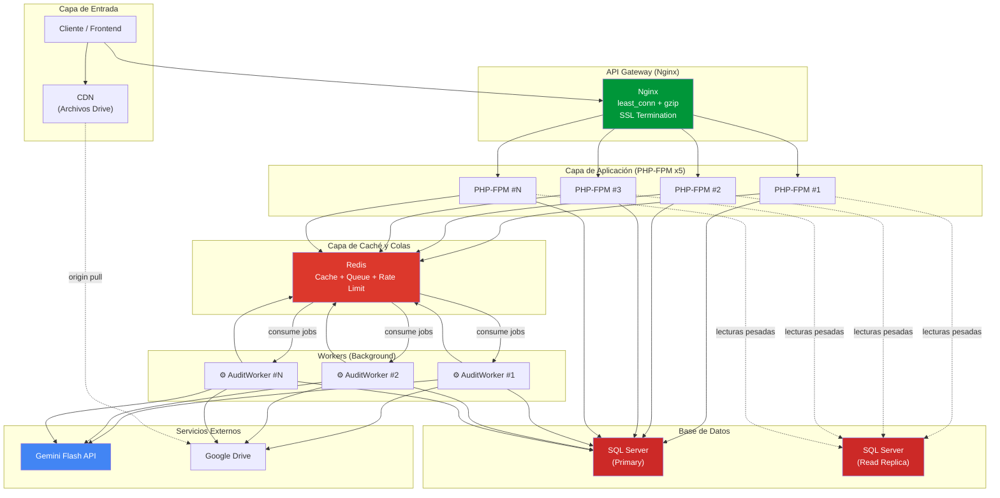
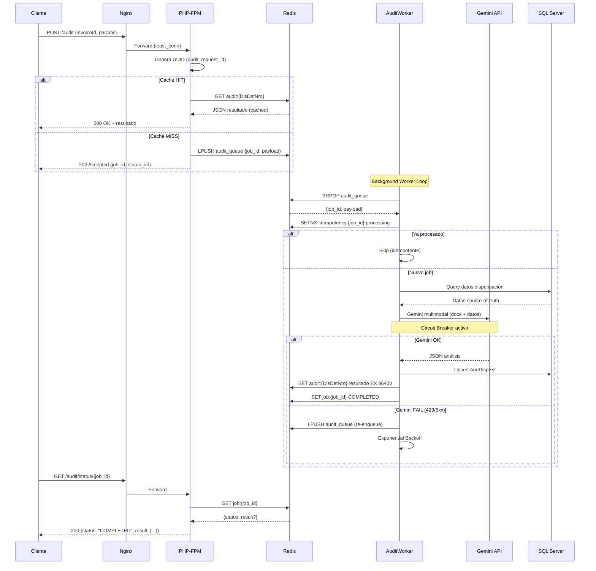
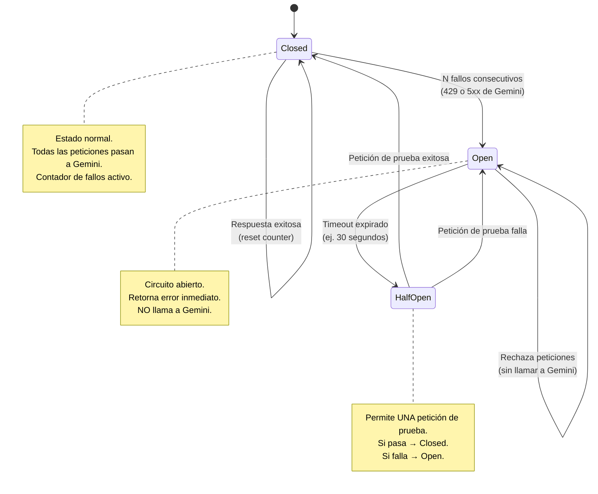
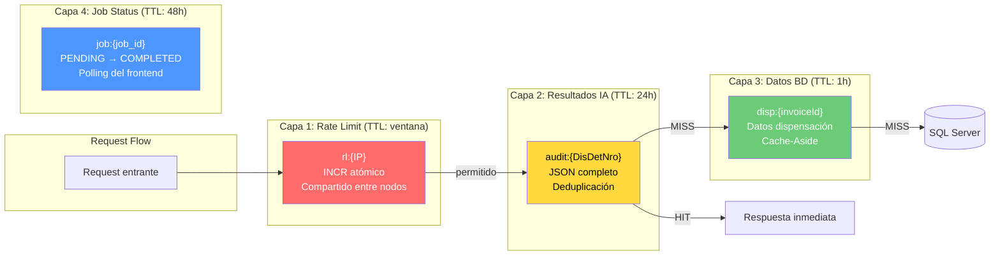
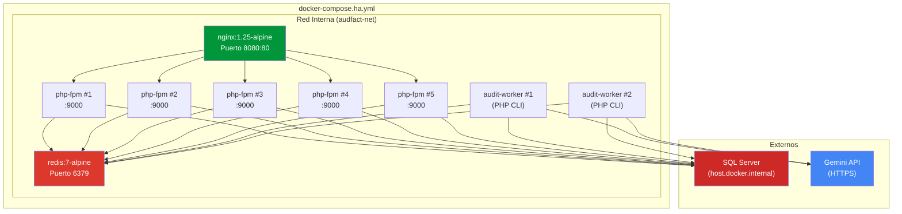
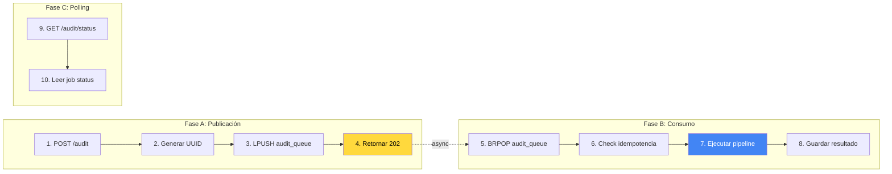

# 📋 TODO — Optimización AudFact (System Design Applied)

> **Origen**: Principios extraídos de *System Design Interview* (Alex Xu) y *Designing Data-Intensive Applications* (Martin Kleppmann).
> **Estado**: 🔒 Pendiente de autorización para sprint posterior.
> **Fecha de creación**: 2026-02-24

---

## 🏗️ Arquitectura Objetivo



---

## 📊 Flujo de Auditoría Asíncrona (Objetivo)



---

## 🔴 Circuit Breaker — Máquina de Estados



---

## 📦 Capas de Caché Redis



---

## 🗄️ Infraestructura Docker (Objetivo)



---

## ✅ Checklist de Implementación Secuencial

### Sprint 1 — Infraestructura Base (Redis + Docker)

> **Objetivo**: Añadir Redis al stack y crear las abstracciones base.

- [ ] **1.1** Añadir servicio Redis a `docker-compose.ha.yml`
  ```yaml
  redis:
    image: redis:7-alpine
    container_name: audfact-redis
    ports:
      - "6379:6379"
    volumes:
      - redis-data:/data
    healthcheck:
      test: ["CMD", "redis-cli", "ping"]
      interval: 10s
      timeout: 3s
      retries: 3
  ```
- [ ] **1.2** Añadir variables de entorno Redis en `.env` y `.env.example`
  ```env
  REDIS_HOST=redis
  REDIS_PORT=6379
  REDIS_PASSWORD=
  REDIS_DB=0
  ```
- [ ] **1.3** Instalar dependencia PHP Redis: `composer require predis/predis`
- [ ] **1.4** Crear `core/Cache.php` — Abstracción Redis
  - [ ] Métodos: `get()`, `set()`, `incr()`, `expire()`, `delete()`, `exists()`
  - [ ] Patrón Singleton similar a `Database.php`
  - [ ] Fallback graceful si Redis no está disponible
- [ ] **1.5** Añadir Redis al `healthcheck.php`
  - [ ] Verificar `PING` a Redis además de `SELECT 1` a SQL Server
- [ ] **1.6** Verificar que `docker-compose -f docker-compose.ha.yml up -d` levanta todos los servicios
- [ ] **1.7** Verificar health checks de todos los contenedores con `docker ps`

---

### Sprint 2 — Rate Limiting Global (Redis Backend)

> **Objetivo**: Migrar Rate Limiting de archivo local a Redis compartido.

- [ ] **2.1** Crear método `redisCheck()` en `core/RateLimit.php`
  - [ ] Usar `INCR` + `EXPIRE` atómico para contador por IP
  - [ ] Fallback a `apcuCheck()` si Redis no disponible
  - [ ] Fallback final a `fileCheck()` si APCu tampoco disponible
- [ ] **2.2** Actualizar jerarquía de backends en `check()`:
  ```
  Redis → APCu → Archivo (último recurso)
  ```
- [ ] **2.3** Eliminar dependencia de `ratelimit.json` y `ratelimit.lock` como backend primario
- [ ] **2.4** Implementar algoritmo **Token Bucket** en Redis:
  - [ ] Key: `rl:tb:{IP}` — tokens disponibles
  - [ ] Key: `rl:tb:{IP}:last` — timestamp última recarga
  - [ ] Configurar: `RATE_LIMIT_BUCKET_SIZE=100`, `RATE_LIMIT_REFILL_RATE=10/s`
- [ ] **2.5** Añadir headers `X-RateLimit-Remaining` y `X-RateLimit-Retry-After` a Response
- [ ] **2.6** **Test**: Levantar 3 réplicas PHP, enviar 200 requests desde la misma IP, verificar que el límite es global

---

### Sprint 3 — Caché de Datos y Resultados IA

> **Objetivo**: Implementar las 3 capas de caché para reducir latencia.

#### Capa 1: Cache de Resultados de Auditoría IA
- [ ] **3.1** Modificar `GeminiAuditService::auditInvoice()`:
  - [ ] Antes de procesar: `Cache::get("audit:{$DisDetNro}")`
  - [ ] Si HIT → retornar resultado cacheado inmediatamente
  - [ ] Si MISS → procesar normalmente
  - [ ] Después de procesar: `Cache::set("audit:{$DisDetNro}", $result, 86400)` (TTL 24h)
- [ ] **3.2** Añadir endpoint `DELETE /audit/cache/{DisDetNro}` para invalidación manual

#### Capa 2: Cache de Datos de Dispensación
- [ ] **3.3** Modificar `DispensationModel::getDispensationData()`:
  - [ ] Implementar patrón **Cache-Aside**
  - [ ] Key: `disp:{invoiceId}`, TTL: 3600s (1h)
- [ ] **3.4** Modificar `AttachmentsModel::getAttachmentsByInvoiceId()`:
  - [ ] Cachear metadatos de adjuntos (no el BLOB)
  - [ ] Key: `att:{invoiceId}`, TTL: 1800s (30min)

#### Capa 3: Métricas de Cache
- [ ] **3.5** Implementar contadores de hit/miss en `Cache.php`:
  - [ ] `Cache::$hits`, `Cache::$misses`
  - [ ] Log al final de cada request: `cache.hit_rate = hits / (hits + misses)`
- [ ] **3.6** **Test**: Auditar la misma factura 2 veces, segunda debe ser < 50ms

---

### Sprint 4 — Procesamiento Asíncrono (Queue System)

> **Objetivo**: Desacoplar la auditoría del flujo HTTP.



#### Queue Infrastructure
- [ ] **4.1** Crear `core/Queue.php` — Abstracción de cola Redis
  - [ ] `push(string $queue, array $payload): string` → retorna job_id
  - [ ] `pop(string $queue, int $timeout): ?array` → blocking pop
  - [ ] `getStatus(string $jobId): string` → PENDING|PROCESSING|COMPLETED|FAILED
  - [ ] `setResult(string $jobId, array $result): void`
  - [ ] `getResult(string $jobId): ?array`

#### Controller (Productor)
- [ ] **4.2** Modificar `AuditController::run()`:
  - [ ] Generar `$jobId = bin2hex(random_bytes(16))`
  - [ ] `Queue::push('audit_queue', ['job_id' => $jobId, 'invoice_id' => ..., 'params' => ...])`
  - [ ] `Response::success(['job_id' => $jobId, 'status_url' => "/audit/status/{$jobId}"], 202)`
- [ ] **4.3** Crear `AuditController::status(string $jobId)`:
  - [ ] `$status = Queue::getStatus($jobId)`
  - [ ] Si COMPLETED: incluir resultado
  - [ ] Si FAILED: incluir error message
- [ ] **4.4** Añadir ruta en `web.php`:
  ```php
  Route::get('/audit/status/{jobId}', [AuditController::class, 'status']);
  ```

#### Worker (Consumidor)
- [ ] **4.5** Crear `app/worker/AuditWorker.php`:
  - [ ] CLI entry point: `php app/worker/AuditWorker.php`
  - [ ] Loop infinito con `BRPOP` (timeout 30s)
  - [ ] Check idempotencia: `SETNX idempotency:{job_id} processing EX 3600`
  - [ ] Ejecutar `GeminiAuditService::auditInvoice()`
  - [ ] Guardar resultado: `Queue::setResult($jobId, $result)`
  - [ ] Manejar señales SIGTERM/SIGINT para graceful shutdown
- [ ] **4.6** Añadir servicio worker a `docker-compose.ha.yml`:
  ```yaml
  audit-worker:
    build:
      context: .
      dockerfile: docker/Dockerfile
    env_file:
      - .env
    volumes:
      - ./:/var/www/html
    command: php /var/www/html/app/worker/AuditWorker.php
    depends_on:
      - redis
    deploy:
      replicas: 2
    restart: unless-stopped
  ```
- [ ] **4.7** **Test**: Enviar 10 `POST /audit` concurrentes, verificar que todos se procesan y `GET /audit/status/{id}` eventualmente retorna COMPLETED

---

### Sprint 5 — API Guardrails (Circuit Breaker + Token Bucket)

> **Objetivo**: Proteger al sistema contra fallos de la API de Gemini.

- [ ] **5.1** Crear `core/CircuitBreaker.php`:
  ```
  Estados: CLOSED → OPEN → HALF_OPEN → CLOSED
  Config:
    CIRCUIT_FAILURE_THRESHOLD=5    (fallos para abrir)
    CIRCUIT_RECOVERY_TIMEOUT=30    (segundos en OPEN)
    CIRCUIT_HALF_OPEN_MAX=1        (peticiones de prueba)
  ```
  - [ ] Almacenar estado en Redis: `cb:gemini:state`, `cb:gemini:failures`, `cb:gemini:last_failure`
  - [ ] Método `allowRequest(): bool` → verifica si se puede llamar a Gemini
  - [ ] Método `recordSuccess(): void` → reset counter, volver a CLOSED
  - [ ] Método `recordFailure(): void` → incrementar counter, evaluar threshold

- [ ] **5.2** Crear `core/TokenBucket.php`:
  - [ ] Config: `TOKEN_BUCKET_CAPACITY=15`, `TOKEN_BUCKET_REFILL_RATE=1` (por segundo)
  - [ ] Almacenar en Redis: `tb:gemini:tokens`, `tb:gemini:last_refill`
  - [ ] Método `consume(int $tokens = 1): bool` → true si hay tokens disponibles

- [ ] **5.3** Integrar en `GeminiAuditService::sendGeminiRequestWithRetry()`:
  ```php
  if (!CircuitBreaker::allowRequest()) {
      throw new \RuntimeException('Gemini circuit is OPEN', 503);
  }
  if (!TokenBucket::consume()) {
      throw new \RuntimeException('Gemini rate limit exceeded', 429);
  }
  // ... llamar a Gemini
  // Si éxito: CircuitBreaker::recordSuccess()
  // Si 429/5xx: CircuitBreaker::recordFailure()
  ```

- [ ] **5.4** **Test**: Simular 6 errores 500 de Gemini seguidos, verificar que el circuito se abre y no se envían más peticiones por 30s

---

### Sprint 6 — Resiliencia de Base de Datos

> **Objetivo**: Eliminar SQL Server como SPOF y optimizar queries.

#### Failover Partner
- [ ] **6.1** Modificar `core/Database.php`:
  - [ ] Leer `DB_FAILOVER_HOST` de `.env`
  - [ ] Si existe, añadir `;Failover_Partner={$failover}` al DSN
  ```php
  $failover = Env::get($prefix . 'FAILOVER_HOST');
  if (!empty($failover)) {
      $dsn .= ";Failover_Partner={$failover}";
  }
  ```
- [ ] **6.2** Añadir a `.env.example`:
  ```env
  DB_FAILOVER_HOST=
  ```

#### Read Replicas
- [ ] **6.3** Crear método `Database::getReadConnection()`:
  - [ ] Busca conexión `readonly` (prefix `READONLY_DB_`)
  - [ ] Si no configurada, fallback a `default`
- [ ] **6.4** Modificar modelos de lectura pesada para usar `getReadConnection()`:
  - [ ] `DispensationModel::getDispensationData()`
  - [ ] `InvoicesModel::getInvoices()`
  - [ ] `AttachmentsModel::getAttachmentsByInvoiceId()`

#### Índices
- [ ] **6.5** Crear script de migración `database/migrations/optimize_indexes.sql`:
  ```sql
  -- Auditoría: búsquedas por InvoiceId
  IF NOT EXISTS (SELECT 1 FROM sys.indexes WHERE name = 'IX_AdjDisp_InvoiceId')
      CREATE INDEX IX_AdjDisp_InvoiceId ON AdjuntosDispensacion(InvoiceId);

  -- Worker: búsquedas por DisDetNro
  IF NOT EXISTS (SELECT 1 FROM sys.indexes WHERE name = 'IX_DispDet_DisDetNro')
      CREATE INDEX IX_DispDet_DisDetNro ON DispensacionDetalleServicio(DisDetNro);

  -- AuditStatus: upsert por DisDetNro
  IF NOT EXISTS (SELECT 1 FROM sys.indexes WHERE name = 'IX_AudDispEst_DisDetNro')
      CREATE INDEX IX_AudDispEst_DisDetNro ON AudDispEst(DisDetNro);
  ```
- [ ] **6.6** **Test**: Comparar tiempos de query antes vs después de índices con `SET STATISTICS TIME ON`

---

### Sprint 7 — API Gateway, Nginx y CDN

> **Objetivo**: Optimizar Nginx como API Gateway y preparar CDN.

- [ ] **7.1** Actualizar `docker/nginx-ha.conf.template`:
  - [ ] Habilitar compresión gzip:
    ```nginx
    gzip on;
    gzip_types application/json text/plain application/javascript;
    gzip_min_length 256;
    ```
  - [ ] Añadir headers de seguridad:
    ```nginx
    add_header X-Content-Type-Options "nosniff" always;
    add_header X-Frame-Options "DENY" always;
    add_header X-XSS-Protection "1; mode=block" always;
    add_header Strict-Transport-Security "max-age=31536000" always;
    ```
  - [ ] Configurar rate limiting a nivel Nginx (defensa en profundidad):
    ```nginx
    limit_req_zone $binary_remote_addr zone=api:10m rate=30r/s;
    limit_req zone=api burst=50 nodelay;
    ```
- [ ] **7.2** Configurar cache de archivos estáticos en Nginx:
  ```nginx
  location ~* \.(jpg|jpeg|png|pdf|gif)$ {
      expires 7d;
      add_header Cache-Control "public, immutable";
  }
  ```
- [ ] **7.3** **Test**: Verificar headers de respuesta con `curl -I http://localhost:8080/health`

---

### Sprint 8 — Monitoreo y Observabilidad

> **Objetivo**: Implementar métricas estructuradas para detectar cuellos de botella.

- [ ] **8.1** Añadir helpers de timing a `core/Logger.php`:
  ```php
  public static function startTimer(string $name): void
  public static function endTimer(string $name): float  // retorna ms
  public static function metric(string $name, float $value, string $unit): void
  ```
- [ ] **8.2** Instrumentar `GeminiAuditService`:
  - [ ] `Logger::startTimer('gemini_request')`
  - [ ] `Logger::endTimer('gemini_request')` → `audit.gemini.latency_ms`
  - [ ] Registrar si fue cache hit o miss
- [ ] **8.3** Implementar colector de percentiles en `Logger.php`:
  - [ ] Store en Redis: `ZADD metrics:gemini_latency {timestamp} {value}`
  - [ ] Calcular p95/p99 bajo demanda
- [ ] **8.4** Crear endpoint `GET /metrics` (protegido):
  ```json
  {
    "audit.latency.p95": 12400,
    "audit.latency.p99": 18200,
    "audit.queue.depth": 3,
    "audit.cache.hit_rate": 0.72,
    "audit.gemini.error_rate": 0.02,
    "audit.throughput.last_hour": 145
  }
  ```
- [ ] **8.5** Añadir ruta en `web.php`:
  ```php
  Route::get('/metrics', [HealthController::class, 'metrics'])
       ->middleware('auth');
  ```
- [ ] **8.6** **Test**: Ejecutar batch de 20 auditorías y verificar que `/metrics` muestra datos reales

---

### Sprint 9 — Health Check Extendido

> **Objetivo**: Verificar todos los componentes del sistema, no solo la BD.

- [ ] **9.1** Expandir `docker/healthcheck.php`:
  ```php
  // 1. SQL Server
  $pdo->query('SELECT 1');
  
  // 2. Redis
  $redis = new \Predis\Client([...]);
  $redis->ping();
  
  // 3. Disco (logs writable)
  $testFile = '/var/www/html/logs/.healthcheck';
  file_put_contents($testFile, 'ok');
  unlink($testFile);
  
  // 4. Memoria (> 32MB free)
  $memFree = memory_get_usage(true);
  if ($memFree > 450 * 1024 * 1024) { // 450MB de 512MB limit
      throw new \RuntimeException('Low memory');
  }
  ```
- [ ] **9.2** Expandir `GET /health` para retornar status granular:
  ```json
  {
    "status": "healthy",
    "checks": {
      "database": {"status": "ok", "latency_ms": 12},
      "redis": {"status": "ok", "latency_ms": 1},
      "disk": {"status": "ok", "free_mb": 2048},
      "memory": {"status": "ok", "used_mb": 128, "limit_mb": 512}
    },
    "version": "1.2.0",
    "hostname": "audfact-php-3"
  }
  ```
- [ ] **9.3** **Test**: Detener Redis y verificar que health check reporta `redis: FAIL`

---

## 📈 Resumen de Impacto por Sprint

| Sprint | Área | Estado Actual | Estado Objetivo | Riesgo |
|:---:|---|---|---|:---:|
| 1 | Infraestructura Redis | Sin Redis | Redis 7 en Docker | 🟢 Bajo |
| 2 | Rate Limiting | Archivo local por nodo | Redis global + Token Bucket | 🟢 Bajo |
| 3 | Caching | Sin caché | 3 capas (IA, BD, Rate Limit) | 🟡 Medio |
| 4 | Async Processing | Síncrono (5-25s) | Queue + Workers (async) | 🔴 Alto |
| 5 | API Guardrails | Solo retry | Circuit Breaker + Token Bucket | 🟡 Medio |
| 6 | Database | Single host | Failover + Replicas + Índices | 🟡 Medio |
| 7 | Nginx / CDN | Básico | gzip + headers + rate limit | 🟢 Bajo |
| 8 | Monitoreo | Logs básicos | Métricas p95/p99 + /metrics | 🟢 Bajo |
| 9 | Health Checks | Solo BD | BD + Redis + Disco + Memoria | 🟢 Bajo |

---

## 📁 Archivos Afectados (Resumen)

### Archivos a Modificar

| Archivo | Sprints |
|---|---|
| `core/RateLimit.php` | 2 |
| `core/Database.php` | 6 |
| `core/Logger.php` | 8 |
| `app/Controllers/AuditController.php` | 4 |
| `app/Routes/web.php` | 3, 4, 8 |
| `app/worker/GeminiAuditService.php` | 3, 5 |
| `app/Models/DispensationModel.php` | 3, 6 |
| `app/Models/AttachmentsModel.php` | 3, 6 |
| `app/Models/InvoicesModel.php` | 6 |
| `docker-compose.ha.yml` | 1, 4 |
| `docker/healthcheck.php` | 1, 9 |
| `docker/nginx-ha.conf.template` | 7 |
| `.env` / `.env.example` | 1, 6 |

### Archivos Nuevos

| Archivo | Sprint | Descripción |
|---|---|---|
| `core/Cache.php` | 1 | Abstracción Redis (Singleton) |
| `core/Queue.php` | 4 | Sistema de colas Redis |
| `core/CircuitBreaker.php` | 5 | Patrón Circuit Breaker |
| `core/TokenBucket.php` | 5 | Rate limiter para Gemini API |
| `app/worker/AuditWorker.php` | 4 | Worker CLI (consumidor de cola) |
| `database/migrations/optimize_indexes.sql` | 6 | Índices de rendimiento |

---

> [!NOTE]
> Este plan requiere **autorización formal** antes de iniciar cualquier sprint.
> Cada sprint es independiente y puede ejecutarse de forma aislada.
> Se recomienda priorizar: **Sprint 1 → 2 → 4 → 5** como ruta crítica.
