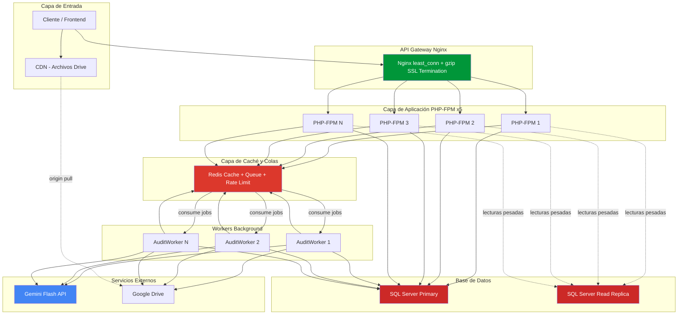
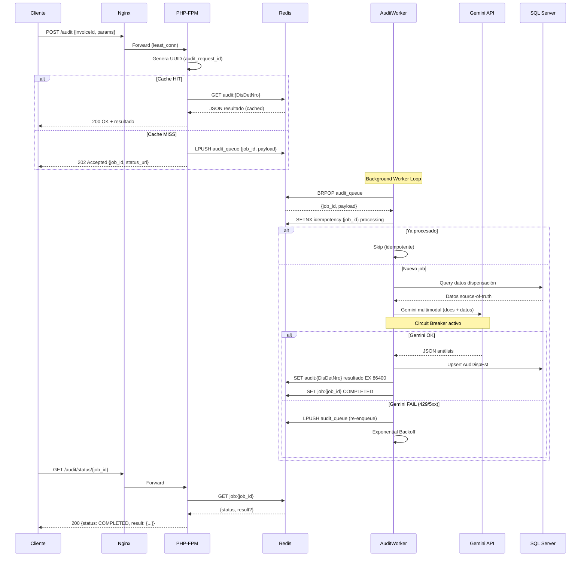
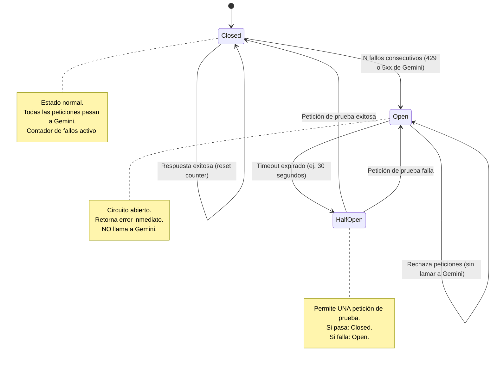
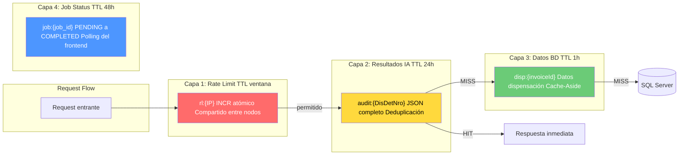
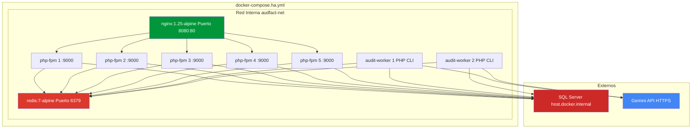
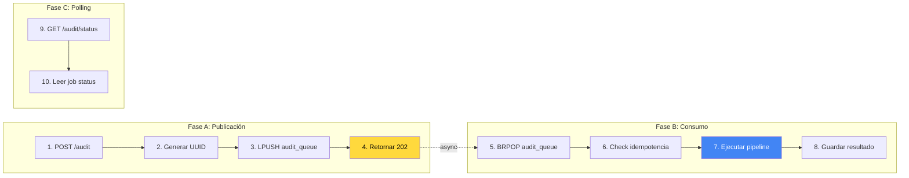

# TODO — Diseño e Implementación de Roadmap Técnico AudFact (Plantilla Estándar)

> **Origen**: Principios extraídos de *System Design Interview* (Alex Xu) y *Designing Data-Intensive Applications* (Martin Kleppmann).
> **Estado**: 🟡 Activo (backlog estratégico, con avances parciales ya implementados).
> **Fecha de creación**: 2026-02-24
> **Última alineación con código real**: 2026-03-04

---

## 1) Objetivo del documento
Este archivo define, con nivel de detalle implementable, el roadmap técnico de AudFact para seguridad baseline, resiliencia, asincronía y observabilidad.

Debe servir como:
- Especificación funcional y técnica del backlog.
- Plan de entrega por fases/release.
- Fuente de verdad para sesiones de trabajo separadas (humanas o por agentes IA).

No reemplaza documentos de arquitectura del repositorio. Este TODO consolida la ejecución priorizada.

---

## 2) Problema a resolver
Hoy el sistema tiene capacidades HA parciales, pero conserva riesgos de release y cuellos de botella:
- Endpoints críticos sin auth obligatoria.
- Defaults de TLS SQL inseguros para producción.
- Rate limit no compartido entre réplicas.
- Auditoría batch mayormente sincrónica en request HTTP.
- Observabilidad y colas aún no cerradas de punta a punta.

Esto genera:
- Riesgo de seguridad y cumplimiento.
- Fragilidad operativa bajo concurrencia.
- Latencia alta y throughput inestable.

El roadmap debe convertir el sistema en una plataforma segura, predecible y escalable por etapas.

---

## 3) Estado Actual Verificado (2026-03-04)

### Implementado actualmente

- Logger en `APP_ENV=production` escribe a `stderr` (logs de contenedor).
- `docker-compose.yml` y `docker-compose.ha.yml` no montan volumen dedicado `./logs`.
- `docker/nginx-ha.conf.template` ya incluye:
  - `least_conn` en upstream de PHP.
  - `gzip` para respuestas.
  - headers de seguridad.
  - `limit_req` general y específico para `/audit`.
- Endpoint `GET /health` ya reporta estado granular de:
  - base de datos,
  - disco,
  - memoria.

### Aún no implementado

- Redis como backend compartido.
- Rate limit global multi-réplica en Redis (actual: APCu o archivo local).
- Cola asíncrona (`Queue`) y workers dedicados (`AuditWorker`).
- Circuit breaker y token bucket para Gemini.
- Endpoint `/metrics`.
- Healthcheck de Redis.

> Nota: este documento permanece como hoja de ruta por sprints, pero ahora refleja explícitamente qué parte ya existe en el repositorio actual.

### Hallazgos de Auditoría End-to-End incorporados (2026-03-04)

- **P0 / SEC-001**: endpoints críticos sin `auth` aplicado en rutas REST.
- **P0 / SEC-002**: defaults de TLS hacia SQL Server inseguros (`DB_ENCRYPT=no`, `DB_TRUST_SERVER_CERT=yes` por default/fallback).
- **P1 / ARCH-001**: rate limit no compartido entre réplicas HA (backend local por nodo).
- **P1 / ARCH-002**: auditoría batch síncrona en request HTTP (latencia y throughput frágiles).
- **P2 / QUAL-001**: cobertura de tests insuficiente en flujos críticos API.
- **P2 / GOV-001**: inconsistencia operativa de UID/GID/permisos entre imagen y pipeline de deploy.

---

## 4) Alcance v1 (MVP)
Se implementan estos bloques en v1.0:
1. Cierre de riesgos P0 (auth, TLS SQL, permisos deploy).
2. Redis base en compose principal/HA.
3. Rate limiting global Redis (fail-closed en negocio, excepción `/health`).
4. Healthcheck con validación Redis.

Adopciones del plan base (por versión):
- v1.0: baseline seguro y operable.
- v1.5: aceleradores (cache + asincronía inicial).
- v2.0: hardening avanzado (circuit breaker, metrics, resiliencia DB).

Regla de alcance estricto:
1. v1.0 termina sin worker full con orquestación compleja de reintentos.
2. v1.0 termina sin `/metrics` completo de percentiles.
3. Todo item fuera de v1.0 se etiqueta explícitamente como v1.5 o v2.0.

Fuera de alcance v1.0:
- Circuit breaker/token bucket para Gemini.
- Read replica/failover DB avanzado.
- Suite completa de observabilidad p95/p99.

---

## 5) Principios de diseño
1. Seguridad por defecto antes de escalar.
2. Contrato estable antes de cambios estructurales.
3. Priorización por impacto temprano (P0 > P1 > P2 > P3).
4. Idempotencia operativa en caches/colas.
5. Fallo accionable y sin fuga de secretos.

---

## 6) UX de comandos/contrato operativo

### 6.1 Contrato API (alto nivel)
- Entradas/salidas deben mantener compatibilidad por major.
- Errores deben ser accionables y consistentes.

### 6.2 Estructura esperada por endpoints de estado/operación
- Payloads con `schemaVersion`, `ok`, `operation`, `summary`, `checks[]`, `actions[]` en endpoints nuevos de observabilidad/estado cuando aplique.

### 6.3 Códigos de salida HTTP (global)
- `200`: operación exitosa.
- `202`: trabajo aceptado asíncrono.
- `401/403`: auth/autorización fallida.
- `429`: quota/rate limit.
- `503`: dependencia crítica no disponible en política fail-closed.

---

## 7) Arquitectura técnica propuesta

### 7.1 Arquitectura Objetivo



### 7.2 Flujo de Auditoría Asíncrona (Objetivo)



### 7.3 Circuit Breaker — Máquina de Estados



### 7.4 Capas de Caché Redis



### 7.5 Infraestructura Docker (Objetivo)



### 7.6 Estructura de archivos (objetivo)

Archivos a crear:

| Archivo | Sprint | Descripción |
|---|---|---|
| `core/Cache.php` | 1 / Sprint A | Abstracción Redis (Singleton) |
| `core/Queue.php` | 4 / Sprint C | Sistema de colas Redis |
| `core/CircuitBreaker.php` | 5 / Sprint D | Patrón Circuit Breaker |
| `core/TokenBucket.php` | 5 / Sprint D | Rate limiter para Gemini API |
| `app/worker/AuditWorker.php` | 4 / Sprint C | Worker CLI (consumidor de cola) |
| `database/migrations/optimize_indexes.sql` | 6 / Sprint D | Índices de rendimiento |

Archivos a modificar:

| Archivo | Sprints |
|---|---|
| `core/RateLimit.php` | 2 |
| `core/Database.php` | 6 |
| `core/Logger.php` | 8 |
| `app/Controllers/AuditController.php` | 4 |
| `app/Routes/web.php` | 3, 4, 8 |
| `app/Services/Audit/AuditOrchestrator.php` | 3, 5, 8 |
| `app/Services/Audit/GeminiGateway.php` | 5, 8 |
| `app/Models/DispensationModel.php` | 3, 6 |
| `app/Models/AttachmentsModel.php` | 3, 6 |
| `app/Models/InvoicesModel.php` | 6 |
| `docker-compose.yml` | 1, 4 |
| `docker-compose.ha.yml` | 1, 4 |
| `docker/healthcheck.php` | 1, 9 |
| `docker/nginx-ha.conf.template` | 7 |
| `.env` / `.env.example` | 1, 6 |

### 7.7 Capa compartida Redis
Implementar abstracciones:
- Cache KV con TTL y métrica hit/miss.
- Queue con estado de jobs.
- Estado distribuido para rate limit/circuit breaker.

### 7.8 Capa de checks
Cada check operativo debe retornar contrato estándar:
- `id`
- `status` (`pass|warn|fail`)
- `message`
- `details?`
- `suggestedAction?`

---

## 8) Comportamiento detallado por bloque

### 8.1 Seguridad baseline (v1.0)
Objetivo: cerrar exposiciones inmediatas.

Checks mínimos:
1. Rutas críticas con middleware auth.
2. Rutas públicas explícitas (`/health`, `/config/public`).
3. TLS SQL seguro por default en producción.
4. Pruebas de no-bypass en rutas protegidas.

Reglas:
- Nunca exponer secretos/stacktrace en producción.
- Mantener respuesta consistente en auth failures.

### 8.2 Redis base + health
Objetivo: habilitar backend compartido.

Flujo:
1. Servicio Redis en compose principal y HA.
2. Variables `REDIS_*` en `.env` y `.env.example`.
3. Healthcheck de Redis (ping).

### 8.3 Rate limiting global
Objetivo: eliminar inconsistencia por réplica.

Flujo:
1. Backend Redis obligatorio en producción.
2. Fallo Redis en rutas de negocio => `503`.
3. Bypass explícito para `GET /health`.
4. Headers de cuota en respuesta.

### 8.4 Cache y asincronía (v1.5)
Objetivo: reducir latencia y desacoplar carga de request.

Flujo:
1. Cache de resultado IA (`audit:{id}` TTL 24h).
2. Cache-aside para lecturas de dispensación/adjuntos.
3. `POST /audit` retorna `202` con `job_id`.
4. `GET /audit/status/{jobId}` para polling.

### 8.5 Hardening avanzado (v2.0)
Objetivo: resiliencia bajo fallos externos y observabilidad madura.

Flujo:
1. Circuit breaker + token bucket para Gemini.
2. Read/failover DB configurable.
3. `/metrics` protegido con KPIs operativos.

---

## 9) Contratos de salida (para automatización)

### 9.1 JSON schema orientativo
```json
{
  "schemaVersion": "1.0",
  "ok": true,
  "operation": "audit.status",
  "summary": "Job completed",
  "checks": [
    {"id": "queue.status", "status": "pass", "message": "COMPLETED"}
  ],
  "actions": []
}
```

### 9.2 Mensajes humanos
Formato consistente:
1. Título corto.
2. Resultado por check.
3. Siguiente acción.

### 9.3 Política de compatibilidad
Salida JSON:
1. Contrato estable por major.
2. Campos mínimos inmutables por major:
   - `schemaVersion`, `ok`, `operation`, `summary`, `checks[]`, `actions[]`.
3. Campos nuevos en minor son compatibles.
4. Quitar/renombrar campos mínimos requiere major.

---

## 10) Variables y configuración requeridas
Actualizar por release:

v1.0:
- `REDIS_HOST`, `REDIS_PORT`, `REDIS_PASSWORD`, `REDIS_DB`
- `DB_ENCRYPT=yes`, `DB_TRUST_SERVER_CERT=no` (producción)

v1.5:
- `AUDIT_QUEUE_NAME`
- `AUDIT_JOB_TTL`

v2.0:
- `CIRCUIT_FAILURE_THRESHOLD`
- `CIRCUIT_RECOVERY_TIMEOUT`
- `TOKEN_BUCKET_CAPACITY`
- `TOKEN_BUCKET_REFILL_RATE`

Adicional:
- Mantener `.env.example` como fuente de verdad pública.

---

## 11) Plan de implementación detallado por fases

### Fase 1 / Sprint A — Cierre de Riesgos P0 + Redis Base (v1.0)

> **Objetivo**: cerrar exposición inmediata antes de escalar arquitectura.

- [ ] **0.1** Aplicar `->middleware('auth')` a rutas críticas REST:
  - [ ] `/clients*`, `/invoices*`, `/dispensation*`, `/audit*`
  - [ ] Excluir `GET /health` y `GET /config/public` por diseño
- [ ] **0.2** Implementar `Core\AuthMiddleware::handle` (JWT/API key según diseño vigente)
- [ ] **0.3** Agregar tests de autorización:
  - [ ] Request sin token → `401/403`
  - [ ] Token válido → `200` en rutas protegidas
- [ ] **0.4** Endurecer defaults de SQL Server para producción:
  - [ ] `.env.example`: `DB_ENCRYPT=yes`, `DB_TRUST_SERVER_CERT=no` (con nota de cert válido)
  - [ ] CI/CD: fallar deploy si en `APP_ENV=production` estos valores no son seguros
- [ ] **0.5** Corregir inconsistencia de UID/GID en deploy:
  - [ ] Alinear UID de `www-data` en imagen con `chown` del runner
  - [ ] Eliminar workaround manual recurrente de permisos
- [ ] **0.6** **Test de salida**: 0 warnings de permisos en `/health` tras 20 refresh + auth bloquea accesos no autorizados
- [ ] **1.1** Añadir servicio Redis a `docker-compose.ha.yml` y `docker-compose.yml` (base HA actual)
  ```yaml
  redis:
    image: redis:7-alpine
    container_name: audfact-redis
    ports:
      - "6379:6379"
    volumes:
      - redis-data:/data
    healthcheck:
      test: ["CMD", "redis-cli", "ping"]
      interval: 10s
      timeout: 3s
      retries: 3
  ```
- [ ] **1.2** Añadir variables de entorno Redis en `.env` y `.env.example`
  ```env
  REDIS_HOST=redis
  REDIS_PORT=6379
  REDIS_PASSWORD=
  REDIS_DB=0
  ```
- [ ] **1.3** Instalar dependencia PHP Redis: `composer require predis/predis`
- [ ] **1.4** Crear `core/Cache.php` — Abstracción Redis
  - [ ] Métodos: `get()`, `set()`, `incr()`, `expire()`, `delete()`, `exists()`
  - [ ] Patrón Singleton similar a `Database.php`
  - [ ] Fallback graceful si Redis no está disponible
- [ ] **1.5** Añadir Redis al `healthcheck.php`
  - [ ] Verificar `PING` a Redis además de `SELECT 1` a SQL Server
- [ ] **1.6** Verificar que `docker-compose up -d` y `docker-compose -f docker-compose.ha.yml up -d` levantan todos los servicios (incluyendo Redis)
- [ ] **1.7** Verificar health checks de todos los contenedores con `docker ps` (incluyendo Redis)

**Aceptación Fase 1**: Cierre total de P0. Redis operativo en entorno principal y HA.

---

### Fase 2 / Sprint B — Rate Limiting Global + Cache Base (v1.0 + v1.5)

> **Objetivo**: Migrar Rate Limiting de archivo local a Redis compartido + cache de datos.

#### Política de fallo en producción (obligatoria)
- **Modo por defecto**: `fail-closed` para endpoints de negocio (`/clients`, `/invoices`, `/dispensation`, `/audit*`).
- **Comportamiento esperado si Redis no está disponible**:
  - Responder `503 Service Unavailable` de forma inmediata.
  - Mensaje controlado: `Rate limiter backend unavailable`.
  - Log estructurado con severidad `ERROR` y marcador `rate_limiter_backend_unavailable`.
- **Excepción operativa**: `GET /health` no debe bloquearse por rate limiter para no romper observabilidad.
- **Fail-open** solo permitido de forma temporal en `APP_ENV=development` o bajo feature flag explícito de emergencia.

#### Rate Limiting Redis
- [ ] **2.1** Crear método `redisCheck()` en `core/RateLimit.php`
  - [ ] Usar `INCR` + `EXPIRE` atómico para contador por IP
  - [ ] Fallback a `apcuCheck()` solo en desarrollo/local
  - [ ] En producción: sin fallback a archivo local (`fileCheck`) para evitar inconsistencia multi-réplica
- [ ] **2.1.1** Implementar bypass explícito de rate limiter para `GET /health`
  - [ ] Opción A: bypass por ruta/método antes de `RateLimit::check()` en `public/index.php`
  - [ ] Opción B: parámetro de exclusión en `RateLimit::check()` para endpoints de observabilidad
  - [ ] Documentar decisión final y mantener consistencia con política fail-closed
- [ ] **2.2** Actualizar jerarquía de backends en `check()`:
  ```
  Producción: Redis (backend obligatorio) | Desarrollo: Redis → APCu (sin archivo en HA)
  ```
- [ ] **2.3** Eliminar dependencia de `ratelimit.json` y `ratelimit.lock` como backend primario
- [ ] **2.4** Implementar algoritmo **Token Bucket** en Redis:
  - [ ] Key: `rl:tb:{IP}` — tokens disponibles
  - [ ] Key: `rl:tb:{IP}:last` — timestamp última recarga
  - [ ] Configurar: `RATE_LIMIT_BUCKET_SIZE=100`, `RATE_LIMIT_REFILL_RATE=10/s`
- [ ] **2.5** Añadir headers `X-RateLimit-Remaining` y `X-RateLimit-Retry-After` a Response
- [ ] **2.6** **Test**: Levantar 3 réplicas PHP, enviar 200 requests desde la misma IP, verificar que el límite es global
- [ ] **2.7** **E2E fail-closed con excepción `/health`**:
  - [ ] Con Redis caído, `GET /health` debe responder sin bloqueo por rate limiter
  - [ ] Con Redis caído, rutas de negocio (`/clients`, `/invoices`, `/dispensation`, `/audit*`) deben responder `503`
  - [ ] Verificar que no exista bypass accidental por rutas similares (`/healthz`, `/health/foo`, query params)
  - [ ] Confirmar log estructurado `rate_limiter_backend_unavailable` solo en rutas de negocio afectadas

#### Cache de Datos y Resultados IA

##### Capa 1: Cache de Resultados de Auditoría IA
- [ ] **3.1** Modificar `AuditOrchestrator::auditInvoice()`:
  - [ ] Antes de procesar: `Cache::get("audit:{$DisDetNro}")`
  - [ ] Si HIT → retornar resultado cacheado inmediatamente
  - [ ] Si MISS → procesar normalmente
  - [ ] Después de procesar: `Cache::set("audit:{$DisDetNro}", $result, 86400)` (TTL 24h)
- [ ] **3.2** Añadir endpoint `DELETE /audit/cache/{DisDetNro}` para invalidación manual

##### Capa 2: Cache de Datos de Dispensación
- [ ] **3.3** Modificar `DispensationModel::getDispensationData()`:
  - [ ] Implementar patrón **Cache-Aside**
  - [ ] Key: `disp:{invoiceId}`, TTL: 3600s (1h)
- [ ] **3.4** Modificar `AttachmentsModel::getAttachmentsByInvoiceId()`:
  - [ ] Cachear metadatos de adjuntos (no el BLOB)
  - [ ] Key: `att:{invoiceId}`, TTL: 1800s (30min)

##### Capa 3: Métricas de Cache
- [ ] **3.5** Implementar contadores de hit/miss en `Cache.php`:
  - [ ] `Cache::$hits`, `Cache::$misses`
  - [ ] Log al final de cada request: `cache.hit_rate = hits / (hits + misses)`
- [ ] **3.6** **Test**: Auditar la misma factura 2 veces, segunda debe ser < 50ms

**Aceptación Fase 2**: Límite global consistente multi-réplica. Cache de auditoría y cache-aside activos.

---

### Fase 3 / Sprint C — Procesamiento Asíncrono (v1.5)

> **Objetivo**: Desacoplar la auditoría del flujo HTTP.



#### Queue Infrastructure
- [ ] **4.1** Crear `core/Queue.php` — Abstracción de cola Redis
  - [ ] `push(string $queue, array $payload): string` → retorna job_id
  - [ ] `pop(string $queue, int $timeout): ?array` → blocking pop
  - [ ] `getStatus(string $jobId): string` → PENDING|PROCESSING|COMPLETED|FAILED
  - [ ] `setResult(string $jobId, array $result): void`
  - [ ] `getResult(string $jobId): ?array`

#### Controller (Productor)
- [ ] **4.2** Modificar `AuditController::run()`:
  - [ ] Generar `$jobId = bin2hex(random_bytes(16))`
  - [ ] `Queue::push('audit_queue', ['job_id' => $jobId, 'invoice_id' => ..., 'params' => ...])`
  - [ ] `Response::success(['job_id' => $jobId, 'status_url' => "/audit/status/{$jobId}"], 'Trabajo encolado', 202)`
- [ ] **4.3** Crear `AuditController::status(string $jobId)`:
  - [ ] `$status = Queue::getStatus($jobId)`
  - [ ] Si COMPLETED: incluir resultado
  - [ ] Si FAILED: incluir error message
- [ ] **4.4** Añadir ruta en `web.php`:
  ```php
  $router->get('/audit/status/{jobId}', 'AuditController', 'status');
  ```

#### Worker (Consumidor)
- [ ] **4.5** Crear `app/worker/AuditWorker.php`:
  - [ ] CLI entry point: `php app/worker/AuditWorker.php`
  - [ ] Loop infinito con `BRPOP` (timeout 30s)
  - [ ] Check idempotencia: `SETNX idempotency:{job_id} processing EX 3600`
  - [ ] Ejecutar `AuditOrchestrator::auditInvoice()`
  - [ ] Guardar resultado: `Queue::setResult($jobId, $result)`
  - [ ] Manejar señales SIGTERM/SIGINT para graceful shutdown
- [ ] **4.6** Añadir servicio worker a `docker-compose.yml` y `docker-compose.ha.yml`:
  ```yaml
  audit-worker:
    build:
      context: .
      dockerfile: docker/Dockerfile
    env_file:
      - .env
    volumes:
      - ./:/var/www/html
    command: php /var/www/html/app/worker/AuditWorker.php
    depends_on:
      - redis
    deploy:
      replicas: 2
    restart: unless-stopped
  ```
- [ ] **4.7** **Test**: Enviar 10 `POST /audit` concurrentes, verificar que todos se procesan y `GET /audit/status/{id}` eventualmente retorna COMPLETED

**Aceptación Fase 3**: Jobs procesables de punta a punta. Worker procesa estado `PENDING/PROCESSING/COMPLETED/FAILED`.

---

### Fase 4 / Sprint D — Hardening y Escalabilidad (v2.0)

> **Objetivo**: Proteger al sistema contra fallos de la API de Gemini, optimizar BD y observabilidad.

#### Circuit Breaker + Token Bucket (API Guardrails)
- [ ] **5.1** Crear `core/CircuitBreaker.php`:
  ```
  Estados: CLOSED → OPEN → HALF_OPEN → CLOSED
  Config:
    CIRCUIT_FAILURE_THRESHOLD=5    (fallos para abrir)
    CIRCUIT_RECOVERY_TIMEOUT=30    (segundos en OPEN)
    CIRCUIT_HALF_OPEN_MAX=1        (peticiones de prueba)
  ```
  - [ ] Almacenar estado en Redis: `cb:gemini:state`, `cb:gemini:failures`, `cb:gemini:last_failure`
  - [ ] Método `allowRequest(): bool` → verifica si se puede llamar a Gemini
  - [ ] Método `recordSuccess(): void` → reset counter, volver a CLOSED
  - [ ] Método `recordFailure(): void` → incrementar counter, evaluar threshold

- [ ] **5.2** Crear `core/TokenBucket.php`:
  - [ ] Config: `TOKEN_BUCKET_CAPACITY=15`, `TOKEN_BUCKET_REFILL_RATE=1` (por segundo)
  - [ ] Almacenar en Redis: `tb:gemini:tokens`, `tb:gemini:last_refill`
  - [ ] Método `consume(int $tokens = 1): bool` → true si hay tokens disponibles

- [ ] **5.3** Integrar en `GeminiGateway::sendWithRetry()` (invocado por `AuditOrchestrator`):
  ```php
  if (!CircuitBreaker::allowRequest()) {
      throw new \RuntimeException('Gemini circuit is OPEN', 503);
  }
  if (!TokenBucket::consume()) {
      throw new \RuntimeException('Gemini rate limit exceeded', 429);
  }
  // ... llamar a Gemini
  // Si éxito: CircuitBreaker::recordSuccess()
  // Si 429/5xx: CircuitBreaker::recordFailure()
  ```

- [ ] **5.4** **Test**: Simular 6 errores 500 de Gemini seguidos, verificar que el circuito se abre y no se envían más peticiones por 30s

#### Resiliencia de Base de Datos

##### Failover Partner
- [ ] **6.1** Modificar `core/Database.php`:
  - [ ] Leer `DB_FAILOVER_HOST` de `.env`
  - [ ] Si existe, añadir `;Failover_Partner={$failover}` al DSN
  ```php
  $failover = Env::get($prefix . 'FAILOVER_HOST');
  if (!empty($failover)) {
      $dsn .= ";Failover_Partner={$failover}";
  }
  ```
- [ ] **6.2** Añadir a `.env.example`:
  ```env
  DB_FAILOVER_HOST=
  ```

##### Read Replicas
- [ ] **6.3** Crear método `Database::getReadConnection()`:
  - [ ] Busca conexión `readonly` (prefix `READONLY_DB_`)
  - [ ] Si no configurada, fallback a `default`
- [ ] **6.4** Modificar modelos de lectura pesada para usar `getReadConnection()`:
  - [ ] `DispensationModel::getDispensationData()`
  - [ ] `InvoicesModel::getInvoices()`
  - [ ] `AttachmentsModel::getAttachmentsByInvoiceId()`

##### Índices
- [ ] **6.5** Crear script de migración `database/migrations/optimize_indexes.sql`:
  ```sql
  -- Auditoría: búsquedas por InvoiceId
  IF NOT EXISTS (SELECT 1 FROM sys.indexes WHERE name = 'IX_AdjDisp_InvoiceId')
      CREATE INDEX IX_AdjDisp_InvoiceId ON AdjuntosDispensacion(InvoiceId);

  -- Worker: búsquedas por DisDetNro
  IF NOT EXISTS (SELECT 1 FROM sys.indexes WHERE name = 'IX_DispDet_DisDetNro')
      CREATE INDEX IX_DispDet_DisDetNro ON DispensacionDetalleServicio(DisDetNro);

  -- AuditStatus: upsert por DisDetNro
  IF NOT EXISTS (SELECT 1 FROM sys.indexes WHERE name = 'IX_AudDispEst_DisDetNro')
      CREATE INDEX IX_AudDispEst_DisDetNro ON AudDispEst(DisDetNro);
  ```
- [ ] **6.6** **Test**: Comparar tiempos de query antes vs después de índices con `SET STATISTICS TIME ON`

#### API Gateway, Nginx y CDN

- [ ] **7.1** Actualizar `docker/nginx-ha.conf.template` (**parcialmente implementado**):
  - [x] Habilitar compresión gzip:
    ```nginx
    gzip on;
    gzip_types application/json text/plain application/javascript;
    gzip_min_length 256;
    ```
  - [ ] Añadir headers de seguridad (pendiente HSTS):
    ```nginx
    add_header X-Content-Type-Options "nosniff" always;
    add_header X-Frame-Options "DENY" always;
    add_header X-XSS-Protection "1; mode=block" always;
    add_header Strict-Transport-Security "max-age=31536000" always;
    ```
  - [x] Configurar rate limiting a nivel Nginx (defensa en profundidad):
    ```nginx
    limit_req_zone $binary_remote_addr zone=api:10m rate=30r/s;
    limit_req zone=api burst=50 nodelay;
    ```
- [ ] **7.2** Configurar cache de archivos estáticos en Nginx:
  ```nginx
  location ~* \.(jpg|jpeg|png|pdf|gif)$ {
      expires 7d;
      add_header Cache-Control "public, immutable";
  }
  ```
- [x] **7.3** **Test**: Verificar headers de respuesta con `curl -I http://localhost:8080/health`

#### Monitoreo y Observabilidad

- [ ] **8.1** Añadir helpers de timing a `core/Logger.php`:
  ```php
  public static function startTimer(string $name): void
  public static function endTimer(string $name): float  // retorna ms
  public static function metric(string $name, float $value, string $unit): void
  ```
- [ ] **8.2** Instrumentar `AuditOrchestrator` y `GeminiGateway`:
  - [ ] `Logger::startTimer('gemini_request')`
  - [ ] `Logger::endTimer('gemini_request')` → `audit.gemini.latency_ms`
  - [ ] Registrar si fue cache hit o miss
- [ ] **8.3** Implementar colector de percentiles en `Logger.php`:
  - [ ] Store en Redis: `ZADD metrics:gemini_latency {timestamp} {value}`
  - [ ] Calcular p95/p99 bajo demanda
- [ ] **8.4** Crear endpoint `GET /metrics` (protegido):
  ```json
  {
    "audit.latency.p95": 12400,
    "audit.latency.p99": 18200,
    "audit.queue.depth": 3,
    "audit.cache.hit_rate": 0.72,
    "audit.gemini.error_rate": 0.02,
    "audit.throughput.last_hour": 145
  }
  ```
- [ ] **8.5** Añadir ruta en `web.php`:
  ```php
  $router->get('/metrics', 'HealthController', 'metrics')
         ->middleware('auth');
  ```
- [ ] **8.6** **Test**: Ejecutar batch de 20 auditorías y verificar que `/metrics` muestra datos reales

#### Health Check Extendido

- [ ] **9.1** Expandir `docker/healthcheck.php`:
  ```php
  // 1. SQL Server
  $pdo->query('SELECT 1');

  // 2. Redis
  $redis = new \Predis\Client([...]);
  $redis->ping();

  // 3. Disco (logs writable)
  $testFile = '/var/www/html/logs/.healthcheck';
  file_put_contents($testFile, 'ok');
  unlink($testFile);

  // 4. Memoria (> 32MB free)
  $memFree = memory_get_usage(true);
  if ($memFree > 450 * 1024 * 1024) { // 450MB de 512MB limit
      throw new \RuntimeException('Low memory');
  }
  ```
- [x] **9.2** Expandir `GET /health` para retornar status granular:
  ```json
  {
    "status": "healthy",
    "checks": {
      "database": {"status": "ok", "latency_ms": 12},
      "disk": {"status": "ok", "free_mb": 2048},
      "memory": {"status": "ok", "used_mb": 128, "limit_mb": 512}
    }
  }
  ```
- [ ] **9.3** **Test**: Detener Redis y verificar que health check reporta `redis: FAIL`

**Aceptación Fase 4**: Resiliencia y observabilidad maduras. KPIs p95/p99 visibles. Circuit breaker probado ante 429/5xx.

---

## 12) Resumen de Impacto por Sprint

| Sprint | Área | Estado Actual | Estado Objetivo | Riesgo |
|:---:|---|---|---|:---:|
| 0 / A | Seguridad Baseline | Exposición auth/TLS/permisos | Cierre de riesgos P0 de release | 🔴 Alto |
| 1 / A | Infraestructura Redis | Sin Redis | Redis 7 en Docker | 🟢 Bajo |
| 2 / B | Rate Limiting | Archivo local por nodo | Redis global + Token Bucket | 🟢 Bajo |
| 3 / B | Caching | Sin caché | 3 capas (IA, BD, Rate Limit) | 🟡 Medio |
| 4 / C | Async Processing | Síncrono (5-25s) | Queue + Workers (async) | 🔴 Alto |
| 5 / D | API Guardrails | Solo retry | Circuit Breaker + Token Bucket | 🟡 Medio |
| 6 / D | Database | Single host | Failover + Replicas + Índices | 🟡 Medio |
| 7 / D | Nginx / CDN | gzip + headers + rate limit (sin CDN) | Cache estática + capa CDN | 🟢 Bajo |
| 8 / D | Monitoreo | Logs básicos | Métricas p95/p99 + /metrics | 🟢 Bajo |
| 9 / D | Health Checks | BD + Disco + Memoria | + Redis y checks de degradación | 🟢 Bajo |

---

## 13) Matriz de riesgos y mitigaciones
1. Drift documental vs código real.
   - Mitigación: validar estado por archivo antes de cerrar sprint.

2. Redis como dependencia crítica nueva.
   - Mitigación: healthcheck, timeouts, política fail-closed definida.

3. Ruptura de clientes al migrar asincronía.
   - Mitigación: versionado de contrato con `schemaVersion` y compatibilidad temporal.

4. Regresiones de seguridad en routing.
   - Mitigación: tests de auth + checklist P0 obligatorio.

5. Aumento de complejidad operativa.
   - Mitigación: rollout secuencial por sprint con evidencia de cierre.

---

## 14) Criterios de aceptación por release

### v1.0 (cierre MVP)
1. Rutas críticas protegidas con auth.
2. Defaults TLS SQL seguros para producción y validados por CI.
3. Redis operativo en entorno principal y HA.
4. Rate limit global distribuido activo.
5. Con Redis caído:
   - negocio => `503`
   - `/health` => operativo
6. Pruebas mínimas v1.0:
   - >= 4 pruebas auth/rate limit/guardrails.
   - >= 2 pruebas seguridad (no leakage).

### v1.5 (aceleradores)
1. Cache de auditoría y cache-aside activos.
2. `POST /audit` asíncrono + `job_id`.
3. `GET /audit/status/{jobId}` funcional.
4. Worker procesa estado `PENDING/PROCESSING/COMPLETED/FAILED`.

### v2.0 (escala y madurez)
1. Circuit breaker abre/cierra según umbral/timeout.
2. Token bucket limita llamadas a Gemini.
3. `/metrics` entrega indicadores reales.
4. Health check extendido reporta DB/Redis/disco/memoria.

---

## 15) Ejemplos de flujo E2E esperado

### Flujo de seguridad baseline
1. Request sin token a `/audit` => `401/403`.
2. Request con token válido => procesa normalmente.

### Flujo asíncrono
1. `POST /audit` => `202` con `job_id`.
2. Poll `GET /audit/status/{job_id}` hasta `COMPLETED`.

### Flujo de degradación controlada
1. Detener Redis.
2. `/health` continúa operativo.
3. `/audit` responde `503` por política fail-closed.

---

## 16) Priorización estricta (impacto temprano)
Objetivo: maximizar valor temprano con menor riesgo.

### P0 - Crítico
1. Auth en rutas críticas.
2. TLS SQL seguro en producción.
3. Corrección permisos deploy.

Definition of Done P0:
1. No acceso anónimo a rutas críticas.
2. Deploy de producción bloquea config TLS insegura.
3. Sin warnings recurrentes de permisos.

### P1 - Alto
1. Redis compartido.
2. Rate limit global distribuido.
3. Fail-closed negocio + excepción `/health`.

Definition of Done P1:
1. Límite se aplica de forma global entre réplicas.
2. Caída de Redis no permite bypass en negocio.

### P2 - Medio
1. Cache de auditoría/datos.
2. Asincronía inicial + worker.
3. Cobertura adicional de tests críticos.

Definition of Done P2:
1. Flujo asíncrono operando con polling.
2. Hit-rate de cache en escenarios repetitivos.

### P3 - Escala
1. Circuit breaker/token bucket Gemini.
2. Read/failover DB.
3. `/metrics` y observabilidad avanzada.

Definition of Done P3:
1. KPIs p95/p99 visibles y accionables.
2. Resiliencia probada ante errores 429/5xx.

---

## 17) Checklist consolidado de implementación (marcar durante ejecución)

### Checklist v1.0:
- [ ] Aplicar auth middleware en rutas críticas.
- [ ] Implementar/validar AuthMiddleware.
- [ ] Agregar pruebas de autorización.
- [ ] Endurecer `.env.example` para TLS SQL seguro.
- [ ] Agregar guardrail CI para `APP_ENV=production`.
- [ ] Corregir UID/GID/permisos de deploy.
- [ ] Agregar Redis a compose principal y HA.
- [ ] Integrar Redis en healthcheck.
- [ ] Implementar rate limit global Redis.
- [ ] Implementar excepción explícita `/health`.

### Checklist v1.5:
- [ ] Cache de resultados IA.
- [ ] Cache-aside para dispensación/metadatos.
- [ ] `POST /audit` asíncrono.
- [ ] `GET /audit/status/{jobId}`.
- [ ] Worker con idempotencia.

### Checklist v2.0:
- [ ] CircuitBreaker.
- [ ] TokenBucket.
- [ ] Read/failover DB.
- [ ] Índices SQL críticos.
- [ ] Endpoint `/metrics` protegido.
- [ ] Health check extendido.

---

## 18) Estándares de calidad para nivel alto
1. Idempotencia estricta en cache/queue/worker.
2. Compatibilidad hacia atrás de contratos API.
3. Clasificación de errores (`validation`, `dependency`, `runtime`, `network`).
4. Mensajes accionables con remediación concreta.
5. Logs estructurados con masking/redaction.
6. Pruebas por capa:
   - unit en core/services.
   - integration en controllers/rutas.
   - contract tests para salidas JSON clave.
7. Política de versionado:
   - minor para campos nuevos compatibles.
   - major para cambios breaking en contrato.

---

## 19) Diseño de integraciones de alto impacto
Objetivo: reducir latencia y fragilidad en auditoría IA.

Bloques:
1. Integración Redis como backend compartido de control.
2. Integración Queue/Worker para desacoplar procesamiento.
3. Integración de guardrails Gemini (circuit breaker/token bucket).

Contrato mínimo de job asíncrono:
1. Crear `job_id` único.
2. Persistir estado de lifecycle.
3. Soportar polling con respuesta estable.
4. Mantener idempotencia en consumo.

Reglas:
1. No perder trabajos ante retries/restarts.
2. No duplicar persistencia final por reintentos.

---

## 20) Perfiles y configuración persistente
Objetivo: parametrizar operación por entorno sin romper compatibilidad.

Config clave sugerida:
1. `defaultRedisDb`
2. `auditQueueName`
3. `auditJobTtl`
4. `rateLimitBucketSize`
5. `rateLimitRefillRate`

Reglas:
1. Defaults seguros en producción.
2. Validación estricta de tipos/rangos en runtime.

---

## 21) Definiciones operativas
- "Baseline seguro": auth cerrada + TLS seguro + rate limit distribuido + health consistente.
- "Job completado": estado `COMPLETED` con resultado persistido y consultable.
- "Error accionable": mensaje con siguiente paso concreto, sin secreto expuesto.

---

## 22) Roadmap consolidado (adopción + implementación)
1. v1.0:
   - seguridad baseline + Redis base + rate limit global.
2. v1.5:
   - cache en capas + asincronía inicial de auditoría.
3. v2.0:
   - resiliencia avanzada Gemini/DB + metrics y health maduro.

---

## 23) Orden de ejecución recomendado (sprints)
1. Sprint A (P0): seguridad baseline + Redis base.
2. Sprint B (P1): rate limit global + excepciones controladas + cache base.
3. Sprint C (P2): queue + worker + endpoints async.
4. Sprint D (P3): hardening Gemini/DB + metrics + health extendido.

Regla de avance:
1. No iniciar siguiente sprint sin DoD del sprint actual.
2. Cada sprint cierra con pruebas, evidencia y riesgos residuales.

---

## 24) Gobernanza de sprints (owner y aprobación)
Objetivo: definir responsables y criterio formal de cierre.

Roles por sprint:
1. `Owner`: ejecuta implementación y evidencia.
2. `Reviewer`: valida DoD, KPIs y riesgos residuales.
3. `Approver`: autoriza cierre formal.

Criterio de aprobación:
1. Checklist del sprint completado.
2. DoD cumplido.
3. Evidencia adjunta (tests/KPIs/salidas).
4. Riesgos residuales documentados con acción y owner.

Plantilla mínima de cierre:
1. `Sprint`: A/B/C/D
2. `Owner`:
3. `Reviewer`:
4. `Approver`:
5. `Fecha`:
6. `DoD`: Cumplido / No cumplido
7. `KPIs`: Cumplido / Parcial / No cumplido
8. `Notas de riesgo`:

Asignación inicial sugerida (editable):
1. Sprint A:
   - `Owner`: Tech Lead.
   - `Reviewer`: Responsable de calidad.
   - `Approver`: Engineering/Product Owner.

---

## 25) Adopciones directas del framework de planificación
Fuente base:
- `PLANNING_GUIDE.md`

Buenas prácticas adoptadas:
1. Alcance por release (`v1.0/v1.5/v2.0`).
2. Priorización estricta (`P0-P3`) con precedencia.
3. Contract-first en salidas JSON.
4. Criterios duros vs objetivos KPI.
5. Gobernanza con Owner/Reviewer/Approver.

Prácticas adaptadas al dominio AudFact:
1. Seguridad API/DB primero (no CLI).
2. Enfoque en Redis+Queue+Gemini en lugar de setup de cliente local.
3. Preservación del MVC custom y runtime Docker existente.

---

## 26) Notas para sesiones futuras (IA/Human)
Antes de codificar:
1. Leer este `TODOv2.md` completo.
2. Ejecutar por sprint; evitar commits gigantes multi-fase.
3. Validar criterios de salida por release.
4. Mantener compatibilidad de contrato API.
5. Priorizar P0 y evidencia de cierre.

Estado actual:
- Documento migrado a plantilla estándar sin regresiones.
- Implementación técnica pendiente.

---

## Traza de migración
- Fuente funcional: `plans/TODO/TODO.md`
- Guía base: `C:\Users\USER\Desktop\grabador-pro\mcpserver\PLANNING_GUIDE.md`
- Formato de referencia: `C:\Users\USER\Desktop\grabador-pro\mcpserver\TODO.md`
- Documento objetivo: `plans/TODO/TODOv2.md`
- Fecha migración original: 2026-03-05
- Fecha corrección de regresiones: 2026-03-05

> [!NOTE]
> Este plan requiere **autorización formal** antes de iniciar cualquier sprint.
> Cada sprint es independiente y puede ejecutarse de forma aislada.
> Ruta crítica actualizada por auditoría: **Sprint A (P0) → Sprint B (P1) → Sprint C (P2) → Sprint D (P3)**.
