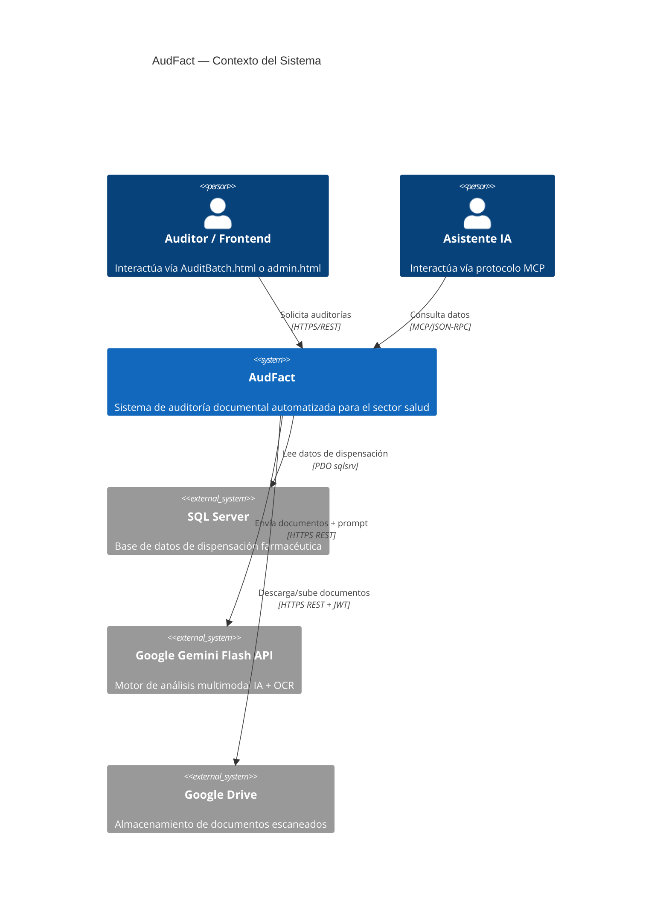
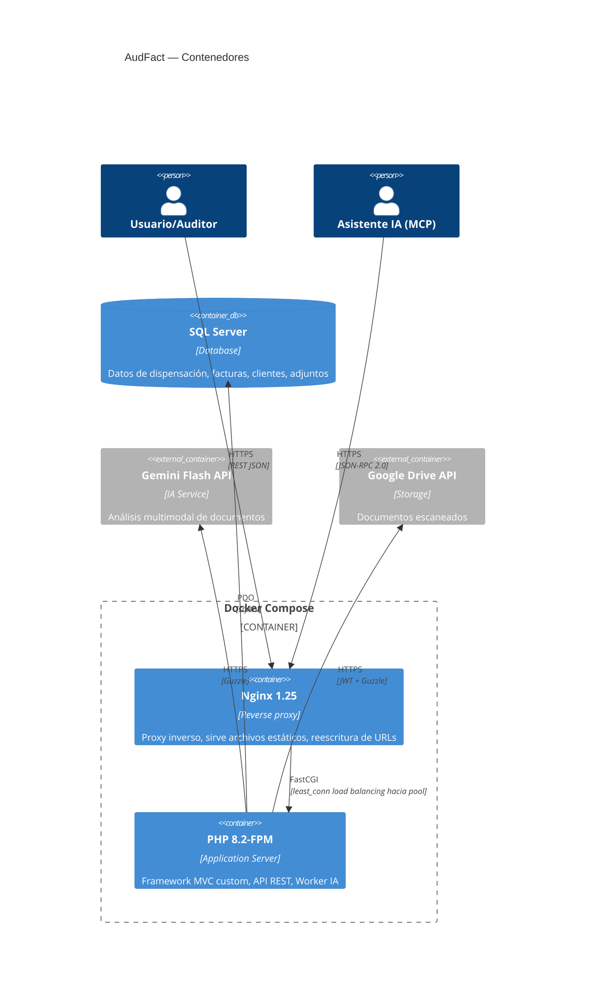
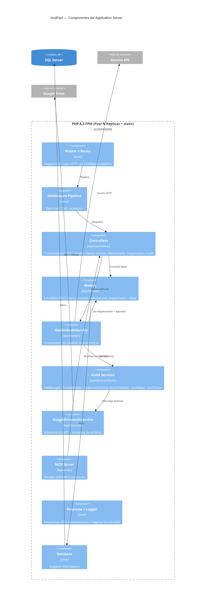
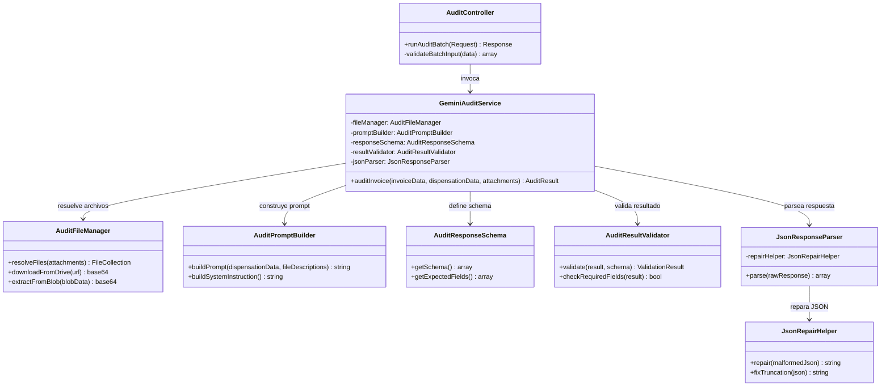

# Diagramas de Arquitectura — AudFact (C4 Model)

## Level 1 — System Context

---

## Level 2 — Container Diagram

---

## Level 3 — Component Diagram (PHP-FPM)

---

## Level 4 — Code Diagram (Pipeline de Auditoría)

