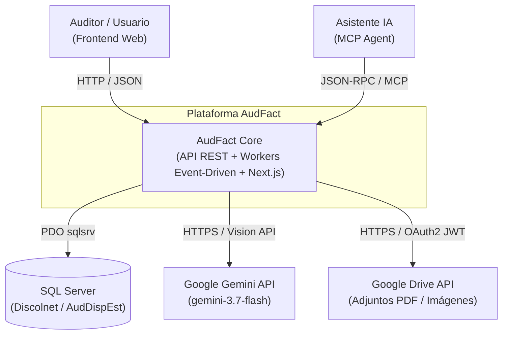
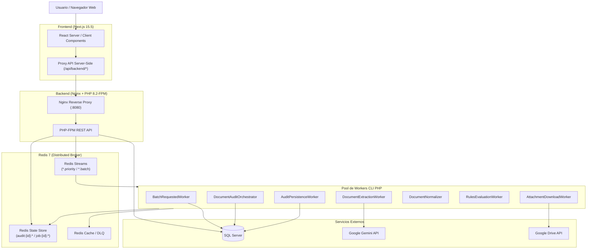
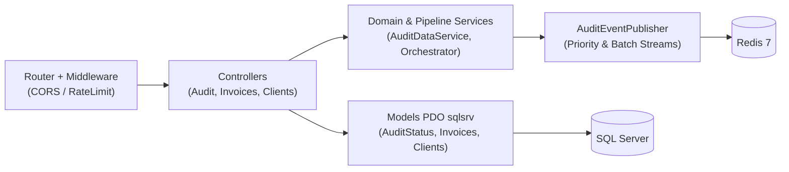
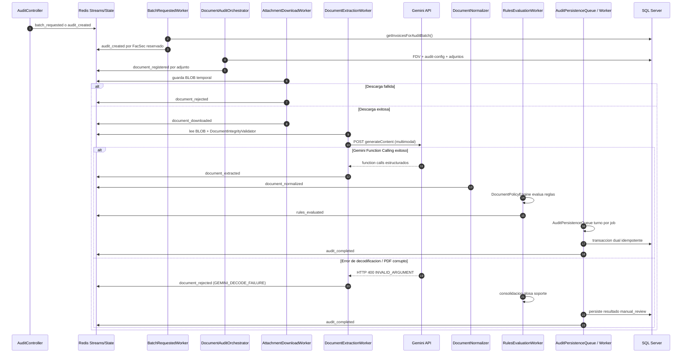
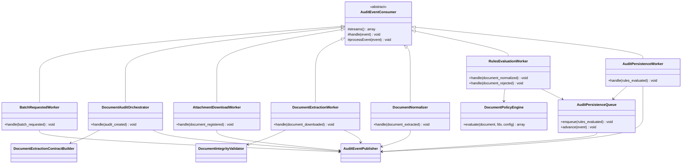
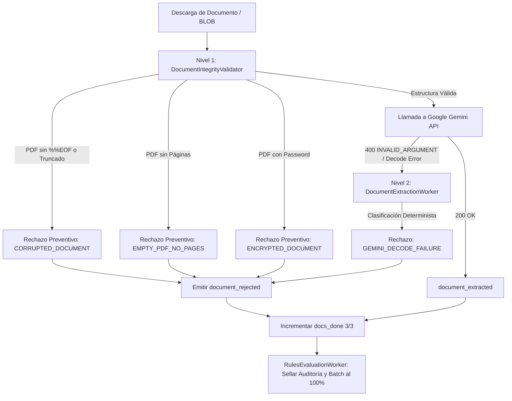

# Diagramas de Arquitectura — AudFact

> Estado actual: backend PHP 8.2-FPM + Nginx, frontend Next.js 15.5.15,
> Redis Streams para auditoría asíncrona y SQL Server externo.
> Fuente operativa: `app/Routes/web.php`, `docker-compose.yml` y `app/Services/Audit/Pipeline/*`.

---

## Level 1 — System Context (Contexto del Sistema)

```mermaid
flowchart TD
    User["Auditor / Usuario<br/>(Frontend Web)"]
    AI["Asistente IA<br/>(MCP Agent)"]
    
    subgraph AudFact["Plataforma AudFact"]
        CoreApp["AudFact Core<br/>(API REST + Workers Event-Driven + Next.js)"]
    end
    
    SQL[("SQL Server<br/>(Discolnet / AudDispEst)")]
    Gemini["Google Gemini API<br/>(gemini-3.7-flash)"]
    Drive["Google Drive API<br/>(Adjuntos PDF / Imágenes)"]
    
    User -->|HTTP / JSON| CoreApp
    AI -->|JSON-RPC / MCP| CoreApp
    CoreApp -->|PDO sqlsrv| SQL
    CoreApp -->|HTTPS / Vision API| Gemini
    CoreApp -->|HTTPS / OAuth2 JWT| Drive
```

---

## Level 2 — Container Diagram (Contenedores)

```mermaid
flowchart TD
    Client["Usuario / Navegador Web"]
    
    subgraph FrontendApp["Frontend (Next.js 15.5)"]
        UI["React Server / Client Components"]
        Proxy["Proxy API Server-Side (/api/backend/*)"]
    end
    
    subgraph BackendApp["Backend (Nginx + PHP 8.2-FPM)"]
        Nginx["Nginx Reverse Proxy (:8080)"]
        PHPFPM["PHP-FPM REST API"]
    end
    
    subgraph Broker["Redis 7 (Distributed Broker)"]
        Streams["Redis Streams<br/>(*.priority / *.batch)"]
        StateStore["Redis State Store<br/>(audit:{id}:* / job:{id}:*)"]
        CacheStore["Redis Cache / DLQ"]
    end
    
    subgraph WorkerPool["Pool de Workers CLI PHP"]
        WBatch["BatchRequestedWorker"]
        WOrch["DocumentAuditOrchestrator"]
        WDown["AttachmentDownloadWorker"]
        WExt["DocumentExtractionWorker"]
        WNorm["DocumentNormalizer"]
        WPol["RulesEvaluationWorker"]
        WPers["AuditPersistenceWorker"]
    end
    
    subgraph ExternalServices["Servicios Externos"]
        SQLServer[("SQL Server")]
        GeminiAPI["Google Gemini API"]
        GDriveAPI["Google Drive API"]
    end
    
    Client --> UI
    UI --> Proxy
    Proxy --> Nginx
    Nginx --> PHPFPM
    
    PHPFPM --> Streams
    PHPFPM --> StateStore
    PHPFPM --> SQLServer
    
    Streams --> WorkerPool
    WorkerPool --> StateStore
    WorkerPool --> CacheStore
    
    WBatch --> SQLServer
    WOrch --> SQLServer
    WDown --> GDriveAPI
    WExt --> GeminiAPI
    WPers --> SQLServer
```

---

## Level 3 — Component Diagram (Componentes del Backend PHP)

```mermaid
flowchart LR
    Router["Router + Middleware<br/>(CORS / RateLimit)"]
    Controllers["Controllers<br/>(Audit, Invoices, Clients)"]
    DataServices["Domain & Pipeline Services<br/>(AuditDataService, Orchestrator)"]
    Models["Models PDO sqlsrv<br/>(AuditStatus, Invoices, Clients)"]
    Publisher["AuditEventPublisher<br/>(Priority & Batch Streams)"]
    
    Redis[("Redis 7")]
    SQL[("SQL Server")]
    
    Router --> Controllers
    Controllers --> DataServices
    Controllers --> Models
    DataServices --> Publisher
    Publisher --> Redis
    Models --> SQL
```

---

## Level 4 — Pipeline de Auditoría IA (Secuencia Event-Driven)

```mermaid
sequenceDiagram
    autonumber
    participant API as AuditController
    participant Redis as Redis Streams/State
    participant Batch as BatchRequestedWorker
    participant Orchestrator as DocumentAuditOrchestrator
    participant Downloader as AttachmentDownloadWorker
    participant Extractor as DocumentExtractionWorker
    participant Gemini as Gemini API
    participant Normalizer as DocumentNormalizer
    participant Policy as RulesEvaluationWorker
    participant Persistence as AuditPersistenceQueue / Worker
    participant SQL as SQL Server

    API->>Redis: batch_requested o audit_created
    Batch->>SQL: getInvoicesForAuditBatch()
    Batch->>Redis: audit_created por FacSec reservado
    Orchestrator->>SQL: FDV + audit-config + adjuntos
    Orchestrator->>Redis: document_registered por adjunto
    Downloader->>Redis: guarda BLOB temporal
    alt Descarga fallida
        Downloader->>Redis: document_rejected
    else Descarga exitosa
        Downloader->>Redis: document_downloaded
        Extractor->>Redis: lee BLOB + DocumentIntegrityValidator
        Extractor->>Gemini: POST generateContent (multimodal)
        alt Gemini Function Calling exitoso
            Gemini-->>Extractor: function calls estructurados
            Extractor->>Redis: document_extracted
            Normalizer->>Redis: document_normalized
            Policy->>Policy: DocumentPolicyEngine evalua reglas
            Policy->>Redis: rules_evaluated
            Persistence->>Persistence: AuditPersistenceQueue turno por job
            Persistence->>SQL: transaccion dual idempotente
            Persistence->>Redis: audit_completed
        else Error de decodificacion / PDF corrupto
            Gemini-->>Extractor: HTTP 400 INVALID_ARGUMENT
            Extractor->>Redis: document_rejected (GEMINI_DECODE_FAILURE)
            Policy->>Policy: consolidacion glosa soporte
            Persistence->>SQL: persiste resultado manual_review
            Persistence->>Redis: audit_completed
        end
    end
```

---

## Level 5 — Diagrama de Clases del Pipeline

```mermaid
classDiagram
    class AuditEventConsumer {
        <<abstract>>
        #streams() array
        #handle(event) void
        #processEvent(event) void
    }

    class BatchRequestedWorker {
        +handle(batch_requested) void
    }

    class DocumentAuditOrchestrator {
        +handle(audit_created) void
    }

    class AttachmentDownloadWorker {
        +handle(document_registered) void
    }

    class DocumentExtractionWorker {
        +handle(document_downloaded) void
    }

    class DocumentNormalizer {
        +handle(document_extracted) void
    }

    class RulesEvaluationWorker {
        +handle(document_normalized) void
        +handle(document_rejected) void
    }

    class DocumentPolicyEngine {
        +evaluate(document, fdv, config) array
    }

    class AuditPersistenceQueue {
        +enqueue(rules_evaluated) void
        +advance(event) void
    }

    class AuditPersistenceWorker {
        +handle(rules_evaluated) void
    }

    AuditEventConsumer <|-- BatchRequestedWorker
    AuditEventConsumer <|-- DocumentAuditOrchestrator
    AuditEventConsumer <|-- AttachmentDownloadWorker
    AuditEventConsumer <|-- DocumentExtractionWorker
    AuditEventConsumer <|-- DocumentNormalizer
    AuditEventConsumer <|-- RulesEvaluationWorker
    AuditEventConsumer <|-- AuditPersistenceWorker
    DocumentAuditOrchestrator --> DocumentExtractionContractBuilder
    DocumentExtractionWorker --> DocumentIntegrityValidator
    RulesEvaluationWorker --> DocumentPolicyEngine
    BatchRequestedWorker --> AuditEventPublisher
    DocumentAuditOrchestrator --> AuditEventPublisher
    AttachmentDownloadWorker --> AuditEventPublisher
    DocumentExtractionWorker --> AuditEventPublisher
    DocumentNormalizer --> AuditEventPublisher
    RulesEvaluationWorker --> AuditPersistenceQueue
    AuditPersistenceQueue --> AuditEventPublisher
    AuditPersistenceWorker --> AuditPersistenceQueue
    AuditPersistenceWorker --> AuditEventPublisher
```

---

## Level 6 — Resiliencia en Extracción Documental (Pre-IA y Post-IA)

```mermaid
flowchart TD
    A[Descarga de Documento / BLOB] --> B[Nivel 1: DocumentIntegrityValidator]
    B -->|PDF sin %%EOF o Truncado| C[Rechazo Preventivo: CORRUPTED_DOCUMENT]
    B -->|PDF sin Páginas| D[Rechazo Preventivo: EMPTY_PDF_NO_PAGES]
    B -->|PDF con Password| E[Rechazo Preventivo: ENCRYPTED_DOCUMENT]
    B -->|Estructura Válida| F[Llamada a Google Gemini API]
    
    F -->|200 OK| G[document_extracted]
    F -->|400 INVALID_ARGUMENT / Decode Error| H[Nivel 2: DocumentExtractionWorker]
    H -->|Clasificación Determinista| I[Rechazo: GEMINI_DECODE_FAILURE]
    
    C --> J[Emitir document_rejected]
    D --> J
    E --> J
    I --> J
    J --> K[Incrementar docs_done 3/3]
    G --> K
    K --> L[RulesEvaluationWorker: Sellar Auditoría y Batch al 100%]
```
