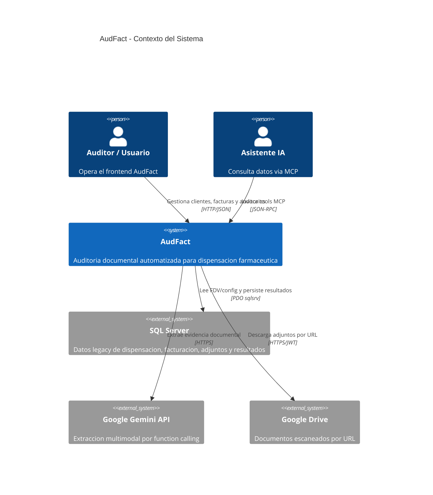
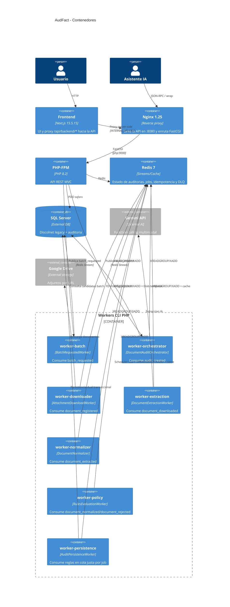
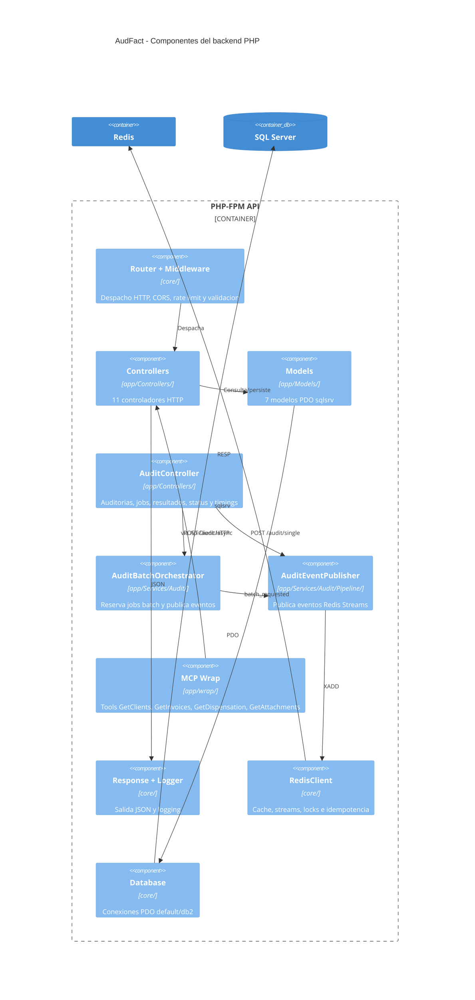
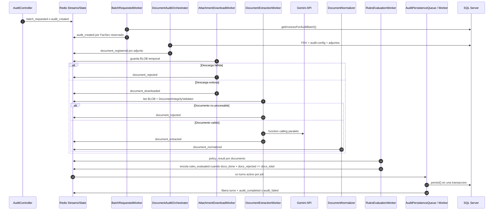
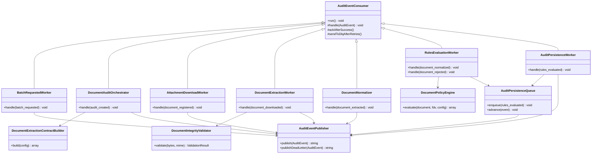

# Diagramas de Arquitectura - AudFact

> Estado actual: backend PHP 8.2-FPM + Nginx, frontend Next.js 15.5.15,
> Redis Streams para auditoria asíncrona y SQL Server externo. Fuente
> operativa: `app/Routes/web.php`, `docker-compose.yml`
> y `app/Services/Audit/Pipeline/*`.

---

## Level 1 - System Context

```mermaid
C4Context
    title AudFact - Contexto del Sistema

    Person(auditor, "Auditor / Usuario", "Opera el frontend AudFact")
    Person(aiAssistant, "Asistente IA", "Consulta datos via MCP")

    System(audfact, "AudFact", "Auditoria documental automatizada para dispensacion farmaceutica")

    System_Ext(sqlserver, "SQL Server", "Datos legacy de dispensacion, facturacion, adjuntos y resultados")
    System_Ext(gemini, "Google Gemini API", "Extraccion multimodal por function calling")
    System_Ext(gdrive, "Google Drive", "Documentos escaneados por URL")

    Rel(auditor, audfact, "Gestiona clientes, facturas y auditorias", "HTTP/JSON")
    Rel(aiAssistant, audfact, "Invoca tools MCP", "JSON-RPC")
    Rel(audfact, sqlserver, "Lee FDV/config y persiste resultados", "PDO sqlsrv")
    Rel(audfact, gemini, "Extrae evidencia documental", "HTTPS")
    Rel(audfact, gdrive, "Descarga adjuntos por URL", "HTTPS/JWT")
```

---

## Level 2 - Container Diagram

```mermaid
C4Container
    title AudFact - Contenedores

    Person(user, "Usuario")
    Person(mcp, "Asistente IA")

    Container(frontend, "Frontend", "Next.js 15.5.15", "UI y proxy /api/backend/* hacia la API")
    Container(nginx, "Nginx 1.25", "Reverse proxy", "Sirve la API en :8080 y enruta FastCGI")
    Container(php, "PHP-FPM", "PHP 8.2", "API REST MVC")
    Container(redis, "Redis 7", "Streams/Cache", "Estado de auditorias, jobs, idempotencia y DLQ")

    Container_Boundary(workers, "Workers CLI PHP") {
        Container(batch, "worker-batch", "BatchRequestedWorker", "Consume batch_requested")
        Container(orchestrator, "worker-orchestrator", "DocumentAuditOrchestrator", "Consume audit_created")
        Container(downloader, "worker-downloader", "AttachmentDownloadWorker", "Consume document_registered")
        Container(extraction, "worker-extraction", "DocumentExtractionWorker", "Consume document_downloaded")
        Container(normalizer, "worker-normalizer", "DocumentNormalizer", "Consume document_extracted")
        Container(policy, "worker-policy", "RulesEvaluationWorker", "Consume document_normalized/document_rejected")
        Container(persistence, "worker-persistence", "AuditPersistenceWorker", "Consume reglas en cola justa por job")
    }

    ContainerDb(sqlsrv, "SQL Server", "External DB", "Discolnet legacy + auditoria")
    Container_Ext(gemini, "Gemini API", "External AI", "Function calling multimodal")
    Container_Ext(gdrive, "Google Drive", "External storage", "Adjuntos por URL")

    Rel(user, frontend, "HTTP")
    Rel(frontend, nginx, "Proxy server-side", "INTERNAL_API_URL")
    Rel(mcp, nginx, "JSON-RPC / wrap")
    Rel(nginx, php, "FastCGI", "php:9000")
    Rel(php, sqlsrv, "PDO sqlsrv")
    Rel(php, redis, "Redis")
    Rel(php, batch, "Publica batch_requested", "Redis Stream")
    Rel(php, orchestrator, "Publica audit_created", "Redis Stream")
    Rel(batch, redis, "XREADGROUP/XADD")
    Rel(orchestrator, redis, "XREADGROUP/XADD")
    Rel(downloader, redis, "XREADGROUP/XADD + blob temporal")
    Rel(extraction, redis, "XREADGROUP/XADD + cache")
    Rel(normalizer, redis, "XREADGROUP/XADD")
    Rel(policy, redis, "XREADGROUP/XADD")
    Rel(persistence, redis, "Scheduler Lua + XREADGROUP/XADD + cierre")
    Rel(batch, sqlsrv, "Consulta candidatas batch")
    Rel(orchestrator, sqlsrv, "FDV/config/adjuntos")
    Rel(downloader, gdrive, "Descarga documentos")
    Rel(extraction, gemini, "Extraccion IA")
    Rel(persistence, sqlsrv, "Persistencia dual transaccional")
```

---

## Level 3 - Component Diagram (API PHP)

```mermaid
C4Component
    title AudFact - Componentes del backend PHP

    Container_Boundary(api, "PHP-FPM API") {
        Component(router, "Router + Middleware", "core/", "Despacho HTTP, CORS, rate limit y validacion")
        Component(controllers, "Controllers", "app/Controllers/", "11 controladores HTTP")
        Component(models, "Models", "app/Models/", "7 modelos PDO sqlsrv")
        Component(auditController, "AuditController", "app/Controllers/", "Auditorias, jobs, resultados, status y timings")
        Component(auditBatch, "AuditBatchOrchestrator", "app/Services/Audit/", "Reserva jobs batch y publica eventos")
        Component(publisher, "AuditEventPublisher", "app/Services/Audit/Pipeline/", "Publica eventos Redis Streams")
        Component(mcpServer, "MCP Wrap", "app/wrap/", "Tools GetClients, GetInvoices, GetDispensation, GetAttachments")
        Component(response, "Response + Logger", "core/", "Salida JSON y logging")
        Component(redisClient, "RedisClient", "core/", "Cache, streams, locks e idempotencia")
        Component(database, "Database", "core/", "Conexiones PDO default/db2")
    }

    Container(redis, "Redis", "")
    ContainerDb(sqlsrv, "SQL Server", "")

    Rel(router, controllers, "Despacha")
    Rel(controllers, models, "Consulta/persiste")
    Rel(auditController, auditBatch, "POST /audit/async")
    Rel(auditController, publisher, "POST /audit/single")
    Rel(auditBatch, publisher, "batch_requested")
    Rel(publisher, redisClient, "XADD")
    Rel(mcpServer, controllers, "via ApiClient HTTP")
    Rel(models, database, "PDO")
    Rel(database, sqlsrv, "sqlsrv")
    Rel(redisClient, redis, "RESP")
    Rel(controllers, response, "JSON")
```

---

## Level 4 - Pipeline de Auditoria IA

```mermaid
sequenceDiagram
    autonumber
    participant API as AuditController
    participant Redis as Redis Streams/State
    participant Batch as BatchRequestedWorker
    participant Orchestrator as DocumentAuditOrchestrator
    participant Downloader as AttachmentDownloadWorker
    participant Extractor as DocumentExtractionWorker
    participant Gemini as Gemini API
    participant Normalizer as DocumentNormalizer
    participant Policy as RulesEvaluationWorker
    participant Persistence as AuditPersistenceQueue / Worker
    participant SQL as SQL Server

    API->>Redis: batch_requested o audit_created
    Batch->>SQL: getInvoicesForAuditBatch()
    Batch->>Redis: audit_created por FacSec reservado
    Orchestrator->>SQL: FDV + audit-config + adjuntos
    Orchestrator->>Redis: document_registered por adjunto
    Downloader->>Redis: guarda BLOB temporal
    alt Descarga fallida
        Downloader->>Redis: document_rejected
    else Descarga exitosa
        Downloader->>Redis: document_downloaded
        Extractor->>Redis: lee BLOB + DocumentIntegrityValidator
        alt Documento no procesable
            Extractor->>Redis: document_rejected
        else Documento valido
            Extractor->>Gemini: function calling paralelo
            Extractor->>Redis: document_extracted
            Normalizer->>Redis: document_normalized
        end
    end
    Policy->>Redis: policy_result por documento
    Policy->>Redis: encola rules_evaluated cuando docs_done + docs_rejected == docs_total
    Redis->>Persistence: un turno activo por job
    Persistence->>SQL: persist() en una transaccion
    Persistence->>Redis: libera turno + audit_completed o audit_failed
```

---

## Level 4 - Componentes del Pipeline

```mermaid
classDiagram
    class AuditEventPublisher {
        +publish(AuditEvent) string
        +publishDeadLetter(AuditEvent) string
    }

    class AuditEventConsumer {
        +run() void
        #handle(AuditEvent) void
        #ackAfterSuccess()
        #sendToDlqAfterRetries()
    }

    class BatchRequestedWorker {
        +handle(batch_requested) void
    }

    class DocumentAuditOrchestrator {
        +handle(audit_created) void
    }

    class DocumentExtractionContractBuilder {
        +build(config) array
    }

    class DocumentIntegrityValidator {
        +validate(bytes, mime) ValidationResult
    }

    class AttachmentDownloadWorker {
        +handle(document_registered) void
    }

    class DocumentExtractionWorker {
        +handle(document_downloaded) void
    }

    class DocumentNormalizer {
        +handle(document_extracted) void
    }

    class RulesEvaluationWorker {
        +handle(document_normalized) void
        +handle(document_rejected) void
    }

    class DocumentPolicyEngine {
        +evaluate(document, fdv, config) array
    }

    class AuditPersistenceQueue {
        +enqueue(rules_evaluated) void
        +advance(event) void
    }

    class AuditPersistenceWorker {
        +handle(rules_evaluated) void
    }

    AuditEventConsumer <|-- BatchRequestedWorker
    AuditEventConsumer <|-- DocumentAuditOrchestrator
    AuditEventConsumer <|-- AttachmentDownloadWorker
    AuditEventConsumer <|-- DocumentExtractionWorker
    AuditEventConsumer <|-- DocumentNormalizer
    AuditEventConsumer <|-- RulesEvaluationWorker
    AuditEventConsumer <|-- AuditPersistenceWorker
    DocumentAuditOrchestrator --> DocumentExtractionContractBuilder
    DocumentExtractionWorker --> DocumentIntegrityValidator
    RulesEvaluationWorker --> DocumentPolicyEngine
    BatchRequestedWorker --> AuditEventPublisher
    DocumentAuditOrchestrator --> AuditEventPublisher
    AttachmentDownloadWorker --> AuditEventPublisher
    DocumentExtractionWorker --> AuditEventPublisher
    DocumentNormalizer --> AuditEventPublisher
    RulesEvaluationWorker --> AuditPersistenceQueue
    AuditPersistenceQueue --> AuditEventPublisher
    AuditPersistenceWorker --> AuditPersistenceQueue
    AuditPersistenceWorker --> AuditEventPublisher
```
