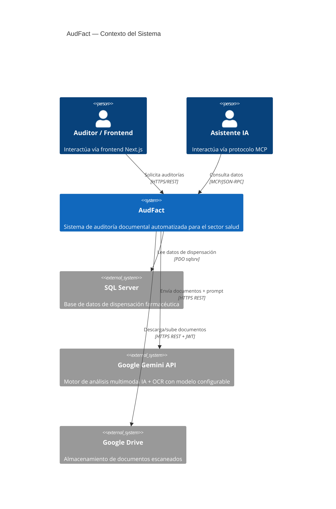
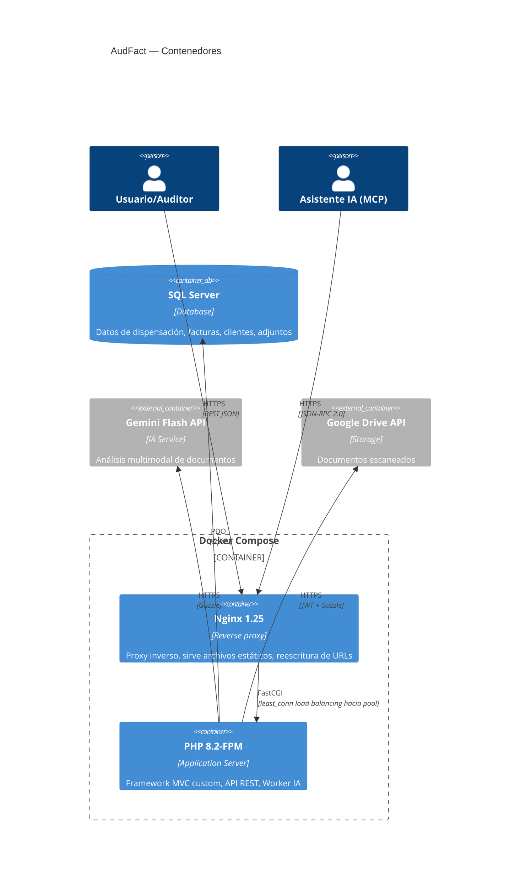
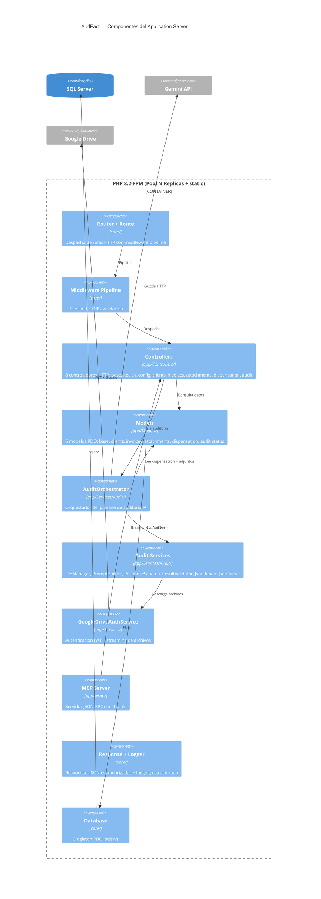
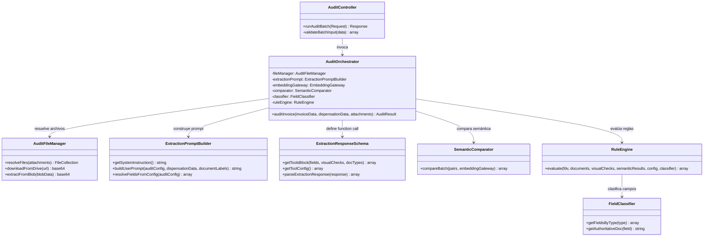

# Diagramas de Arquitectura — AudFact (C4 Model)

> **[OBSOLETO POST-AUDIT-013/014/015]** Este documento describe la arquitectura monolítica anterior.  
> **Arquitectura actual**: Pipeline event-driven con Redis Streams y 5 workers independientes.  
> **Referencias actualizadas**:
> - Skill: [`.agent/skills/audfact-audit-gemini/SKILL.md`](./.agent/skills/audfact-audit-gemini/SKILL.md) — flujo completo y workers  
> - Architecture: [`plans/architecture.md`](./architecture.md) — diagrama event-driven  
> - Project overview: [`.agent/skills/audfact-project-overview/SKILL.md`](./.agent/skills/audfact-project-overview/SKILL.md) — endpoints y flujo  
>
> Si necesitas diagramas C4 de la arquitectura actual, abre un ticket DOCS-*.

---

## Level 1 — System Context

```mermaid
C4Context
    title AudFact — Contexto del Sistema

    Person(auditor, "Auditor / Frontend", "Interactúa vía frontend Next.js")
    Person(aiAssistant, "Asistente IA", "Interactúa vía protocolo MCP")

    System(audfact, "AudFact", "Sistema de auditoría documental automatizada para el sector salud")

    System_Ext(sqlserver, "SQL Server", "Base de datos de dispensación farmacéutica")
    System_Ext(gemini, "Google Gemini API", "Motor de análisis multimodal IA + OCR con modelo configurable")
    System_Ext(gdrive, "Google Drive", "Almacenamiento de documentos escaneados")

    Rel(auditor, audfact, "Solicita auditorías", "HTTPS/REST")
    Rel(aiAssistant, audfact, "Consulta datos", "MCP/JSON-RPC")
    Rel(audfact, sqlserver, "Lee datos de dispensación", "PDO sqlsrv")
    Rel(audfact, gemini, "Envía documentos + prompt", "HTTPS REST")
    Rel(audfact, gdrive, "Descarga/sube documentos", "HTTPS REST + JWT")
```

---

## Level 2 — Container Diagram

```mermaid
C4Container
    title AudFact — Contenedores

    Person(user, "Usuario/Auditor")
    Person(mcp, "Asistente IA (MCP)")

    Container_Boundary(docker, "Docker Compose") {
        Container(nginx, "Nginx 1.25", "Reverse proxy", "Proxy inverso, sirve archivos estáticos, reescritura de URLs")
        Container(phpfpm, "PHP 8.2-FPM", "Application Server", "Framework MVC custom, API REST, Worker IA")
    }

    ContainerDb(sqlsrv, "SQL Server", "Database", "Datos de dispensación, facturas, clientes, adjuntos")
    Container_Ext(gemini, "Gemini Flash API", "IA Service", "Análisis multimodal de documentos")
    Container_Ext(gdrive, "Google Drive API", "Storage", "Documentos escaneados")

    Rel(user, nginx, "HTTPS", "REST JSON")
    Rel(mcp, nginx, "HTTPS", "JSON-RPC 2.0")
    Rel(nginx, phpfpm, "FastCGI", "least_conn load balancing hacia pool")
    Rel(phpfpm, sqlsrv, "PDO", "sqlsrv")
    Rel(phpfpm, gemini, "HTTPS", "Guzzle")
    Rel(phpfpm, gdrive, "HTTPS", "JWT + Guzzle")
```

---

## Level 3 — Component Diagram (PHP-FPM)

```mermaid
C4Component
    title AudFact — Componentes del Application Server

    Container_Boundary(phpfpm, "PHP 8.2-FPM (Pool N Replicas + static)") {
        Component(router, "Router + Route", "core/", "Despacho de rutas HTTP con middleware pipeline")
        Component(middleware, "Middleware Pipeline", "core/", "Rate limit, CORS, validación")
        Component(controllers, "Controllers", "app/Controllers/", "8 controladores HTTP: base, health, config, clients, invoices, attachments, dispensation, audit")
        Component(models, "Models", "app/Models/", "6 modelos PDO: base, clients, invoices, attachments, dispensation, audit status")
        Component(auditWorker, "AuditOrchestrator", "app/Services/Audit/", "Orquestador del pipeline de auditoría IA")
        Component(auditServices, "Audit Services", "app/Services/Audit/", "FileManager, PromptBuilder, ResponseSchema, ResultValidator, JsonRepair, JsonParser")
        Component(driveService, "GoogleDriveAuthService", "app/Services/", "Autenticación JWT + streaming de archivos")
        Component(mcpServer, "MCP Server", "app/wrap/", "Servidor JSON-RPC con 4 tools")
        Component(response, "Response + Logger", "core/", "Respuestas JSON estandarizadas + logging estructurado")
        Component(database, "Database", "core/", "Singleton PDO (sqlsrv)")
    }

    ContainerDb(sqlsrv, "SQL Server", "")
    Container_Ext(gemini, "Gemini API", "")
    Container_Ext(gdrive, "Google Drive", "")

    Rel(router, middleware, "Pipeline")
    Rel(middleware, controllers, "Despacha")
    Rel(controllers, models, "Consulta datos")
    Rel(controllers, auditWorker, "Inicia auditoría")
    Rel(auditWorker, auditServices, "Usa servicios")
    Rel(auditWorker, models, "Lee dispensación + adjuntos")
    Rel(auditServices, driveService, "Descarga archivos")
    Rel(mcpServer, controllers, "Reutiliza vía ApiClient")
    Rel(models, database, "PDO")
    Rel(database, sqlsrv, "sqlsrv")
    Rel(auditWorker, gemini, "Guzzle HTTP")
    Rel(driveService, gdrive, "JWT + Guzzle")
```

---

## Level 4 — Code Diagram (Pipeline de Auditoría)

```mermaid
classDiagram
    class AuditController {
        +runAuditBatch(Request) Response
        -validateBatchInput(data) array
    }

    class AuditOrchestrator {
        -fileManager: AuditFileManager
        -extractionPrompt: ExtractionPromptBuilder
        -embeddingGateway: EmbeddingGateway
        -comparator: SemanticComparator
        -classifier: FieldClassifier
        -ruleEngine: RuleEngine
        +auditInvoice(invoiceData, dispensationData, attachments) AuditResult
    }

    class AuditFileManager {
        +resolveFiles(attachments) FileCollection
        +downloadFromDrive(url) base64
        +extractFromBlob(blobData) base64
    }

    class ExtractionPromptBuilder {
        +getSystemInstruction() string
        +buildUserPrompt(auditConfig, dispensationData, documentLabels) string
        +resolveFieldsFromConfig(auditConfig) array
    }

    class ExtractionResponseSchema {
        +getToolsBlock(fields, visualChecks, docTypes) array
        +getToolConfig() array
        +parseExtractionResponse(response) array
    }

    class SemanticComparator {
        +compareBatch(pairs, embeddingGateway) array
    }

    class RuleEngine {
        +evaluate(fdv, documents, visualChecks, semanticResults, config, classifier) array
    }

    class FieldClassifier {
        +getFieldsByType(type) array
        +getAuthoritativeDoc(field) string
    }

    AuditController --> AuditOrchestrator : invoca
    AuditOrchestrator --> AuditFileManager : resuelve archivos
    AuditOrchestrator --> ExtractionPromptBuilder : construye prompt
    AuditOrchestrator --> ExtractionResponseSchema : define function call
    AuditOrchestrator --> SemanticComparator : compara semántica
    AuditOrchestrator --> RuleEngine : evalúa reglas
    RuleEngine --> FieldClassifier : clasifica campos
```
