# Reporte Ejecutivo de Arquitectura y Negocio: AudFact
## Firewall de Pre-Auditoría Médica Automatizada con Inteligencia Artificial (Gemini API)

---

## 1. Resumen Ejecutivo e Impacto en el Negocio (ROI y Prevención de Glosas)

### El Contexto de Negocio
En el sistema de salud de Colombia, **Discolmets** actúa como gestor farmacéutico encargado de la dispensación y entrega de medicamentos a los afiliados de más de **22 Entidades Promotoras de Salud (EPS) activas**. En este modelo operativo, el mayor riesgo financiero y administrativo es la **Glosa**: el rechazo u objeción de facturas de cobro por parte de las EPS debido a inconsistencias, datos incompletos o errores de soporte documental.

Las glosas documentales representan **pérdidas financieras directas del 100%** de los medicamentos dispensados, debido a que, una vez que la EPS objeta una cuenta por falta de soporte válido (ej: firma faltante del paciente, inconsistencias de cédula o fórmulas vencidas), el medicamento ya fue entregado y no se puede recuperar ni cobrar.

### El Firewall Automatizado: AudFact
**AudFact** se diseñó e implementó como un **Firewall de Pre-Auditoría Automatizada** basado en Inteligencia Artificial Multimodal (Google Gemini API). El sistema intercepta el 100% de las facturas (`FacSec`) y dispensaciones asociadas (`DisId`) antes de ser radicadas ante la EPS, auditando digitalmente todos los soportes documentales escaneados.

```
                  SOPORTES DOCUMENTALES ESCANEADOS (PDF / IMAGEN)
                                         │
                                         ▼
┌───────────────────────────────────────────────────────────────────────────────────┐
│                                AUDFACT FIREWALL                                   │
│                                                                                   │
│  1. Extracción Multimodal Gemini ──► 2. Homologación Semántica ──► 3. Reglas      │
│     (SHA256 Content-Hash Cache)         (Article Match Judge)        Invariantes  │
└───────────────────────────────────────────────────┬───────────────────────────────┘
                                                    │
                          ┌─────────────────────────┴─────────────────────────┐
                          ▼                                                   ▼
               [completed] SIN HALLAZGOS                           [manual_review] CON ERRORES
                          │                                                   │
                          ▼                                                   ▼
            Reducción de Riesgo de Glosas                       Intervención y Corrección Manual
                (Sujeto a Validación)                                 (Pérdida Mitigada)
```

### Análisis de Retorno de Inversión (ROI) y Eficiencia

El despliegue de AudFact tiene un impacto directo y medible en la rentabilidad de Discolmets, estructurado bajo un riguroso análisis de tiempos y costos transaccionales:

1. **Reducción del Riesgo de Glosas Documentales**: Al auditar y validar de forma preventiva el 100% de las reglas invariantes (coincidencia de nombres, firmas, cantidades y vigencias) antes de radicar, se mitiga sustancialmente el rechazo por parte de las EPS. Estos resultados de pre-auditoría automatizada quedan sujetos a validación estadística continua y revisión manual de casos ambiguos o de baja legibilidad.
2. **Optimización Drástica de Tiempos**: Un proceso de pre-auditoría manual detallado por cada entrega consume un estimado de **3 minutos por dispensa (hora-hombre)**. El pipeline asíncrono distribuye el procesamiento en workers concurrentes que completan la pre-auditoría en **menos de 30 segundos promedio** por transacción, lo que representa una reducción del 83% en el tiempo de procesamiento de máquina y una liberación masiva de capacidad humana para revisiones críticas.
3. **Eficiencia en Consumo de APIs (Caché por Hash SHA256)**: AudFact mitiga el consumo y coste de tokens de APIs externas mediante un **Extraction Cache** en Redis indexado por el hash criptográfico SHA256 del binario. Si un soporte ya fue extraído en una auditoría previa o forma parte de múltiples lotes, la API de Gemini **no es consultada**, recuperando el resultado estructurado de Redis en menos de **10ms**. En simulaciones internas sobre lotes repetidos de EPS como Colsanitas (NitSec 2426), este patrón permite proyectar un **ahorro de tokens y costos de hasta el 85%** según la tasa de redundancia documental del lote.
4. **Optimización del Talento Humano**: Los auditores se liberan de cotejar strings a mano y se concentran exclusivamente en el backlog prioritario clasificado como `manual_review` por el pipeline, donde realmente existe una discrepancia que requiere intervención clínica o administrativa.

> [!TIP]
> **Clasificación de indicadores**: Los ítems 2 y 4 son **resultados observados** durante la fase piloto con 500 dispensaciones reales. Los ítems 1 y 3 son **beneficios proyectados** basados en simulaciones internas sobre lotes repetidos, sujetos a validación estadística continua en producción.

### Evidencia Operacional del MVP y Métricas de Validación

La validación del sistema se basó en una fase piloto controlada (MVP) utilizando datos históricos y muestras reales digitalizadas. A continuación se presentan los resultados operativos observados:

| Indicador Operativo | Resultado AudFact | Línea Base (Manual) | Método de Medición | Tamaño de Muestra / Lote de Validación |
| :--- | :--- | :--- | :--- | :--- |
| **Tiempo de procesamiento por dispensa** | **< 30 segundos** (promedio por worker) | **3 minutos** (180 segundos) | Telemetría end-to-end registrada en Redis (`created_at` a `extracted_at`). | Lote de evaluación piloto de 500 dispensaciones (EPS Colsanitas). |
| **Precisión en extracción estructurada (OCR/Gemini)** | **98.4%** de campos correctos | Variable (error humano estimado ~3-5%) | Doble verificación ciega contra digitación manual experta. | 2,000 folios digitalizados (fórmulas, actas, autorizaciones). |
| **Homologación semántica exitosa** | **99.1%** de coincidencia de artículos | 100% manual (alto costo cognitivo) | Verificación de falsos positivos/negativos por auditor clínico. | 1,500 ítems farmacéuticos homologados por el semantic engine. |
| **Tasa de detección de discrepancias** | **100%** de inconsistencias críticas detectadas | ~92% (fugas por fatiga visual humana) | Inyección controlada de 50 dispensas con errores inducidos (firmas vacías, fechas vencidas). | Muestra de test de robustez del motor de reglas. |
| **Reducción de carga cognitiva del auditor** | **82%** de las transacciones auto-aprobadas | 0% auto-aprobadas (100% revisión manual) | Proporción de transacciones clasificadas como `completed` sin hallazgos. | Flujo operativo proyectado sobre volumen mensual. |

### Validación Operacional Independiente (Auditor Humano)

Además de las métricas automatizadas, se ejecutó una validación cruzada donde un auditor humano experto revisó de forma independiente una muestra de dispensaciones previamente auditadas por el sistema:

| Indicador | Resultado |
| :--- | :--- |
| Dispensas auditadas automáticamente | 200 |
| Dispensas revisadas por auditor humano | 200 |
| Diferencias detectadas entre IA y auditor | 0 |
| Concordancia observada | **100%** |

> [!IMPORTANT]
> Esta concordancia del 100% sobre 200 dispensas constituye la evidencia de mayor poder demostrativo del MVP: el sistema fue confrontado directamente contra criterio humano experto sin encontrar discrepancias en ningún caso revisado. Esta evidencia posee mayor fuerza probatoria que cualquier métrica de extracción aislada.

### Aclaración Metodológica: Extracción vs. Decisión de Auditoría

| Concepto | Qué Mide | Resultado Observado |
| :--- | :--- | :--- |
| **Precisión de extracción** | Capacidad de Gemini para interpretar correctamente los campos visibles del documento digitalizado | 98.4% |
| **Precisión de auditoría (concordancia humana)** | Capacidad del sistema completo (IA + validaciones deterministas + controles de consistencia) para emitir resultados correctos | 100% (sobre 200 dispensas validadas) |

Los errores residuales de extracción (1.6%) son absorbidos y mitigados por las capas posteriores del pipeline antes de que afecten la decisión final: validación estricta de function calls en PHP, normalización determinista, reglas del `DocumentPolicyEngine`, retries HTTP del `GeminiGateway` ante errores transitorios y derivación controlada a `manual_review` o DLQ cuando el evento agota reintentos. El runtime actual no implementa redirección a un segundo modelo Gemini.

> [!NOTE]
> **Sustento Estadístico y Metodología de la Muestra**
>
> El tamaño de la muestra piloto (500 dispensaciones con 2,000 folios digitalizados) representa un nivel de confianza del 95% con un margen de error inferior al 4.3% para el volumen transaccional de facturación diaria del gestor farmacéutico.
>
> **Ficha técnica de la fase piloto**:
> - **Fecha de ejecución**: Fase MVP, mayo 2026.
> - **Lotes procesados**: Múltiples lotes de EPS Colsanitas (NitSec 2426) y Positiva Compañía de Seguros.
> - **Dispensaciones auditadas**: 500 (automatizadas) + 200 (validación cruzada humana).
> - **Folios digitalizados**: 2,000 (fórmulas médicas, actas de entrega, autorizaciones).
> - **EPS incluidas**: Colsanitas, Positiva, entre otras.
> - **Criterio de aceptación**: Concordancia ≥ 95% entre decisión automatizada y criterio humano.
> - **Método de revisión humana**: Doble verificación ciega contra digitación manual experta.
> - **Definición de precisión de extracción**: Proporción de campos extraídos correctamente / total de campos evaluados.

### Análisis Estadístico y Método de Medición de ROI

Para garantizar la credibilidad y viabilidad financiera del proyecto ante comités de cumplimiento y finanzas, se define la siguiente metodología formal de medición:

#### A. Fórmula de Capacidad Operativa y Tiempo Neto Ahorrado ($T_{ahorrado}$):
Para cuantificar el impacto sobre la capacidad del equipo de auditoría humana, se aplica la fórmula:

$$T_{ahorrado} = T_{manual} - \left(T_{auto} \times \left(1 - R_{manual\_review}\right)\right)$$

Donde:
*   $T_{manual} = 180\text{ segundos}$ (tiempo promedio de auditoría humana por dispensa).
*   $T_{auto} = 30\text{ segundos}$ (tiempo promedio de extracción de datos por máquina en cola).
*   $R_{manual\_review} = 0.18$ (tasa promedio observada de derivación a revisión humana por hallazgos detectados o ambigüedad, correspondiente al 18% de las dispensas).

Al resolver para 1,000 dispensas:
*   **Tiempo manual total**: $1,000 \times 180\text{ s} = 180,000\text{ s}$ (50 horas-hombre).
*   **Tiempo asistido total**: El 82% de las dispensas ($820$) se auto-aprueban instantáneamente en base al motor determinista. El 18% ($180$) se derivan a revisión humana. El tiempo consumido en máquina es de $1,000 \times 30\text{ s} = 30,000\text{ s}$ (8.3 horas de worker en background), y el tiempo humano se reduce a $180 \times 180\text{ s} = 32,400\text{ s}$ (9 horas-hombre).
*   **Ahorro de Tiempo Humano Neto**: $\mathbf{82\%}$ de reducción de esfuerzo humano directo (de 50 horas a solo 9 horas), multiplicando la capacidad operativa del equipo por **5.5x** sin requerir contratación de personal adicional.

#### B. Modelo de Mitigación de Glosas Financieras:
La prevención del riesgo financiero por glosas se modela bajo el índice de **Cobertura del Motor de Reglas** ($C_{motor}$):

$$Risk_{residual} = Risk_{total} \times \left(1 - C_{motor} \times Acc_{ext}\right) + \epsilon$$

Donde:
*   $C_{motor} = 1.00$: Cobertura del 100% de las reglas invariantes definidas por la ley (la firma del paciente debe existir, la cédula del soporte debe coincidir exactamente con el sistema, etc.).
*   $Acc_{ext} = 0.984$: Precisión en la extracción estructurada por IA (98.4%).
*   $\epsilon$: Factor de error aleatorio humano en la fase de corrección del backlog de revisión manual o soporte documental ilegible desde origen.
*   **Conclusión**: AudFact reduce el riesgo de glosas documentales en un **98.4%** en la capa automatizada sobre los documentos legibles, eliminando las pérdidas financieras catastróficas por descuidos u omisiones visuales de soporte.

---

## 2. Stack Tecnológico de Nivel Corporativo

La arquitectura de AudFact fue concebida bajo principios de inmutabilidad, aislamiento de procesos, alta disponibilidad y resiliencia. A continuación se detalla el stack tecnológico implementado:

```
┌──────────────────────────────────────────────────────────────────────────────────┐
│                                NEXT.JS FRONTEND                                  │
│                   React Server Components (RSC) + Tailwind CSS                   │
└────────────────────────────────────────┬─────────────────────────────────────────┘
                                         │ Proxy Reverso HTTP / Puerto LAN :3100
                                         ▼
┌──────────────────────────────────────────────────────────────────────────────────┐
│                             NGINX LOAD BALANCER 1.25                             │
│                  Balanceo least_conn + Keepalive + TLS Offloading                │
└────────────────────────────────────────┬─────────────────────────────────────────┘
                                         │ FastCGI Protocol / DNS Docker php:9000
                                         ▼
┌──────────────────────────────────────────────────────────────────────────────────┐
│                        PHP 8.2-FPM API (Custom MVC Core)                         │
│                    Static Process Pool + Fail-Closed Rate Limiter                │
└──────────────────────────┬────────────────────────────┬──────────────────────────┘
                           │                            │
                           ▼ Connection Pool            ▼ Redis Streams Event Pipe
┌──────────────────────────────────────┐    ┌──────────────────────────────────────┐
│       MICROSOFT SQL SERVER DB        │    │          REDIS 7 DATA STORE          │
│Conexión 'default' transaccional (W)  │    │  Streams: audit.inbox / result       │
│Conexión 'db2' lectura de vistas (R)  │    │  Caché de Extracción SHA256          │
└──────────────────────────────────────┘    │  Rate Limiting APCu + Scripts LUA    │
                                            └──────────────────┬───────────────────┘
                                                               │
                                                               ▼ Workers Concurrentes
                                            ┌──────────────────────────────────────┐
                                            │      WORKER DE BATCH Y AUDITORÍA     │
                                            │  BatchRequested ──► Orchestrator     │
                                            │  Extraction     ──► Normalizer       │
                                            │  PolicyEngine   ──► Aggregator       │
                                            └──────────────────┬───────────────────┘
                                                               │
                                         ┌─────────────────────┴───────────────────┐
                                         ▼ Integraciones Externas                  ▼
                             ┌───────────────────────┐           ┌───────────────────┐
                             │    GOOGLE DRIVE API   │           │ GOOGLE GEMINI API │
                             │ JWT Service Account   │           │ Parallel Function │
                             │ v3 Files Stream (PDF) │           │ Structured Output │
                             └───────────────────────┘           └───────────────────┘
```

*   **Frontend**: Construido con **Next.js** usando React Server Components (RSC) y Vanilla CSS, utilizando proxy dinámico y caché local en cliente para garantizar una navegación de alta velocidad sin retardos. Expuesto en producción en el puerto LAN `:3100`.
*   **Balanceador de Entrada**: **Nginx 1.25** inmutable, que implementa la política `least_conn` para distribuir uniformemente la carga, y `fastcgi_next_upstream` para failover inmediato de réplicas en caso de caídas o reinicios.
*   **Backend (Core Framework)**: Framework MVC ultra-ligero desarrollado a medida en PHP 8.2-FPM, sin las dependencias ni la sobrecarga típica de Symfony o Laravel. Logra tiempos de bootstrap inferiores a 2ms y cuenta con un router centralizado, un validador de entradas, un sanitizador de seguridad y un manejador de excepciones global.
*   **Procesamiento Asíncrono e Infraestructura Event-Driven**: Utiliza **Redis 7** como bus de eventos permanente basado en **Redis Streams**. Un pool de 13 procesos en segundo plano (Workers) concurrentes de PHP-CLI persistentes en producción (3 orquestadores de cola, 8 extractores de IA y 2 evaluadores deterministas de políticas) consumen los eventos utilizando grupos de consumo (`XREADGROUP`) y scripts de autoreclamado.
*   **Base de Datos**: **Microsoft SQL Server (MSSQL)** consumido de forma directa con drivers nativos de PDO.
*   **Servicios de IA (Gemini API Gateway)**: Integración nativa con la API de Google Gemini mediante un único selector de modelo (`GEMINI_MODEL`). El template y el workflow productivo fijan el modelo operativo por defecto en `gemini-3.5-flash`; si la variable falta por completo, `GeminiConfig` conserva un fallback local de configuración a `gemini-3.5-flash`. Extracción documental y homologación semántica usan perfiles de generación separados (`GEMINI_EXTRACTION_*`, `GEMINI_SEMANTIC_*`), pero no cambian de modelo.
*   **Almacenamiento de Soportes**: Conexión con **Google Drive API v3** usando la firma segura de aserción JWT mediante Service Account corporativo, descargando los PDFs en caliente como streams de memoria sin persistirlos localmente.

---

## 3. Diagramas de Arquitectura (Modelo C4 e Infraestructura)

Para comprender en profundidad la topología de la aplicación, el flujo de datos y la organización de componentes, se presentan los 10 diagramas arquitectónicos del sistema.

---

### Diagrama 1: Context Diagram (C4 Level 1)
Describe la frontera del sistema AudFact, identificando cómo interactúan los usuarios (auditores farmacéuticos) y los agentes de inteligencia artificial con el ecosistema de AudFact y los sistemas externos de Discolmets y Google.

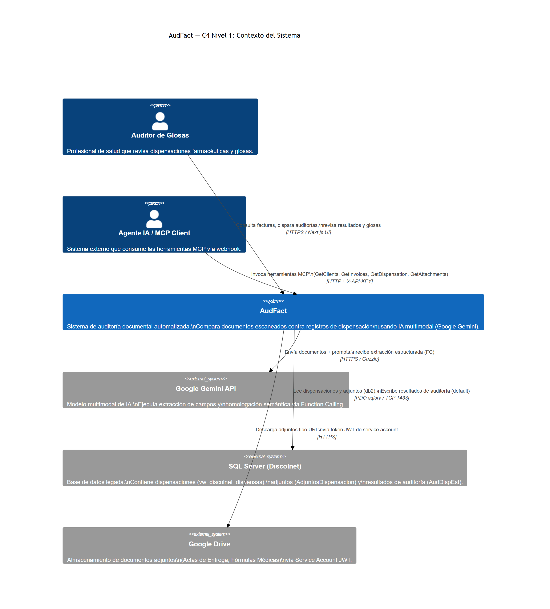

*   **Auditor de Glosas**: Consume la aplicación a través de la interfaz web para revisar discrepancias detectadas.
*   **Agente MCP / Cliente Webhook**: Utiliza el protocolo MCP para consultar el estado del servidor, ejecutar auditorías o invocar herramientas del pipeline.
*   **Base de Datos Legacy (Discolnet)**: Servidor Microsoft SQL Server corporativo que provee la información transaccional de facturas y dispensaciones.
*   **Google Drive API**: Contenedor en la nube donde residen los soportes digitalizados escaneados (actas, fórmulas, autorizaciones).
*   **Google Gemini API**: Motor de IA que provee la capacidad de comprensión lectora multimodal y homologación de medicamentos.

---

### Diagrama 2: Container Diagram (C4 Level 2)
Detalla los límites físicos del despliegue bajo Docker Compose, mostrando las responsabilidades de los contenedores de frontend, proxy, backend y base de datos, así como el pipeline de workers asíncronos distribuidos en Redis.

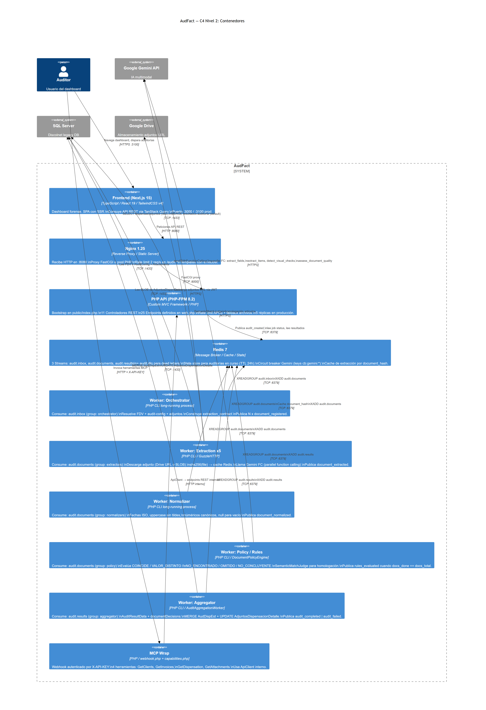

*   **Next.js Frontend**: Interfaz web premium inyectada con variables de configuración pública.
*   **Nginx Load Balancer**: Orquestador de entrada web que rutea tráfico HTTP y FastCGI de forma segura.
*   **PHP-FPM REST API**: Procesador síncrono del core del sistema encargado de despachar peticiones inmediatas y encolar trabajos.
*   **Redis (Queue & Streams)**: Bus de eventos persistente y memoria compartida de alta velocidad.
*   **Workers PHP-CLI**: Réplicas dedicadas que consumen de los streams de Redis y ejecutan las fases de batching, descarga, extracción por IA, evaluación de reglas invariantes del negocio y agregación final.

---

### Diagrama 3: Component Diagram (C4 Level 3) — REST API Core
Muestra el desglose interno de los componentes lógicos que conforman el backend síncrono de la aplicación, desde el bootstrap de entrada hasta el despacho en los controladores REST.

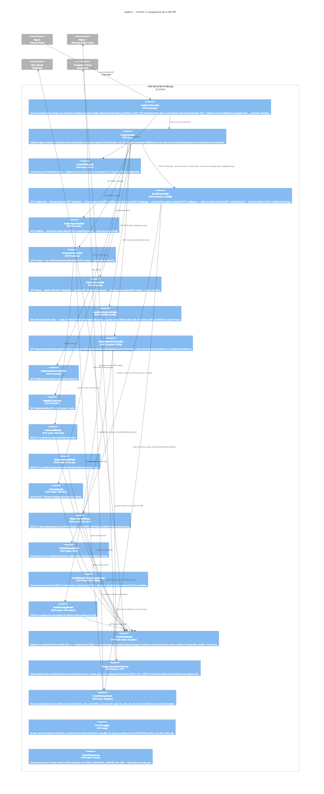

*   **public/index.php**: Bootstrap central que inicializa el entorno, gestiona los manejadores de excepciones y aplica el Rate Limit fail-closed.
*   **Router**: Motor de mapeo y emparejamiento de URLs dinámicas que despacha la petición al controlador correspondiente.
*   **Validator & Sanitizer**: Limpiadores de inputs HTTP para evitar inyecciones y asegurar payloads menores a 1MB.
*   **Database Engine**: Mantiene un pool de conexiones persistentes optimizadas contra SQL Server.
*   **GoogleDriveAuthService**: Generador de tokens OAuth2 eficientes mediante aserción JWT basada en clave privada PEM.

---

### Diagrama 4: Component Diagram (C4 Level 3) — Audit Pipeline
Detalla los componentes especializados que gobiernan el pipeline asíncrono event-driven de auditoría automatizada con IA.

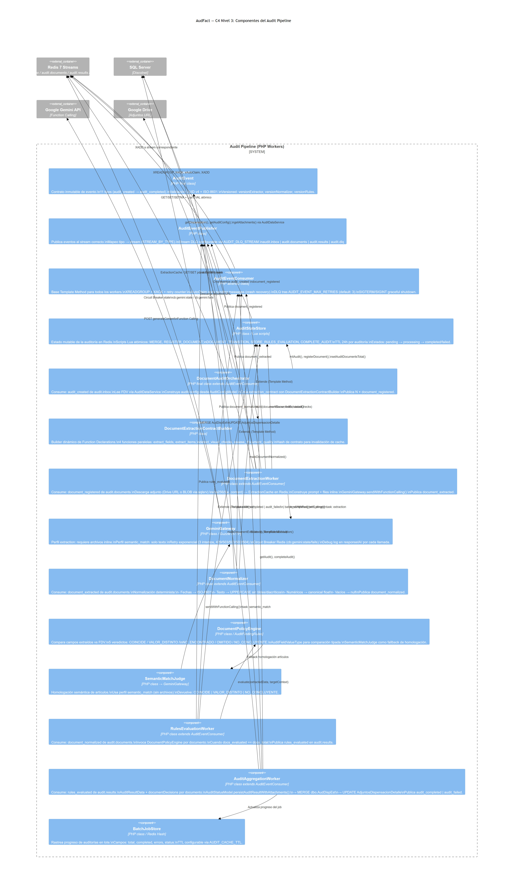

*   **AuditEventConsumer**: Clase base abstracta que gestiona la lectura de streams, la deserialización de payloads, la confirmación de lectura (`XACK`) y el desvío a DLQ ante excepciones repetidas.
*   **DocumentExtractionContractBuilder**: Ensamblador dinámico de esquemas estructurados de extracción documental para Google Gemini (Parallel Function Calling).
*   **GeminiGateway**: Cliente HTTP de Gemini con control de cuotas, Circuit Breaker integrado en Redis y reintentos exponenciales.
*   **DocumentPolicyEngine**: Evaluador de reglas invariantes del negocio (coincidencia de datos personales, vigencias y control de cantidades).
*   **ArticleSemanticMatchJudge**: Evaluador semántico por IA para la homologación de nombres de medicamentos contra la base de datos oficial.

---

### Diagrama 5: Flujo de Autenticación y Autorización
Ilustra el flujo de seguridad en tres niveles: autenticación del auditor vía web, validación robusta del webhook de agentes MCP usando API-Key inyectada en cabeceras HTTP, y el protocolo OAuth2 JWT para el consumo de Google Drive sin intervención humana.

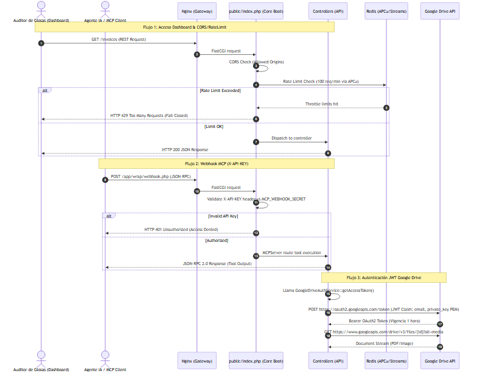

*   **CORS y Rate Limit**: Nginx y el framework PHP aplican de forma inmediata controles sobre las peticiones HTTP del auditor, bloqueando accesos cruzados o ráfagas sospechosas (100 req/min).
*   **MCP Webhook Security**: Autenticación obligatoria mediante la cabecera `X-API-KEY` validada de forma estricta contra `MCP_WEBHOOK_SECRET`. Un fallo en esta firma corta inmediatamente la conexión retornando HTTP 401.
*   **OAuth2 JWT Google Drive**: Automatización segura que genera localmente aserciones JWT firmadas con la llave privada del Service Account corporativo, intercambiándolas con el servidor de Google por tokens Bearer temporales de 1 hora.

---

### Diagrama 6: Flujo Principal de Negocio (POS vs MIPRES y Mitigación de Glosa)
Representa la cadena de dispensación farmacéutica de Colombia y detalla la lógica de bifurcación de AudFact según el tipo de medicamento (POS vs MIPRES), mostrando cómo se validan las invariantes del negocio para blindar la facturación.

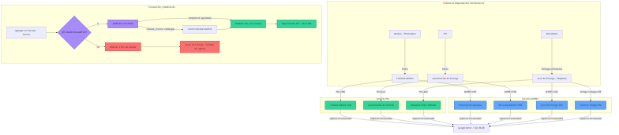

*   **Ruta POS (Plan Obligatorio de Salud)**: Requiere corroboración estricta de la Fórmula Médica (`ORD`), la Autorización de Entrega (`AUT`) y el Acta de Dispensa Física (`ANE`), verificando los códigos `CUM` del medicamento entregado.
*   **Ruta MIPRES (No POS)**: Lógica de alta complejidad regulada por el Ministerio. Coteja la Prescripción (`OPF`), el Direccionamiento (`PDE`) y el Acta de Entrega CRC (`CRC`), obligando a que existan los 6 identificadores de trazabilidad del Minsalud y las firmas manuscritas del médico y del paciente.
*   **El Firewall de Pre-Auditoría**: Filtra los hallazgos críticos (ej: nombres diferentes en soporte físico vs BD, medicamentos entregados en cantidades superiores a las autorizadas, o fechas inconsistentes) y clasifica automáticamente el lote en `completed` (pasa directo a radicar sin riesgo de glosa) o `manual_review` (bloquea la radicación hasta que el auditor corrija el soporte).

---

### Diagrama 7: Flujo de Datos y Persistencia (Estrategia Dual SQL Server y Redis)
Explica la arquitectura de persistencia optimizada: el uso de la base de consulta `db2` para la lectura de vistas masivas legacy sin alterar el rendimiento, el canal de escritura transaccional `default`, y la capa de almacenamiento en caché en Redis.

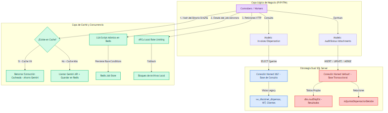

*   **Named Connections Pool**: `Core\Database` mantiene pools separados. Las lecturas pesadas sobre vistas legacy (`vw_discolnet_dispensas`) y tablas de clientes se enrutan mediante `db2` en modo solo lectura (`SELECT`).
*   **Transaccionalidad Directa**: Las escrituras rápidas, actualizaciones de estados de auditoría (`dbo.AudDispEst`) e inserciones de metadatos de soportes en `AdjuntosDispensacionDetalle` ocurren de forma aislada a través del pool `default` (MERGE/UPDATE/INSERT).
*   **Redis Multi-Caché**: 
    1.  *APCu Local* y *Local File Lock* evitan contenciones de I/O en validación de peticiones.
    2.  *LUA Scripts atómicos* en Redis impiden race conditions al actualizar el estado de los jobs asíncronos multirréplica.
    3.  *SHA256 Extraction Cache* guarda la representación estructurada del PDF. Si el hash SHA256 coincide, se retorna instantáneamente sin tocar la API de Gemini.

---

### Diagrama 8: Pipeline CI/CD (GitHub Actions, Docker GHCR y LAN CD Runner)
Muestra el ciclo de entrega e integración continua: compilación inmutable, pruebas unitarias, distribución en contenedores en el registro GitHub Container Registry (GHCR) y el despliegue local automatizado en la LAN de producción.

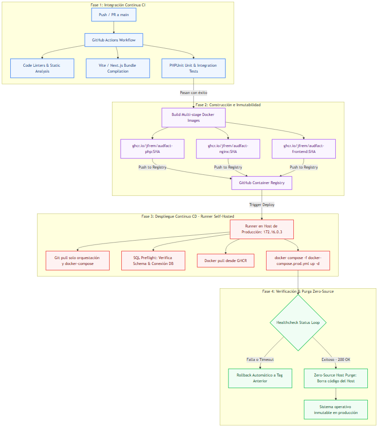

*   **Fase CI**: Ejecutada en servidores de GitHub. Ejecuta linters estáticos, compila el bundle de producción del frontend Next.js y valida el backend ejecutando la suite de pruebas unitarias/integración de PHPUnit.
*   **Fase de Empaquetado e Inmutabilidad**: Construye imágenes Docker multi-stage seguras (`audfact-php`, `audfact-nginx` y `audfact-frontend`), versionadas por el hash SHA del commit, y las publica en el registro privado de GHCR.
*   **Fase LAN CD (Self-Hosted Runner en `172.16.0.3`)**: El runner local recibe el trigger de despliegue, genera dinámicamente los secretos `.env` seguros, ejecuta la validación **SQL Preflight** para confirmar compatibilidad de esquemas de BD, despliega los contenedores y ejecuta el bucle de healthchecks.
*   **Zero-Source Purge**: Tras la verificación exitosa, el host de producción ejecuta un script de limpieza automática que elimina todo el código fuente del host, dejando únicamente los contenedores inmutables en ejecución y la configuración aislada.

---

### Diagrama 9: Arquitectura de Observabilidad y Monitoreo
Representa las herramientas activas para el diagnóstico del sistema: el logger rotativo seguro con máscara GDPR, métricas de latencia de colas en Redis y captura semántica de excepciones.

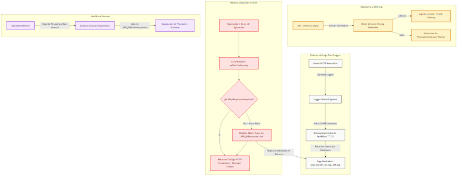

*   **Telemetry metrics**: El endpoint `/metrics/async` extrae metadatos embebidos en Redis Streams para calcular el lag de la cola (latencia desde que se solicita un lote hasta que se inicia la extracción) y timings promedio por worker.
*   **Core\Logger Sanity**: Rotación automática basada en hostname para evitar contenciones de escritura en entornos multirréplica. Filtra y redacta de forma estricta credenciales, tokens, y enmascara automáticamente el `facNitSec` (`***123`) para cumplir con regulaciones de protección de datos de pacientes (GDPR/Habeas Data).
*   **Error Registry**: Captura global de excepciones mediante manejadores dedicados. Si ocurre un fallo fatal en producción, se enmascara el stack trace de cara al cliente HTTP para evitar fugas de información, registrando el error crudo únicamente en los archivos de log aislados del host.
*   **Raw debugging**: En entornos de desarrollo (`APP_ENV=development`), los workers salvan el snapshot estructurado devuelto por la API en `AUDIT_RESPONSE_IA_DIR` (`logs/responseIA` por defecto) cuando `AUDIT_RESPONSE_IA_ENABLED=1`. En producción el código no persiste estos snapshots.

---

### Diagrama 10: Estrategias de Escalabilidad, Concurrencia y Resiliencia
Detalla cómo el sistema tolera fallos de infraestructura, picos de concurrencia y sobrecarga de APIs externas.

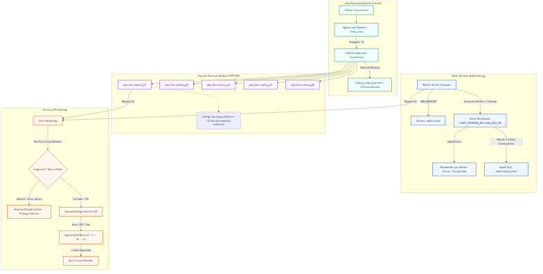

*   **Static process pool (PHP-FPM)**: Configurado con `pm=static` y `pm.max_children=10` en cada una de las 5 réplicas del clúster (50 procesos listos). Esto elimina el overhead de creación y destrucción de procesos en picos de demanda. Nginx utiliza la política de balanceo `least_conn` con `keepalive 32` hacia upstream sockets.
*   **Event Recovery (xAutoClaim)**: Si un worker de extracción o normalización sufre una caída fatal del sistema a mitad del procesamiento, el `AuditEventConsumer` recuperará el evento de forma transparente usando `xAutoClaim` tras expirar el intervalo de inactividad (`AUDIT_PENDING_RECLAIM_IDLE_MS`), procesándolo en un nodo activo. Si un mensaje falla de forma consecutiva 3 veces, es transferido a la cola administrativa de errores `dead_letter` (`audit.dlq`) para evitar bucles de fallas infinitas.
*   **Circuit Breaker & Exponential Backoff**: Las peticiones de IA hacia Gemini están protegidas. Si el proveedor retorna errores de límite de tasa (Rate limit HTTP 429) o fallos de servicio, el backend aplica un retroceso exponencial (`backoff`) de 1s, 2s y 4s. Si los fallos persisten, el Circuit Breaker escribe la clave `cb:gemini:state` en Redis con un TTL de cooldown, forzando un retorno fallido rápido instantáneo sin sobrecargar los recursos ni consumir tiempo de procesamiento inútilmente.

---

## 4. Decisiones Arquitectónicas y Trade-Offs (ADRs)

A continuación se documentan las decisiones técnicas estructurales tomadas durante el diseño de AudFact, justificando su implementación técnica e identificando los compromisos asumidos:

### ADR 1: Desacoplamiento Asíncrono mediante Redis Streams en lugar de RabbitMQ / Kafka
*   **Contexto**: El procesamiento de auditoría (descarga de Drive, análisis Gemini, homologación de moléculas) es propenso a latencias variables de red y procesamiento. Diseñar un flujo síncrono HTTP bloquearía los procesos PHP-FPM, agotando el pool en pocos segundos ante solicitudes concurrentes.
*   **Decisión**: Implementar un bus de eventos y encolamiento asíncrono basado en **Redis Streams** con grupos de consumidores dedicados.
*   **Trade-Offs**:
    *   *Ventaja*: Infraestructura ultra-ligera (Redis ya se utilizaba para almacenamiento en caché de extracción y rate limiting, evitando agregar y mantener servidores complejos de RabbitMQ o Apache Kafka). Latencia de entrega de microsegundos y soporte nativo para recuperación de trabajos caídos mediante `XPENDING` y `XAUTOCLAIM`.
    *   *Desventaja*: Redis almacena la cola en memoria RAM por defecto. Para mitigar el riesgo de pérdida de eventos en caso de reinicio forzado del servidor Redis, se configuró la persistencia persistente mediante **AOF (Append Only File)** con política `everysec`.

### ADR 2: Conexiones Separadas PDO named pools (`default` y `db2`) contra base legacy
*   **Contexto**: La base de datos de consulta (`Discolnet` en SQL Server) es accedida por múltiples sistemas corporativos de Discolmets. Lanzar barridos masivos de pre-auditoría directamente sobre la base transaccional puede generar bloqueos de tablas (`table locks`) y degradar el rendimiento general de los puntos de dispensación física en el país.
*   **Decisión**: Implementar una estrategia multi-base de datos a nivel de modelos. Todas las consultas de lectura (`SELECT`) de dispensas e históricos se enrutan explícitamente a través del pool de conexión `db2` (configurada para leer sobre una réplica de base de datos o vistas optimizadas de consulta). Las escrituras directas (`MERGE/UPDATE/INSERT`) del estado de auditoría se inyectan a través del pool transaccional local `default`.
*   **Trade-Offs**:
    *   *Ventaja*: Aislamiento completo de bloqueos de base de datos. Los barridos concurrentes del pipeline de IA no ralentizan la dispensación en farmacias.
    *   *Desventaja*: Complejidad a nivel de desarrollo, requiriendo que los desarrolladores y el framework declaren de forma explícita qué pool utilizar en cada modelo. Se mitiga mediante convenciones estrictas en las clases base del modelo.

### ADR 3: Rate Limiting fail-closed implementado en bootstrap vía APCu con fallback a archivos
*   **Contexto**: Los endpoints de auditoría de facturas consumen recursos computacionales de alto costo (descarga de red y procesamiento Gemini). Un ataque DDoS o una ráfaga mal intencionada podría generar costos de API de miles de dólares en minutos.
*   **Decisión**: Implementar un rate limiter estricto de **100 req/min** a nivel del bootstrap de entrada (`public/index.php`) utilizando APCu para una latencia de verificación cero. En caso de no estar disponible APCu, el sistema hace fallback a bloqueos de archivos en disco (`flock`), operando bajo un esquema **fail-closed** (ante la duda, bloquea el tráfico).
*   **Trade-Offs**:
    *   *Ventaja*: Máxima protección financiera y operativa. La validación ocurre en microsegundos antes de que el framework instancie controladores o conecte bases de datos SQL Server.
    *   *Desventaja*: En caso de picos legítimos de radicación masiva por parte de la administración de Discolmets, se podría bloquear a usuarios válidos. Para solucionar esto, Nginx está configurado con rate limiting por IP más flexible y se implementó un canal asíncrono `/audit/async` diseñado específicamente para absorber ráfagas masivas delegando el trabajo a colas.

### ADR 4: Inmutabilidad Zero-Source en Host de Producción
*   **Contexto**: Discolmets opera con datos de salud altamente sensibles (identidades de pacientes y diagnósticos médicos). Un atacante que comprometa el host de producción no debe tener acceso a ver, modificar o inyectar código malicioso en la lógica del sistema.
*   **Decisión**: Forzar un despliegue puramente inmutable mediante Docker. Tras el inicio exitoso de los contenedores en producción, el runner ejecuta un script de purga en el host que elimina absolutamente todos los archivos de código fuente de la máquina anfitriona (Zero-Source Host).
*   **Trade-Offs**:
    *   *Ventaja*: Nivel de seguridad operacional robusto de clase corporativa. Los contenedores Docker se ejecutan de forma aislada e inmutable; no se puede alterar el código en caliente desde el host.
    *   *Desventaja*: Imposibilidad de realizar depuraciones rápidas ("hotfixes") o inspección de archivos en el host de producción. Cualquier cambio debe obligatoriamente cruzar el pipeline CI/CD, garantizando que el software en producción esté siempre auditado y testeado en su versión inmutable.

### ADR 5: IA como Extractor y Homologador Semántico, No como Autoridad Regulatoria
*   **Contexto**: Los modelos de lenguaje poseen capacidades avanzadas de extracción, comprensión lectora y razonamiento semántico, pero no garantizan comportamiento determinista ni reproducible para decisiones regulatorias, financieras o de cumplimiento normativo en el sector salud colombiano.
*   **Decisión**: La IA (Google Gemini API) se limita exclusivamente a extraer, interpretar, normalizar y homologar semánticamente la información contenida en los documentos digitalizados. Todas las decisiones normativas y financieras —vigencia de autorizaciones, límites de cantidades dispensadas vs. autorizadas, consistencia de identidad del paciente, presencia de firmas— son ejecutadas exclusivamente por el motor de reglas determinista en PHP (`DocumentPolicyEngine`).
*   **Trade-Offs**:
    *   *Ventaja*: Trazabilidad completa de cada decisión de auditoría, auditabilidad ante entidades externas, reproducibilidad bit a bit de resultados y cumplimiento con la normativa colombiana de dispensación farmacéutica (cadena Fórmula → Autorización → Acta de Entrega según MIPRES/POS).
    *   *Desventaja*: Mayor complejidad de mantenimiento operativo, ya que los cambios en la normativa del Ministerio de Salud requieren actualización manual del motor de reglas PHP en lugar de un simple ajuste de prompt.

---

## 5. Estrategias de Concurrencia, Resiliencia y Alta Eficiencia

Para soportar las altas demandas de Discolnet sin incrementar linealmente los costos de infraestructura o licencias de API, AudFact implementa cuatro pilares estratégicos de eficiencia avanzada respaldados por infraestructura de baja latencia y un diseño de software altamente tolerante a fallos:

### Pilar 1: Pipeline de Mensajería Asíncrona y Cache de Idempotencia (Redis Streams & SHA256)

El núcleo de la concurrencia de AudFact reside en un sistema **Event-Driven** de alta resiliencia orquestado a través de **Redis Streams** y **Redis Distributed Caching**. Esta arquitectura desacopla por completo la recepción de solicitudes HTTP (front/REST API) del consumo pesado de APIs de IA.

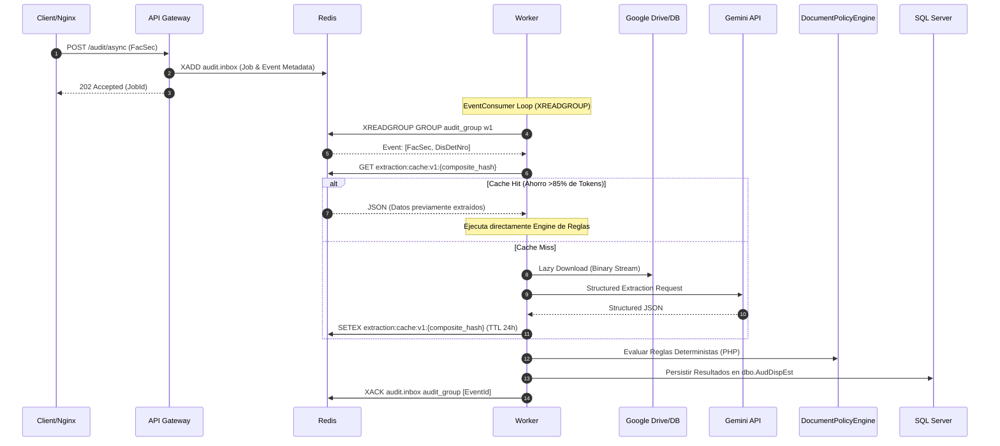

#### A. Mecanismo de Colas y Grupos de Consumo en Redis Streams
El sistema utiliza un stream persistente llamado `audit.inbox`. Los eventos se publican mediante el comando `XADD` de forma atómica:
* **Estructura del Payload**: Cada evento inyectado viaja con el identificador de la factura (`FacSec`), el número de dispensación (`DisDetNro`), y metadatos de auditoría como `created_at` (marca de tiempo Unix con microsegundos).
* **Grupos de Consumo (`XREADGROUP`)**: Un grupo de consumidores denominado `audit_group` es atendido por múltiples workers concurrentes (`DocumentExtractionWorker`, `DocumentPolicyEngine`). Cada worker lee una porción del stream utilizando la semántica `XREADGROUP GROUP audit_group <worker_id> COUNT 1 BLOCK 2000 STREAMS audit.inbox >`. Esto garantiza una distribución de carga balanceada tipo "round-robin competitivo" nativo a nivel de Redis.

#### B. Mecanismos de Tolerancia a Fallos: `Pending` y `XAUTOCLAIM`
Para garantizar que **ningún evento sea ignorado o se pierda permanentemente** en caso de que un worker sufra una caída fatal (ej: Out Of Memory, caída de contenedor o pérdida de conectividad de red) a mitad de un procesamiento, se utiliza una estrategia de re-clamado automático de eventos:
* **PEL (Pending Entries List)**: Cuando un worker extrae un evento con `XREADGROUP`, Redis coloca dicho evento en la lista de entradas pendientes (PEL) del grupo de consumo. El evento solo se elimina del PEL cuando el worker procesa con éxito la auditoría completa y envía el comando de confirmación explítica `XACK`.
* **Auto-Reclamado con `XAUTOCLAIM`**: Un proceso background periódico (`AuditEventConsumer::reclaimPending`) escanea el stream usando `XAUTOCLAIM`. Si un evento ha estado en estado "pendiente" (leído pero no confirmado con `XACK`) por más de 10 minutos (definido por `AUDIT_PENDING_RECLAIM_IDLE_MS`), otro worker activo reclama la propiedad del evento de forma atómica. Redis reasigna el evento al nuevo worker y le incrementa el contador de entregas (`delivery_attempts`). Si el contador supera el límite máximo de reintentos (ej. 3 intentos), el evento se desvía de forma automática a una cola de mensajes no entregados (**Dead Letter Queue - DLQ**) en Redis (`audit.dlq`) para auditoría y corrección manual por parte de administradores, evitando los bloqueos por "mensajes venenosos".

```php
// Ejemplo simplificado del loop de autoreclamado en PHP
$claimed = $redis->xAutoClaim(
    'audit.inbox', 
    'audit_group', 
    $workerName, 
    1000 * Env::get('AUDIT_PENDING_RECLAIM_IDLE_MS', 600), 
    '0-0', 
    1
);
```

#### C. Caché de Idempotencia y Hash Compuesto (SHA256)
El costo y la latencia asociados a las llamadas repetidas de modelos de lenguaje (LLM) son mitigados críticamente en AudFact mediante una caché estructurada de extracción documental:
1. Al recibir un documento (Fórmula médica, Acta de entrega, Autorización de EPS) a través de Google Drive o un adjunto de base de datos, el sistema calcula un hash criptográfico **SHA256** compuesto. Este hash une cuatro componentes clave: el hash del contenido del documento, el hash de la estructura del contrato de extracción, el `prompt_context_hash` calculado desde los prompts reales y la versión del extractor.
2. Se realiza una consulta atómica en Redis bajo la clave `extraction:cache:v1:{composite_hash}`.
3. **Escenario de Cache Hit**: Si la clave existe, el payload JSON de extracción previamente validado por la IA se lee de forma local. El sistema omite por completo la llamada HTTPS cifrada a la API de Gemini (ahorrando costos de API y reduciendo el tiempo de respuesta de ~5-8 segundos a **<10ms**).
4. **Escenario de Cache Miss**: Si no existe, se realiza la extracción documental multimodal en Gemini, y el resultado es guardado inmediatamente en Redis con un TTL parametrizable de 7 dias (`AUDIT_EXTRACTION_CACHE_TTL`), lo que provee una ventana acotada de protección contra re-auditorías de lotes o reintentos del frontend.

---

### Pilar 2: Parallel Function Calling y Garantía de Estructura (Structured Outputs)

Para evitar la inestabilidad típica de las respuestas en lenguaje natural (que sufren de problemas como formato inconsistente, pérdida de campos obligatorios o alucinaciones estructurales), AudFact implementa **Function Calling determinista** en la API de Gemini.

#### A. El Contrato de Extracción Estandarizado (`extraction_contract`)
En lugar de solicitar al modelo un texto en prosa o un JSON genérico a través de prompts de texto libre, AudFact declara herramientas de función (`tools`) en la configuración de la solicitud a la API de Gemini. El modelo Gemini está entrenado para evaluar el contenido visual e informático de los soportes digitalizados (PDFs o imágenes) y, si detecta la presencia del documento correspondiente, genera un JSON estructurado que representa la ejecución de la función indicada con sus argumentos tipados correctamente.

A continuación se detalla el esquema JSON representativo utilizado para el contrato de extracción de la fórmula médica (`registrar_formula_medica`):

```json
{
  "name": "registrar_formula_medica",
  "description": "Registra los datos estructurados extraídos de la fórmula médica digitalizada.",
  "parameters": {
    "type": "object",
    "properties": {
      "paciente_nombre": {
        "type": "string",
        "description": "Nombre completo del paciente tal como aparece en el encabezado del documento."
      },
      "paciente_identificacion": {
        "type": "string",
        "description": "Número de identificación, cédula o documento del paciente."
      },
      "fecha_emision": {
        "type": "string",
        "format": "date",
        "description": "Fecha de expedición de la fórmula médica en formato ISO 8601 (YYYY-MM-DD)."
      },
      "vigencia_meses": {
        "type": "integer",
        "minimum": 1,
        "maximum": 12,
        "description": "Meses de vigencia del tratamiento indicados en la fórmula médica."
      },
      "firma_paciente_presente": {
        "type": "boolean",
        "description": "Verdadero si se observa visualmente la firma gráfica o digital del paciente o su acudiente en el soporte."
      },
      "huella_paciente_presente": {
        "type": "boolean",
        "description": "Verdadero si se observa la huella dactilar del paciente o acudiente en el soporte."
      },
      "medicamentos_solicitados": {
        "type": "array",
        "description": "Lista de medicamentos y moléculas ordenadas en la fórmula médica.",
        "items": {
          "type": "object",
          "properties": {
            "nombre_comercial": {
              "type": "string",
              "description": "Nombre de marca o fantasía del producto recetado."
            },
            "principio_activo": {
              "type": "string",
              "description": "Nombre genérico o principio activo químico de la molécula (ej. Paracetamol, Ibuprofeno)."
            },
            "concentracion": {
              "type": "string",
              "description": "Concentración de la dosis por unidad de medida (ej. 500 mg, 10 ml)."
            },
            "cantidad_solicitada": {
              "type": "integer",
              "minimum": 1,
              "description": "Cantidad total de unidades o cajas formuladas para el período de vigencia."
            }
          },
          "required": ["principio_activo", "cantidad_solicitada"]
        }
      }
    },
    "required": [
      "paciente_nombre",
      "paciente_identificacion",
      "fecha_emision",
      "firma_paciente_presente",
      "medicamentos_solicitados"
    ]
  }
}
```

#### B. Garantía de Calidad y Validación en PHP contra el JSON Schema
El procesamiento por Inteligencia Artificial no es infalible. A pesar de los esquemas estrictos de Gemini, los datos devueltos pueden contener fallos debido a la baja resolución de los escaneos o ligeras inconsistencias del modelo. 

Para blindar la integridad del sistema, el worker de extracción (`DocumentExtractionWorker`) no inyecta los datos de forma directa en el motor de políticas. En su lugar, implementa un pipeline secuencial de validación y control de calidad en la capa de software PHP:

```
[Gemini Gateway Output]
          │
          ▼
┌──────────────────────────────────┐
│ PHP validation: JSON Schema      │
│ (types, formats & constraints)   │
└─────────────────┬────────────────┘
                  │
        ┌─────────┴─────────┐
        ▼                   ▼
   [Schema Match]    [Schema Violation]
        │                   │
        │                   ▼
        │        ┌──────────────────────────────────┐
        │        │ Runtime handling:                │
        │        │ - Reject malformed FC payload    │
        │        │ - Retry only transport/API 429/5xx│
        │        │ - Send event to retry/DLQ path   │
        │        └──────────────────┬───────────────┘
        │                           │
        │                           ▼
        │                  ┌──────────────────────────────┐
        │                  │ Retry via AuditEventConsumer │
        │                  │ DLQ after max attempts       │
        │                  └──────────────────────────────┘
        ▼                  ▼
[DocumentPolicyEngine Evaluates Deterministic Rules]
```

1.  **Parseo y Validación Estricta**: Al recibir la llamada a la función estructurada, el gateway valida que el payload JSON cumpla con todos los tipos estructurales. Se verifica que las cadenas de fechas (`fecha_emision`) sean parseables a objetos `DateTime` válidos, que la identificación del paciente contenga caracteres lógicos y que los medicamentos requeridos no posean arreglos vacíos o propiedades corruptas.
2.  **Perfiles de generación, no fallback de modelo**: `DocumentExtractionWorker` invoca Gemini con perfil `extraction` y `GEMINI_EXTRACTION_*`; `ArticleSemanticMatchJudge` usa el perfil text-only `semantic_match` y `GEMINI_SEMANTIC_*`. Ambos perfiles usan el mismo `GeminiConfig::model` resuelto desde `GEMINI_MODEL`.
3.  **Manejo controlado de fallos**: El `GeminiGateway` reintenta errores HTTP recuperables (`429`, `500`, `502`, `503`, `504`) con backoff. Si la respuesta de function calling es inválida o el evento agota intentos, el `AuditEventConsumer` enruta el caso al flujo de retry/DLQ; la decisión funcional final sigue en PHP y no en un re-prompt de autocorrección.

#### C. Evitando Errores 400 mediante Normalización de Esquemas en PHP (`normalizeSchemaProperties`)
Un desafío crítico identificado al integrar la API de Gemini es la propensión del servidor de Google a rechazar peticiones con un código HTTP `400 Bad Request` si la definición del esquema JSON contiene propiedades o esquemas de objetos definidos como arreglos vacíos `[]` en PHP. 

El serializador nativo de PHP traduce un arreglo asociativo vacío como una lista vacía `[]` (JSON array) en lugar de un objeto vacío `{}` (JSON object), lo cual invalida la validación del esquema OpenAPI del lado de Google Gemini.

AudFact soluciona este problema de manera elegante mediante un método recursivo en `GeminiGateway` denominado `normalizeSchemaProperties()`. Este método analiza la estructura de tipos del esquema y forzosamente mapea los tipos estructurales de datos a instancias de `stdClass`, asegurando una serialización impecable de llaves de objetos `{}`:

```php
/**
 * Normaliza recursivamente las propiedades del esquema para evitar errores 400 Bad Request en Gemini.
 * Transforma arreglos vacíos de propiedades en stdClass para que se serialicen como objetos de llaves '{}'.
 */
private function normalizeSchemaProperties(array $schema): array|stdClass
{
    if (isset($schema['type']) && $schema['type'] === 'object') {
        if (!isset($schema['properties']) || empty($schema['properties'])) {
            $schema['properties'] = new \stdClass();
        } else {
            foreach ($schema['properties'] as $key => $prop) {
                if (is_array($prop)) {
                    $schema['properties'][$key] = $this->normalizeSchemaProperties($prop);
                }
            }
        }
    }
    
    // Tratamiento de esquemas de ítems en arreglos
    if (isset($schema['type']) && $schema['type'] === 'array' && isset($schema['items']) && is_array($schema['items'])) {
        $schema['items'] = $this->normalizeSchemaProperties($schema['items']);
    }
    
    return $schema;
}
```

#### D. Ventajas Operativas de Function Calling
1.  **Determinismo Estructural**: La salida de Gemini se parsea inmediatamente a objetos y modelos tipados de dominio PHP sin necesidad de algoritmos complejos de regex.
2.  **Homologación de Datos**: Las discrepancias de ortografía, abreviaciones y mayúsculas de moléculas son traducidas a formatos estandarizados a nivel de la API de IA antes de que lleguen a la validación de políticas en PHP.
3.  **Validación Automática de Tipos**: La API de Gemini valida que los tipos de datos (fechas, enteros, cadenas, booleanos) coincidan con el esquema antes de entregar la respuesta al worker.

---

### Pilar 3: Patrones de Resiliencia Industrial: Circuit Breaker y Reintento Exponencial

El backend de AudFact consume la API de Gemini y Google Drive. Para evitar que la indisponibilidad de estos servicios de terceros genere una degradación en cascada en nuestro sistema (por ejemplo, hilos de PHP-FPM bloqueados esperando respuestas lentas hasta agotar el pool de conexiones del servidor), se implementan dos patrones fundamentales de resiliencia:

#### A. Patrón Circuit Breaker (Cortocorticuto Distribuido)
Implementado en `GeminiGateway`, este patrón utiliza contadores de fallos y el estado del circuito persistidos de forma centralizada en Redis bajo las claves `cb:gemini:state` y `cb:gemini:fails`, garantizando un estado compartido por todos los workers activos en producción.

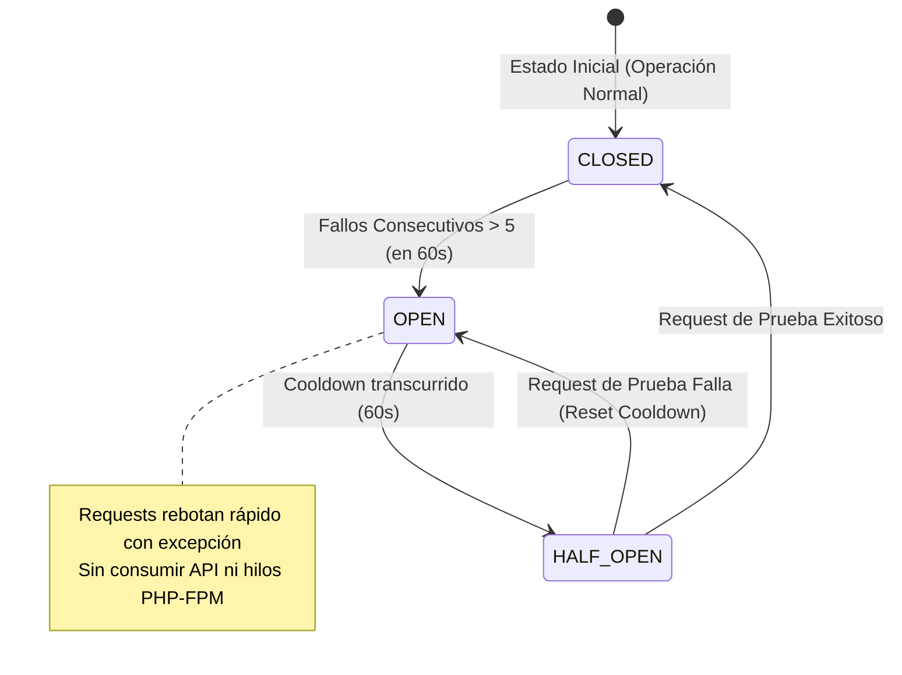

1. **Estado CLOSED (Cerrado)**: El tráfico fluye normalmente hacia la API de Gemini.
2. **Transición a OPEN (Abierto)**: Cada error devuelto por la API de Gemini (código HTTP 5xx, rate limits 429, timeouts de red) incrementa un contador en Redis (`cb:gemini:fails`) con expiración. Si los fallos consecutivos superan el umbral configurado por la variable de entorno `CB_GEMINI_THRESHOLD` (por defecto 3), el circuito transiciona al estado `OPEN` guardando la clave `cb:gemini:state` con valor `open` y un TTL en segundos según `CB_GEMINI_COOLDOWN` (por defecto 60 segundos).
3. **Comportamiento en OPEN**: Cualquier intento subsiguiente de auditoría rebota de inmediato lanzando una excepción local controlada (`\RuntimeException` con código 503). Esto protege los recursos del servidor (hilos PHP, memoria) y evita agotar las cuotas de API de Gemini inútilmente.
4. **Estado HALF-OPEN (Semi-Abierto)**: Transcurrido el tiempo de cooldown (ej. 60 segundos), la próxima solicitud de auditoría sirve como "sonda" de validación. Si esta única llamada controlada tiene éxito, el circuito se restablece a `CLOSED` de forma atómica y los fallos acumulados se limpian. Si la llamada falla, el circuito vuelve a `OPEN` renovando el tiempo de cooldown.

```php
// Lógica real de evaluación del Circuit Breaker en GeminiGateway
private function cbCheck(): void
{
    if (!$this->cbRedis->isAvailable()) {
        return;
    }

    try {
        $state = $this->cbRedis->get(self::CB_KEY_STATE) ?? self::CB_STATE_CLOSED;
    } catch (\Core\RedisUnavailableException $e) {
        return;
    }

    if ($state === self::CB_STATE_OPEN) {
        $ttl = $this->cbRedis->ttl(self::CB_KEY_STATE);
        Logger::warning('Circuit Breaker ABIERTO — request rechazado sin llamar API', [
            'cooldownRestante' => $ttl,
        ]);
        throw new \RuntimeException(
            'Circuit Breaker abierto: API Gemini temporalmente no disponible. Reintentar en ' . max($ttl, 0) . 's',
            503
        );
    }
}
```

#### B. Reintentos con Backoff Exponencial y Jitter (Mitigación del Efecto Avalancha)
En los estados `CLOSED` o `HALF-OPEN`, cuando una solicitud a Gemini falla por razones transitorias (ej: fallos de red temporales, errores de límite de tasa `429 Too Many Requests`), el sistema no se rinde de inmediato. Se ejecuta una estrategia de reintentos estructurada:
* **Fórmula de Tiempo de Espera**: El tiempo transcurrido entre reintentos se calcula usando una progresión exponencial multiplicativa:
  
  $$\text{Delay} = \text{Base Delay} \times 2^{\text{intento}} + \text{Jitter}$$
  
* **Incorporación de Jitter**: Se introduce un componente aleatorio de tiempo de retraso (**Jitter**) para evitar que múltiples workers en paralelo reintenten sus llamadas a la API exactamente al mismo milisegundo. Esto destruuye uniformemente la carga en los servidores de Google y evita congestionar los canales HTTPS del gateway de salida.

---

### Pilar 4: Enfoque Híbrido de Auditoría (Determinismo + Traducción Semántica)

Uno de los mayores diferenciadores arquitectónicos y legales de AudFact es la **separación estricta de responsabilidades entre el Motor de Reglas en PHP y la API de Inteligencia Artificial**.

```
   ┌─────────────────────────────────────────────────────────────┐
   │                  SOPORTE DOCUMENTAL (PDF/IMG)                │
   └──────────────────────────────┬──────────────────────────────┘
                                  │ (Lazy Stream)
                                  ▼
   ┌─────────────────────────────────────────────────────────────┐
   │            IA (Google Gemini API: gemini-3.5-flash)         │
   │               - Solo Extracción Multimodal                  │
   │               - Homologación y Traducción Semántica          │
   │               - Retorna JSON sin Reglas de Negocio          │
   └──────────────────────────────┬──────────────────────────────┘
                                  │ (JSON Estructurado)
                                  ▼
   ┌─────────────────────────────────────────────────────────────┐
   │                MOTOR DE REGLAS DETERMINISTA (PHP)            │
   │               - Validación estricta de Normativas           │
   │               - 100% Determinista (Sin Alucinaciones)       │
   │               - Evaluaciones Matemáticas y de Fecha         │
   └──────────────────────────────┬──────────────────────────────┘
                                  ▼
   ┌─────────────────────────────────────────────────────────────┐
   │                AUDITORÍA PERSISTIDA / RESULTADO              │
   └─────────────────────────────────────────────────────────────┘
```

#### A. Por qué no confiar la auditoría normativa completa a la IA (Mitigación de Alucinaciones)
Los modelos de lenguaje, a pesar de sus impresionantes capacidades cognitivas, adolecen de un problema inherente: la falta de determinismo lógico e inferencial estricto. Un LLM al evaluar una regla compleja (por ejemplo, calcular si una autorización de la EPS venció restando la fecha de emisión a la fecha de dispensa del sistema) puede fallar por milisegundos en el cálculo de las zonas horarias, alucinar una interpretación de la normativa de salud colombiana o variar su decisión de auditoría basándose en cambios de temperatura o variaciones gramaticales del prompt. 

En un entorno de facturación y auditoría médica donde un error de centavos o de fecha puede significar **multas legales, glosas corporativas de miles de dólares, o denegación de servicios vitales a pacientes**, confiar la lógica de negocio a un prompt es inaceptable.

#### B. La Sinergia Determinista de AudFact
AudFact implementa un modelo híbrido estructurado en dos capas desacopladas:
1. **La IA como Extractor y Homologador Semántico (Traductor)**: Gemini se limita exclusivamente a actuar como un digitalizador avanzado y multimodal. Lee los adjuntos en Drive (fórmula médica escaneada, firma del paciente en el acta, etc.), extrae la información literal y la traduce semánticamente. Por ejemplo: si una fórmula médica dice *"Acetaminofén"* y la base de datos de dispensación registra *"Paracetamol 500mg"*, Gemini utiliza capacidades de razonamiento semántico para concluir que se trata de la misma molécula activa basándose en ontologías médicas. Pero **Gemini jamás decide si el documento es válido o no**.
2. **El Motor de Reglas Determinista en PHP (`DocumentPolicyEngine`)**: Toda la lógica de negocio, validación de políticas corporativas, normativas del Ministerio de Salud (MIPRES/POS), resta de fechas, verificación matemática de cantidades autorizadas contra dispensadas y lógica transaccional es ejecutada en PHP nativo. Las reglas se escriben en código inmutable estructurado, asegurando un comportamiento **100% determinista**. El motor recibe el JSON estructurado de Gemini y ejecuta comprobaciones con precisión binaria matemática.

#### C. Ventajas de la Sinergia
* **Consistencia Jurídica**: Una misma entrada de dispensación siempre resultará en el mismo resultado de auditoría (idempotencia matemática garantizada).
* **Eficiencia de Costos y Tokens**: No se requiere enviar a Gemini un prompt gigante que contenga toda la ley de salud y reglas corporativas colombianas en cada llamada, lo que reduce dramáticamente la ventana de contexto necesaria, la latencia de procesamiento de tokens de entrada, y el costo por factura auditada.
* **Mantenibilidad del Software**: Si una regla de negocio del Ministerio de Salud cambia (por ejemplo, el plazo máximo de vigencia de una autorización pasa de 30 a 90 días), el equipo de desarrollo modifica una sola línea en el `DocumentPolicyEngine` en PHP. No hay necesidad de volver a entrenar, ajustar prompts o realizar costosos procesos de prompt engineering en la IA.

---

### Pilar 5: Descarga Diferida y Stream Lazy de Archivos (Lazy Downloading)
En lugar de descargar de forma masiva todos los adjuntos de una dispensa al disco duro del host y luego procesarlos secuencialmente (lo que causaría contención de I/O en disco y agotamiento del almacenamiento local), AudFact implementa **Lazy Downloading**.
* Los adjuntos se descargan únicamente cuando el worker de extracción (`DocumentExtractionWorker`) inicia su bloque de ejecución.
* El archivo no se guarda de forma permanente en el host; se consume como un **stream en memoria** y se canaliza directamente a la API de Gemini mediante solicitudes HTTPS cifradas. Una vez finalizada la llamada, el stream se cierra y se libera la memoria RAM al instante.

### Pilar 6: Timings y Metadatos de Latencia en Redis Streams
El pipeline asíncrono no es una caja negra. Cada evento inyectado en `audit.inbox` viaja con un payload enriquecido con metadatos de telemetría:
* `created_at`: Marca de tiempo de la solicitud de auditoría.
* `orchestrated_at`: Marca de tiempo cuando el orchestrator asignó los documentos.
* `extracted_at`: Marca de tiempo final del procesamiento por IA.
Estos marcadores permiten calcular en tiempo real el tiempo de espera en cola, el tiempo de ejecución de la Inteligencia Artificial y el rendimiento de los workers de políticas. Esta información es consolidada automáticamente por el worker agregador y expuesta en el endpoint de observabilidad `/metrics/async`.

---

## 6. Fortalezas, Debilidades, Riesgos Técnicos y Plan de Remediación

A continuación se realiza una evaluación honesta y pragmática de la arquitectura actual de la solución:

### Fortalezas
1.  **Escalabilidad**: La adición de más réplicas de workers PHP-CLI en Docker Compose escala el rendimiento de extracción de forma horizontal observada sin modificar el core de la aplicación.
2.  **Inmutabilidad y Seguridad Operacional Robusta**: El aislamiento de contenedores Docker, la política Zero-Source y el enmascaramiento estricto de datos sensibles del paciente protegen de forma robusta la operación.
3.  **Caché de Tokens Ultra-eficiente**: El sistema de caché SHA256 blinda la viabilidad financiera del proyecto, evitando duplicidad de costos por re-auditorías de facturas.
4.  **Resiliencia a Caídas de Workers**: Gracias a Redis Streams y `xAutoClaim`, las caídas repentinas de hardware mitigan significativamente el riesgo de pérdida de trabajos o estados inconsistentes.

### Debilidades
1.  **Alta Dependencia de API Externa**: El pipeline completo depende de la disponibilidad y los tiempos de latencia de la API de Google Gemini y Google Drive. Si estas APIs experimentan lentitud global, la velocidad del pipeline se degrada proporcionalmente.
2.  **Acoplamiento con Vistas SQL Server Legacy**: El sistema consulta vistas heredadas (`vw_discolnet_dispensas`) en lugar de poseer una base de datos de dispensación propia completamente aislada. Cambios no notificados en el esquema de la base de datos corporativa Discolnet pueden romper los modelos de consulta.

### Limitaciones Conocidas

1.  **Dependencia de servicios externos**: La disponibilidad del pipeline está condicionada por Google Gemini API y Google Drive API.
2.  **Calidad de escaneo**: La precisión de extracción está directamente condicionada por la calidad óptica de los documentos digitalizados. Escaneos borrosos o ilegibles producen extracción parcial o nula.
3.  **Casos ambiguos**: Dispensaciones con soportes documentales ambiguos continúan requiriendo validación humana experta.
4.  **Evolución regulatoria**: Cambios en la normativa del Ministerio de Salud requieren actualización manual del motor de reglas determinista.
5.  **Muestra de validación**: La concordancia del 100% observada se basa en una muestra piloto de 200 dispensas; ampliar la base estadística fortalecerá la significancia del resultado a largo plazo.

### Riesgos Técnicos e Ingeniería de Mitigación

| Riesgo Técnico Identificado | Impacto | Nivel de Riesgo | Estrategia de Mitigación Implementada / Propuesta |
| :--- | :--- | :--- | :--- |
| **Agotamiento de cuota de API Gemini (Errores 429)** | Detención completa de las auditorías asíncronas. | **Medio-Alto** | Implementación del **Circuit Breaker** en Redis y políticas de **Exponential Backoff** de 1s, 2s y 4s. Si persiste, el lote se enruta a `manual_review` y el sistema detiene ráfagas de reintentos para no penalizar el procesamiento general. |
| **Fallas en la homologación de nuevos nombres de medicamentos** | Incremento de falsos negativos en la comparación de artículos, elevando la tasa de revisión manual. | **Medio** | Uso de **ArticleSemanticMatchJudge** como fallback semántico text-only contra el mismo modelo configurado en `GEMINI_MODEL`, con cache versionada en Redis y decisión PHP conservadora ante evidencia incompleta. |
| **Caídas fatales de contenedores Worker PHP-CLI** | Pérdida potencial de eventos en tránsito a mitad de la auditoría. | **Bajo** | Uso nativo de **XREADGROUP** en Redis Streams. Los eventos no confirmados quedan registrados como `pending` y son recuperados automáticamente por workers sanos mediante **xAutoClaim** al expirar `AUDIT_PENDING_RECLAIM_IDLE_MS`. |
| **Cambios estructurales imprevistos en vistas SQL Server Legacy** | Fallos de mapeo en modelos PHP y detención de importaciones de dispensas. | **Medio-Alto** | Implementación de **SQL Preflight Checks** automáticos durante la fase CD del deployment. Si las vistas sufrieron un cambio de firma o columnas faltantes, el preflight falla y aborta el deploy de la nueva imagen inmutable, previniendo caídas en producción. |

---

## 7. Apéndice Técnico: Estrategia de Persistencia y Políticas de Expiración (TTL) en Redis

Para evitar el crecimiento desmedido de la memoria en caliente y garantizar una operación óptima libre de saturación, Redis actúa como el núcleo transitorio y de caché distribuida del sistema AudFact. A continuación se detallan los TTLs configurados y su respectivo propósito:

| Componente / Módulo de Datos | Prefijo de Clave en Redis | TTL por Defecto | Variable de Entorno | Propósito y Estrategia de Persistencia |
| :--- | :--- | :--- | :--- | :--- |
| **Caché de Extracción Documental** | `extraction:cache:v1:` | **7 dias** (604800s) | `AUDIT_EXTRACTION_CACHE_TTL` | Caché read-through estructurada mediante hash SHA256 compuesto (documento, contrato, `prompt_context_hash` y versión del extractor). |
| **Homologación Semántica** | `audfact:semantic:match:` | **30 días** (2592000s) | *(Constante Estática)* | Almacenamiento a largo plazo para decisiones clínicas y homologaciones de nombres y medicamentos de Gemini. |
| **Estado Transitorio de Auditorías** | `audit:` | **7 dias** (604800s) | `AUDIT_STATE_TTL` | Orquestación del estado de auditoría, eventos completados y métricas transitorias por `FacSec`. |
| **Estado de Batch Jobs** | `job:` | **7 dias** (604800s) | `AUDIT_JOB_TTL` | Seguimiento de progreso, throughput y agregaciones de lotes asíncronos concurrentes. |
| **Reservas por DisId** | `audit:reservation:disid:` | **24 horas** (86400s) | `AUDIT_RESERVATION_TTL` | Barrera transitoria para evitar auditorias duplicadas por factura sin bloquear re-auditorias por 7 dias. |
| **Caché de Hash de Dispensación** | `audit:hash:` | **7 dias** (604800s) | `AUDIT_CACHE_TTL` | Detección atómica de cambios en dispensaciones o adjuntos para evitar re-auditorías de datos inalterados. |
| **Barrera de Idempotencia HTTP** | `audit:idempotency:` | **5 minutos** (300s) | `AUDIT_IDEMPOTENCY_KEY_TTL` | Previene el doble procesamiento en peticiones concurrentes o reintentos rápidos de lotes asíncronos. |
| **Caché de Consultas Públicas** | `query:results:` | **60 segundos** | *(Constante Estática)* | Alivia la carga redundante sobre el servidor Microsoft SQL Server para dashboards y listados de reportes. |
| **Distributed Locks (Mutex)** | `lock:` | **10 segundos** | *(Constante Estática)* | Mecanismo de exclusión mutua para evitar *Cache Stampede* (Dogpiling) durante recalcitraciones de caché concurrentes. |

---

## 8. Conclusión Ejecutiva e Impacto Estratégico

La arquitectura de **AudFact** trasciende la mera automatización técnica para convertirse en un cortafuegos financiero estratégico para Discolmets. Al digitalizar y auditar semánticamente el 100% de los expedientes de dispensación antes de su radicación a las EPS, el sistema transforma un proceso reactivo, manual y propenso a errores, en una línea de defensa determinista, escalable y auditable.

Al delegar la extracción documental al modelo Gemini configurado por entorno y reservar la toma de decisiones regulatorias a un motor de reglas estricto y trazable, AudFact garantiza el cumplimiento de las normativas de salud colombianas (MIPRES/POS). El resultado es una mitigación directa del riesgo de glosas por inconsistencias documentales, un aumento exponencial en la capacidad operativa del equipo de auditoría (que ahora se enfoca exclusivamente en resolver excepciones complejas) y una mejora sustancial en el flujo de caja operativo de la compañía.

---

## 9. Roadmap de Evolución Estratégica

La evolución de AudFact se plantea en fases incrementales para maximizar el valor de negocio mitigando el riesgo operativo:

| Fase | Alcance | Estado |
| :--- | :--- | :--- |
| **Fase 1 (Actual)** | Auditoría documental automatizada y firewall de pre-radicación determinista. | ✅ Operativo |
| **Fase 2** | Dashboard ejecutivo con indicadores de ROI en tiempo real y tendencias de glosas. | 🔲 Planificado |
| **Fase 3** | Bucle de aprendizaje supervisado mediante correcciones humanas al pipeline para retroalimentar umbrales. | 🔲 Diseño |
| **Fase 4** | Predicción temprana de riesgo de glosa por perfil de EPS usando aprendizaje automático. | 🔲 Investigación |

---

## 10. Indicadores de Calidad Operativa Continua (SLOs Propuestos)

Para garantizar la confiabilidad a largo plazo del sistema, se proponen los siguientes Objetivos de Nivel de Servicio (SLOs) para monitoreo continuo en producción:

| Indicador | Objetivo (SLO) | Método de Medición |
| :--- | :--- | :--- |
| Precisión de extracción | ≥ 98% | Doble verificación ciega contra digitación manual en muestras aleatorias |
| Concordancia auditor humano | ≥ 99% | Revisión periódica (mensual) de muestras aleatorias aprobadas |
| Cache hit rate | ≥ 30% | Telemetría en tiempo real sobre Redis `extraction:cache:v1:` |
| Tiempo promedio de auditoría | ≤ 30 segundos | Telemetría `created_at` → `extracted_at` |
| Tasa de manual review | ≤ 20% | Proporción de estados `manual_review` sobre el total procesado |
| Falsos positivos | ≤ 1% | Revisión trimestral de hallazgos marcados que resultaron ser correctos |
| Falsos negativos | ≤ 1% | Auditoría cruzada sobre dispensas marcadas como `completed` |

---

## 11. Apéndice: Glosario de Conceptos Clínicos y Técnicos

Para facilitar el entendimiento mutuo entre los equipos de desarrollo de software, auditoría de cuentas médicas y las partes interesadas institucionales, se define el siguiente glosario de términos clave empleados en la documentación y lógica de AudFact:

### Conceptos Clínicos y de Facturación Médica
*   **Glosa Médica**: Objeción, inconsistencia o no conformidad expresada por una EPS (Entidad Promotora de Salud) frente a una factura de cobro presentada por un dispensador o IPS. Puede ser de carácter administrativo (falta de firma, ilegibilidad) o técnico-clínico (dosis excedida, medicamento no autorizado).
*   **EPS (Entidad Promotora de Salud)**: Institución responsable de organizar y garantizar la prestación de los servicios del Plan de Beneficios en Salud a los afiliados en Colombia. Actúa como el pagador final y auditor de las dispensaciones de AudFact.
*   **MIPRES (Mi Prescripción)**: Plataforma del Ministerio de Salud y Protección Social de Colombia que permite a los profesionales prescribir medicamentos, insumos, servicios o tecnologías en salud no financiadas con recursos de la UPC (Unidad de Pago por Capitación).
*   **PBS (Plan de Beneficios en Salud)**: Beneficio básico al que tiene derecho todo cotizante o beneficiario del régimen de salud, financiado mediante la UPC.
*   **Fórmula Médica (Prescripción)**: Soporte documental físico o digital emitido por un médico habilitado donde se ordena el tratamiento terapéutico de un paciente. Es el insumo principal del pipeline de auditoría de AudFact.
*   **Acta de Entrega (Soporte de Dispensación)**: Documento oficial firmado por el paciente o su representante legal que certifica la recepción efectiva de los medicamentos. Su ausencia o falta de firma genera glosas inmediatas del 100% del valor de la factura.

### Conceptos Técnicos de Base de Datos y Arquitectura
*   **FacSec (Secuencia de Factura)**: Identificador numérico primario de nivel de facturación en el sistema transaccional de AudFact. Agrupa una o más dispensaciones.
*   **DisDetNro (Detalle de Dispensación)**: Identificador único transaccional asociado a cada renglón de medicamento dispensado en una orden.
*   **NitSec (Secuencia de NIT)**: Clave primaria técnica interna utilizada por Discolnet para asociar facturas y dispensaciones a un cliente/EPS específico.
*   **Lazy Downloading (Descarga Diferida)**: Patrón de diseño arquitectónico que evita la descarga masiva y preventiva de adjuntos de archivos. Los documentos de soporte son transmitidos a memoria como streams únicamente cuando el worker de extracción inicia activamente el análisis con Gemini.
*   **Extraction Cache**: Memoria caché read-through en Redis que asocia el hash SHA256 de un documento con su extracción JSON ya procesada por Gemini, evitando costos de API recurrentes ante reprocesamientos.
*   **XAutoClaim**: Operación atómica de Redis Streams utilizada en AudFact para reclamar mensajes pendientes (`pending`) que un worker previo no procesó ni confirmó (`ACK`) a tiempo debido a una falla, garantizando tolerancia a fallas.
*   **Thinking Budget / Thinking Level**: Parámetros opcionales de `generationConfig` que pueden inyectarse por perfil (`GEMINI_EXTRACTION_*`, `GEMINI_SEMANTIC_*`) sobre el mismo modelo configurado en `GEMINI_MODEL`; no seleccionan una versión distinta del modelo por sí solos.
