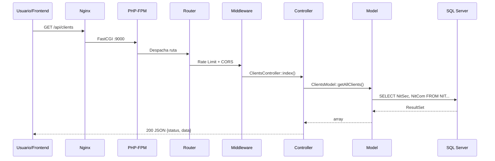
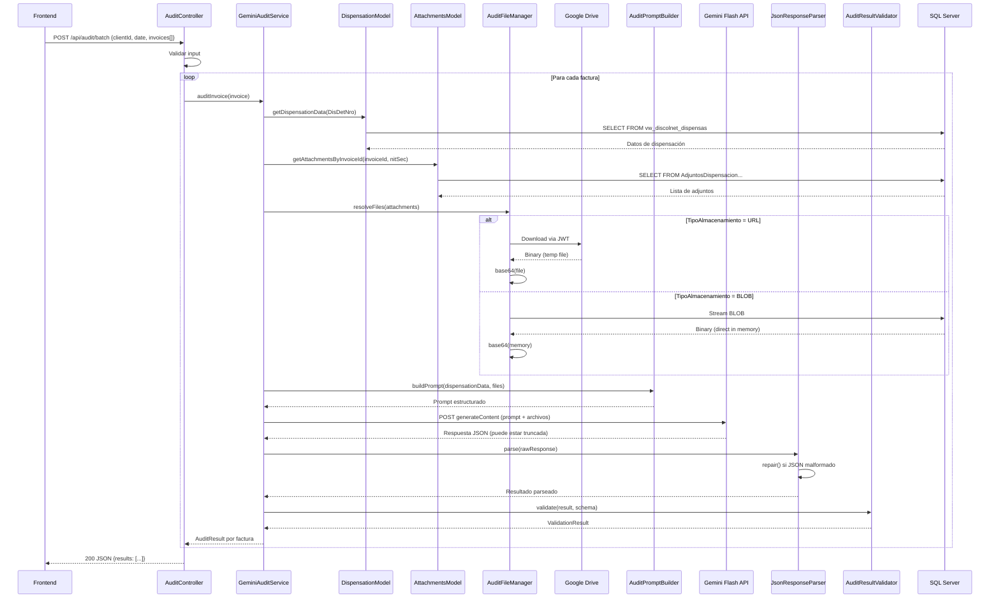
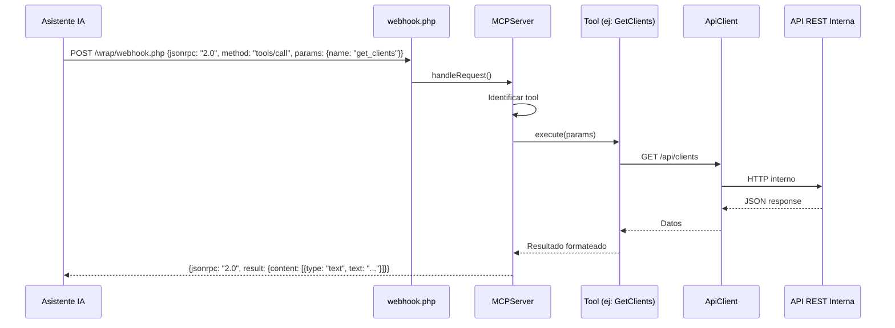

# Flujos de Datos — AudFact

## 1. Consulta REST Simple (Clientes / Facturas / Dispensación)

### Descripción
Flujo estándar para consultas de lectura a la API REST.

### Flujo



### Entrada
- Método HTTP + URI + Query params (opcionales)

### Salida
- JSON: `{status: "success", data: [...], message: "..."}`

### Manejo de Errores
- `400` — Parámetros inválidos (Validator)
- `404` — Recurso no encontrado
- `429` — Rate limit excedido
- `500` — Error interno (Logger registra detalle)

---

## 2. Auditoría IA (Flujo Principal)

### Descripción
Pipeline completo de auditoría: recibe lote de facturas, obtiene datos de dispensación + documentos adjuntos, envía a Gemini Flash para análisis multimodal, parsea y valida el resultado.

### Flujo



### Entrada
```json
{
    "clientId": 12345,
    "date": "2026-01-15",
    "invoices": [
        {"FacSec": 1001, "FacNro": "F-001", "DisId": "D-001"}
    ]
}
```

### Salida
```json
{
    "status": "success",
    "data": {
        "results": [
            {
                "invoiceId": "D-001",
                "auditResult": { "...schema definido en AuditResponseSchema..." },
                "status": "completed"
            }
        ],
        "summary": { "total": 1, "completed": 1, "failed": 0 }
    }
}
```

### Manejo de Errores
- `429` — Gemini API quota excedida (reintento con backoff)
- `503` — Modelo no disponible
- JSON truncado — `JsonRepairHelper` intenta reparar
- Validación fallida — Se registra y se marca como `failed`

---

## 3. Protocolo MCP

### Descripción
Flujo de comunicación MCP (Model Context Protocol) para asistentes de IA que consultan datos del sistema.

### Flujo



### Entrada
- JSON-RPC 2.0: `{jsonrpc, method, params, id}`

### Salida
- JSON-RPC 2.0: `{jsonrpc, result, id}`

### Manejo de Errores
- Tool no encontrada → `{error: {code: -32601, message: "Method not found"}}`
- Error interno → `{error: {code: -32603, message: "Internal error"}}`
