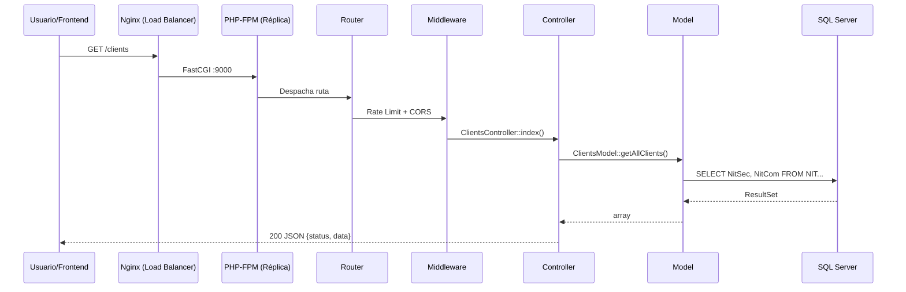
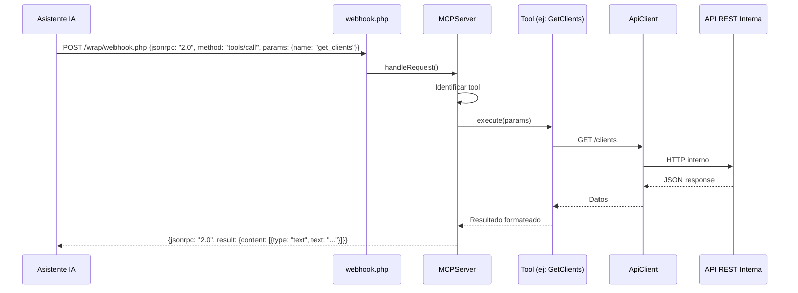
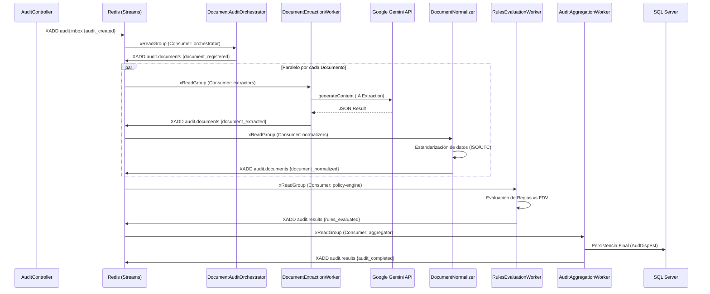

# Flujos de Datos — AudFact

## 1. Consulta REST Simple (Clientes / Facturas / Dispensación)

### Descripción
Flujo estándar para consultas de lectura a la API REST.

### Flujo

```mermaid
sequenceDiagram
    participant U as Usuario/Frontend
    participant N as Nginx (Load Balancer)
    participant P as PHP-FPM (Réplica)
    participant R as Router
    participant MW as Middleware
    participant C as Controller
    participant M as Model
    participant DB as SQL Server

    U->>N: GET /clients
    N->>P: FastCGI :9000
    P->>R: Despacha ruta
    R->>MW: Rate Limit + CORS
    MW->>C: ClientsController::index()
    C->>M: ClientsModel::getAllClients()
    M->>DB: SELECT NitSec, NitCom FROM NIT...
    DB-->>M: ResultSet
    M-->>C: array
    C-->>U: 200 JSON {status, data}
```

### Entrada
- Método HTTP + URI + Query params (opcionales)

### Salida
- JSON: `{status: "success", data: [...], message: "..."}`

### Manejo de Errores
- `400` — Parámetros inválidos (Validator)
- `404` — Recurso no encontrado
- `429` — Rate limit excedido
- `500` — Error interno (Logger registra detalle)

---

## 2. Protocolo MCP

### Descripción
Flujo de comunicación MCP (Model Context Protocol) para asistentes de IA que consultan datos del sistema.

### Flujo

```mermaid
sequenceDiagram
    participant AI as Asistente IA
    participant WH as webhook.php
    participant MCP as MCPServer
    participant Tool as Tool (ej: GetClients)
    participant API as ApiClient
    participant REST as API REST Interna

    AI->>WH: POST /wrap/webhook.php {jsonrpc: "2.0", method: "tools/call", params: {name: "get_clients"}}
    WH->>MCP: handleRequest()
    MCP->>MCP: Identificar tool
    MCP->>Tool: execute(params)
    Tool->>API: GET /clients
    API->>REST: HTTP interno
    REST-->>API: JSON response
    API-->>Tool: Datos
    Tool-->>MCP: Resultado formateado
    MCP-->>AI: {jsonrpc: "2.0", result: {content: [{type: "text", text: "..."}]}}
```

### Entrada
- JSON-RPC 2.0: `{jsonrpc, method, params, id}`

### Salida
- JSON-RPC 2.0: `{jsonrpc, result, id}`

### Manejo de Errores
- Tool no encontrada → `{error: {code: -32601, message: "Method not found"}}`
- Error interno → `{error: {code: -32603, message: "Internal error"}}`

---

## 3. Pipeline de Auditoría Asíncrono (Event-Driven) 🚀

### Descripción
Flujo desacoplado basado en Redis Streams. Permite procesamiento paralelo de documentos, reintentos granulares y observabilidad total por fase (Timings).

### Flujo

```mermaid
sequenceDiagram
    participant API as AuditController
    participant R as Redis (Streams)
    participant AO as DocumentAuditOrchestrator
    participant EW as DocumentExtractionWorker
    participant G as Google Gemini API
    participant NW as DocumentNormalizer
    participant RW as RulesEvaluationWorker
    participant AW as AuditAggregationWorker
    participant DB as SQL Server

    API->>R: XADD audit.inbox {audit_created}
    R->>AO: xReadGroup (Consumer: orchestrator)
    AO->>R: XADD audit.documents {document_registered}
    
    par Paralelo por cada Documento
        R->>EW: xReadGroup (Consumer: extractors)
        EW->>G: generateContent (IA Extraction)
        G-->>EW: JSON Result
        EW->>R: XADD audit.documents {document_extracted}
        
        R->>NW: xReadGroup (Consumer: normalizers)
        NW->>NW: Estandarización de datos (ISO/UTC)
        NW->>R: XADD audit.documents {document_normalized}
    end

    R->>RW: xReadGroup (Consumer: policy-engine)
    RW->>RW: Evaluación de Reglas vs FDV
    RW->>R: XADD audit.results {rules_evaluated}

    R->>AW: xReadGroup (Consumer: aggregator)
    AW->>DB: Persistencia Final (AudDispEst)
    AW->>R: XADD audit.results {audit_completed}
```

### Eventos Clave (Redis Streams)

| Evento | Origen | Destino | Propósito |
|---|---|---|---|
| `audit_created` | Controller | Orchestrator | Inicia la orquestación del lote |
| `document_registered` | Orchestrator | Extractor | Registra un adjunto para extracción |
| `document_extracted` | Extractor | Normalizer | Transporta datos crudos de Gemini |
| `document_normalized` | Normalizer | Rule Engine | Transporta datos estandarizados |
| `rules_evaluated` | Rule Engine | Aggregator | Transporta veredicto de reglas |
| `audit_completed` | Aggregator | Bus Global | Notifica fin de la auditoría |
| `dead_letter` | Cualquier Worker | DLQ Controller | Registra fallos fatales para reintento manual |
