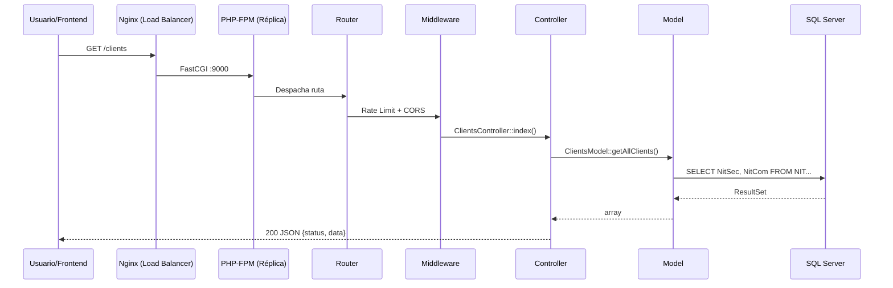
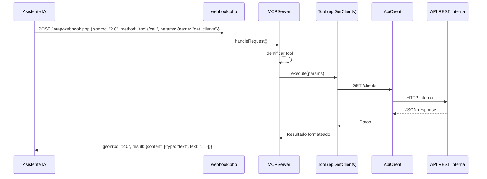

# Flujos de Datos — AudFact

## 1. Consulta REST Simple (Clientes / Facturas / Dispensación)

### Descripción
Flujo estándar para consultas de lectura a la API REST.

### Flujo

```mermaid
sequenceDiagram
    participant U as Usuario/Frontend
    participant N as Nginx (Load Balancer)
    participant P as PHP-FPM (Réplica)
    participant R as Router
    participant MW as Middleware
    participant C as Controller
    participant M as Model
    participant DB as SQL Server

    U->>N: GET /clients
    N->>P: FastCGI :9000
    P->>R: Despacha ruta
    R->>MW: Rate Limit + CORS
    MW->>C: ClientsController::index()
    C->>M: ClientsModel::getAllClients()
    M->>DB: SELECT NitSec, NitCom FROM NIT...
    DB-->>M: ResultSet
    M-->>C: array
    C-->>U: 200 JSON {status, data}
```

### Entrada
- Método HTTP + URI + Query params (opcionales)

### Salida
- JSON: `{status: "success", data: [...], message: "..."}`

### Manejo de Errores
- `400` — Parámetros inválidos (Validator)
- `404` — Recurso no encontrado
- `429` — Rate limit excedido
- `500` — Error interno (Logger registra detalle)

---

## 2. Protocolo MCP

### Descripción
Flujo de comunicación MCP (Model Context Protocol) para asistentes de IA que consultan datos del sistema.

### Flujo

```mermaid
sequenceDiagram
    participant AI as Asistente IA
    participant WH as webhook.php
    participant MCP as MCPServer
    participant Tool as Tool (ej: GetClients)
    participant API as ApiClient
    participant REST as API REST Interna

    AI->>WH: POST /wrap/webhook.php {jsonrpc: "2.0", method: "tools/call", params: {name: "get_clients"}}
    WH->>MCP: handleRequest()
    MCP->>MCP: Identificar tool
    MCP->>Tool: execute(params)
    Tool->>API: GET /clients
    API->>REST: HTTP interno
    REST-->>API: JSON response
    API-->>Tool: Datos
    Tool-->>MCP: Resultado formateado
    MCP-->>AI: {jsonrpc: "2.0", result: {content: [{type: "text", text: "..."}]}}
```

### Entrada
- JSON-RPC 2.0: `{jsonrpc, method, params, id}`

### Salida
- JSON-RPC 2.0: `{jsonrpc, result, id}`

### Manejo de Errores
- Tool no encontrada → `{error: {code: -32601, message: "Method not found"}}`
- Error interno → `{error: {code: -32603, message: "Internal error"}}`

---

## 3. Pipeline de Auditoría Asíncrono (Event-Driven) 🚀

### Descripción
Flujo desacoplado basado en Redis Streams. Permite procesamiento paralelo de documentos, reintentos granulares, observabilidad total por fase (Timings) y reserva idempotente por `DisId` para que batches concurrentes del mismo cliente no dupliquen auditorías.

### Contrato de Identidad

El batch y la auditoría individual transportan dos identificadores con roles distintos:

| Campo | Origen | Rol |
|---|---|---|
| `dis_id` | `vw_discolnet_dispensas.DisId` | Identidad interna e idempotencia; se conserva en `AudDispEst.FacSec` como columna legacy |
| `dis_det_nro` | `DispensacionDetalleServicio.DisDetNro` / `vw_discolnet_dispensas.Dispensa` | Llave operativa de dispensación, adjuntos y resultados persistidos (`AudDispEst.FacNro`) |

`DocumentAuditOrchestrator` resuelve la FDV por `dis_id` + `dis_det_nro` y valida que `FDV.header.DisId`, `FDV.header.NumeroFactura`, `payload.dis_det_nro` y `payload.fac_nit_sec` apunten a la misma dispensación. Si no coinciden, falla con `AUDIT_IDENTITY_MISMATCH`.

Antes de publicar `audit_created`, el API reserva `DisId` en Redis con un owner token. `DisDetNro` se conserva como llave operativa de adjuntos y como `FacNro` persistido. Si una auditoría cae a DLQ antes del agregador, el consumidor marca la auditoría como `failed`, actualiza el job si existe y libera la reserva por owner token.

### Flujo

```mermaid
sequenceDiagram
    participant API as AuditController
    participant R as Redis (Streams)
    participant BW as BatchRequestedWorker
    participant DB as SQL Server
    participant AO as DocumentAuditOrchestrator
    participant DW as AttachmentDownloadWorker
    participant EW as DocumentExtractionWorker
    participant IV as DocumentIntegrityValidator
    participant G as Google Gemini API
    participant NW as DocumentNormalizer
    participant RW as RulesEvaluationWorker
    participant PQ as AuditPersistenceQueue
    participant PW as AuditPersistenceWorker

    Note over API,R: Fase HTTP Express (< 100ms)
    API->>R: Guarda/Chequea Job en Redis (BatchJobStore)
    API->>R: XADD audit.batch.inbox {batch_requested}
    API-->>API: Retorna 202 Accepted de inmediato

    Note over R,BW: Fase Asíncrona en Background
    R->>BW: Consume batch_requested
    BW->>DB: Consulta pesada de facturas que califican
    DB-->>BW: Lista de dispensaciones (DisId, DisDetNro)
    
    loop Por cada Factura en el Lote
        BW->>R: SETNX audit:reservation:disid:{DisId} (Reserva de Idempotencia)
        alt Reserva Exitosa
            BW->>R: XADD audit.inbox {audit_created}
        else Reserva Fallida (Ya procesándose/procesada)
            BW-->>BW: Ignorar factura en este job
        end
    end
    BW->>R: Actualiza metadata del job (Total facturas)

    R->>AO: xReadGroup (Consumer: orchestrator)
    AO->>DB: Consulta adjuntos físicos sin filtrar opcionalidad
    AO->>AO: Reconciliación global 1:1 (nombre, ID corroborado, alias único)
    alt Mapping inequívoco
        AO->>R: XADD audit.documents {document_registered}
    else Missing / ambiguous / no content / reused
        AO->>R: Estado rejected + XADD audit.documents {document_rejected, category=DOCUMENT_MAPPING}
        R->>RW: Policy genera hallazgo MAP sin descarga ni Gemini
    end
    
    par Paralelo por cada Documento
        R->>DW: xReadGroup (Consumer: downloaders)
        DW->>DB: Lectura BLOB con PDO db2 fresco y validación bytes = DATALENGTH
        alt Descarga fallida
            DW->>R: Telemetría failed + XADD audit.dlq + XACK
            Note over DW,R: Fallo técnico; no document_rejected ni hallazgo funcional
        else Descarga exitosa
            DW->>R: Guarda BLOB temporal audit:blob:*
            DW->>R: XADD audit.documents {document_downloaded}
            R->>EW: xReadGroup (Consumer: extractors)
            EW->>IV: valida tamaño, MIME y magic bytes
            alt Documento no procesable
                EW->>R: XADD audit.documents {document_rejected}
                R->>RW: xReadGroup (Consumer: policy-engine)
                RW->>RW: Genera hallazgo RECHAZADO tipo_auditoria=integrity
            else Documento válido
                EW->>G: generateContent (IA Extraction)
                G-->>EW: JSON Result
                EW->>R: XADD audit.documents {document_extracted}
                R->>NW: xReadGroup (Consumer: normalizers)
                NW->>NW: Estandarización de datos (ISO/UTC)
                NW->>R: XADD audit.documents {document_normalized}
            end
        end
    end

    R->>RW: xReadGroup (Consumer: policy-engine)
    RW->>RW: Evaluación de Reglas vs FDV
    RW->>PQ: Encola rules_evaluated
    PQ->>R: XADD audit.persistence:{queue} (un turno activo por job)

    R->>PW: xReadGroup (Consumer: persistence)
    PW->>DB: PDO default fresco + transacción idempotente dual
    Note over PW,DB: Reintentos por desconexión: 1s / 5s / 30s
    PW->>PQ: Libera turno y promueve el siguiente evento del job
    PW->>R: XADD audit.results {audit_completed}
    PW->>R: DEL audit:reservation:disid:{DisId} (owner token)
```

### Eventos Clave (Redis Streams)

| Evento | Stream | Origen | Destino | Propósito |
|---|---|---|---|---|
| `batch_requested` | `audit.batch.inbox` | Controller | Batch Worker | Encola la solicitud del lote para consulta de base de datos pesada |
| `audit_created` | `audit.inbox` | Batch Worker / Sync Controller | Orchestrator | Inicia la orquestación de una auditoría individual |
| `document_registered` | `audit.documents` | Orchestrator | Downloader | Registra un adjunto para descarga |
| `document_downloaded` | `audit.documents` | Downloader | Extractor | Transporta `blob_reference_key` y `document_hash` sin incluir base64 en el evento |
| `document_extracted` | `audit.documents` | Extractor | Normalizer | Transporta datos crudos extraídos de Gemini |
| `document_rejected` | `audit.documents` | Orchestrator / Extractor | Rule Engine | Transporta rechazos cerrados de mapping (`DOCUMENT_MAPPING`) o contenido (`document_content`) según origen; nunca representa una falla SQL/Drive/transferencia |
| `document_normalized` | `audit.documents` | Normalizer | Rule Engine | Transporta datos estandarizados listos para reglas |
| `rules_evaluated` | `audit.persistence:{queue}` | Rule Engine / Scheduler | Persistence Worker | Transporta el veredicto respetando un turno activo por job |
| `audit_completed` | `audit.results` | Persistence Worker | Bus Global / Job Store | Confirma la transacción SQL y notifica fin del proceso |
| `dead_letter` | `audit.dlq` | Cualquier Worker | DLQ Controller | Registra fallos fatales para reintento manual administrativamente |

Las operaciones SQL de lectura y escritura se ejecutan con un PDO fresco por
intento. Las lecturas y escrituras idempotentes pueden repetirse ante
desconexiones (`08*`, `SHUTDOWN`; `HYT00` solo en apertura). Cuando esa política
se agota, `AuditEventConsumer` envía a DLQ, hace ACK y libera el turno en la
misma entrega; no depende de los 600 segundos de `XAUTOCLAIM`.
