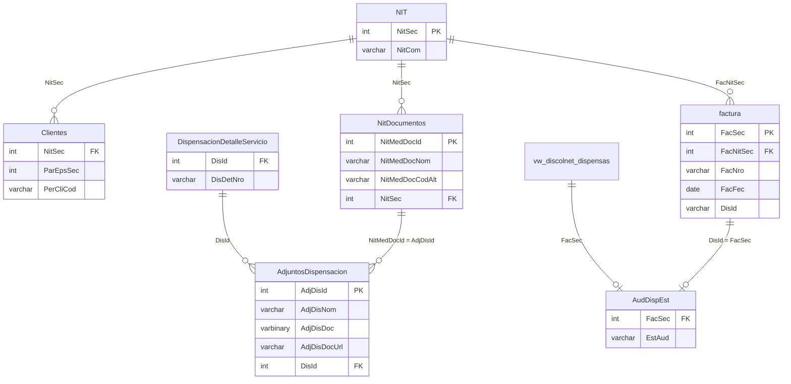

# Database Schema — AudFact

## Visión General

AudFact opera sobre una base de datos **SQL Server** existente del sistema de dispensación farmacéutica. La aplicación **no crea ni modifica tablas** — solo realiza consultas de lectura. Las tablas y vistas son parte del ERP farmacéutico corporativo.

> [!IMPORTANT]
> AudFact es un sistema **read-only** sobre la BD de dispensación. No existe esquema propio ni migraciones.

---

## Tablas Consultadas

### `NIT`

**Propósito**: Maestro de terceros (clientes, proveedores, etc.)

| Columna | Tipo | Descripción |
|---|---|---|
| `NitSec` | int (PK) | Identificador único del tercero |
| `NitCom` | varchar | Nombre comercial |

**Usada por**: `ClientsModel`

---

### `Clientes`

**Propósito**: Registro de clientes (EPS) vinculados a NIT.

| Columna | Tipo | Descripción |
|---|---|---|
| `NitSec` | int (FK → NIT) | Referencia al tercero |
| `ParEpsSec` | int | Parámetro EPS (> 0 indica EPS activa) |
| `PerCliCod` | varchar | Código de perfil de cliente ('2' = dispensación) |

**Usada por**: `ClientsModel` (JOIN con NIT)

---

### `factura`

**Propósito**: Registro de facturas de dispensación.

| Columna | Tipo | Descripción |
|---|---|---|
| `FacSec` | int (PK) | Secuencial de factura |
| `FacNitSec` | int (FK → NIT) | NitSec del cliente |
| `FacNro` | varchar | Número de factura |
| `FacFec` | date | Fecha de facturación |
| `DisId` | varchar | Identificador de dispensación |

**Usada por**: ~~`InvoicesModel`~~ (migrado a `vw_discolnet_dispensas` en v2026-02-24). Tabla de referencia del ERP.

---

### `vw_discolnet_dispensas` (Vista)

**Propósito**: Vista consolidada de dispensaciones con todos los datos necesarios para auditoría. Fuente de verdad del sistema.

| Columna | Alias | Descripción |
|---|---|---|
| `facsec` | FacSec | Secuencial de factura |
| `Dispensa` | NumeroFactura | Número de dispensación |
| `Cliente` | Cliente | Nombre del cliente/EPS |
| `Nit` | NITCliente | NIT del cliente |
| `NitSec` | NitSec | ID del cliente |
| `Copago` | VlrCobrado | Valor de copago |
| `IPS` | IPS | Nombre de la IPS |
| `IPS_nit` | IPS_NIT | NIT de la IPS |
| `Paciente` | NombrePaciente | Nombre del paciente |
| `Paciente_doct` | TipoDocumentoPaciente | Tipo de documento |
| `Paciente_doc` | DocumentoPaciente | Número de documento |
| `Fecha_nac` | FechaNacimiento | Fecha de nacimiento |
| `Medico` | Medico | Nombre del médico |
| `Medico_DocT` | TipoDocumentoMedico | Tipo de documento |
| `Medico_Doc` | DocumentoMedico | Número de documento |
| `Cie` | CodigoDiagnostico | Código CIE del diagnóstico |
| `Fecha_solicitud` | FechaEntrega | Fecha de solicitud/entrega |
| `Fecha_formula` | FechaFormula | Fecha de la fórmula |
| `Fecha_autorizacion` | FechaAutorizacion | Fecha de autorización |
| `Autorizacion` | NumeroAutorizacion | Número de autorización |
| `Tipo_servicio` | Tipo | Tipo de servicio |
| `Codigo` | CodigoArticulo | Código del artículo |
| `Codigo_aut` | CodigoProducto | Código autorizado |
| `Producto` | NombreArticulo | Nombre del producto |
| `Laboratorio` | Laboratorio | Nombre del laboratorio |
| `Cum` | CUM | Código Único de Medicamentos |
| `Lot` | Lote | Número de lote |
| `LotFec` | FechaVencimiento | Fecha de vencimiento |
| `Unidades_entr` | CantidadEntregada | Unidades entregadas |
| `Unidades_pres` | CantidadPrescrita | Unidades prescritas |
| `Mipres` | Mipres | Código MIPRES |
| `IdPrincipal` | — | ID principal |
| `IdDirec` | — | ID dirección |
| `IdProg` | — | ID programa |
| `IdEntr` | — | ID entrega |
| `IdRepEnt` | — | ID reporte entrega |
| `IdFact` | — | ID facturación |

**Usada por**: `DispensationModel`, `InvoicesModel` (columnas `NitSec`, `FacSec`, `Dispensa`)

---

### `AdjuntosDispensacion`

**Propósito**: Documentos adjuntos (escaneados) vinculados a dispensaciones.

| Columna | Tipo | Descripción |
|---|---|---|
| `AdjDisId` | int (PK) | ID del adjunto |
| `AdjDisNom` | varchar | Nombre del archivo |
| `AdjDisDoc` | varbinary(max) | Documento almacenado como BLOB |
| `AdjDisDocUrl` | varchar | URL del documento en Google Drive |
| `AdjDisOpc` | varchar(1) | Documento opcional: `N`=obligatorio, `S`=opcional |
| `AdjDisEstSop` | varchar | Estado del soporte: `P`=pendiente, `A`=aprobado, `C`=conforme, `R`=rechazado, `I`=en revisión |
| `AdjDisRec` | varchar(1) | Reclamación: `' '`=sin revisar, `N`=no reclamado, `S`=reclamado |
| `DisId` | int (FK) | Referencia a la dispensación |
| `DisDetId` | int (FK) | Referencia al detalle de dispensación |

**Usada por**: `AttachmentsModel`, `InvoicesModel` (LEFT JOIN con `AdjDisOpc='N'` para filtrar docs obligatorios conformes)

---

### `DispensacionDetalleServicio`

**Propósito**: Detalle de servicios de dispensación.

| Columna | Tipo | Descripción |
|---|---|---|
| `DisId` | int (FK) | ID de dispensación |
| `DisDetNro` | varchar | Número de detalle (clave de búsqueda) |

**Usada por**: `AttachmentsModel` (JOIN con AdjuntosDispensacion)

---

### `NitDocumentos`

**Propósito**: Tipos de documentos requeridos por cada cliente/EPS.

| Columna | Tipo | Descripción |
|---|---|---|
| `NitMedDocId` | int (PK) | ID del tipo de documento |
| `NitMedDocNom` | varchar | Nombre del documento |
| `NitMedDocCodAlt` | varchar | Código alternativo |
| `NitSec` | int (FK → NIT) | Cliente al que pertenece |

**Usada por**: `AttachmentsModel` (JOIN con AdjuntosDispensacion)

---

### `Discolnet.dbo.AudDispEst`

**Propósito**: Estado de auditoría de dispensaciones (base de datos cruzada).

> [!WARNING]
> **Dependencia de misma instancia**: Esta tabla reside en la base de datos `Discolnet`,
> que DEBE coexistir en la misma instancia SQL Server que la BD principal (`DB_NAME`).
> Las queries cross-database (`Discolnet.dbo.AudDispEst`) dependen de esta topología.
> Si alguna vez las bases de datos se separan a instancias distintas, será necesario
> refactorizar a linked servers o replicación.

| Columna | Tipo | Descripción |
|---|---|---|
| `FacSec` | int (FK) | Referencia a `vw_discolnet_dispensas.FacSec` |
| `EstAud` | varchar | Estado de auditoría (NULL = no auditada) |

**Usada por**: `InvoicesModel` (LEFT JOIN para filtrar dispensaciones no auditadas), `AuditStatusModel` (MERGE para guardar resultados)

---

## Relaciones (ER Diagram)

### Vistas Clave
- `vw_discolnet_dispensas`: Fuente principal de dispensados.
- `vw_discolnet_facturas`: Movimientos de inventario/unidades (usada para filtrar `KarUni = 0`).
- `vw_discolnet_conceptos`: Conceptos de recobro.

> [!NOTE]
> La vista `vw_discolnet_dispensas` no se incluye en el ER porque es una vista consolidada que ya resuelve los JOINs necesarios internamente.
