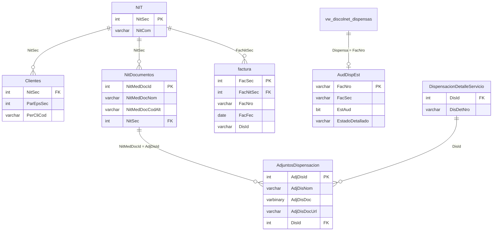

# Database Schema — AudFact

## Visión General

AudFact opera sobre una base de datos **SQL Server** existente del sistema de dispensación farmacéutica. La aplicación no crea tablas desde el runtime: consume vistas/tablas legacy para lectura y persiste resultados/configuración de auditoría en tablas existentes de `Discolnet`.

> [!IMPORTANT]
> Las consultas operativas usan la conexión `db2` de lectura. Las escrituras controladas (`MERGE`, `INSERT`, `DELETE`, `UPDATE`) usan la conexión `default` y se limitan a configuración/resultados de auditoría: `Discolnet.dbo.AudDisp`, `Discolnet.dbo.AudDispCampo`, `Discolnet.dbo.AudDispEst` y estados de `AdjuntosDispensacion`.

---

## Tablas Consultadas

### `NIT`

**Propósito**: Maestro de terceros (clientes, proveedores, etc.)

| Columna | Tipo | Descripción |
|---|---|---|
| `NitSec` | int (PK) | Identificador único del tercero |
| `NitCom` | varchar | Nombre comercial |

**Usada por**: `ClientsModel`

---

### `Clientes`

**Propósito**: Registro de clientes (EPS) vinculados a NIT.

| Columna | Tipo | Descripción |
|---|---|---|
| `NitSec` | int (FK → NIT) | Referencia al tercero |
| `ParEpsSec` | int | Parámetro EPS (> 0 indica EPS activa) |
| `PerCliCod` | varchar | Código de perfil de cliente ('2' = dispensación) |

**Usada por**: `ClientsModel` (JOIN con NIT)

---

### `factura`

**Propósito**: Registro de facturas de dispensación.

| Columna | Tipo | Descripción |
|---|---|---|
| `FacSec` | int (PK) | Secuencial de factura |
| `FacNitSec` | int (FK → NIT) | NitSec del cliente |
| `FacNro` | varchar | Número de factura |
| `FacFec` | date | Fecha de facturación |
| `DisId` | varchar | Identificador de dispensación |

**Usada por**: `InvoicesModel` para seleccionar la llave canónica `Factura.FacSec` del batch y alinear el filtro contra `AudDispEst`.

---

### `vw_discolnet_dispensas` (Vista)

**Propósito**: Vista consolidada de dispensaciones con todos los datos necesarios para auditoría. Fuente de verdad del sistema.

| Columna | Alias | Descripción |
|---|---|---|
| `facsecF` | FacSec | Llave canónica de factura; equivale a `Factura.FacSec` y a `AudDispEst.FacSec` |
| `facsec` | — | Identificador legacy/de agrupación; no usar como llave de auditoría |
| `Dispensa` | NumeroFactura | Número de dispensación |
| `Cliente` | Cliente | Nombre del cliente/EPS |
| `Nit` | NITCliente | NIT del cliente |
| `NitSec` | NitSec | ID del cliente |
| `Copago` | VlrCobrado | Valor de copago |
| `IPS` | IPS | Nombre de la IPS |
| `IPS_nit` | IPS_NIT | NIT de la IPS |
| `Paciente` | NombrePaciente | Nombre del paciente |
| `Paciente_doct` | TipoDocumentoPaciente | Tipo de documento |
| `Paciente_doc` | DocumentoPaciente | Número de documento |
| `Fecha_nac` | FechaNacimiento | Fecha de nacimiento |
| `Medico` | Medico | Nombre del médico |
| `Medico_DocT` | TipoDocumentoMedico | Tipo de documento |
| `Medico_Doc` | DocumentoMedico | Número de documento |
| `Cie` | CodigoDiagnostico | Código CIE del diagnóstico |
| `Fecha_solicitud` | FechaEntrega | Fecha de solicitud/entrega |
| `Fecha_formula` | FechaFormula | Fecha de la fórmula |
| `Fecha_autorizacion` | FechaAutorizacion | Fecha de autorización |
| `Autorizacion` | NumeroAutorizacion | Número de autorización |
| `Tipo_servicio` | Tipo | Tipo de servicio |
| `Codigo` | CodigoArticulo | Código del artículo |
| `Codigo_aut` | CodigoProducto | Código autorizado |
| `Producto` | NombreArticulo | Nombre del producto |
| `Laboratorio` | Laboratorio | Nombre del laboratorio |
| `Cum` | CUM | Código Único de Medicamentos |
| `Lot` | Lote | Número de lote |
| `LotFec` | FechaVencimiento | Fecha de vencimiento |
| `Unidades_entr` | CantidadEntregada | Unidades entregadas |
| `Unidades_pres` | CantidadPrescrita | Unidades prescritas |
| `Mipres` | Mipres | Código MIPRES |
| `IdPrincipal` | — | ID principal |
| `IdDirec` | — | ID dirección |
| `IdProg` | — | ID programa |
| `IdEntr` | — | ID entrega |
| `IdRepEnt` | — | ID reporte entrega |
| `IdFact` | — | ID facturación |

**Usada por**: `DispensationModel` como FDV (`facsecF AS FacSec`, `Dispensa AS NumeroFactura`).

---

### `AdjuntosDispensacion`

**Propósito**: Documentos adjuntos (escaneados) vinculados a dispensaciones.

| Columna | Tipo | Descripción |
|---|---|---|
| `AdjDisId` | int (PK) | ID del adjunto |
| `AdjDisNom` | varchar | Nombre del archivo |
| `AdjDisDoc` | varbinary(max) | Documento almacenado como BLOB |
| `AdjDisDocUrl` | varchar | URL del documento en Google Drive |
| `AdjDisOpc` | varchar(1) | Documento opcional: `N`=obligatorio, `S`=opcional |
| `AdjDisEstSop` | varchar | Estado del soporte: `P`=pendiente, `A`=aprobado, `C`=conforme, `R`=rechazado, `I`=en revisión |
| `AdjDisRec` | varchar(1) | Reclamación: `' '`=sin revisar, `N`=no reclamado, `S`=reclamado |
| `DisId` | int (FK) | Referencia a la dispensación |
| `DisDetId` | int (FK) | Referencia al detalle de dispensación |

**Usada por**: `AttachmentsModel`, `InvoicesModel` (LEFT JOIN con `AdjDisOpc='N'` para filtrar docs obligatorios conformes)

Para el pipeline, `AttachmentsModel` obtiene `AdjDisDoc` y
`DATALENGTH(AdjDisDoc)` en la misma consulta, materializa los bytes dentro del
callback PDO y rechaza técnicamente cualquier lectura parcial. El endpoint HTTP
conserva su contrato de streaming independiente.

La enumeración previa a Gemini usa `getPhysicalAttachmentsByDisDetNro`: parte
de `AdjuntosDispensacion`, une `NitDocumentos` con `LEFT JOIN` y aplica `NitSec`
dentro del `ON`, no en `WHERE`. Así conserva todos los adjuntos físicos aunque
no tengan catálogo compatible. Expone internamente `attachment_id`,
`physical_catalog_id`, nombre, aliases y `storage_type`; este shape no reemplaza
el contrato público histórico de listado de adjuntos.

---

### `DispensacionDetalleServicio`

**Propósito**: Detalle de servicios de dispensación.

| Columna | Tipo | Descripción |
|---|---|---|
| `DisId` | int (FK) | ID de dispensación |
| `DisDetNro` | varchar | Número de detalle (clave de búsqueda) |

**Usada por**: `AttachmentsModel` (JOIN con AdjuntosDispensacion), `DispensationModel` (resolución dinámica de `DisId`)

---

### `NitDocumentos`

**Propósito**: Tipos de documentos requeridos por cada cliente/EPS.

| Columna | Tipo | Descripción |
|---|---|---|
| `NitMedDocId` | int (PK) | ID del tipo de documento |
| `NitMedDocNom` | varchar | Nombre del documento |
| `NitMedDocCodAlt` | varchar | Código alternativo |
| `NitSec` | int (FK → NIT) | Cliente al que pertenece |

**Usada por**: `AttachmentsModel` (JOIN con AdjuntosDispensacion)

---

### `Discolnet.dbo.AudDispEst`

**Propósito**: Estado de auditoría de dispensaciones (base de datos cruzada).

> [!WARNING]
> **Dependencia de misma instancia**: Esta tabla reside en la base de datos `Discolnet`,
> que DEBE coexistir en la misma instancia SQL Server que la BD principal (`DB_NAME`).
> Las queries cross-database (`Discolnet.dbo.AudDispEst`) dependen de esta topología.
> Si alguna vez las bases de datos se separan a instancias distintas, será necesario
> refactorizar a linked servers o replicación.

| Columna | Tipo | Descripción |
|---|---|---|
| `FacNro` | nvarchar(100) (PK) | Llave primaria operativa; almacena `DisDetNro` / `vw_discolnet_dispensas.Dispensa` |
| `FacSec` | nvarchar(320) | Columna legacy que almacena `vw_discolnet_dispensas.DisId` |
| `EstAud` | bit | Estado de auditoría (0 = pendiente/manual, 1 = procesada) |
| `EstadoDetallado` | varchar(50) | Estado funcional terminal o en curso (`completed`, `manual_review`, `failed`, etc.) |
| `RequiereRevisionHumana` | bit | Flag explícito de revisión humana (`true` cuando `EstadoDetallado = manual_review`) |
| `Severidad` | nvarchar | Severidad máxima de los hallazgos: `alta`, `media`, `baja` |
| `Hallazgos` | nvarchar(max) | Payload persistido de hallazgos, decisiones y timings (JSON completo con `items`, `field_decisions`, `document_decisions`, `metrics` y `timings`) |
| `DetalleError` | nvarchar | Resumen legible del resultado o del primer hallazgo que causó el rechazo |
| `DocumentosProcesados` | int | Cantidad de documentos evaluados en la auditoría (típicamente 3-4) |
| `DocumentoFallido` | nvarchar | Tipo del primer documento que falló (si aplica): `FORMULA MEDICA`, `AUTORIZACION`, `DISPENSA`, `ACTA DE ENTREGA` |
| `DuracionProcesamientoMs` | int | Duración total del pipeline en ms (end-to-end) |
| `FacNitSec` | nvarchar | Identificador del cliente/EPS asociado a la auditoría |
| `FechaCreacion` | datetime | Timestamp de creación del registro de auditoría |
| `FechaActualizacion` | datetime | Timestamp de última actualización del registro |
| `JobId` | varchar(50) | Job batch asociado cuando la auditoría fue encolada como parte de un lote (`POST /audit/async`). ⚠️ **No se inserta** en el `INSERT` inicial de `AuditResultPersistenceModel`; la columna existe en el schema pero el path de escritura actual no la asigna. Valor consultado desde Redis (`BatchJobStore`) cuando aplique. |

**Usada por**: `InvoicesModel` (LEFT JOIN para filtrar dispensaciones no auditadas por `FacSec`/`DisId`), `AuditStatusModel` (lectura por `FacNro`) y `AuditResultPersistenceModel` (upsert serializable por `FacNro`)

`AuditResultPersistenceModel` reproduce la transacción completa únicamente
cuando el error es una desconexión y la operación sigue siendo idempotente. La
persistencia de `AudDispEst`, hallazgos de `AdjuntosDispensacion` y trazabilidad
de `DispensacionDetalleServicio` permanece atómica; este endurecimiento no
requiere DDL ni migración de esquema.

---

### `Discolnet.dbo.AudDisp`

**Propósito**: Cabecera de configuración dinámica de auditoría por cliente.

| Columna | Tipo | Descripción |
|---|---|---|
| `FacNitSec` | int/varchar | Identificador del cliente/NIT |
| `SystemPrompt` | text/varchar | Prompt base de extracción/evaluación por cliente |
| `Activo` | bit/int | Indica si la configuración está activa |
| `FecCre` | datetime | Fecha de creación |
| `FecMod` | datetime | Fecha de modificación |

**Usada por**: `AuditConfigModel` (`getHeader()`, `saveConfig()` con `MERGE`).

---

### `Discolnet.dbo.AudDispCampo`

**Propósito**: Campos configurables por documento y cliente para extracción/evaluación (tabla de asignación; los metadatos de campo vienen de `AudDispCampoCatalogo`).

| Columna | Tipo | Descripción |
|---|---|---|
| `FacNitSec` | int/varchar | Cliente/NIT |
| `NitMedDocId` | int | Documento requerido asociado |
| `CampoNombre` | varchar | Nombre canónico del campo (FK → `AudDispCampoCatalogo.CampoNombre`) |
| `Activo` | bit/int | Indica si el campo participa en runtime |
| `Orden` | int | Orden estable de procesamiento/presentación |
| `DescripcionOverride` | varchar/null | Descripción custom que sobreescribe la de catálogo para visual checks |
| `SeveridadOverride` | varchar/null | Severidad custom (`alta`, `media`, `baja`) que sobreescribe la de catálogo |

**Usada por**: `AuditConfigModel` (`getConfig()`, `saveConfig()` con reemplazo `DELETE + INSERT`).

---

### `Discolnet.dbo.AudDispCampoCatalogo`

**Propósito**: Catálogo global de campos de extracción y visual checks. Define los metadatos de cada campo; `AudDispCampo` hace referencia a este catálogo por `CampoNombre`.

| Columna | Tipo | Descripción |
|---|---|---|
| `CampoNombre` | varchar (PK funcional) | Nombre canónico del campo o visual check |
| `TipoCampo` | varchar | Tipo de campo (`E`=extracción, `S`=semejanza, `V`=visual, etc.) |
| `TipoDato` | varchar/null | Tipo explícito para schema Gemini y normalización |
| `EsVisual` | bit | Si es `1`, el campo es un visual check (no extracción Gemini) |
| `Descripcion` | varchar/null | Descripción por defecto del campo (puede ser sobreescrita por `AudDispCampo.DescripcionOverride`) |
| `Severidad` | varchar/null | Severidad por defecto (`alta`, `media`, `baja`); puede sobreescribirse vía `AudDispCampo.SeveridadOverride` |
| `CodigoCampo` | varchar/null | Código funcional del campo; se antepone como prefijo `-CODIGO- ` al `detalle` de hallazgos fallidos |

**Usada por**: `AuditConfigModel` (`getConfig()` vía `INNER JOIN`, y `catalog()` — devuelve el catálogo completo de campos disponibles para configuración de auditoría).

---

## Relaciones (ER Diagram)

```mermaid
erDiagram
    NIT ||--o{ Clientes : "NitSec"
    NIT ||--o{ NitDocumentos : "NitSec"
    NIT ||--o{ factura : "FacNitSec"

    vw_discolnet_dispensas ||--o| AudDispEst : "Dispensa = FacNro"

    DispensacionDetalleServicio ||--o{ AdjuntosDispensacion : "DisId"
    NitDocumentos ||--o{ AdjuntosDispensacion : "NitMedDocId = AdjDisId"

    NIT {
        int NitSec PK
        varchar NitCom
    }

    Clientes {
        int NitSec FK
        int ParEpsSec
        varchar PerCliCod
    }

    factura {
        int FacSec PK
        int FacNitSec FK
        varchar FacNro
        date FacFec
        varchar DisId
    }

    AdjuntosDispensacion {
        int AdjDisId PK
        varchar AdjDisNom
        varbinary AdjDisDoc
        varchar AdjDisDocUrl
        int DisId FK
    }

    DispensacionDetalleServicio {
        int DisId FK
        varchar DisDetNro
    }

    NitDocumentos {
        int NitMedDocId PK
        varchar NitMedDocNom
        varchar NitMedDocCodAlt
        int NitSec FK
    }

    AudDispEst {
        varchar FacNro PK
        varchar FacSec
        bit EstAud
        varchar EstadoDetallado
    }
```

### Vistas Clave
- `vw_discolnet_dispensas`: Fuente principal de dispensados.
- `vw_discolnet_facturas`: Movimientos de inventario/unidades (usada para filtrar `KarUni = 0`).
- `vw_discolnet_conceptos`: Conceptos de recobro.

> [!NOTE]
> La vista `vw_discolnet_dispensas` no se incluye en el ER porque es una vista consolidada que ya resuelve los JOINs necesarios internamente.
