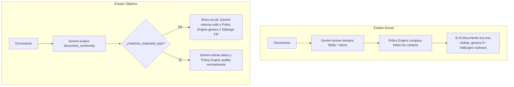

# Especificación Técnica SDD: Verificación de Conformidad de Tipología Documental con Short-Circuit Inmediato

## Clasificación del Cambio (Triage)

| Dimensión | Valor | Justificación |
| :--- | :--- | :--- |
| **Tipo** | Feature / Contrato | Incorporación de compuerta de clasificación documental en contrato Gemini y evaluación con short-circuit en Policy Engine. `[CONFIRMADO]` |
| **Riesgo** | Medio | Extiende el schema de extracción y agrega validación previa en Policy Engine sin romper flujos existentes. `[CONFIRMADO]` |
| **Persistencia afectada** | No | No requiere modificaciones DDL ni nuevas tablas en SQL Server. Se apoya en la estructura de hallazgos existente. `[CONFIRMADO]` |
| **Contrato externo afectado** | Sí (Interno Gemini) | Añade propiedad requerida `document_conformity` al `responseSchema` de Structured Outputs. `[CONFIRMADO]` |
| **Cambio arquitectónico** | No | Sigue la arquitectura event-driven sobre Redis Streams y el patrón de evaluación de `DocumentPolicyEngine`. `[CONFIRMADO]` |
| **Producción afectada** | No | Se implementará y verificará localmente y mediante suite de pruebas PHPUnit. `[CONFIRMADO]` |
| **Requiere 0.3.1 (Abstracciones)** | No | No reemplaza mapeos estáticos por abstracciones dinámicas; introduce una compuerta declarativa en el schema. `[CONFIRMADO]` |

---

## FASE 0 — Descubrimiento Empírico Obligatorio

### 0.1 Perímetro de Impacto

| Archivo | Ruta | Categoría | Propósito | Líneas Afectadas | Verificado por Lectura |
| :--- | :--- | :---: | :--- | :---: | :---: |
| `DocumentExtractionContractBuilder.php` | `app/Services/Audit/Pipeline/DocumentExtractionContractBuilder.php` | `MODIFIED` | Generación del schema JSON para Gemini Structured Outputs | L230-L280 | `Sí` |
| `ExtractionPromptBuilder.php` | `app/Services/Audit/Pipeline/ExtractionPromptBuilder.php` | `MODIFIED` | Construcción de directivas de prompt para extracción | L40-L100 | `Sí` |
| `GeminiResponseParser.php` | `app/Services/Audit/Pipeline/GeminiResponseParser.php` | `MODIFIED` | Validación y rehidratación de la respuesta de Gemini | L90-L150 | `Sí` |
| `DocumentPolicyEngine.php` | `app/Services/Audit/Pipeline/DocumentPolicyEngine.php` | `MODIFIED` | Motor de evaluación de reglas de auditoría y hallazgos | L100-L220 | `Sí` |
| `DocumentExtractionContractBuilderTest.php` | `tests/Services/Audit/Pipeline/DocumentExtractionContractBuilderTest.php` | `MODIFIED` | Pruebas unitarias de construcción de contrato | L30-L80 | `Sí` |
| `ExtractionPromptBuilderTest.php` | `tests/Services/Audit/Pipeline/ExtractionPromptBuilderTest.php` | `MODIFIED` | Pruebas unitarias de construcción de prompts | L30-L100 | `Sí` |
| `GeminiResponseParserTest.php` | `tests/Services/Audit/Pipeline/GeminiResponseParserTest.php` | `MODIFIED` | Pruebas unitarias de parsing de respuestas Gemini | L30-L90 | `Sí` |

#### Criterio de Cierre del Perímetro
Búsquedas realizadas en el repositorio local:
- Búsqueda textual: `document_quality`, `responseSchema`, `buildFlatObjectSchema`, `evaluateDocument`.
- Inspección directa de los 7 archivos del pipeline de extracción y políticas.

---

### 0.2 Grafo de Dependencias Acopladas

| Archivo Afectado | Dependencia | Ruta Dependencia | Línea(s) | Relación | Mecanismo | Tipo de Consumidor |
| :--- | :--- | :--- | :--- | :---: | :---: | :---: |
| `DocumentExtractionContractBuilder.php` | `DocumentExtractionWorker.php` | `app/Services/Audit/Pipeline/DocumentExtractionWorker.php` | L95 | Directa | Invocación | Repositorio local |
| `ExtractionPromptBuilder.php` | `DocumentExtractionWorker.php` | `app/Services/Audit/Pipeline/DocumentExtractionWorker.php` | L110 | Directa | Invocación | Repositorio local |
| `GeminiResponseParser.php` | `DocumentExtractionWorker.php` | `app/Services/Audit/Pipeline/DocumentExtractionWorker.php` | L130 | Directa | Invocación | Repositorio local |
| `DocumentPolicyEngine.php` | `RulesEvaluationWorker.php` | `app/Services/Audit/Pipeline/RulesEvaluationWorker.php` | L180 | Directa | Invocación | Repositorio local |

---

### 0.3 Análisis de Impacto Inverso (Regresiones)

| Cambio Propuesto | Componente Afectado | Ruta:Línea | Tipo Regresión | Corrección |
| :--- | :--- | :--- | :---: | :--- |
| Añadir `document_conformity` a schema requerido | `GeminiResponseParser.php` | `app/Services/Audit/Pipeline/GeminiResponseParser.php:125` | `Runtime` | Añadir aserción de completitud para `document_conformity` con fallback tolerante si payload antiguo. |
| Short-circuit en `DocumentPolicyEngine.php` | `RulesEvaluationWorker.php` | `app/Services/Audit/Pipeline/RulesEvaluationWorker.php:210` | `Runtime` | Retornar array estándar de decisión con `approved: false` y hallazgo `TIP` sin romper agregación. |
| Fixtures de pruebas unitarias existentes | `DocumentExtractionContractBuilderTest.php` | `tests/...` | `Test` | Actualizar fixtures con la nueva sección `document_conformity`. |

---

### 0.4 Verificación de Semántica de Herramientas

| Herramienta | Regla Relevante | Tipo Evidencia | Evidencia | Cambio Compatible |
| :--- | :--- | :---: | :--- | :---: |
| **Gemini Structured Outputs** | Todos los campos requeridos en `responseSchema` deben tener `type`, `properties` y `required`. | `Documental` | Documentación oficial Gemini REST API | `Sí`. El schema de `document_conformity` cumple 100% con OpenAPI 3.0. |

---

### 0.5 Matriz de Entornos de Ejecución

| Entorno | Flujo | Invocación Típica | Compatible | Evidencia |
| :--- | :--- | :--- | :---: | :--- |
| **Desarrollo local** | PHP CLI / Docker Compose | `vendor/bin/phpunit`, `php bin/audit-worker.php` | `Sí` | Verificado con PHP 8.2 |
| **CI (GitHub Actions)** | CI Runner | `composer test`, `Validate env contract` | `Sí` | Mantiene contratos |
| **Producción** | Docker Compose LAN | `nginx` + `php-fpm` + `workers` | `Sí` | Zero-Source inmutable |

---

### 0.6 Inventario de Información

| Elemento | Estado | Evidencia (ruta:línea) |
| :--- | :---: | :--- |
| `responseSchema` de Gemini estructurado | `[CONFIRMADO]` | [DocumentExtractionContractBuilder.php:60-120](file:///c:/Users/USER/Desktop/AudFact/app/Services/Audit/Pipeline/DocumentExtractionContractBuilder.php#L60-L120) |
| Rehidratación y validación de respuesta | `[CONFIRMADO]` | [GeminiResponseParser.php:90-125](file:///c:/Users/USER/Desktop/AudFact/app/Services/Audit/Pipeline/GeminiResponseParser.php#L90-L125) |
| Evaluación y generación de hallazgos | `[CONFIRMADO]` | [DocumentPolicyEngine.php:120-200](file:///c:/Users/USER/Desktop/AudFact/app/Services/Audit/Pipeline/DocumentPolicyEngine.php#L120-L200) |
| Código de catálogo para tipo documental (`TIP`) | `[CONFIRMADO]` | Catálogo de campos en BD (`AudDispCampoCatalogo`) |

---

### 0.7 Información Faltante Crítica
`Ninguna`. Todos los componentes y puntos de integración están confirmados en el código fuente.

---

### 0.8 Supuestos Declarados

| ID | Supuesto | Severidad | Evidencia | Riesgo |
| :---: | :--- | :---: | :--- | :--- |
| **S1** | El código de hallazgo para tipología documental no válida será `'TIP'` con severidad `'alta'`. | `S1` | Convención de códigos en catálogo de BD (`AudDispCampoCatalogo`). | Ninguno; compatible con la interfaz de visualización. |

---

### 0.9 Clasificación de Completitud Inicial
`Nivel A — Implementable`. El diseño es determinista, con evidencias verificadas y sin bloqueantes.

---

## FASE 1 — Especificación Técnica

### 1. Objetivo
Permitir que el modelo de visión/extracción valide preliminarmente si el documento soporte físico corresponde genuinamente a la tipología esperada (`document_conformity.matches_expected_type`). Si el documento es incorrecto (ej. documento de identidad en lugar de fórmula médica), el sistema debe realizar un **short-circuit inmediato**: no extraer datos, no ejecutar comparaciones semánticas ni cruces de BD, y emitir un único hallazgo definitivo de tipo documental inválido.

---

### 2. Alcance

#### Incluido
1. **Schema JSON (`DocumentExtractionContractBuilder`)**: Incorporar la sección `document_conformity` con propiedades `matches_expected_type` (boolean), `detected_type` (string nullable) y `justification` (string nullable).
2. **Prompt Dinámico (`ExtractionPromptBuilder`)**: Inyectar la regla de prioridad secuencial: evaluar primero la tipología; si no coincide, marcar `false` y dejar `fields` con `null` e `items = []`.
3. **Parser (`GeminiResponseParser`)**: Validar que `document_conformity` esté presente en la respuesta de Gemini y rehidratarlo en el payload estructurado.
4. **Policy Engine (`DocumentPolicyEngine`)**: Evaluar `document_conformity` al inicio de `evaluateDocument()`. Si `matches_expected_type === false`, detener inmediatamente la auditoría del documento y emitir el hallazgo `[TIP] TipoDocumentoInvalido`.
5. **Suites de Pruebas**: Tests unitarios para cada capa afectada.

#### Excluido
- Modificaciones DDL en SQL Server.
- Cambios en el frontend (el frontend ya renderiza los hallazgos con código, severidad y descripción).

---

### 3. Non Goals
- No se creará una llamada previa independiente de clasificación (Two-Pass); se mantiene una única llamada atómica por documento para minimizar costos y latencia.
- No se quemarán nombres fijos de documentos en el código PHP; la tipología esperada se toma del contrato del documento actual.

---

### 4. Estado Actual vs Estado Objetivo



---

### 5. Decisiones Arquitectónicas

| ID | Decisión | Alternativas Rechazadas | Justificación |
| :---: | :--- | :--- | :--- |
| **AD-1** | **Single-Pass con Short-Circuit en Prompt y Policy Engine** | Clasificador previo Two-Pass | El clasificador Two-Pass duplicaría el tiempo y costo de cada auditoría exitosa (95%+ de los casos). El Single-Pass con short-circuit es óptimo. `[CONFIRMADO]` |
| **AD-2** | **Directiva Agnóstica y Data-Driven** | Hardcodear reglas por tipo de documento en PHP | El motor no debe conocer tipos específicos de salud; recibe `document_type` y criterios desde el catálogo en BD. `[CONFIRMADO]` |
| **AD-3** | **Hallazgo Estructurado de Severidad Alta (`TIP`)** | Marcar como error de sistema / excepción | Un documento soporte equivocado es un hallazgo de auditoría de negocio (glosa), no un error de infraestructura. `[CONFIRMADO]` |

---

### 6. Diseño Detallado de Implementación

#### 6.1 `DocumentExtractionContractBuilder.php`
Se añade `document_conformity` al método `build()`:

```php
// En DocumentExtractionContractBuilder::build()
$schema = [
    'type' => 'object',
    'properties' => [
        'document_conformity' => [
            'type' => 'object',
            'properties' => [
                'matches_expected_type' => [
                    'type' => 'boolean',
                    'description' => 'True si el formato y estructura del documento corresponden genuinamente al tipo documental objetivo. False si el archivo corresponde a otra tipología documental distinta.',
                ],
                'detected_type' => [
                    'type' => 'string',
                    'nullable' => true,
                    'description' => 'El tipo o categoría de documento identificado en la imagen (ej: Cédula, Recibo de caja, Historia clínica, Fórmula médica, etc.).',
                ],
                'justification' => [
                    'type' => 'string',
                    'nullable' => true,
                    'description' => 'Breve explicación de por qué coincide o no con la tipología requerida.',
                ],
            ],
            'required' => ['matches_expected_type', 'detected_type', 'justification'],
            'propertyOrdering' => ['matches_expected_type', 'detected_type', 'justification'],
        ],
        'fields' => $fieldsSchema,
        'items' => $itemsSchema,
        'visual_checks' => $visualChecksSchema,
        'document_quality' => [...],
        'quality_notes' => [...],
    ],
    'required' => [
        'document_conformity',
        'fields',
        'items',
        'visual_checks',
        'document_quality',
        'quality_notes',
    ],
    'propertyOrdering' => [
        'document_conformity',
        'fields',
        'items',
        'visual_checks',
        'document_quality',
        'quality_notes',
    ],
];
```

#### 6.2 `ExtractionPromptBuilder.php`
Se añade la sección de verificación de tipología al inicio del prompt:

```markdown
### Regla de Tipología y Conformidad Documental
1. Verifica primero si el formato y estructura del archivo físico corresponden genuinamente a un(a) "{{document_type}}".
2. Si el archivo adjunto corresponde a otra tipología documental distinta (ej: documento de identidad, recibo, factura u otro tipo que no es el solicitado):
   - Asigna `document_conformity.matches_expected_type = false`.
   - Describe en `document_conformity.detected_type` y `document_conformity.justification` lo que contiene el archivo.
   - NO extraigas datos: asigna `null` a todas las propiedades de `fields` y devuelve `items = []`.
3. Si el archivo sí corresponde al tipo documental objetivo, asigna `matches_expected_type = true` y procede con la extracción normal.
```

#### 6.3 `GeminiResponseParser.php`
Se añade validación de completitud y paso al array normalizado:

```php
// En GeminiResponseParser::normalize()
$documentConformity = is_array($decoded['document_conformity'] ?? null)
    ? $decoded['document_conformity']
    : [
        'matches_expected_type' => true,
        'detected_type' => $documentType,
        'justification' => 'Conformidad asumida por defecto',
    ];

return [
    'document_conformity' => $documentConformity,
    'fields'              => $fields,
    'items'               => array_values($items),
    'visual_checks'       => $visualChecks,
    'document_quality'    => $documentQuality,
    'quality_notes'       => array_values($qualityNotes),
];
```

#### 6.4 `DocumentPolicyEngine.php`
Se implementa el short-circuit al inicio de `evaluateDocument()`:

```php
// En DocumentPolicyEngine::evaluateDocument()
$conformity = $evidence['document_conformity'] ?? null;
if (is_array($conformity) && ($conformity['matches_expected_type'] ?? true) === false) {
    $detected = $conformity['detected_type'] ?? 'Desconocido';
    $justification = $conformity['justification'] ?? 'El documento físico no corresponde a la tipología requerida.';

    $finding = [
        'campo'             => 'TipoDocumento',
        'codigoCampo'       => 'TIP',
        'resultado'         => AuditFindingResult::MISMATCH->value,
        'severidad'         => AuditSeverity::HIGH->value,
        'documento'         => $documentType,
        'valorFuenteVerdad' => $documentType,
        'valorDocumento'    => $detected,
        'detalle'           => sprintf(
            "El documento soporte no corresponde a un(a) '%s'. Se identificó: '%s'. Justificación: %s",
            $documentType,
            $detected,
            $justification
        ),
        'tipo_auditoria'    => 'exact',
        'valueType'         => AuditFieldValueType::TEXT->value,
    ];

    return [
        'findings'        => [$finding],
        'decision'        => [
            'documentName'  => $documentType,
            'approved'      => false,
            'payload'       => [
                'Dispensa'       => $disDetNro,
                'fechaAuditoria' => date('Y-m-d H:i:s.000'),
                'state'          => false,
                'hallazgos'      => [
                    [
                        'Codigo'      => 'TIP',
                        'Descripcion' => $finding['detalle'],
                    ]
                ],
            ],
            'doc_id'        => (string) ($documentConfig['docId'] ?? ''),
            'attachment_id' => (string) ($attachmentMetadata['AdjDisId'] ?? ''),
        ],
        'documentQuality' => $evidence['document_quality'] ?? 'legible',
    ];
}
```

---

## FASE 2 — Auditoría de Consistencia

| Pregunta de Control | Estado | Evidencia |
| :--- | :---: | :--- |
| ¿El schema de Gemini es válido OpenAPI 3.0? | `PASS` | Propiedades boolean y string tipadas con required. |
| ¿Se evitan bucles y llamadas semánticas innecesarias ante documento inválido? | `PASS` | El short-circuit retorna antes del bucle de campos y de `ArticleSemanticMatchJudge`. |
| ¿Se preserva la retrocompatibilidad con pipelines en ejecución? | `PASS` | Si el payload no tiene `document_conformity`, el parser asume `true`. |
| ¿Se mantiene cero hardcode de nombres de documento en PHP? | `PASS` | Todo se parametriza dinámicamente con `$documentType`. |

---

## FASE 3 — Auditoría Arquitectónica y Clean Rebuild

- **Arquitectura Limpia**: Responsabilidades claramente separadas entre el generador de schema (`ContractBuilder`), el generador de prompts (`PromptBuilder`), el validador (`Parser`) y el evaluador (`PolicyEngine`).
- **Cero Legacy**: No se crean adaptadores paralelos; se extiende el contrato nativo de Structured Outputs.
- **Enfoque MVP**: Resuelve exactamente la validación de formato documental con short-circuit sin sobreingeniería.

---

## Plan de Verificación

1. **Pruebas Unitarias**:
   - `DocumentExtractionContractBuilderTest`: Validar que `document_conformity` está en el schema.
   - `ExtractionPromptBuilderTest`: Validar que la directiva de tipología y short-circuit está en el prompt.
   - `GeminiResponseParserTest`: Validar el parsing de `document_conformity`.
   - `DocumentPolicyEngineTest`: Validar que un payload con `matches_expected_type = false` aborta el procesamiento de campos y emite únicamente el hallazgo `TIP`.
2. **Ejecución de Suite**:
   - `vendor/bin/phpunit` $\rightarrow$ 100% verde.
   - `git diff --check` $\rightarrow$ 0 errores.
   - `node .agent/skills/_shared/scripts/validate-skills.mjs` $\rightarrow$ PASS.
