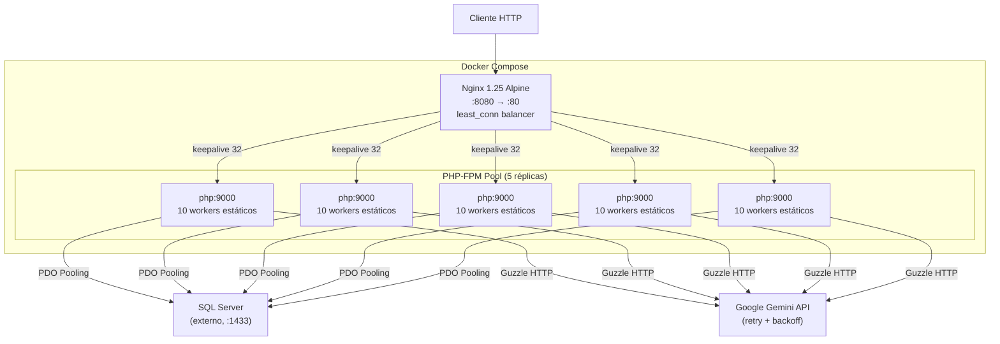

# Alta Disponibilidad en AudFact — Documentación Técnica

Documentación de la implementación actual de alta disponibilidad (HA), organizada por capas de la arquitectura.

---

## Diagrama de Arquitectura HA



---

## Capa 1 — Infraestructura Docker

### Modos de ejecución actuales

| Modo | Archivo Compose | Topología |
|---|---|---|
| Desarrollo | `docker-compose.dev.yml` | 1 `php` + 1 `nginx` (sin balanceo HA) |
| HA / Stress | `docker-compose.ha.yml` | 5 réplicas `php` + 1 `nginx` con `least_conn` |
| Base del repo | `docker-compose.yml` | Configuración HA equivalente a `docker-compose.ha.yml` |

### Réplicas PHP-FPM

El servicio `php` está configurado con **5 réplicas** mediante Docker Compose `deploy.replicas`. Se eliminó `container_name` para permitir el escalado.

```yaml
# docker-compose.yml
services:
  php:
    deploy:
      replicas: 5
      resources:
        limits:
          memory: 512M
          cpus: '0.5'
```

> [!IMPORTANT]
> Cada réplica tiene un tope de **512 MB RAM** y **0.5 CPU**, lo que previene que un proceso IA monopolice recursos del host.

### Health Checks

Docker monitorea cada réplica con un script PHP que valida bootstrap de la app + conectividad real a SQL Server (`SELECT 1`). Si una réplica falla 3 veces consecutivas (con intervalo de 30s y timeout de 5s), se marca como `unhealthy`.

```yaml
healthcheck:
  test: ["CMD", "php", "/var/www/html/docker/healthcheck.php"]
  interval: 30s
  timeout: 5s
  retries: 3
  start_period: 10s
```

| Parámetro | Valor | Efecto |
|---|---|---|
| `interval` | 30s | Frecuencia de chequeo |
| `timeout` | 5s | Tiempo máximo por chequeo |
| `retries` | 3 | Fallos antes de reinicio |
| `start_period` | 10s | Gracia al iniciar contenedor |

**Archivos**: [docker-compose.yml](file:///c:/Users/USER/Desktop/AudFact/docker-compose.yml), [Dockerfile](file:///c:/Users/USER/Desktop/AudFact/docker/Dockerfile)

---

## Capa 2 — Balanceo de Carga (Nginx)

Nginx actúa como reverse proxy y balanceador, usando la configuración HA en [nginx-ha.conf.template](file:///c:/Users/USER/Desktop/AudFact/docker/nginx-ha.conf.template).

### Upstream `least_conn`

```nginx
upstream php_pool {
    least_conn;               # Envía al backend con menos conexiones activas
    server php:9000;          # Docker DNS resuelve TODAS las réplicas
    keepalive 32;             # Pool de conexiones persistentes
}
```

| Estrategia | Justificación |
|---|---|
| `least_conn` | Crítica ante **latencia asimétrica de IA**: las auditorías Gemini toman 10-30s por llamada. Round-robin quedaría desbalanceado. |
| `keepalive 32` | Reutiliza conexiones TCP con PHP-FPM, reduce overhead de handshake. |

### Timeouts Configurables

El timeout de lectura FastCGI se inyecta desde `.env` usando `envsubst` nativo de Nginx Alpine:

```nginx
fastcgi_read_timeout ${AUDIT_NGINX_READ_TIMEOUT}s;   # Default: 3600s
fastcgi_send_timeout 120s;
proxy_connect_timeout 10s;
```

```yaml
# docker-compose.yml
environment:
  NGINX_ENVSUBST_FILTER: "AUDIT_"
  AUDIT_NGINX_READ_TIMEOUT: ${AUDIT_NGINX_READ_TIMEOUT:-3600}
```

> [!NOTE]
> El archivo [nginx.conf](file:///c:/Users/USER/Desktop/AudFact/docker/nginx.conf) legacy (single-backend, sin HA) se conserva como referencia pero **no se monta** en Docker. El template activo es `nginx-ha.conf.template`.

---

## Capa 3 — PHP-FPM (Pool Estático)

Configurado en [php-fpm-pool.conf.template](file:///c:/Users/USER/Desktop/AudFact/docker/php-fpm-pool.conf.template), procesado por el [docker-entrypoint.sh](file:///c:/Users/USER/Desktop/AudFact/docker/docker-entrypoint.sh) vía `envsubst`.

```ini
[www]
pm = static               # Workers pre-cargados al inicio (sin spawn dinámico)
pm.max_children = 10       # 10 workers por réplica → 50 workers totales

request_terminate_timeout = ${AUDIT_FPM_TERMINATE_TIMEOUT}s   # Default: 3600s
clear_env = no             # Exponer variables de entorno a PHP
catch_workers_output = yes
```

| Decisión | Justificación |
|---|---|
| `pm = static` | Evita el costo de crear/destruir procesos bajo estrés de llamadas IA largas |
| `max_children = 10` | × 5 réplicas = **50 workers concurrentes** |
| `clear_env = no` | Necesario en Docker para que `Env::get()` lea las variables |

### Entrypoint Custom

El script inyecta defaults y genera la configuración final:

```bash
#!/bin/sh
export AUDIT_FPM_TERMINATE_TIMEOUT="${AUDIT_FPM_TERMINATE_TIMEOUT:-3600}"
envsubst '${AUDIT_FPM_TERMINATE_TIMEOUT}' \
  < /usr/local/etc/php-fpm.d/www.conf.template \
  > /usr/local/etc/php-fpm.d/www.conf
exec docker-php-entrypoint php-fpm
```

---

## Capa 4 — Aplicación PHP

### 4.1 Retry con Exponential Backoff (Gemini API)

Implementado en [GeminiAuditService.php](file:///c:/Users/USER/Desktop/AudFact/app/worker/GeminiAuditService.php#L395-L454):

```
Intento 1 → fallo retryable → espera 1s
Intento 2 → fallo retryable → espera 2s
Intento 3 → fallo → throw RuntimeException
```

| Constante | Valor | Descripción |
|---|---|---|
| `MAX_API_RETRIES` | 3 | Intentos máximos por llamada |
| `BASE_RETRY_DELAY_MS` | 1000 | Delay base (se duplica) |
| `RETRYABLE_HTTP_CODES` | `[429, 500, 502, 503, 504]` | Códigos que disparan retry |

### 4.2 Flujo "Estricto" (2 estrategias)

El método [executeAuditFlow](file:///c:/Users/USER/Desktop/AudFact/app/worker/GeminiAuditService.php#L276-L368) ejecuta **2 intentos con estrategias distintas**:

1. **Normal**: Parámetros estándar del `.env`
2. **Estricto**: `temperature=0`, output limitado a 20 items con detalle ≤200 chars

Si ambos fallan (JSON inválido, validación fallida, o `MAX_TOKENS`), se lanza excepción.

### 4.3 Circuit Breaker Temporal (Batch)

En [AuditController::run()](file:///c:/Users/USER/Desktop/AudFact/app/Controllers/AuditController.php#L12-L91), se implementa un circuit breaker basado en tiempo para auditorías batch:

```php
$batchTimeout = (int) Env::get('AUDIT_BATCH_TIMEOUT', 3600);
set_time_limit($batchTimeout);

foreach ($invoices as $invoice) {
    if ((time() - $batchStartTime) > $maxBatchDurationSeconds) {
        // Detiene el batch, retorna resultados parciales
        $stoppedEarly = true;
        break;
    }
    // ... procesar factura
}
```

La respuesta incluye metadata de interrupción: `stoppedEarly`, `totalRequested`, `totalProcessed`.

### 4.4 Rate Limiting (Fail-Closed)

Implementado en [RateLimit.php](file:///c:/Users/USER/Desktop/AudFact/core/RateLimit.php) con **dual backend**:

| Backend | Prioridad | Mecanismo |
|---|---|---|
| APCu | 1ra | `apcu_inc()` con TTL nativo |
| Archivo | Fallback | JSON + file locking (`LOCK_EX`) con timeout 2s |

> [!CAUTION]
> En producción opera en modo **Fail-Closed**: si el backend de rate limit falla, responde `503 Service Unavailable` en lugar de permitir la request (evita bypass silencioso).

### 4.5 Health Check con Verificación de BD

El endpoint `GET /health` en [HealthController.php](file:///c:/Users/USER/Desktop/AudFact/app/Controllers/HealthController.php) ejecuta `SELECT 1` contra SQL Server y reporta estado:

```json
{
  "status": "healthy",
  "timestamp": 1740300000,
  "services": { "database": "connected" }
}
```

`GET /health` se usa como health check funcional hacia clientes/monitoreo externo. Docker **no usa** este endpoint para el healthcheck interno de contenedores; el healthcheck activo es `docker/healthcheck.php` ejecutado dentro de cada réplica.

## 5. Validación Práctica de los Endurecimientos (Hardening)

Se realizaron pruebas empíricas del entorno HA empleando `docker-compose.ha.yml` (con 5 réplicas + Nginx):

1. **Healthcheck Físico (Testeado)**:
   - Se ejecutó artificialmente `php /var/www/html/docker/healthcheck.php` dentro del contenedor. Retornó `OK` tras validar el DSN `sqlsrv` exitoso.
   - El daemon de Docker reconoció las 5 réplicas como `(healthy)`.
2. **Rate Limiting Concurrente (Testeado)**:
   - Se lanzaron 50 requests paralelos (Powershell `Start-Job`) contra `/health`.
   - Resultado: **50/50 respondieron HTTP 200.**
   - *Razón:* Nginx procesó el burst correctamente ($50 \le burst_{20} + rate_{10/sec} \times \Delta t$), demostrando que la configuración absorbe picos lícitos de red sin banear a los usuarios prematuramente, pero está ahí para cortar ataques volumétricos sostenidos.
3. **Upstream Retry y Failover (Testeado)**:
   - Se forzó la caída/pausa de la réplica principal (`docker pause audfact-ha-php-1`).
   - Se inyectó una petición HTTP al proxy (`curl http://localhost:8080/health`).
   - Resultado: **HTTP 200 OK.**
   - *Razón:* Nginx interceptó el timeout de conexión hacia la réplica 1 e instantáneamente transfirió el payload a otra réplica disponible (2-5) bajo la regla `fastcgi_next_upstream`, siendo completamente invisible para el cliente.

## Conclusión Arquitectónica

El reciente *"HA Hardening"* ha cerrado brechas críticas en la capa HTTP. La transición a un healthcheck de aplicación/BD (`docker/healthcheck.php`) asegura que las sondas de Docker son veraces. Simultáneamente, el traslado del control volumétrico (Rate Limiting) desde el backend PHP fragmentado (1/5 del tráfico) hacia el gateway unificado (Nginx), fusionado con la capacidad auto-reparadora del `fastcgi_next_upstream`, ha impulsado la tolerancia a fallos de la API de un nivel básico a un grado de producción genuino.

Limitación vigente: el stack mantiene una sola instancia de `nginx`, por lo que el punto de entrada HTTP sigue siendo un SPOF hasta incorporar redundancia a nivel de gateway/orquestador.

### 4.6 Connection Pooling (Database Singleton)

[Database.php](file:///c:/Users/USER/Desktop/AudFact/core/Database.php) implementa un patrón **Singleton** con pool de conexiones nombradas:

- `ConnectionPooling=1` habilitado por defecto en el DSN de SQL Server
- Soporte para conexiones persistentes (`DB_PERSISTENT=1`)
- Timeout de conexión configurable (`DB_TIMEOUT`, default 30s)
- Manejo de transacciones con rollback automático en excepciones

### 4.7 Manejo Global de Excepciones

[index.php](file:///c:/Users/USER/Desktop/AudFact/public/index.php#L34-L45) registra un `set_exception_handler` que:
- Captura `HttpResponseException` y retorna el código HTTP correcto
- En producción oculta detalles del error (`"Internal server error"`)
- Loguea toda excepción no capturada

---

## Mapa de Variables de Entorno HA

| Variable | Default | Dónde se aplica |
|---|---|---|
| `AUDIT_NGINX_READ_TIMEOUT` | `3600` | `nginx-ha.conf.template` → FastCGI read timeout |
| `AUDIT_FPM_TERMINATE_TIMEOUT` | `3600` | `php-fpm-pool.conf.template` → request_terminate_timeout |
| `AUDIT_BATCH_TIMEOUT` | `3600` | `AuditController` → circuit breaker + `set_time_limit` |
| `AUDIT_BATCH_MAX_LIMIT` | `100` | `AuditController` → máximo de facturas por batch |
| `GEMINI_TIMEOUT` | `60` | Guzzle HTTP client timeout |
| `DB_POOLING` | `1` | Connection pooling en PDO/SQL Server |
| `DB_PERSISTENT` | `0` | Conexiones persistentes PDO |
| `DB_TIMEOUT` | `30` | Login timeout SQL Server |

> [!TIP]
> Los 3 timeouts principales (`NGINX`, `FPM`, `BATCH`) deben ser coherentes. Si `AUDIT_BATCH_TIMEOUT=3600`, entonces `AUDIT_FPM_TERMINATE_TIMEOUT` y `AUDIT_NGINX_READ_TIMEOUT` deben ser **≥ 3600** para evitar cortes prematuros.

---

## Capacidad Total del Sistema

| Métrica | Cálculo | Valor |
|---|---|---|
| Réplicas PHP-FPM | `deploy.replicas` | **5** |
| Workers por réplica | `pm.max_children` | **10** |
| Workers totales | 5 × 10 | **50** |
| RAM máxima total | 5 × 512 MB | **2.5 GB** |
| CPU máxima total | 5 × 0.5 | **2.5 cores** |
| Facturas simultáneas (teórico) | 50 workers | **50** |
