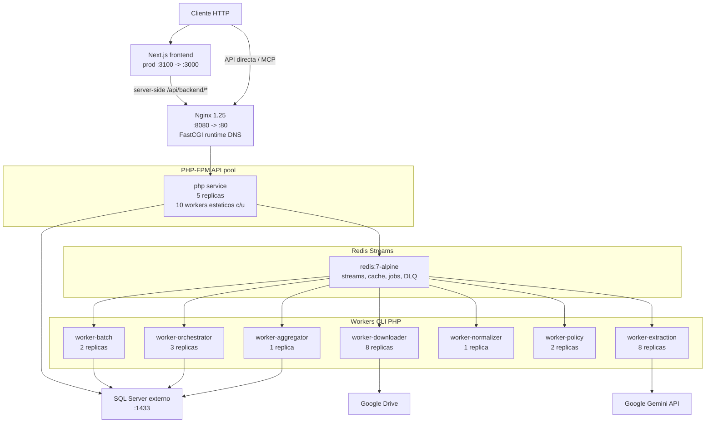

# Alta Disponibilidad en AudFact - Documentacion Tecnica

Esta pagina describe la topologia vigente del repositorio. Los archivos Compose
existentes son `docker-compose.yml` (build local/base) y
`docker-compose.prod.yml` (imagenes GHCR para produccion LAN).

---

## Arquitectura HA Actual


```mermaid
graph TB
    Client["Cliente HTTP"]
    Front["Next.js frontend<br/>prod :3100 -> :3000"]
    Nginx["Nginx 1.25<br/>:8080 -> :80<br/>FastCGI runtime DNS"]

    subgraph PHPPool["PHP-FPM API pool"]
        PHP["php service<br/>5 replicas<br/>10 workers estaticos c/u"]
    end

    subgraph RedisLayer["Redis Streams"]
        Redis["redis:7-alpine<br/>streams, cache, jobs, DLQ"]
    end

    subgraph Workers["Workers CLI PHP"]
        Batch["worker-batch<br/>2 replicas"]
        Orchestrator["worker-orchestrator<br/>3 replicas"]
        Downloader["worker-downloader<br/>8 replicas"]
        Extraction["worker-extraction<br/>8 replicas"]
        Normalizer["worker-normalizer<br/>1 replica"]
        Policy["worker-policy<br/>2 replicas"]
        Aggregator["worker-aggregator<br/>1 replica"]
    end

    SQLSRV["SQL Server externo<br/>:1433"]
    Gemini["Google Gemini API"]
    Drive["Google Drive"]

    Client --> Front
    Front -->|"server-side /api/backend/*"| Nginx
    Client -->|"API directa / MCP"| Nginx
    Nginx --> PHP
    PHP --> SQLSRV
    PHP --> Redis
    Redis --> Batch
    Redis --> Orchestrator
    Redis --> Downloader
    Redis --> Extraction
    Redis --> Normalizer
    Redis --> Policy
    Redis --> Aggregator
    Batch --> SQLSRV
    Orchestrator --> SQLSRV
    Downloader --> Drive
    Extraction --> Gemini
    Aggregator --> SQLSRV
```

---

## Capa 1 - Compose y Replicas

| Archivo | Uso actual | Observacion |
|---|---|---|
| `docker-compose.yml` | Build local/base | Incluye `php`, `redis`, `nginx` y los 7 servicios de worker, incluido `worker-downloader`. |
| `docker-compose.prod.yml` | Produccion LAN | Usa imagenes GHCR, publica el frontend y levanta los 7 servicios de worker. |

### PHP-FPM

El servicio `php` elimina `container_name` para permitir escalado y define 5
replicas:

```yaml
services:
  php:
    deploy:
      replicas: 5
      resources:
        limits:
          memory: 512M
          cpus: "0.5"
```

Cada replica carga `docker/php-fpm-pool.conf.template` con `pm = static` y
`pm.max_children = 10`, por lo que la capacidad teorica de la API es de 50
procesos PHP-FPM.

### Workers Async

El pipeline usa un launcher unico: `php bin/audit-worker.php <worker>`.

| Servicio | Worker | Default |
|---|---|---:|
| `worker-batch` | `BatchRequestedWorker` | `AUDIT_WORKER_BATCH_REPLICAS=2` |
| `worker-orchestrator` | `DocumentAuditOrchestrator` | `3` |
| `worker-downloader` | `AttachmentDownloadWorker` | `AUDIT_WORKER_DOWNLOADER_REPLICAS=8` |
| `worker-extraction` | `DocumentExtractionWorker` | `8` |
| `worker-normalizer` | `DocumentNormalizer` | `1` |
| `worker-policy` | `RulesEvaluationWorker` | `2` |
| `worker-aggregator` | `AuditAggregationWorker` | `1` |

Los nombres de consumer incluyen rol + hostname + PID para que Redis refleje
replicas reales y para que `XAUTOCLAIM` pueda recuperar mensajes `pending`
abandonados.

---

## Capa 2 - Nginx

Nginx enruta FastCGI a `php:9000` usando DNS Docker en runtime. Esto evita que
mantenga IPs obsoletas cuando se recrean replicas PHP-FPM.

```nginx
resolver 127.0.0.11 valid=10s ipv6=off;
set $php_upstream php:9000;
fastcgi_pass $php_upstream;
fastcgi_read_timeout ${AUDIT_NGINX_READ_TIMEOUT}s;
```

`AUDIT_NGINX_READ_TIMEOUT` se inyecta via `envsubst` con
`NGINX_ENVSUBST_FILTER=AUDIT_`.

---

## Capa 3 - Health Checks

Docker ejecuta un healthcheck interno dentro de las replicas PHP:

```yaml
healthcheck:
  test: ["CMD", "php", "/usr/local/bin/audfact-healthcheck.php"]
  interval: 30s
  timeout: 5s
  retries: 3
  start_period: 10s
```

El script `docker/healthcheck.php` se copia en la imagen como
`/usr/local/bin/audfact-healthcheck.php` y valida bootstrap + conectividad SQL.
El endpoint público `GET /health` sigue existiendo para monitoreo externo.

---

## Capa 4 - Redis Streams y Recuperacion

Redis almacena:

- streams `audit.batch.inbox`, `audit.inbox`, `audit.documents`, `audit.results`
  y `audit.dlq`;
- estado por auditoria `audit:{id}:*`;
- estado de jobs `job:{id}:*`;
- reservas idempotentes por `DisId`;
- cache de extracciones y homologaciones.

Variables operativas:

| Variable | Default | Uso |
|---|---:|---|
| `AUDIT_STREAM_BLOCK_MS` | `5000` | Bloqueo de `XREADGROUP` |
| `AUDIT_EVENT_MAX_RETRIES` | `3` | Intentos antes de DLQ |
| `AUDIT_PENDING_RECLAIM_IDLE_MS` | `600000` | Idle minimo para reclamar pending |
| `AUDIT_PENDING_RECLAIM_INTERVAL_MS` | `30000` | Frecuencia de escaneo pending |
| `AUDIT_DLQ_STREAM` | `audit.dlq` | Stream de dead letters |

No reducir `AUDIT_PENDING_RECLAIM_IDLE_MS` por debajo del peor caso Gemini:
puede duplicar trabajo legítimo en curso.

---

## Capa 5 - Controles de Aplicacion

| Control | Implementacion vigente |
|---|---|
| Rate limiting | `Core\RateLimit`: APCu con fallback a archivos; en produccion falla cerrado si no puede registrar consumo. |
| Timeouts FPM | `AUDIT_FPM_TERMINATE_TIMEOUT` en `php-fpm-pool.conf.template`. |
| Gemini retry/backoff | `GeminiGateway` con reintentos para 429/5xx y `GeminiCircuitBreaker`. |
| Integridad documental | `DocumentIntegrityValidator` rechaza adjuntos vacios, corruptos o con MIME inconsistente antes de Gemini. |
| DLQ | `AuditEventConsumer` publica `dead_letter` tras agotar reintentos. |

`AUDIT_BATCH_TIMEOUT` permanece en `.env.example` por compatibilidad, pero el
flujo actual de lote es 202 asincrono: `AuditController::async` publica
`batch_requested` y el trabajo pesado ocurre en `BatchRequestedWorker`.

---

## Diagnostico Rapido

```bash
# Estado de servicios base
wsl docker compose ps
wsl docker compose top worker-batch worker-orchestrator worker-extraction worker-policy

# Redis consumer groups
wsl docker compose exec redis redis-cli -a "$REDIS_PASSWORD" XINFO GROUPS audfact:audit.batch.inbox
wsl docker compose exec redis redis-cli -a "$REDIS_PASSWORD" XINFO GROUPS audfact:audit.inbox
wsl docker compose exec redis redis-cli -a "$REDIS_PASSWORD" XINFO GROUPS audfact:audit.documents

# Health externo
curl -sf http://localhost:8080/health
curl -sf http://localhost:${AUDFACT_FRONTEND_HOST_PORT:-3100}/api/health
```

Estrategia de escalado: subir primero `worker-extraction` si la espera crece en
`audit.documents` y Gemini no responde con 429/503. Subir `worker-orchestrator`
si se acumula `audit.inbox`. Subir `worker-policy` solo si el cuello aparece
despues de la normalizacion.

---

## Capacidad Teorica

| Metrica | Calculo | Valor |
|---|---|---:|
| Replicas PHP-FPM | `deploy.replicas` | 5 |
| Workers PHP por replica | `pm.max_children` | 10 |
| Procesos PHP-FPM totales | 5 x 10 | 50 |
| RAM maxima API | 5 x 512 MB | 2.5 GB |
| CPU maxima API | 5 x 0.5 | 2.5 cores |
| Extractores Gemini base | `AUDIT_WORKER_EXTRACTION_REPLICAS` | 8 |

Limitacion vigente: el stack conserva una sola instancia de Nginx y una sola
instancia Redis standalone, por lo que la redundancia de gateway/cola depende de
la capa de orquestacion externa futura.
