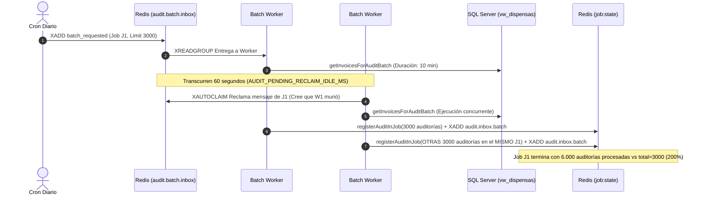

# SDD: Idempotencia y Protección Concurrente en Generación de Lotes Batch (BatchRequestedWorker)

## FASE 0 — Triage y Clasificación del Cambio

| Dimensión | Valor | Justificación |
| :--- | :--- | :--- |
| **Tipo** | Bugfix / Refactor de Concurrencia | Corrige duplicación de auditorías por reclamo concurrente (`xAutoClaim`) en lotes masivos. |
| **Riesgo** | Alto | Afecta el encolamiento masivo de facturas (`POST /audit/async`, crons diarios) y la consistencia de métricas de jobs batch en Redis. |
| **Persistencia afectada** | No | No modifica esquemas SQL; solo afecta llaves y locks en Redis (`job:*:state`, `batch:claim:*`). |
| **Contrato externo afectado** | No | Los endpoints REST (`POST /audit/async`, `GET /audit/jobs`, `GET /audit/jobs/{jobId}`) mantienen su contrato JSON intacto. |
| **Cambio arquitectónico** | Sí | Introduce lock atómico distribuido de generación por `job_id` y desacopla el timeout de reclaim de batch (30 min) del de documentos (60 s). |
| **Producción afectada** | Sí | Aplica directamente al runtime de producción para estabilizar lotes nocturnos de 3.000 a 5.000 facturas. |
| **Nivel de Rigor** | **Nivel A (Determinista Exhaustivo)** | Clasificación de aserciones `[CONFIRMADO]`, `[INFERIDO]`, `[DESCONOCIDO]` y matrices de riesgo completas. |

---

## FASE 1 — Análisis y Diagnóstico de Causa Raíz

### 1.1 El Problema Raíz [CONFIRMADO]
En auditorías de lotes masivos (lotes de 3.000 facturas en clientes con millones de registros como NUEVA EPS `2624`):
1. `BatchRequestedWorker` consume el evento `batch_requested` de `audit.batch.inbox`.
2. La consulta SQL `InvoicesModel::getInvoicesForAuditBatch()` y la creación de 3.000 reservas toma **entre 8 y 15 minutos**.
3. El mensaje permanece en el PEL (*Pending Entries List*) de Redis Streams sin `XACK` mientras el worker está ejecutando.
4. `AuditEventConsumer` aplica un umbral global de `$pendingReclaimIdleMs = 60000` (60 segundos).
5. A los 60 segundos, la segunda réplica (`audfact-worker-batch-2`) ejecuta `xAutoClaim`, asume que el primer worker murió y **reclama el mismo mensaje**.
6. Ambas réplicas ejecutan `AuditBatchOrchestrator::enqueueBatch()` para el **mismo `job_id`** sin exclusión mutua.
7. Se registran 6.000 a 9.000 auditorías dentro del arreglo `job['audits']` del mismo job en Redis.
8. Cuando se completa el procesamiento de todas las facturas, `job['done']` llega a ~6.000, pero `job['total']` se selló en 3.000, resultando en un progreso visible del **200%**.



---

### 1.2 Alternativas Evaluadas [CONFIRMADO]

| Alternativa | Ventajas | Desventajas | Decisión |
| :--- | :--- | :--- | :---: |
| **A. Reducir la réplica de `worker-batch` a 1** | Evita concurrencia entre workers batch. | Elimina alta disponibilidad si el worker falla legítimamente; no protege contra reclaims del mismo worker post-reinicio. | ❌ Descartada |
| **B. Aumentar solo el timeout global de `AUDIT_PENDING_RECLAIM_IDLE_MS`** | Un solo cambio de variable env. | Perjudica a los 26 workers de documentos (downloader, extraction, policy), que tardarían 30 min en recuperar mensajes colgados. | ❌ Descartada |
| **C. Lock Distribuido Atómico por `job_id` + Timeout Especializado para Batch + Guarda de Job Sellado** | Garantía matemática de exclusión mutua; mantiene workers rápidos en 60s y batch en 30 min; cero código muerto. | Requiere extender `BatchJobStore` y `BatchRequestedWorker`. | ✅ **Seleccionada** |

---

## FASE 2 — Especificación de Implementación

### 2.1 Perímetro de Impacto de Archivos [CONFIRMADO]

| Archivo | Rol en el Cambio |
| :--- | :--- |
| [`app/Services/Audit/Pipeline/BatchJobStore.php`](file:///c:/Users/USER/Desktop/AudFact/app/Services/Audit/Pipeline/BatchJobStore.php) | **Modificar**: Añadir métodos atómicos `claimJobGenerationLock()` y `releaseJobGenerationLock()`. |
| [`app/Services/Audit/AuditBatchOrchestrator.php`](file:///c:/Users/USER/Desktop/AudFact/app/Services/Audit/AuditBatchOrchestrator.php) | **Modificar**: Adquirir lock distribuido antes de generar facturas y verificar si el job ya fue sellado / poblado. |
| [`app/Services/Audit/Pipeline/BatchRequestedWorker.php`](file:///c:/Users/USER/Desktop/AudFact/app/Services/Audit/Pipeline/BatchRequestedWorker.php) | **Modificar**: Sobreescribir `$pendingReclaimIdleMs = 1800000` (30 min) y manejar el descarte limpio si el lock está ocupado. |
| [`tests/Services/Audit/AuditBatchOrchestratorTest.php`](file:///c:/Users/USER/Desktop/AudFact/tests/Services/Audit/AuditBatchOrchestratorTest.php) | **Modificar**: Añadir pruebas unitarias para descarte de generación concurrente y jobs previamente sellados. |
| [`tests/Services/Audit/Events/BatchRequestedWorkerTest.php`](file:///c:/Users/USER/Desktop/AudFact/tests/Services/Audit/Events/BatchRequestedWorkerTest.php) | **Nuevo / Modificar**: Validar que el worker use timeout de reclaim de 30 minutos y libere locks en fallo. |

---

### 2.2 Diseño Detallado de Componentes

#### 1. Lock Distribuido en `BatchJobStore.php`
```php
/**
 * Intenta adquirir el lock atómico para la generación de un lote batch.
 *
 * @param  string  $jobId  UUID del job batch.
 * @param  string  $workerId Identificador del worker solicitante.
 * @param  int     $ttlSeconds Tiempo de vida del lock (default 1800s = 30 min).
 * @return bool    true si adquirió el lock; false si otro worker ya lo tiene.
 */
public function claimJobGenerationLock(string $jobId, string $workerId, int $ttlSeconds = 1800): bool
{
    $key = "batch:claim:{$jobId}";
    return $this->redis->setnx($key, $workerId, max(60, $ttlSeconds));
}

/**
 * Libera el lock de generación de lote batch si el token coincide.
 */
public function releaseJobGenerationLock(string $jobId, string $workerId): bool
{
    $key = "batch:claim:{$jobId}";
    $script = <<<'LUA'
local current = redis.call('GET', KEYS[1])
if current == ARGV[1] then
    redis.call('DEL', KEYS[1])
    return 1
end
return 0
LUA;
    return (bool) $this->redis->eval($script, [$key], [$workerId]);
}
```

---

#### 2. Guarda de Idempotencia en `AuditBatchOrchestrator.php`
Al iniciar `enqueueBatch()`:
```php
public function enqueueBatch(int $facNitSec, string $dateFrom, string $dateTo, int $limit, ?string $jobId = null, string $workerToken = ''): array
{
    $externalJobId = $jobId !== null;
    $jobId = $jobId ?? AuditEvent::uuidV4();
    $workerToken = $workerToken !== '' ? $workerToken : AuditEvent::uuidV4();

    // 1. Verificar si el job ya existe en Redis
    if ($externalJobId) {
        $existing = $this->jobStore->getJob($jobId);
        if ($existing === null) {
            throw new RuntimeException("Job externo {$jobId} no encontrado en Redis", 503);
        }

        // Si el job ya fue sellado o ya tiene auditorías generadas, abortar generación duplicada
        if (($existing['sealed'] ?? false) === true || count($existing['audits'] ?? []) > 0) {
            Logger::warning('AuditBatchOrchestrator: Job ya inicializado o sellado previamente; se omite re-generación', [
                'job_id' => $jobId,
                'sealed' => $existing['sealed'] ?? false,
                'audits_count' => count($existing['audits'] ?? []),
            ]);
            return $this->buildBatchResponse(
                $jobId,
                (string) ($existing['status'] ?? BatchJobStore::JOB_STATUS_PROCESSING),
                (int) ($existing['total'] ?? count($existing['audits'] ?? [])),
                (int) ($existing['skipped_locked'] ?? 0),
                (int) ($existing['skipped_existing'] ?? 0)
            );
        }
    }

    // 2. Adquirir lock atómico de generación para evitar que dos workers lo procesen
    if (!$this->jobStore->claimJobGenerationLock($jobId, $workerToken, 1800)) {
        Logger::warning('AuditBatchOrchestrator: Generación de batch en curso por otro worker; se omite concurrencia', [
            'job_id' => $jobId,
            'worker_token' => $workerToken,
        ]);
        $currentJob = $this->jobStore->getJob($jobId);
        return $this->buildBatchResponse(
            $jobId,
            (string) ($currentJob['status'] ?? BatchJobStore::JOB_STATUS_PENDING),
            (int) ($currentJob['total'] ?? 0),
            0,
            0
        );
    }

    try {
        // ... Ejecución normal de la consulta SQL y encolamiento ...
    } finally {
        $this->jobStore->releaseJobGenerationLock($jobId, $workerToken);
    }
}
```

---

#### 3. Configuración Especializada en `BatchRequestedWorker.php`
```php
final class BatchRequestedWorker extends AuditEventConsumer
{
    public function __construct(
        RedisClient $redis,
        AuditEventPublisher $publisher,
        AuditStateStore $stateStore,
        BatchJobStore $jobStore,
        string $consumerName = 'batch-worker-1'
    ) {
        parent::__construct($redis, $publisher, $stateStore, $jobStore, $consumerName);
        
        // Timeout de inactividad de 30 minutos (1.800.000 ms) exclusivo para consultas batch masivas
        $this->pendingReclaimIdleMs = (int) Env::get('AUDIT_BATCH_PENDING_RECLAIM_IDLE_MS', 1800000);
        $this->pendingReclaimIntervalMs = (int) Env::get('AUDIT_BATCH_PENDING_RECLAIM_INTERVAL_MS', 60000);
    }
}
```

---

## FASE 3 — Plan de Pruebas y Criterios de Aceptación

### 3.1 Pruebas Automatizadas (PHPUnit 10+)
1. **`testEnqueueBatchRejectsDuplicateExecutionWhenLocked`**:
   - Simular adquisición de lock previa por Worker A.
   - Ejecutar `enqueueBatch` con Worker B para el mismo `jobId`.
   - Verificar que no se invoque `getInvoicesForAuditBatch()` y no se registren nuevas auditorías.
2. **`testEnqueueBatchReturnsExistingStateIfJobAlreadySealed`**:
   - Inicializar y sellar un job con 10 auditorías.
   - Invocar `enqueueBatch` con el mismo `jobId`.
   - Asertar retorno inmediato con total=10 y 0 eventos publicados.
3. **`testBatchRequestedWorkerCustomReclaimTimeout`**:
   - Instanciar `BatchRequestedWorker` y verificar que `$this->pendingReclaimIdleMs === 1800000`.

### 3.2 Criterios de Aceptación
- **Cero Duplicidad**: Un lote de 3.000 facturas genera exactamente $\le 3.000$ auditorías registradas en Redis.
- **Progreso Acotado**: El cálculo `done / total` nunca excede el 100% en ningún job (`completed` o `completed_with_errors`).
- **Resiliencia ante Caídas**: Si un worker muere legítimamente tras 30 minutos, el lock expira y permite la recuperación.
- **Suite PHPUnit**: 100% de tests pasando (`488/488+`).

---

## FASE 4 — Matriz de Trazabilidad y Riesgo

| ID | Riesgo | Probabilidad | Impacto | Mitigación |
| :--- | :--- | :---: | :---: | :--- |
| **R1** | Worker crashea a mitad de consulta SQL y retiene el lock. | Baja | Media | El lock tiene TTL forzoso de 1.800s (30 min) vía `SETNX ... EX`. |
| **R2** | Dos workers reclaman la misma dispensa `DisId`. | Media | Baja | Ya protegido por `claimAuditReservation(disId)` (SETNX). |
| **R3** | Degradación de memoria por llaves `batch:claim:*`. | Muy Baja | Muy Baja | Llave temporal con TTL explícito y borrado en `finally`. |

---

## FASE 5 — Plan de Rollback

1. **Reversibilidad**: Si el cambio presenta anomalías, no hay alteraciones en tablas SQL ni en los streams de datos de documentos.
2. **Procedimiento**: Revertir las clases PHP modificadas a través de git o desplegar la imagen previa de GHCR (`ghcr.io/jfrem/audfact-php:47351852b9005f98f1d5ea200c25926c3e2d2b46`) en menos de 2 minutos vía GitHub Actions.
