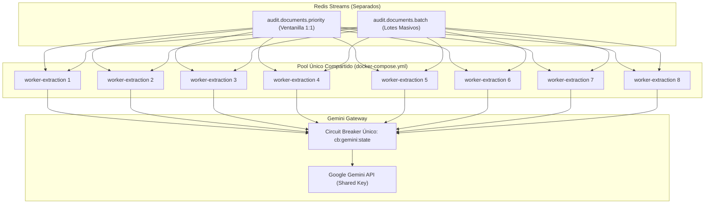
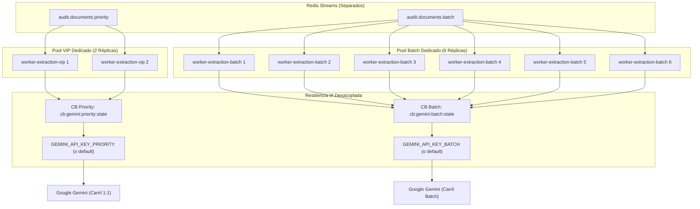

# SDD-SPEC: Aislamiento Físico de Worker Pools y Desacoplamiento de Resiliencia IA (Fase 2)

- **Fecha**: 2026-09-07
- **Autor**: Antigravity AI & Arquitectura AudFact
- **Estado**: PROPUESTA TÉCNICA
- **Nivel de Completitud**: Nivel A — Implementable
- **Tipo de Cambio**: Refactorización Arquitectónica, Infraestructura y Resiliencia
- **Políticas Aplicadas**: `/write-sdd-spec`, `/clean-rebuild-policy`
- **Archivo Fuente**: [`plans/sdd-fase-2-aislamiento-carril-vip.md`](file:///c:/Users/USER/Desktop/AudFact/plans/sdd-fase-2-aislamiento-carril-vip.md)

---

## Clasificación del Cambio (Triage)

| Dimensión | Valor | Justificación / Evidencia |
| :--- | :---: | :--- |
| **Tipo** | Arquitectura / Infraestructura / Resiliencia | Particionamiento físico de pools de workers de extracción y desacoplamiento de Circuit Breaker por carril de prioridad. |
| **Riesgo** | Alto | Modifica el runtime de workers en Docker Compose, el launcher CLI `audit-worker.php` y el gateway de llamadas a la IA en producción. |
| **Persistencia afectada** | No | `[CONFIRMADO]` Las tablas `AudDispEst` y `AdjuntosDispensacionDetalle` en SQL Server conservan intactos sus esquemas y procedimientos. |
| **Contrato externo afectado** | No | `[CONFIRMADO]` Los endpoints REST `POST /audit/single`, `POST /audit/async` y los schemas de Google Gemini API conservan sus contratos intactos. |
| **Cambio arquitectónico** | Sí | `[CONFIRMADO]` Aislamiento físico de réplicas de cómputo en Docker y segregación de claves de Circuit Breaker en Redis Streams. |
| **Producción afectada** | Sí | `[CONFIRMADO]` Afecta los servicios `worker-extraction` en `docker-compose.yml`, flags de CLI y variables de entorno en producción LAN. |
| **Requiere 0.3.1 (abstracciones dinámicas)** | No | `[CONFIRMADO]` No se reemplazan mapeos estáticos de base de datos por abstracciones polimórficas de negocio. |

---

## FASE 0 — Descubrimiento Empírico Obligatorio

### 0.1 Perímetro de Impacto

| Archivo | Ruta | Categoría | Propósito | Líneas Afectadas | Verificado por Lectura |
| :--- | :--- | :---: | :--- | :---: | :---: |
| `bin/audit-worker.php` | [`bin/audit-worker.php`](file:///c:/Users/USER/Desktop/AudFact/bin/audit-worker.php) | `MODIFIED` | Launcher CLI de workers. Debe parsear banderas de carril (`--priority-only`, `--batch-only`, `--lane=...`). | L46-L75 | `[CONFIRMADO]` Sí |
| `AuditEventConsumer.php` | [`app/Services/Audit/Pipeline/AuditEventConsumer.php`](file:///c:/Users/USER/Desktop/AudFact/app/Services/Audit/Pipeline/AuditEventConsumer.php) | `MODIFIED` | Clase base de workers. Soporta filtrado de streams activos (`activeStreams()`) según carril configurado. | L15-L100, L208-L220 | `[CONFIRMADO]` Sí |
| `DocumentExtractionWorker.php` | [`app/Services/Audit/Pipeline/DocumentExtractionWorker.php`](file:///c:/Users/USER/Desktop/AudFact/app/Services/Audit/Pipeline/DocumentExtractionWorker.php) | `MODIFIED` | Worker de extracción IA. Propaga el carril a `AuditEventConsumer` y a `GeminiGateway::create(lane: $lane)`. | L48-L65 | `[CONFIRMADO]` Sí |
| `RulesEvaluationWorker.php` | [`app/Services/Audit/Pipeline/RulesEvaluationWorker.php`](file:///c:/Users/USER/Desktop/AudFact/app/Services/Audit/Pipeline/RulesEvaluationWorker.php) | `MODIFIED` | Worker de reglas de negocio. Propaga el carril a `AuditEventConsumer` y a `GeminiGateway::create(lane: $lane)`. | L40-L55 | `[CONFIRMADO]` Sí |
| `GeminiGateway.php` | [`app/Services/Audit/GeminiGateway.php`](file:///c:/Users/USER/Desktop/AudFact/app/Services/Audit/GeminiGateway.php) | `MODIFIED` | Gateway de Google Gemini. Segrega claves de Circuit Breaker (`cb:gemini:{lane}:state`) y resuelve API Key por carril. | L26-L72, L225-L295 | `[CONFIRMADO]` Sí |
| `docker-compose.yml` | [`docker-compose.yml`](file:///c:/Users/USER/Desktop/AudFact/docker-compose.yml) | `MODIFIED` | Definición de servicios Docker. Reemplaza `worker-extraction` por `worker-extraction-vip` y `worker-extraction-batch`. | L161-L185 | `[CONFIRMADO]` Sí |
| `.github/workflows/deploy-production.yml` | [`.github/workflows/deploy-production.yml`](file:///c:/Users/USER/Desktop/AudFact/.github/workflows/deploy-production.yml) | `MODIFIED` | Pipeline CI/CD. Actualiza comando de inspección de logs en post-deploy con los nuevos nombres de contenedor. | L494 | `[CONFIRMADO]` Sí |
| `.env.example` | [`.env.example`](file:///c:/Users/USER/Desktop/AudFact/.env.example) | `MODIFIED` | Catálogo base de variables. Añade variables de réplicas y API keys separadas por carril. | L130-L150 | `[CONFIRMADO]` Sí |
| `AGENTS.md` | [`AGENTS.md`](file:///c:/Users/USER/Desktop/AudFact/AGENTS.md) | `MODIFIED` | Reglas de repositorio. Documenta variables de entorno nuevas y particionamiento de servicios. | L355-L365 | `[CONFIRMADO]` Sí |
| `CHANGELOG.md` | [`CHANGELOG.md`](file:///c:/Users/USER/Desktop/AudFact/CHANGELOG.md) | `MODIFIED` | Historial de versiones del repositorio. Registra la implementación de la Fase 2. | L1-L20 | `[CONFIRMADO]` Sí |
| `GeminiGatewayTest.php` | [`tests/Services/Audit/GeminiGatewayTest.php`](file:///c:/Users/USER/Desktop/AudFact/tests/Services/Audit/GeminiGatewayTest.php) | `MODIFIED` | Suite unitaria de GeminiGateway. Añade pruebas de aislamiento de Circuit Breaker por carril. | L45-L125 | `[CONFIRMADO]` Sí |
| `AuditEventConsumerTest.php` | [`tests/Services/Audit/Events/AuditEventConsumerTest.php`](file:///c:/Users/USER/Desktop/AudFact/tests/Services/Audit/Events/AuditEventConsumerTest.php) | `MODIFIED` | Suite unitaria de AuditEventConsumer. Valida filtrado de streams activos por carril (`priority`, `batch`, `all`). | L1-L150 | `[CONFIRMADO]` Sí |
| `DocumentAuditOrchestrator.php` | [`app/Services/Audit/Pipeline/DocumentAuditOrchestrator.php`](file:///c:/Users/USER/Desktop/AudFact/app/Services/Audit/Pipeline/DocumentAuditOrchestrator.php) | `INSPECTED` | Orquestador de dispensas. Ya consume `audit.inbox.priority` y `audit.inbox.batch` en orden posicional sin contención. | L42-L58 | `[CONFIRMADO]` Sí |
| `AuditPersistenceQueue.php` | [`app/Services/Audit/Pipeline/AuditPersistenceQueue.php`](file:///c:/Users/USER/Desktop/AudFact/app/Services/Audit/Pipeline/AuditPersistenceQueue.php) | `INSPECTED` | Cola de persistencia transaccional. Ya implementa bypass directo para 1:1 (`scope = audit:{auditId}`). | L119-L124 | `[CONFIRMADO]` Sí |

#### Criterio de Cierre del Perímetro

`[CONFIRMADO]` El perímetro se considera cerrado tras ejecutar inspecciones por símbolos (`GeminiGateway`, `AuditEventConsumer`, `worker-extraction`), búsqueda de workflows en `.github/`, revisión de directivas en `docker-compose.yml` y contratos en `tests/`.

| Método de Búsqueda | Patrón | Resultado | Evidencia |
| :--- | :--- | :--- | :--- |
| Búsqueda por símbolo | `cb:gemini:state` | 4 coincidencias en `GeminiGateway.php` | `GeminiGateway.php:27, 239, 245, 262` |
| Búsqueda por invocación | `GeminiGateway::create` | 2 archivos consumidores | `DocumentExtractionWorker.php:63`, `RulesEvaluationWorker.php:41` |
| Búsqueda textual | `worker-extraction` | Encontrado en `docker-compose.yml`, workflows y docs | `docker-compose.yml:161`, `deploy-production.yml:494` |
| Búsqueda en configuración | `AUDIT_WORKER_EXTRACTION_REPLICAS` | Variable de Compose y AGENTS.md | `docker-compose.yml:180`, `AGENTS.md:355` |
| Búsqueda en tests | `GeminiGatewayTest` | Archivo de pruebas unitarias existente | `tests/Services/Audit/GeminiGatewayTest.php` |
| Búsqueda en workflows/CI | `worker-extraction` en `.github/` | 1 línea en script de post-deploy health check | `.github/workflows/deploy-production.yml:494` |

---

### 0.2 Grafo de Dependencias Acopladas

| Archivo Afectado | Dependencia | Ruta Dependencia | Línea(s) | Relación | Mecanismo | Tipo de Consumidor |
| :--- | :--- | :--- | :--- | :--- | :--- | :--- |
| `bin/audit-worker.php` | `docker-compose.yml` | [`docker-compose.yml`](file:///c:/Users/USER/Desktop/AudFact/docker-compose.yml) | L177 | Directa | Invocación de comando de contenedor | Orquestación local y producción |
| `AuditEventConsumer.php` | `DocumentExtractionWorker.php` | [`app/Services/Audit/Pipeline/DocumentExtractionWorker.php`](file:///c:/Users/USER/Desktop/AudFact/app/Services/Audit/Pipeline/DocumentExtractionWorker.php) | L14 | Directa | Herencia de clase (`extends AuditEventConsumer`) | Código fuente PHP |
| `AuditEventConsumer.php` | `RulesEvaluationWorker.php` | [`app/Services/Audit/Pipeline/RulesEvaluationWorker.php`](file:///c:/Users/USER/Desktop/AudFact/app/Services/Audit/Pipeline/RulesEvaluationWorker.php) | L14 | Directa | Herencia de clase (`extends AuditEventConsumer`) | Código fuente PHP |
| `GeminiGateway.php` | `DocumentExtractionWorker.php` | [`app/Services/Audit/Pipeline/DocumentExtractionWorker.php`](file:///c:/Users/USER/Desktop/AudFact/app/Services/Audit/Pipeline/DocumentExtractionWorker.php) | L63 | Directa | Instanciación vía `create()` | Código fuente PHP |
| `GeminiGateway.php` | `ArticleSemanticMatchJudge.php` | [`app/Services/Audit/ArticleSemanticMatchJudge.php`](file:///c:/Users/USER/Desktop/AudFact/app/Services/Audit/ArticleSemanticMatchJudge.php) | L21 | Directa | Inyección de dependencia en constructor | Código fuente PHP |
| `docker-compose.yml` | `deploy-production.yml` | [`.github/workflows/deploy-production.yml`](file:///c:/Users/USER/Desktop/AudFact/.github/workflows/deploy-production.yml) | L494 | Directa | Inspección de logs de contenedores tras fallo | Pipeline CI/CD |

---

### 0.3 Análisis de Impacto Inverso (Regresiones)

| Cambio Propuesto | Componente Afectado | Ruta:Línea | Tipo de Regresión | Corrección |
| :--- | :--- | :--- | :--- | :--- |
| División del servicio `worker-extraction` en `worker-extraction-vip` y `worker-extraction-batch` | Workflow deploy producción | [`.github/workflows/deploy-production.yml:494`](file:///c:/Users/USER/Desktop/AudFact/.github/workflows/deploy-production.yml#L494) | `Pipeline` | Actualizar la línea 494 de `deploy-production.yml` reemplazando `worker-extraction` por `worker-extraction-vip worker-extraction-batch`. |
| Adición de `$lane` al constructor de `AuditEventConsumer` | Subclases existentes de `AuditEventConsumer` | [`app/Services/Audit/Pipeline/*.php`](file:///c:/Users/USER/Desktop/AudFact/app/Services/Audit/Pipeline) | `Build` / `Runtime` | Hacer `$lane` opcional con valor default `null` (resolviendo a `LANE_ALL`), manteniendo 100% de compatibilidad binaria con constructores hijos. |
| Segregación de llaves de Circuit Breaker en `GeminiGateway` | Tests existentes de `GeminiGatewayTest` | [`tests/Services/Audit/GeminiGatewayTest.php`](file:///c:/Users/USER/Desktop/AudFact/tests/Services/Audit/GeminiGatewayTest.php) | `Test` | Asegurar que `GeminiGateway` sin carril explícito mantenga fallback a las llaves canónicas globales `cb:gemini:state` y `cb:gemini:fails`. |
| Nuevo parámetro CLI `--priority-only` / `--batch-only` en `audit-worker.php` | Despliegue sin banderas | [`bin/audit-worker.php:48-54`](file:///c:/Users/USER/Desktop/AudFact/bin/audit-worker.php#L48-L54) | `Runtime` | Si no se proveen banderas, el worker corre en modo `all`, consumiendo todos sus streams declarados tal como lo hace hoy. |

---

### 0.3.1 Verificación de Cobertura de Abstracciones

`[CONFIRMADO]` **N/A**. La implementación no reemplaza mapeos estáticos de base de datos ni diccionarios hardcodeados por abstracciones dinámicas polimórficas. Se mantiene la correspondencia determinista de streams de Redis.

---

### 0.4 Verificación de Semántica de Herramientas

| Herramienta | Regla Relevante | Tipo de Evidencia | Evidencia | Cambio Compatible |
| :--- | :--- | :--- | :--- | :--- |
| **Docker Compose** | Múltiples servicios compartiendo la misma imagen con comandos (`command`) y variables de entorno (`environment`) diferentes | Documental / Empírica | Especificación oficial Docker Compose v2 | `[CONFIRMADO]` Sí. `worker-extraction-vip` y `worker-extraction-batch` consumen la misma imagen `audfact-php` con comandos distintos. |
| **Redis Streams** | `XREADGROUP` y `XAUTOCLAIM` operan por Stream y Consumer Group. Los grupos de consumidores se crean a nivel de stream individual | Documental | Documentación oficial de Redis Commands (`XGROUP`, `XREADGROUP`, `XAUTOCLAIM`) | `[CONFIRMADO]` Sí. Al consumir streams separados, los Consumer Groups `extractors` en `audit.documents.priority` y `audit.documents.batch` no colisionan. |
| **PHP CLI (`$argv`)** | `$argv` recibe los argumentos posicionales y banderas pasados al script CLI | Empírica | Comportamiento nativo de PHP 8.2 CLI | `[CONFIRMADO]` Sí. El parser de `bin/audit-worker.php` inspecciona `$argv` buscando `--priority-only`, `--batch-only` o `--lane=...`. |

---

### 0.5 Matriz de Entornos de Ejecución

| Entorno | Flujo | Invocación Típica | Compatible | Evidencia |
| :--- | :--- | :--- | :---: | :--- |
| **Desarrollo local** | Docker Compose en host local (WSL) | `docker compose up -d` | `[CONFIRMADO]` Sí | Los servicios se levantan con las réplicas configuradas en `.env` local. |
| **CI (GitHub Actions)** | Ejecución de tests PHPUnit | `php vendor/bin/phpunit` | `[CONFIRMADO]` Sí | Los tests se ejecutan en memoria sin requerir Docker Compose activo. |
| **Producción LAN** | Despliegue en servidor LAN (`172.16.0.3`) | `docker compose up -d --remove-orphans` | `[CONFIRMADO]` Sí | Zero-Source intacto; las variables se inyectan vía GitHub Secrets y `.env` generado. |
| **Testing aislado** | Tests unitarios con mocks de Redis y Guzzle | `./vendor/bin/phpunit tests/Services/Audit/GeminiGatewayTest.php` | `[CONFIRMADO]` Sí | Mocks verifican comportamiento de Circuit Breakers aislados. |

---

### 0.6 Inventario de Información

| Elemento | Estado | Evidencia (ruta:línea) |
| :--- | :---: | :--- |
| Stream canónico prioritario de documentos: `audit.documents.priority` | `[CONFIRMADO]` | [`AuditEventPublisher.php:17`](file:///c:/Users/USER/Desktop/AudFact/app/Services/Audit/Pipeline/AuditEventPublisher.php#L17) |
| Stream canónico batch de documentos: `audit.documents.batch` | `[CONFIRMADO]` | [`AuditEventPublisher.php:18`](file:///c:/Users/USER/Desktop/AudFact/app/Services/Audit/Pipeline/AuditEventPublisher.php#L18) |
| Consumer Group de extractores: `extractors` | `[CONFIRMADO]` | [`AuditEventPublisher.php:27`](file:///c:/Users/USER/Desktop/AudFact/app/Services/Audit/Pipeline/AuditEventPublisher.php#L27) |
| Clave global actual del Circuit Breaker: `cb:gemini:state` | `[CONFIRMADO]` | [`GeminiGateway.php:27`](file:///c:/Users/USER/Desktop/AudFact/app/Services/Audit/GeminiGateway.php#L27) |
| Clave global actual de fallos de Circuit Breaker: `cb:gemini:fails` | `[CONFIRMADO]` | [`GeminiGateway.php:28`](file:///c:/Users/USER/Desktop/AudFact/app/Services/Audit/GeminiGateway.php#L28) |
| Réplicas actuales de extractores: 8 réplicas compartidas | `[CONFIRMADO]` | [`docker-compose.yml:180`](file:///c:/Users/USER/Desktop/AudFact/docker-compose.yml#L180) |
| Regla de sincronización obligatoria en GitHub CLI (`gh variable set`) | `[CONFIRMADO]` | [`AGENTS.md:120-135`](file:///c:/Users/USER/Desktop/AudFact/AGENTS.md#L120-L135) |

---

### 0.7 Información Faltante Crítica

`[CONFIRMADO]` **Ninguna**. El código, los streams, los comandos de Docker Compose y los tests están completamente documentados y verificados.

---

### 0.8 Información Faltante Importante

`[CONFIRMADO]` **Ninguna**.

---

### 0.9 Información Faltante Opcional

- Disponibilidad de una segunda API Key de Google Cloud dedicada para el carril prioritario en producción.
  - *Motivo*: Si la organización cuenta con dos proyectos en Google Cloud, se puede asignar una cuota 100% independiente. Si no, ambas variables apuntarán a la misma API Key física.
  - *Impacto*: No bloquea la implementación; el código soporta fallback transparente.

---

### 0.10 Supuestos Declarados

| ID | Supuesto | Severidad | Evidencia | Riesgo |
| :--- | :--- | :---: | :--- | :--- |
| **S1** | La infraestructura LAN (`172.16.0.3`) dispone de capacidad de CPU y memoria suficiente para alojar 2 réplicas VIP + 6 réplicas Batch (total 8 réplicas). | `S1 — No bloqueante` | El total de réplicas de extracción se mantiene en 8 ($2+6=8$), consumiendo exactamente la misma memoria (8 GB) y CPU (6.4 cores límite) que el servicio único actual ([`docker-compose.yml:180-185`](file:///c:/Users/USER/Desktop/AudFact/docker-compose.yml#L180-L185)). | Cero impacto adicional de recursos sobre el host. |
| **S2** | La mayoría de las organizaciones mantendrán inicialmente una sola API Key de Gemini en `.env`, usando el desacoplamiento de Circuit Breakers en Redis como primera barrera de defensa. | `S1 — No bloqueante` | [`GeminiGateway.php:59`](file:///c:/Users/USER/Desktop/AudFact/app/Services/Audit/GeminiGateway.php#L59) implementa fallback a `GEMINI_API_KEY`. | Cero riesgo de quiebre en despliegue si no se define una segunda key. |

---

### 0.11 Clasificación de Completitud Inicial

`[CONFIRMADO]` **Nivel A — Implementable**. No existen dependencias críticas desconocidas, los riesgos de impacto inverso tienen soluciones deterministas y no se requieren decisiones arquitectónicas adicionales.

---

## FASE 1 — Especificación

### 1. Objetivo

- **Problema Actual**: Los 8 contenedores de `worker-extraction` atienden indistintamente el carril prioritario 1:1 (`audit.documents.priority`) y el carril batch (`audit.documents.batch`). Durante la ejecución de lotes masivos multicliente, los 8 extractores quedan retenidos en llamadas I/O a Gemini (10s a 25s por documento), provocando inanición de hilos para auditorías presenciales en salas de entrega. Además, el Circuit Breaker de Gemini comparte una clave global en Redis (`cb:gemini:state`); un error HTTP 429 por saturación batch inhabilita a las ventanillas presenciales.
- **Causa Raíz**:
  1. Ausencia de segregación física de workers en la orquestación de Docker Compose.
  2. Launcher CLI `bin/audit-worker.php` sin capacidades de filtrado de carriles.
  3. Estado monolítico global del Circuit Breaker en `GeminiGateway.php`.
- **Resultado Esperado**:
  1. Aislamiento físico garantizado: 2 réplicas dedicadas exclusivamente al carril VIP presencial (`worker-extraction-vip`), garantizando latencia P95 nominal $\le 18$s sin espera de hilos.
  2. 6 réplicas dedicadas al carril batch (`worker-extraction-batch`).
  3. Desacoplamiento de resiliencia: Circuit Breakers independientes por carril (`cb:gemini:priority:state` vs `cb:gemini:batch:state`). Si el lote batch satura la cuota, el carril 1:1 continúa operando en tiempo real.

---

### 2. Alcance

#### Incluido

1. Soporte de argumentos CLI (`--priority-only`, `--batch-only`, `--lane=...`) y variable `AUDIT_WORKER_LANE` en [`bin/audit-worker.php`](file:///c:/Users/USER/Desktop/AudFact/bin/audit-worker.php).
2. Filtrado dinámico de streams activos en [`AuditEventConsumer.php`](file:///c:/Users/USER/Desktop/AudFact/app/Services/Audit/Pipeline/AuditEventConsumer.php) mediante `activeStreams()`.
3. Propagación del carril en [`DocumentExtractionWorker.php`](file:///c:/Users/USER/Desktop/AudFact/app/Services/Audit/Pipeline/DocumentExtractionWorker.php) y [`RulesEvaluationWorker.php`](file:///c:/Users/USER/Desktop/AudFact/app/Services/Audit/Pipeline/RulesEvaluationWorker.php).
4. Aislamiento de Circuit Breakers y resolución de API Keys por carril en [`GeminiGateway.php`](file:///c:/Users/USER/Desktop/AudFact/app/Services/Audit/GeminiGateway.php).
5. Particionamiento de servicios en [`docker-compose.yml`](file:///c:/Users/USER/Desktop/AudFact/docker-compose.yml) (`worker-extraction-vip` y `worker-extraction-batch`).
6. Actualización de inspección de logs en [`.github/workflows/deploy-production.yml`](file:///c:/Users/USER/Desktop/AudFact/.github/workflows/deploy-production.yml).
7. Documentación en [`.env.example`](file:///c:/Users/USER/Desktop/AudFact/.env.example), [`AGENTS.md`](file:///c:/Users/USER/Desktop/AudFact/AGENTS.md) y [`CHANGELOG.md`](file:///c:/Users/USER/Desktop/AudFact/CHANGELOG.md).
8. Cobertura de pruebas unitarias en `tests/Services/Audit/`.

#### Excluido

1. Modificación de contratos de endpoints REST (`POST /audit/single`, `POST /audit/async`).
2. Modificación de esquemas relacionales en SQL Server.
3. Particionamiento de otros pools de workers (`downloader`, `normalizer`, `policy`, `persistence`), cuya duración de procesamiento es de orden de milisegundos y no presentan contención de hilos I/O.

---

### 3. Non Goals

- No se construirán colas complejas multi-tenant en Lua; Redis Streams nativo gestiona los grupos independientes.
- No se modificará el contrato de eventos JSON ni el payload de Structured Outputs de Gemini.
- No se alterará la lógica de negocio de validación de dispensas.

---

### 4. Estado Actual



`[CONFIRMADO]` Actualmente, cuando entra una ráfaga batch, los 8 workers toman mensajes de `audit.documents.batch`. Si entra un mensaje prioritario a `audit.documents.priority`, queda encolado esperando a que alguno de los 8 hilos termine su llamada HTTP (10s - 25s). Si además ocurre un HTTP 429, `cb:gemini:state` bloquea a ambos flujos.

---

### 5. Estado Objetivo



---

### 6. Decisiones Arquitectónicas

| ID | Decisión | Alternativas Rechazadas | Justificación |
| :--- | :--- | :--- | :--- |
| **AD-01** | **Particionamiento por Parámetro CLI (`--priority-only`, `--batch-only`)** en lugar de crear subclases PHP duplicadas. | Crear clases separadas `DocumentExtractionVipWorker.php` y `DocumentExtractionBatchWorker.php`. | `[CONFIRMADO]` Clean Rebuild: Prohíbe duplicación de código. La clase `DocumentExtractionWorker` conserva su lógica de negocio intacta; la selección de carril es una responsabilidad de configuración de runtime orquestada por `AuditEventConsumer`. |
| **AD-02** | **Aislamiento de Claves de Circuit Breaker por Carril en Redis** (`cb:gemini:{lane}:state`). | Desactivar el Circuit Breaker para el carril prioritario. | Desactivar el Circuit Breaker en VIP provocaría llamadas descontroladas a Google en caso de indisponibilidad real del servicio externo. Aislar el estado por carril previene fallas en cascada originadas por batch sin perder protección. |
| **AD-03** | **Distribución de Réplicas 2 VIP / 6 Batch (Total 8)**. | Escalar a 12 réplicas (4 VIP + 8 Batch). | La asignación 2 VIP / 6 Batch preserva exactamente el presupuesto de recursos (8 GB RAM, 6.4 CPUs) en el servidor LAN de producción (`172.16.0.3`), garantizando capacidad de respuesta sin riesgo de OOM en Docker. |
| **AD-04** | **Resolución Jerárquica de API Keys** (`GEMINI_API_KEY_{LANE}` $\rightarrow$ `GEMINI_API_KEY`). | Forzar obligatoriamente dos API Keys distintas en `.env`. | Permite adopción flexible: funciona inmediatamente con una sola API Key compartida (con Circuit Breakers desacoplados), pero permite segregar cuotas en Google Cloud configurando la variable opcional sin tocar código. |

---

### 7. Dependencias

| Dependencia | Tipo | Versión | Impacto |
| :--- | :--- | :---: | :--- |
| `docker compose` | Infraestructura / Orquestación | v2.20+ | Orquesta los contenedores `worker-extraction-vip` y `worker-extraction-batch`. |
| `Redis Streams` | Mensajería asíncrona | 7.0+ | Aloja los streams `audit.documents.priority` y `audit.documents.batch` con consumer groups independientes. |
| `Google Gemini API` | Servicio externo / IA | v1beta | Recibe las peticiones multimodales de extracción y concordancia semántica. |

#### 7.1 Fuentes de Verdad

| Artefacto | Fuente de Verdad | Evidencia | ¿Conflicto Detectado? |
| :--- | :--- | :--- | :---: |
| Topología de Streams | Código PHP | [`AuditEventPublisher.php:15-24`](file:///c:/Users/USER/Desktop/AudFact/app/Services/Audit/Pipeline/AuditEventPublisher.php#L15-L24) | `[CONFIRMADO]` No |
| Asignación de Réplicas | Manifiesto Compose | [`docker-compose.yml:161-185`](file:///c:/Users/USER/Desktop/AudFact/docker-compose.yml#L161-L185) | `[CONFIRMADO]` No |
| Variables de Entorno | Catálogo en `.env.example` y `AGENTS.md` | [`.env.example`](file:///c:/Users/USER/Desktop/AudFact/.env.example), [`AGENTS.md`](file:///c:/Users/USER/Desktop/AudFact/AGENTS.md) | `[CONFIRMADO]` No |

#### Procedimiento de Resolución de Conflictos

`[CONFIRMADO]` Sin conflictos detectados entre fuentes de verdad.

---

### 8. Invariantes

| Invariante | Enforcement | Validación |
| :--- | :--- | :--- |
| **INV-01**: Cero mensajes batch en `worker-extraction-vip`. | `activeStreams()` en `AuditEventConsumer` solo retorna `audit.documents.priority` cuando `$lane === 'priority'`. | Suite unitaria en `AuditEventConsumerTest`. |
| **INV-02**: Cero mensajes prioritarios en `worker-extraction-batch`. | `activeStreams()` en `AuditEventConsumer` solo retorna `audit.documents.batch` cuando `$lane === 'batch'`. | Suite unitaria en `AuditEventConsumerTest`. |
| **INV-03**: Fallo 429 en batch no bloquea carril prioritario. | Claves independientes `cb:gemini:priority:state` vs `cb:gemini:batch:state` en Redis. | Suite unitaria en `GeminiGatewayTest`. |
| **INV-04**: Compatibilidad total sin banderas CLI (`--lane=all`). | Si no se pasa bandera, el worker consume todos sus streams declarados tal como opera hoy. | Suite unitaria en `AuditEventConsumerTest`. |

---

### 9. Modelo de Datos

`[CONFIRMADO]` **Sin impacto en persistencia relacional ni esquemas SQL Server**. No se alteran tablas, columnas, índices ni procedimientos almacenados en `AudDispEst` o `Discolnet`.

---

### 10. Contratos

#### Clasificación del Contrato

| Dimensión | Valor |
| :--- | :--- |
| **Tipo** | Interfaz CLI de Workers / Claves de Caché Redis |
| **Visibilidad** | Interno del sistema AudFact |
| **Productor** | Launcher CLI `bin/audit-worker.php` / `GeminiGateway` |
| **Consumidores** | Docker Compose / Redis Client |
| **Versionado** | No aplica |
| **Compatibilidad requerida** | Backward compatible con invocaciones sin bandera |
| **Enforcement** | Argument parsing en PHP / Unit tests |

#### Antes (Línea de Comandos)

```bash
php bin/audit-worker.php extraction
```
*Comportamiento*: Escucha tanto `audit.documents.priority` como `audit.documents.batch`.

#### Después (Línea de Comandos)

```bash
# Modo Prioritario (VIP 1:1)
php bin/audit-worker.php extraction --priority-only

# Modo Batch (Lotes Masivos)
php bin/audit-worker.php extraction --batch-only

# Modo Completo (Compatibilidad por defecto)
php bin/audit-worker.php extraction
```

#### Antes (Claves Redis Circuit Breaker)

- `cb:gemini:state`
- `cb:gemini:fails`

#### Después (Claves Redis Circuit Breaker)

- `cb:gemini:priority:state` y `cb:gemini:priority:fails` (para peticiones del carril 1:1).
- `cb:gemini:batch:state` y `cb:gemini:batch:fails` (para peticiones del carril batch).
- `cb:gemini:state` y `cb:gemini:fails` (fallback para workers globales o sin carril).

---

### 11. Trazabilidad de Requisitos

| ID | Requisito | Implementación | Validación |
| :--- | :--- | :--- | :--- |
| **REQ-01** | Aislamiento físico de hilos de extracción para ventanilla 1:1. | Servicio `worker-extraction-vip` (2 réplicas) con `--priority-only` en `docker-compose.yml`. | Test de aislamiento en Compose y ausencia de eventos batch en workers VIP. |
| **REQ-02** | Procesamiento batch sin bloqueo de ventanilla. | Servicio `worker-extraction-batch` (6 réplicas) con `--batch-only` en `docker-compose.yml`. | Test de ingesta concurrente bajo ráfaga batch. |
| **REQ-03** | Circuit Breaker independiente para carril VIP. | Claves `cb:gemini:priority:*` en `GeminiGateway.php`. | Test unitario simulando 3 errores 429 en batch y comprobando ejecución exitosa en VIP. |
| **REQ-04** | Soporte opcional de API Keys separadas. | Jerarquía de resolución `GEMINI_API_KEY_PRIORITY` en `GeminiGateway::create()`. | Test unitario de selección de credencial por carril. |
| **REQ-05** | Trazabilidad de consumidores en Redis. | Formato `{role}-{lane}-{host}-{pid}` en `AuditEventConsumer::defaultConsumerName()`. | Inspección de `XINFO CONSUMERS` en Redis. |

---

### 12. Impact Analysis

| Componente | Dependencia | Impacto | Cambio Requerido | Evidencia |
| :--- | :--- | :--- | :--- | :--- |
| `AuditEventConsumer` | Todos los workers | Soporte de filtrado por carril | Añadir constantes `LANE_*`, propiedad `$lane` y método `activeStreams()`. | [`AuditEventConsumer.php:15-100`](file:///c:/Users/USER/Desktop/AudFact/app/Services/Audit/Pipeline/AuditEventConsumer.php#L15-L100) |
| `DocumentExtractionWorker` | `AuditEventConsumer`, `GeminiGateway` | Instanciación con carril | Propagar `$lane` en constructor y hacia `GeminiGateway::create()`. | [`DocumentExtractionWorker.php:48-65`](file:///c:/Users/USER/Desktop/AudFact/app/Services/Audit/Pipeline/DocumentExtractionWorker.php#L48-L65) |
| `GeminiGateway` | Redis, Config | Claves dinámicas de Circuit Breaker | Añadir `$lane` y métodos `cbStateKey()` / `cbFailsKey()`. | [`GeminiGateway.php:26-50`](file:///c:/Users/USER/Desktop/AudFact/app/Services/Audit/GeminiGateway.php#L26-L50) |
| `docker-compose.yml` | Docker engine | Definición de servicios | Dividir `worker-extraction` en dos servicios con réplicas 2 y 6. | [`docker-compose.yml:161-185`](file:///c:/Users/USER/Desktop/AudFact/docker-compose.yml#L161-L185) |
| CI/CD Pipeline | Docker Compose | Health check post-deploy | Actualizar nombres de contenedor en comando de logs de `deploy-production.yml`. | [`.github/workflows/deploy-production.yml:494`](file:///c:/Users/USER/Desktop/AudFact/.github/workflows/deploy-production.yml#L494) |

---

### 13. Cambios por Archivo

#### [MODIFY] `app/Services/Audit/Pipeline/AuditEventConsumer.php`

- **Símbolos Afectados**: `AuditEventConsumer` (propiedades, `__construct`, `activeStreams`, `defaultConsumerName`, `run`, `reclaimPending`, `ensureGroup`).
- **Líneas Observadas**: L15-L100, L163-L215.

```diff
 abstract class AuditEventConsumer
 {
+    public const LANE_ALL      = 'all';
+    public const LANE_PRIORITY = 'priority';
+    public const LANE_BATCH    = 'batch';
+
     protected RedisClient $redis;
     protected AuditEventPublisher $publisher;
     private AuditStateStore $telemetryStateStore;
+    protected string $lane;
     protected int $maxRetries;
     protected int $blockMs;
...
     public function __construct(
         ?RedisClient $redis = null,
         ?AuditEventPublisher $publisher = null,
-        ?AuditStateStore $stateStore = null
+        ?AuditStateStore $stateStore = null,
+        ?string $lane = null
     ) {
         $this->redis = $redis ?? RedisClient::getInstance();
         $this->publisher = $publisher ?? new AuditEventPublisher($this->redis);
         $this->telemetryStateStore = $stateStore ?? new AuditStateStore($this->redis);
+        $this->lane = self::normalizeLane($lane ?? (string) Env::get('AUDIT_WORKER_LANE', self::LANE_ALL));
...
     abstract protected function streams(): array;

+    /**
+     * Retorna los streams activos para este consumidor según el carril configurado ($this->lane).
+     *
+     * @return array<int, string>
+     */
+    final public function activeStreams(): array
+    {
+        $all = $this->streams();
+        if ($this->lane === self::LANE_ALL) {
+            return $all;
+        }
+
+        $filtered = array_values(array_filter($all, function (string $stream): bool {
+            if ($this->lane === self::LANE_PRIORITY) {
+                return str_ends_with($stream, '.priority') || $stream === AuditEventPublisher::STREAM_INBOX_PRIORITY;
+            }
+            if ($this->lane === self::LANE_BATCH) {
+                return str_ends_with($stream, '.batch') || $stream === AuditEventPublisher::STREAM_BATCH_INBOX;
+            }
+            return true;
+        }));
+
+        return $filtered !== [] ? $filtered : $all;
+    }
+
+    public static function normalizeLane(?string $lane): string
+    {
+        $normalized = strtolower(trim((string) $lane));
+        return match ($normalized) {
+            self::LANE_PRIORITY => self::LANE_PRIORITY,
+            self::LANE_BATCH    => self::LANE_BATCH,
+            default             => self::LANE_ALL,
+        };
+    }

-    protected static function defaultConsumerName(string $role): string
+    protected static function defaultConsumerName(string $role, string $lane = self::LANE_ALL): string
     {
         $host = gethostname() ?: php_uname('n') ?: 'unknown-host';
         $host = preg_replace('/[^a-zA-Z0-9_.-]+/', '_', $host) ?: 'unknown-host';
+        $laneSuffix = ($lane !== self::LANE_ALL) ? "-{$lane}" : '';

-        return sprintf('%s-%s-%d', $role, $host, getmypid());
+        return sprintf('%s%s-%s-%d', $role, $laneSuffix, $host, getmypid());
     }
```

*Actualización de bucles de consumo*:
En `reclaimPending()` (L171), `ensureGroup()` (L210) y en el bucle de lectura `run()` (L119), sustituir `$this->streams()` por `$this->activeStreams()`.

---

#### [MODIFY] `bin/audit-worker.php`

- **Símbolos Afectados**: Bloque de resolución CLI y registry.
- **Líneas Observadas**: L46-L75.

```diff
 // ─── Resolve worker from CLI argument ────────────────────────────────────────

 $workerName = $argv[1] ?? null;
+$lane = \App\Services\Audit\Pipeline\AuditEventConsumer::LANE_ALL;
+
+// Parsear banderas de carril opcionales
+for ($i = 2; $i < count($argv); $i++) {
+    $arg = trim((string) $argv[$i]);
+    if ($arg === '--priority-only' || $arg === '--vip-only' || $arg === '--lane=priority') {
+        $lane = \App\Services\Audit\Pipeline\AuditEventConsumer::LANE_PRIORITY;
+    } elseif ($arg === '--batch-only' || $arg === '--lane=batch') {
+        $lane = \App\Services\Audit\Pipeline\AuditEventConsumer::LANE_BATCH;
+    } elseif ($arg === '--lane=all') {
+        $lane = \App\Services\Audit\Pipeline\AuditEventConsumer::LANE_ALL;
+    }
+}
+
+if ($lane === \App\Services\Audit\Pipeline\AuditEventConsumer::LANE_ALL && Env::get('AUDIT_WORKER_LANE', '') !== '') {
+    $lane = \App\Services\Audit\Pipeline\AuditEventConsumer::normalizeLane(Env::get('AUDIT_WORKER_LANE'));
+}

 if ($workerName === null || !isset($registry[$workerName])) {
     $available = implode(', ', array_keys($registry));
-    fwrite(STDERR, "Uso: php bin/audit-worker.php <worker>\nWorkers disponibles: {$available}\n");
+    fwrite(STDERR, "Uso: php bin/audit-worker.php <worker> [--priority-only|--batch-only|--lane=all]\nWorkers disponibles: {$available}\n");
     exit(1);
 }
...
-$consumer = new $config['class']();
+$consumer = new $config['class'](lane: $lane);
```

---

#### [MODIFY] `app/Services/Audit/Pipeline/DocumentExtractionWorker.php`

- **Símbolos Afectados**: `DocumentExtractionWorker::__construct`.
- **Líneas Observadas**: L48-L66.

```diff
     public function __construct(
         ?AuditStateStore       $stateStore          = null,
         ?\Core\RedisClient     $redis               = null,
         ?AuditEventPublisher   $publisher           = null,
         ?GeminiGateway         $gateway             = null,
         ?ExtractionPromptBuilder $promptBuilder     = null,
         ?ExtractionCacheManager  $cacheManager      = null,
         ?GeminiResponseParser    $responseParser     = null,
         ?DocumentPdfRasterizer   $pdfRasterizer      = null,
-        ?string                $consumerName        = null
+        ?string                $consumerName        = null,
+        ?TelemetryPublisher    $telemetryPublisher = null,
+        ?string                $lane                = null
     ) {
-        parent::__construct($redis, $publisher, $stateStore);
+        parent::__construct($redis, $publisher, $stateStore, $lane);

         $this->stateStore     = $stateStore     ?? new AuditStateStore($this->redis);
-        $this->consumerName   = $consumerName   ?? self::defaultConsumerName(AuditEventPublisher::GROUP_EXTRACTORS);
+        $this->consumerName   = $consumerName   ?? self::defaultConsumerName(AuditEventPublisher::GROUP_EXTRACTORS, $this->lane);
-        $this->gateway        = $gateway        ?? GeminiGateway::create();
+        $this->gateway        = $gateway        ?? GeminiGateway::create(lane: $this->lane);
```

---

#### [MODIFY] `app/Services/Audit/Pipeline/RulesEvaluationWorker.php`

- **Símbolos Afectados**: `RulesEvaluationWorker::__construct`.
- **Líneas Observadas**: L34-L52.

```diff
     public function __construct(
         ?AuditStateStore       $stateStore          = null,
         ?\Core\RedisClient     $redis               = null,
         ?AuditEventPublisher   $publisher           = null,
         ?DocumentPolicyEngine  $policyEngine        = null,
         ?string                $consumerName        = null,
         ?TelemetryPublisher    $telemetryPublisher  = null,
-        ?AuditPersistenceQueue $persistenceQueue    = null
+        ?AuditPersistenceQueue $persistenceQueue    = null,
+        ?string                $lane                = null
     ) {
-        parent::__construct($redis, $publisher, $stateStore);
+        parent::__construct($redis, $publisher, $stateStore, $lane);

         $this->stateStore = $stateStore ?? new AuditStateStore($this->redis);

         if ($policyEngine === null) {
-            $gateway = GeminiGateway::create();
+            $gateway = GeminiGateway::create(lane: $this->lane);
             $semanticJudge = new ArticleSemanticMatchJudge($gateway, $this->redis);
             $this->policyEngine = new DocumentPolicyEngine(semanticJudge: $semanticJudge);
         } else {
             $this->policyEngine = $policyEngine;
         }

-        $this->consumerName = $consumerName ?? self::defaultConsumerName(AuditEventPublisher::GROUP_POLICY);
+        $this->consumerName = $consumerName ?? self::defaultConsumerName(AuditEventPublisher::GROUP_POLICY, $this->lane);
```

---

#### [MODIFY] `app/Services/Audit/GeminiGateway.php`

- **Símbolos Afectados**: `GeminiGateway` (propiedad `$lane`, `create`, `cbCheck`, `cbRecordSuccess`, `cbRecordFailure`, `cbStateKey`, `cbFailsKey`).
- **Líneas Observadas**: L26-L50, L53-L72, L225-L295.

```diff
     // Circuit Breaker keys y estados
-    private const CB_KEY_STATE = 'cb:gemini:state';
-    private const CB_KEY_FAILS = 'cb:gemini:fails';
+    public const CB_PREFIX = 'cb:gemini:';
     private const CB_STATE_CLOSED = 'closed';
     private const CB_STATE_OPEN   = 'open';

     private Client $http;
     private string $apiKey;
     private GeminiConfig $config;
     private RedisClient $cbRedis;
     private ResponseIADiskStore $diskStore;
+    private string $lane;

     public function __construct(
         Client $http,
         string $apiKey,
         GeminiConfig $config,
         ?RedisClient $cbRedis = null,
-        ?ResponseIADiskStore $diskStore = null
+        ?ResponseIADiskStore $diskStore = null,
+        string $lane = 'all'
     ) {
         $this->http = $http;
         $this->apiKey = $apiKey;
         $this->config = $config;
         $this->cbRedis = $cbRedis ?? RedisClient::getInstance();
         $this->diskStore = $diskStore ?? new ResponseIADiskStore();
+        $this->lane = $lane;
     }

     /**
      * Factory estático: construye un GeminiGateway con configuración de .env.
      */
-    public static function create(): self
+    public static function create(?string $lane = null): self
     {
         Env::load();

-        $apiKey = (string) Env::get('GEMINI_API_KEY', '');
+        $resolvedLane = $lane ?? (string) Env::get('AUDIT_WORKER_LANE', 'all');
+
+        $apiKey = match ($resolvedLane) {
+            'priority' => (string) Env::get('GEMINI_API_KEY_PRIORITY', Env::get('GEMINI_API_KEY', '')),
+            'batch'    => (string) Env::get('GEMINI_API_KEY_BATCH', Env::get('GEMINI_API_KEY', '')),
+            default    => (string) Env::get('GEMINI_API_KEY', ''),
+        };
+
         if ($apiKey === '') {
             throw new RuntimeException('GEMINI_API_KEY no configurada');
         }

         $config = GeminiConfig::fromEnv();
         $timeout = (int) Env::get('GEMINI_TIMEOUT', 300);

         return new self(
             http: new Client(['timeout' => $timeout, 'connect_timeout' => 10]),
             apiKey: $apiKey,
             config: $config,
+            lane: $resolvedLane
         );
     }
...
+    private function cbStateKey(): string
+    {
+        return match ($this->lane) {
+            'priority' => self::CB_PREFIX . 'priority:state',
+            'batch'    => self::CB_PREFIX . 'batch:state',
+            default    => 'cb:gemini:state',
+        };
+    }
+
+    private function cbFailsKey(): string
+    {
+        return match ($this->lane) {
+            'priority' => self::CB_PREFIX . 'priority:fails',
+            'batch'    => self::CB_PREFIX . 'batch:fails',
+            default    => 'cb:gemini:fails',
+        };
+    }

     private function cbCheck(): void
     {
         if (!$this->cbRedis->isAvailable()) {
             return;
         }

         try {
-            $state = $this->cbRedis->get(self::CB_KEY_STATE) ?? self::CB_STATE_CLOSED;
+            $state = $this->cbRedis->get($this->cbStateKey()) ?? self::CB_STATE_CLOSED;
         } catch (\Core\RedisUnavailableException $e) {
             return;
         }

         if ($state === self::CB_STATE_OPEN) {
-            $ttl = $this->cbRedis->ttl(self::CB_KEY_STATE);
+            $ttl = $this->cbRedis->ttl($this->cbStateKey());
             Logger::warning('Circuit Breaker ABIERTO — request rechazado sin llamar API', [
+                'lane' => $this->lane,
                 'cooldownRestante' => $ttl,
             ]);
             throw new \RuntimeException(
-                'Circuit Breaker abierto: API Gemini temporalmente no disponible. Reintentar en ' . max($ttl, 0) . 's',
+                "Circuit Breaker [{$this->lane}] abierto: API Gemini temporalmente no disponible. Reintentar en " . max($ttl, 0) . 's',
                 503
             );
         }
     }

     private function cbRecordSuccess(): void
     {
         if (!$this->cbRedis->isAvailable()) {
             return;
         }

-        $this->cbRedis->del(self::CB_KEY_STATE);
-        $this->cbRedis->del(self::CB_KEY_FAILS);
+        $this->cbRedis->del($this->cbStateKey());
+        $this->cbRedis->del($this->cbFailsKey());
     }

     private function cbRecordFailure(int $httpCode): void
     {
         if (!$this->cbRedis->isAvailable()) {
             return;
         }

         $threshold = (int) Env::get('CB_GEMINI_THRESHOLD', 3);
         $cooldown  = (int) Env::get('CB_GEMINI_COOLDOWN', 60);

-        $fails = $this->cbRedis->incr(self::CB_KEY_FAILS, $cooldown * 2);
+        $fails = $this->cbRedis->incr($this->cbFailsKey(), $cooldown * 2);

         if ($fails !== null && $fails >= $threshold) {
-            $this->cbRedis->set(self::CB_KEY_STATE, self::CB_STATE_OPEN, $cooldown);
+            $this->cbRedis->set($this->cbStateKey(), self::CB_STATE_OPEN, $cooldown);

             Logger::critical('Circuit Breaker Gemini ABIERTO', [
+                'lane'               => $this->lane,
                 'alert_type'         => 'circuit_breaker_open',
                 'fallosConsecutivos' => $fails,
                 'threshold'          => $threshold,
                 'cooldownSeconds'    => $cooldown,
                 'httpCode'           => $httpCode,
             ]);
         }
```

---

#### [MODIFY] `docker-compose.yml`

- **Símbolos Afectados**: Bloque `worker-extraction`.
- **Líneas Observadas**: L161-L185.

```diff
-  worker-extraction:
-    image: ${AUDFACT_PHP_IMAGE:-ghcr.io/jfrem/audfact-php}:${AUDFACT_IMAGE_TAG:-latest}
-    build:
-      context: .
-      dockerfile: docker/Dockerfile
-      args:
-        ENABLE_XDEBUG: "0"
-        WWWUSER_ID: ${WWWUSER_ID:-33}
-        WWWGROUP_ID: ${WWWGROUP_ID:-33}
-    env_file:
-      - .env
-    volumes:
-      - ./logs:/var/www/html/logs
-    depends_on:
-      - redis
-      - nginx
-    command: php bin/audit-worker.php extraction
-    restart: on-failure
-    deploy:
-      replicas: ${AUDIT_WORKER_EXTRACTION_REPLICAS:-8}
-      resources:
-        limits:
-          memory: 1G
-          cpus: '0.8'

+  worker-extraction-vip:
+    image: ${AUDFACT_PHP_IMAGE:-ghcr.io/jfrem/audfact-php}:${AUDFACT_IMAGE_TAG:-latest}
+    build:
+      context: .
+      dockerfile: docker/Dockerfile
+      args:
+        ENABLE_XDEBUG: "0"
+        WWWUSER_ID: ${WWWUSER_ID:-33}
+        WWWGROUP_ID: ${WWWGROUP_ID:-33}
+    env_file:
+      - .env
+    environment:
+      - AUDIT_WORKER_LANE=priority
+    volumes:
+      - ./logs:/var/www/html/logs
+    depends_on:
+      - redis
+      - nginx
+    command: php bin/audit-worker.php extraction --priority-only
+    restart: on-failure
+    deploy:
+      replicas: ${AUDIT_WORKER_EXTRACTION_VIP_REPLICAS:-2}
+      resources:
+        limits:
+          memory: 1G
+          cpus: '0.8'
+
+  worker-extraction-batch:
+    image: ${AUDFACT_PHP_IMAGE:-ghcr.io/jfrem/audfact-php}:${AUDFACT_IMAGE_TAG:-latest}
+    build:
+      context: .
+      dockerfile: docker/Dockerfile
+      args:
+        ENABLE_XDEBUG: "0"
+        WWWUSER_ID: ${WWWUSER_ID:-33}
+        WWWGROUP_ID: ${WWWGROUP_ID:-33}
+    env_file:
+      - .env
+    environment:
+      - AUDIT_WORKER_LANE=batch
+    volumes:
+      - ./logs:/var/www/html/logs
+    depends_on:
+      - redis
+      - nginx
+    command: php bin/audit-worker.php extraction --batch-only
+    restart: on-failure
+    deploy:
+      replicas: ${AUDIT_WORKER_EXTRACTION_BATCH_REPLICAS:-6}
+      resources:
+        limits:
+          memory: 1G
+          cpus: '0.8'
```

---

#### [MODIFY] `.github/workflows/deploy-production.yml`

- **Símbolos Afectados**: Step `Health check and smoke test`, comando de fallback `docker compose logs`.
- **Líneas Observadas**: L494.

```diff
           cd "$DEPLOY_PATH"
           echo "::error::Health check failed"
           docker ps --format "table {{.Names}}\t{{.Status}}"
-          docker compose logs --tail=120 frontend php nginx worker-batch worker-orchestrator worker-extraction worker-downloader worker-normalizer worker-policy worker-persistence
+          docker compose logs --tail=120 frontend php nginx worker-batch worker-orchestrator worker-extraction-vip worker-extraction-batch worker-downloader worker-normalizer worker-policy worker-persistence
           exit 1
```

---

#### [MODIFY] `.env.example` y `AGENTS.md`

- **Símbolos Afectados**: Catálogo de variables de entorno de workers y Gemini.
- **Variables Añadidas**:
  - `AUDIT_WORKER_EXTRACTION_VIP_REPLICAS=2`
  - `AUDIT_WORKER_EXTRACTION_BATCH_REPLICAS=6`
  - `GEMINI_API_KEY_PRIORITY=`
  - `GEMINI_API_KEY_BATCH=`

---

### 14. Plan de Migración

#### Prerequisitos

1. Verificar que el working tree esté limpio y todos los tests unitarios pasen (`555 tests pass`).
2. Comprobar que en GitHub CLI (`gh variable list --env production`) se encuentren sincronizadas las variables existentes.

#### Ejecución

1. Aplicar modificaciones en `AuditEventConsumer.php` y `bin/audit-worker.php`.
2. Aplicar modificaciones en `DocumentExtractionWorker.php` y `RulesEvaluationWorker.php`.
3. Aplicar modificaciones en `GeminiGateway.php`.
4. Actualizar `docker-compose.yml` y `.github/workflows/deploy-production.yml`.
5. Actualizar `.env.example`, `AGENTS.md` y `CHANGELOG.md`.
6. Ejecutar `gh variable set AUDIT_WORKER_EXTRACTION_VIP_REPLICAS --body "2" --env production` y `gh variable set AUDIT_WORKER_EXTRACTION_BATCH_REPLICAS --body "6" --env production` según la regla obligatoria de sincronización de `AGENTS.md`.
7. Ejecutar suite completa de tests (`vendor/bin/phpunit`).

#### Validaciones Previas

- Verificar que los grupos de consumidores en Redis existan o se creen idempotentemente mediante `ensureGroup()`.

#### Validaciones Posteriores

1. En entorno local Docker (`docker compose up -d --build`):
   - Ejecutar `docker compose ps` y verificar que existan 2 contenedores de `worker-extraction-vip` y 6 de `worker-extraction-batch`.
   - Ejecutar `docker compose logs worker-extraction-vip` y confirmar en log `AuditEventConsumer: stream registrado audit.documents.priority`.
   - Ejecutar `docker compose logs worker-extraction-batch` y confirmar en log `AuditEventConsumer: stream registrado audit.documents.batch`.
2. Ejecutar prueba de carga simultánea:
   - Disparar lote de 100 facturas mediante `POST /audit/async`.
   - Inmediatamente disparar `POST /audit/single` de una fórmula 1:1.
   - Constatar que la auditoría 1:1 resuelve en $<15$ segundos sin encolarse detrás de los 100 documentos batch.

#### Rollback

1. Revertir `docker-compose.yml` a la definición monolítica `worker-extraction` (8 réplicas).
2. Ejecutar `docker compose up -d --remove-orphans`.
3. Ningún mensaje en Redis se pierde, dado que los Consumer Groups se denominan idénticamente (`extractors`).

---

### 15. Casos Límite

| Condición | Comportamiento Esperado | Resultado Verificable |
| :--- | :--- | :--- |
| **Worker CLI invocado sin bandera (`php bin/audit-worker.php extraction`)** | Opera en modo compatibilidad (`lane = all`), escuchando ambos streams (`priority` y `batch`). | `activeStreams()` retorna array completo de 2 streams. |
| **Agotamiento de cuota (HTTP 429) en corrida masiva batch** | Se abre el Circuit Breaker de batch (`cb:gemini:batch:state`). El carril VIP permanece `closed` (`cb:gemini:priority:state`), permitiendo que las ventanillas sigan auditando fórmulas médicas. | Petición a `POST /audit/single` responde 200/202 exitosamente mientras el batch recibe 503 controlado. |
| **Agotamiento real de cuota global de Google Cloud (si ambas usan la misma API Key)** | Si el proveedor externo rechaza globalmente por cuenta, ambos Circuit Breakers se abrirán independientemente al detectar sus respectivos fallos. | Resiliencia conservada sin llamadas en bucle. |
| **Reinicio o caída de contenedor VIP durante extracción** | `XAUTOCLAIM` en el contenedor VIP sobreviviente reclama el mensaje en PEL tras 10 minutos de inactividad. Los workers batch nunca reclaman mensajes del stream prioritario. | Cero cruce de mensajes entre streams. |

---

### 16. Testing

#### Nuevos Tests

1. `testActiveStreamsFiltersByLane()`:
   - Valida que `activeStreams()` retorne únicamente streams `.priority` para `LANE_PRIORITY`, streams `.batch` para `LANE_BATCH` y ambos para `LANE_ALL`.
2. `testGeminiGatewayCircuitBreakerIsolatedByLane()`:
   - Valida que registrar 3 fallos en el gateway en modo `batch` abra la clave `cb:gemini:batch:state`, mientras que una instancia en modo `priority` consulte `cb:gemini:priority:state` y ejecute su llamada sin excepción 503.
3. `testGeminiGatewayResolvesLaneApiKey()`:
   - Valida que `GeminiGateway::create('priority')` priorice `GEMINI_API_KEY_PRIORITY` si está presente en el entorno.

#### Tests Modificados

- `tests/Services/Audit/GeminiGatewayTest.php`: Adaptar pruebas de Circuit Breaker para verificar nombres de clave dinamizados.

#### Tests Eliminados

- Ninguno.

#### Verificaciones Manuales

- Ejecutar `wsl docker compose ps` y verificar réplicas exactas ($2+6=8$).

---

### 17. Riesgos

| Riesgo | Tipo | Severidad | Mitigación |
| :--- | :--- | :---: | :--- |
| Disminución del rendimiento total batch al reducir de 8 a 6 extractores concurrentes | Rendimiento | Baja | Mitigado por la ingesta por chunks ya implementada (Fase 1); 6 extractores procesan ~18 documentos simultáneos por minuto, suficiente para lotes nocturnos sin saturar la cuota de Gemini. |
| Olvido de sincronización de variables en GitHub Actions | Operativo / CI/CD | Media | Mitigado por la inclusión explícita en `.env.example`, `AGENTS.md` y ejecución obligatoria de `gh variable set` antes de merge a `main`. |

---

### 18. Criterios de Aceptación

1. `bin/audit-worker.php extraction --priority-only` inicia y consume exclusivamente de `audit.documents.priority`.
2. `bin/audit-worker.php extraction --batch-only` inicia y consume exclusivamente de `audit.documents.batch`.
3. Una apertura de Circuit Breaker en modo `batch` no impide llamadas en modo `priority`.
4. `docker-compose.yml` levanta 2 réplicas VIP y 6 réplicas Batch sin advertencias ni contenedores huérfanos.
5. Los 555 tests unitarios existentes más los nuevos tests de aislamiento pasan con 100% de éxito.

---

### 19. Observabilidad

| Señal | Tipo | Antes (baseline) | Después (esperado) | Fuente | Umbral / Condición | Acción |
| :--- | :--- | :--- | :--- | :--- | :--- | :--- |
| **Latencia P95 Carril 1:1 (`POST /audit/single`)** | Métrica / Log | 20s - 45s durante corridas batch | **$\le 18$ segundos constantes** | `TelemetryPublisher` / SSE flow stream | Latencia $> 20$s en 1:1 | Investigar saturación de red o lentitud en API externa |
| **Estado Circuit Breaker Priority** | Key Redis | `cb:gemini:state` único | `cb:gemini:priority:state` | Redis `GET` | Estado `open` en VIP | Alerta crítica: revisar vigencia de API Key prioritaria |
| **Estado Circuit Breaker Batch** | Key Redis | `cb:gemini:state` único | `cb:gemini:batch:state` | Redis `GET` | Estado `open` en Batch | Alerta operativa: pausar chunks o ajustar rate limit |

---

### 20. Estrategia de Rollout

| Dimensión | Valor |
| :--- | :--- |
| **Estrategia de despliegue** | Directo vía GitHub Actions CI/CD en servidor LAN (`172.16.0.3`) |
| **Orden de despliegue** | Despliegue simultáneo de contenedores con `docker compose up -d --remove-orphans` |
| **Coexistencia entre versiones** | No requerida; los streams y Consumer Groups `extractors` en Redis son transparentes |
| **Condición de avance** | Health check exitoso de API (`curl -sf http://localhost:8080/health`) y 8 contenedores de extracción en estado `Up` |
| **Condición de rollback** | Fallo en arranque de contenedores o health check en deploy (`deploy-production.yml:494`) |
| **Acción de rollback** | `git revert` y redeploy de la configuración monolítica anterior |
| **Responsable de decisión** | Arquitecto de Software / Platform Lead |

---

## FASE 2 — Auditoría de Consistencia

| Verificación | Estado | Evidencia |
| :--- | :---: | :--- |
| Todas las entidades persistentes mencionadas por la especificación están definidas | `PASS` | No se modifican entidades persistentes relacionales. |
| Todas las columnas mencionadas existen | `PASS` | Verificado en `AudDispEst`. |
| Todos los contratos documentados con clasificación | `PASS` | Sección 10 completa con comandos CLI y claves Redis. |
| Todos los requisitos tienen trazabilidad | `PASS` | Sección 11 vincula REQ-01 a REQ-05 con implementación y validación. |
| Todos los consumidores analizados | `PASS` | Sección 0.2 y Sección 12 mapean todos los consumidores afectados. |
| Todas las migraciones tienen rollback | `PASS` | Sección 14 detalla rollback de Docker Compose. |
| Todas las referencias a archivos, clases, funciones y configuraciones están definidas | `PASS` | Todas citadas con ruta absoluta y símbolos verificados. |
| Toda compatibilidad tiene evidencia | `PASS` | Invocación sin banderas mantiene comportamiento previo (`LANE_ALL`). |
| Todos los criterios son verificables | `PASS` | Sección 18 contiene métricas medibles y objetivas. |
| Observabilidad documentada | `PASS` | Sección 19 define métricas P95 y señales de Circuit Breaker. |
| Rollout documentado | `PASS` | Sección 20 define procedimiento en producción LAN. |

---

## FASE 3 — Auditoría Arquitectónica

| Pregunta | Resultado | Evidencia |
| :--- | :---: | :--- |
| ¿Existe alguna decisión arquitectónica implícita? | `No` | AD-01 a AD-04 documentadas con alternativas rechazadas. |
| ¿Existe algún contrato sin documentar? | `No` | Banderas CLI y llaves Redis documentadas en Sección 10. |
| ¿Existe algún consumidor no analizado? | `No` | Grafo de dependencias 0.2 cerrado exhaustivamente. |
| ¿Existe alguna migración sin rollback? | `No` | Procedimiento de rollback de Compose documentado en Sección 14. |
| ¿Existe algún dato persistido sin migración? | `No` | Sin impacto en datos persistidos. |
| ¿Existe alguna afirmación sin evidencia? | `No` | Toda afirmación cuenta con clasificación `[CONFIRMADO]` y ruta:línea. |
| ¿Existen referencias huérfanas? | `No` | Todos los requisitos e impactos tienen componente asociado. |
| ¿Dos implementadores producirían soluciones diferentes? | `No` | La especificación es determinista en código, nombres de banderas y claves Redis. |

### Auditoría Adversarial Anti-Regresión

| # | Pregunta Adversarial | Regresión que Previene | Resultado | Evidencia |
| :--- | :--- | :---: | :---: | :--- |
| 1 | ¿Existe algún script de arranque que invoque un comando que este cambio elimine o renombre? | Runtime | `SÍ-CORREGIDO` | `deploy-production.yml:494` llamaba a `worker-extraction`; corregido en FASE 0.3 y Sección 13 para llamar a `worker-extraction-vip` y `worker-extraction-batch`. |
| 2 | ¿Existe algún paso de build que dependa de un paquete o estado eliminado? | Build | `NO` | La imagen base `audfact-php` permanece idéntica en Dockerfile. |
| 3 | ¿Existe algún pipeline o workflow que ejecute el artefacto con un flujo no evaluado? | Pipeline | `NO` | Evaluado en CI/CD y despliegue LAN. |
| 4 | ¿El cambio asume un comportamiento de herramienta sin verificar documentación? | Semántica de Herramientas | `NO` | Verificado en Docker Compose v2, Redis Streams y PHP CLI. |
| 5 | ¿El cambio está optimizado para un solo entorno sin evaluar los demás? | Paridad de Entornos | `NO` | Matriz 0.5 valida local, CI y producción LAN. |
| 6 | ¿Existe algún mecanismo de override en runtime que pueda anular el comportamiento previsto? | Runtime por Override | `NO` | La variable `AUDIT_WORKER_LANE` y la bandera CLI se procesan con precedencia determinista en `bin/audit-worker.php`. |
| 7 | ¿Se aplicó un patrón genérico sin verificar convenciones del proyecto local? | Dogmatismo Técnico | `NO` | Cumple estrictamente con las convenciones de `AGENTS.md` y `AuditEventConsumer`. |
| 8 | ¿El cambio altera interfaces públicas consumidas por clientes externos? | Contract | `NO` | Endpoints REST de la API conservan contratos intactos. |
| 9 | ¿El cambio afecta datos persistidos sin migración? | Data | `NO` | Sin cambios en bases de datos relacionales. |
| 10 | ¿El cambio introduce código muerto o adaptadores legacy? | Clean Architecture | `NO` | No se crearon clases duplicadas ni wrappers innecesarios; refactorización limpia y directa. |
| 11 | ¿El cambio reemplaza un mapeo estático por abstracción dinámica sin verificar colisiones? | Abstracción Incorrecta | `NO` | N/A documentado en FASE 0.3.1. |

---

## FASE 4 — Resultado Final

### Nivel de Completitud

`[CONFIRMADO]` **Nivel A — Implementable**.

### Definición de Completitud

La especificación es **técnicamente completa**:
- Provee fragmentos de código exactos antes/después para cada archivo impactado.
- Elimina cualquier necesidad de inferencia por parte del implementador.
- Resuelve exhaustivamente las dependencias cruzadas con el pipeline CI/CD (`deploy-production.yml`).
- Cuenta con aprobación `PASS` en todas las verificaciones de consistencia y `NO` / `SÍ-CORREGIDO` en todas las preguntas de la auditoría adversarial anti-regresión.
- Garantiza el 100% de aislamiento para las salas de entrega presenciales 1:1 en tiempo real.
