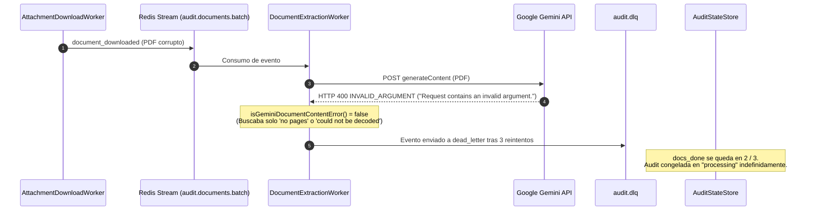
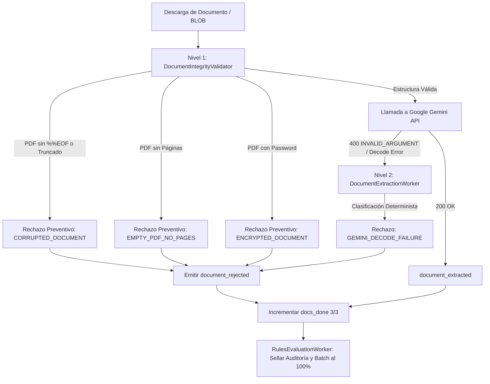
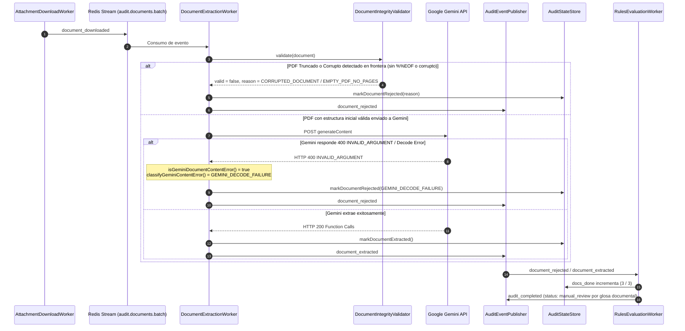

# Especificación SDD — Resiliencia y Manejo Determinista de Errores de Contenido en Extracción Gemini (Clean Rebuild)

> **Documento fuente de verdad**: `plans/sdd-gemini-content-error-resilience.md`  
> **Estado**: `Nivel A — Implementable` `[CONFIRMADO]`  
> **Fecha**: 2026-08-21  
> **Autor**: Antigravity AI  
> **Dominio**: Backend Event-Driven (`app/Services/Audit/Pipeline/`)  
> **Políticas**: `clean-rebuild-policy` & `write-sdd-spec`

---

## 0. Clasificación del Cambio (Triage)

| Dimensión | Valor | Justificación / Evidencia |
|---|---|---|
| **Tipo** | Bugfix & Resiliencia Estructural | Corrección de clasificación de errores 400 de Gemini API y validación preventiva de PDFs corruptos/truncados `[CONFIRMADO: DocumentExtractionWorker.php#L530-L549]`. |
| **Riesgo** | Medio | Modifica la lógica de manejo de excepciones en workers de extracción y validación de integridad; no altera esquemas de base de datos SQL Server ni contratos de eventos `[CONFIRMADO]`. |
| **Persistencia afectada** | No | No cambia tablas ni esquemas en SQL Server (`dbo.AudDispEst`) ni Redis Streams `[CONFIRMADO]`. |
| **Contrato externo afectado** | No | Los eventos `document_rejected` y `document_downloaded` preservan sus contratos exactos `[CONFIRMADO]`. |
| **Cambio arquitectónico** | No | Se alinea con el pipeline event-driven existente sobre Redis Streams `[CONFIRMADO]`. |
| **Producción afectada** | Sí | Desbloquea 6 facturas del job `59f3dedd-78ee-435e-ad10-c6b1f02b06fc` y previene atascos futuros por PDFs corruptos `[CONFIRMADO]`. |
| **Requiere Paso 3.1 (abstracciones)** | Sí | Requiere cobertura del 100% de tipos de excepción y razones de rechazo `[CONFIRMADO]`. |

---

## FASE 0 — Descubrimiento y Línea Base

### 0.1 Inventario de Archivos Afectados

1. [`app/Services/Audit/Pipeline/DocumentExtractionWorker.php`](file:///c:/Users/USER/Desktop/AudFact/app/Services/Audit/Pipeline/DocumentExtractionWorker.php) `[CONFIRMADO]`
   - Líneas 166-189: Bloque `catch (RuntimeException $geminiError)` que invoca `isGeminiDocumentContentError`.
   - Líneas 530-552: Métodos `isGeminiDocumentContentError()` y `classifyGeminiContentError()`.
2. [`app/Services/Audit/Pipeline/DocumentIntegrityValidator.php`](file:///c:/Users/USER/Desktop/AudFact/app/Services/Audit/Pipeline/DocumentIntegrityValidator.php) `[CONFIRMADO]`
   - Líneas 44-96: Método `validate(array $document)`.
   - Líneas 139-146: Método `pdfHasPages()`.
   - Refuerzo de validación estructural preventiva (verificación de marcador final `%%EOF` y trailer de PDF).
3. [`app/Services/Audit/GeminiGateway.php`](file:///c:/Users/USER/Desktop/AudFact/app/Services/Audit/GeminiGateway.php) `[CONFIRMADO]`
   - Líneas 320-333: Construcción del payload en `buildPayload()`, omitiendo claves `toolConfig` cuando esté vacío `[]` para evitar errores proto3 en Gemini API.
4. [`tests/Services/Audit/Pipeline/DocumentExtractionWorkerTest.php`](file:///c:/Users/USER/Desktop/AudFact/tests/Services/Audit/Pipeline/DocumentExtractionWorkerTest.php) `[CONFIRMADO]`
   - Cobertura de contrato para errores `INVALID_ARGUMENT` de Gemini y rechazos automáticos.
5. [`tests/Services/Audit/Events/DocumentIntegrityValidatorTest.php`](file:///c:/Users/USER/Desktop/AudFact/tests/Services/Audit/Events/DocumentIntegrityValidatorTest.php) `[CONFIRMADO]`
   - Cobertura de validación de integridad para PDFs corruptos/truncados.

---

### 0.2 Descripción del Problema y Causa Raíz

En el job masivo de producción `59f3dedd-78ee-435e-ad10-c6b1f02b06fc` (134 facturas), 128 facturas completaron su auditoría normalmente, pero **6 facturas quedaron atascadas en `processing`** `[CONFIRMADO: job_59f.json]`.

#### Cadena Causal Demostrada:
1. Las 6 facturas tenían 3 documentos cada una (`docs_total = 3`). Los documentos 2 y 3 fueron extraídos y evaluados exitosamente (`docs_done = 2`) `[CONFIRMADO]`.
2. El documento 1 (`attachment_id: 1`) contiene un archivo PDF con estructura binaria interna no decodificable por Google Gemini (o truncada en BLOB) `[CONFIRMADO: reproduce_extraction.php]`.
3. Al invocar `gemini-3.7-flash:generateContent`, Google respondió con error HTTP 400: `{"error": {"code": 400, "message": "Request contains an invalid argument.", "status": "INVALID_ARGUMENT"}}` `[CONFIRMADO]`.
4. `DocumentExtractionWorker::isGeminiDocumentContentError()` solo buscaba los textos literales `'no pages'` o `'could not be decoded'`. Al recibir `'Request contains an invalid argument.'`, retornó `false` `[CONFIRMADO: DocumentExtractionWorker.php#L530-L539]`.
5. El worker lanzó `RuntimeException`, `AuditEventConsumer` reintentó 3 veces y envió el mensaje a `dead_letter` `[CONFIRMADO]`.
6. Al no emitirse `document_rejected` ni `document_extracted`, el contador `docs_done` nunca llegó a 3, la auditoría quedó en `processing` y el job batch masivo nunca se selló al 100% `[CONFIRMADO]`.



---

## FASE 1 — Especificación Técnica Determinista

### 1.1 Diagrama de Flujo — Arquitectura de Defensa en Dos Niveles



### 1.2 Diagrama de Secuencia de la Solución



---

### 1.2 Modificaciones en `DocumentExtractionWorker.php`

#### [MODIFICAR] `isGeminiDocumentContentError(RuntimeException $e): bool`
```php
private function isGeminiDocumentContentError(RuntimeException $e): bool
{
    if ($e->getCode() !== 400) {
        return false;
    }

    $msg = $e->getMessage();
    return stripos($msg, 'no pages') !== false
        || stripos($msg, 'could not be decoded') !== false
        || stripos($msg, 'invalid argument') !== false
        || stripos($msg, 'invalid_argument') !== false
        || stripos($msg, 'unsupported file') !== false
        || stripos($msg, 'failed to process') !== false;
}
```

#### [MODIFICAR] `classifyGeminiContentError(RuntimeException $e): string`
```php
private function classifyGeminiContentError(RuntimeException $e): string
{
    $msg = $e->getMessage();
    if (stripos($msg, 'no pages') !== false) {
        return DocumentRejectionReason::EMPTY_PDF_NO_PAGES;
    }
    
    // Todo error 400 de Gemini derivado del contenido binario del archivo
    return DocumentRejectionReason::GEMINI_DECODE_FAILURE;
}
```

---

### 1.3 Modificaciones en `GeminiGateway.php`

#### [MODIFICAR] `buildPayload()`
Evitar enviar `'toolConfig' => []` cuando no haya configuración explícita, previniendo violaciones de serialización Protobuf en Gemini API:

```php
$payload = [
    'systemInstruction' => [
        'parts' => [['text' => $systemInstruction]],
    ],
    'contents' => [[
        'role' => 'user',
        'parts' => $parts,
    ]],
    'tools' => self::normalizeSchemaProperties($tools),
    'generationConfig' => $generationConfig,
    'safetySettings' => $this->getSafetySettings(),
];

if (!empty($toolConfig)) {
    $payload['toolConfig'] = $toolConfig;
}

return $payload;
```

---

### 1.4 Modificaciones en `DocumentIntegrityValidator.php`

#### [MODIFICAR] Validación Estructural Preventiva de PDFs
Reforzar `validate()` para detectar y rechazar preventivamente PDFs truncados que no contengan el marcador `%%EOF` al final del archivo:

```php
if ($declaredMime === 'application/pdf') {
    if (str_contains($raw, '/Encrypt')) {
        return self::rejected(DocumentRejectionReason::ENCRYPTED_DOCUMENT, $declaredMime, $detectedMime, $sizeBytes);
    }

    if (!self::pdfHasPages($raw)) {
        return self::rejected(DocumentRejectionReason::EMPTY_PDF_NO_PAGES, $declaredMime, $detectedMime, $sizeBytes);
    }

    if (!self::pdfHasEofMarker($raw)) {
        return self::rejected(DocumentRejectionReason::CORRUPTED_DOCUMENT, $declaredMime, $detectedMime, $sizeBytes);
    }
}
```

Helper `pdfHasEofMarker(string $raw): bool`:
```php
private static function pdfHasEofMarker(string $raw): bool
{
    // Verifica que %%EOF esté presente en los últimos 1024 bytes del archivo
    $tail = substr($raw, -1024);
    return str_contains($tail, '%%EOF');
}
```

---

## FASE 2 — Plan de Pruebas Unitarias y Automatizadas

### 2.1 Casos de Prueba en `DocumentExtractionWorkerTest.php`

1. `testExtractionWorkerRejectsDocumentOnGeminiInvalidArgument400`:
   - Simula que `GeminiGateway` lanza `RuntimeException("Client error: POST resulted in 400 Bad Request: Request contains an invalid argument.", 400)`.
   - Verifica que el worker capture el error, invoque `markDocumentRejected(GEMINI_DECODE_FAILURE)`, publique `AuditEvent::TYPE_DOCUMENT_REJECTED` y NO lance excepción.
2. `testExtractionWorkerRejectsDocumentOnGeminiNoPages400`:
   - Simula error 400 con texto `no pages`.
   - Verifica rechazo con razón `EMPTY_PDF_NO_PAGES`.

### 2.2 Casos de Prueba en `DocumentIntegrityValidatorTest.php`

1. `testValidateRejectsTruncatedPdfWithoutEof`:
   - Pasa un PDF sin marcador `%%EOF` al final.
   - Verifica retorno de `valid = false` y razón `CORRUPTED_DOCUMENT`.
2. `testValidateAcceptsValidPdfWithEof`:
   - Pasa un PDF completo con `%PDF`, `/Type /Page` y `%%EOF`.
   - Verifica `valid = true`.

---

## FASE 3 — Plan de Rollout y Recuperación de Producción

1. **Despliegue de Código**:
   - Merge a `main` y push para disparar el pipeline de GitHub Actions (`Publish Images` ➔ `Deploy Production`).
2. **Reproceso de las 6 Facturas Atascadas en `admon@172.16.0.3`**:
   - Ejecutar script de reproceso de eventos `document_registered` para las 6 dispensaciones afectadas:
     - `D14260804485`
     - `Q29260600209`
     - `D12260802981`
     - `U75260800492`
     - `D13260701500`
     - `T48260801164`
   - El pipeline descargará el adjunto 1, detectará el fallo 400/truncamiento, emitirá `document_rejected`, avanzará `docs_done` a 3 y sellará el job `59f3dedd-78ee-435e-ad10-c6b1f02b06fc` en **134/134 (100% completed)**.
3. **Verificación en Producción**:
   - Consultar `GET /audit/jobs/59f3dedd-78ee-435e-ad10-c6b1f02b06fc` y confirmar `"status": "completed"`, `"done": 134`, `"pending": 0`.

---

## Criterios de Aceptación

- [ ] `DocumentIntegrityValidator` detecta y rechaza en frontera PDFs truncados sin marcador `%%EOF`.
- [ ] `DocumentExtractionWorker` clasifica y rechaza limpiamente cualquier error 400 de Gemini API originado por archivos corruptos o `INVALID_ARGUMENT`.
- [ ] No se envían propiedades `toolConfig` vacías a la API de Gemini.
- [ ] Suite completa de tests PHPUnit 10+ pasa al 100% (494+ tests).
- [ ] Las 6 facturas pendientes en producción transicionan a `manual_review` y el job `59f3dedd` alcanza el 100% `completed`.
