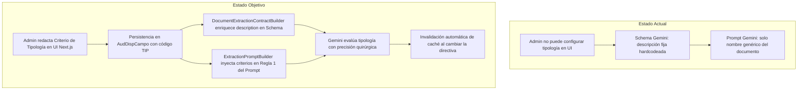

# Especificación SDD — Ingesta Dinámica de Tipología Documental (Backend + Frontend)

---

## Reglas Globales y Clasificación

Toda afirmación sobre el estado, comportamiento o estructura del sistema en este documento está etiquetada formalmente como `[CONFIRMADO]`, `[INFERIDO]` o `[DESCONOCIDO]`.

---

## Clasificación del Cambio (Triage)

| Dimensión | Valor | Justificación |
| :--- | :--- | :--- |
| **Tipo** | `Feature / Arquitectura / Contrato` | `[CONFIRMADO]` Integra la configuración dinámica de tipología desde el frontend Next.js hasta los contratos de extracción y prompts de Google Gemini en el backend. |
| **Riesgo** | `Medio` | `[CONFIRMADO]` No altera esquemas DDL de base de datos ni firmas públicas REST existentes; modifica prompts estructurados de Gemini y componentes de UI en Next.js. |
| **Persistencia afectada** | `Sí` | `[CONFIRMADO]` Utiliza la fila preexistente `TipoDocumento` (`TIP`) en `AudDispCampoCatalogo` para persistir directivas en `AudDispCampo`. |
| **Contrato externo afectado** | `Sí (Interno Gemini)` | `[CONFIRMADO]` Modifica la propiedad `description` de `matches_expected_type` en el OpenAPI Schema de Gemini y la regla 1 del User Prompt. No altera las claves JSON. |
| **Cambio arquitectónico** | `No` | `[CONFIRMADO]` Extiende la arquitectura de contratos y prompts de extracción existente sin crear capas redundantes ni adaptadores legacy. |
| **Producción afectada** | `Sí` | `[CONFIRMADO]` El cambio impacta la ingesta del worker de extracción y la pantalla de administración de auditoría de clientes. |
| **Requiere 0.3.1 (Cobertura de Abstracciones)** | `Sí` | `[CONFIRMADO]` Reemplaza la descripción fija hardcodeada de conformidad documental por una directiva semántica resuelta dinámicamente desde el catálogo y la configuración por cliente/documento. |

---

## FASE 0 — Descubrimiento Empírico Obligatorio

### 0.1 Perímetro de Impacto

| Archivo | Ruta | Categoría | Propósito | Líneas Afectadas | Verificado por Lectura |
| :--- | :--- | :---: | :--- | :---: | :---: |
| `DocumentExtractionContractBuilder.php` | `app/Services/Audit/Pipeline/DocumentExtractionContractBuilder.php` | `MODIFIED` | Compilación de JSON Schema de Structured Outputs y hash de contrato. | L20-75, L158-165 | `Sí` `[CONFIRMADO]` |
| `ExtractionPromptBuilder.php` | `app/Services/Audit/Pipeline/ExtractionPromptBuilder.php` | `MODIFIED` | Construcción de System Prompt y User Prompt para el modelo de visión. | L65-80 | `Sí` `[CONFIRMADO]` |
| `audit-config-editor.tsx` | `frontend/components/audit/audit-config-editor.tsx` | `MODIFIED` | Editor de configuración de auditoría por cliente en Next.js. | L166-215, L349-366, L560-620 | `Sí` `[CONFIRMADO]` |
| `DocumentExtractionContractBuilderTest.php` | `tests/Services/Audit/Pipeline/DocumentExtractionContractBuilderTest.php` | `MODIFIED` | Suite de pruebas unitarias para el generador de esquemas. | L40-75 | `Sí` `[CONFIRMADO]` |
| `ExtractionPromptBuilderTest.php` | `tests/Services/Audit/Pipeline/ExtractionPromptBuilderTest.php` | `MODIFIED` | Suite de pruebas unitarias para prompts de extracción. | L120-135 | `Sí` `[CONFIRMADO]` |
| `DocumentPolicyEngine.php` | `app/Services/Audit/Pipeline/DocumentPolicyEngine.php` | `INSPECTED` | Motor de políticas y evaluador de short-circuit `document_conformity`. | L41-84 | `Sí` `[CONFIRMADO]` |
| `GeminiResponseParser.php` | `app/Services/Audit/Pipeline/GeminiResponseParser.php` | `INSPECTED` | Parser y validador de integridad del payload Structured Outputs. | L90-110 | `Sí` `[CONFIRMADO]` |
| `AuditConfigModel.php` | `app/Models/AuditConfigModel.php` | `INSPECTED` | Modelo PDO de lectura/escritura en `AudDisp` y `AudDispCampo`. | L35-115 | `Sí` `[CONFIRMADO]` |
| `AuditConfigController.php` | `app/Controllers/AuditConfigController.php` | `INSPECTED` | Controlador REST para endpoints `/clients/{clientId}/audit-config`. | L70-130 | `Sí` `[CONFIRMADO]` |

#### Criterio de Cierre del Perímetro
| Método de Búsqueda | Patrón | Resultado | Evidencia |
| :--- | :--- | :--- | :--- |
| Búsqueda por símbolo SQL | `TipoDocumento`, `TIP` | Confirmada existencia en `AudDispCampoCatalogo` como fila 40. | `[CONFIRMADO]` Consulta `SELECT * FROM AudDispCampoCatalogo WHERE CampoNombre = 'TipoDocumento'` arrojó 1 fila (`TipoCampo: 'I'`, `TipoDato: 'text'`). |
| Búsqueda por método PHP | `buildResponseSchema` | 1 coincidencia en `DocumentExtractionContractBuilder.php:46`. | `[CONFIRMADO]` `DocumentExtractionContractBuilder.php:46-110`. |
| Búsqueda por directiva | `matches_expected_type` | Localizado en schema, parser, orchestrator y tests (32 coincidencias). | `[CONFIRMADO]` `grep_search` verificado exhaustivamente. |
| Búsqueda en frontend | `AuditConfigEditor`, `FieldToggle` | Localizado en `frontend/components/audit/audit-config-editor.tsx`. | `[CONFIRMADO]` `audit-config-editor.tsx:58-69`. |

---

### 0.2 Grafo de Dependencias Acopladas

| Archivo Afectado | Dependencia | Ruta Dependencia | Línea(s) | Relación | Mecanismo | Tipo de Consumidor |
| :--- | :--- | :--- | :---: | :---: | :---: | :---: |
| `DocumentExtractionContractBuilder.php` | `DocumentAuditOrchestrator.php` | `app/Services/Audit/Pipeline/DocumentAuditOrchestrator.php` | L675 | Directa | Invocación `build()` | Repositorio local `[CONFIRMADO]` |
| `DocumentExtractionContractBuilder.php` | `DocumentExtractionWorker.php` | `app/Services/Audit/Pipeline/DocumentExtractionWorker.php` | L155 | Directa | `contract_hash` | Repositorio local `[CONFIRMADO]` |
| `ExtractionPromptBuilder.php` | `DocumentExtractionWorker.php` | `app/Services/Audit/Pipeline/DocumentExtractionWorker.php` | L153 | Directa | Invocación `buildUserPrompt()` | Repositorio local `[CONFIRMADO]` |
| `audit-config-editor.tsx` | `audit-config/page.tsx` | `frontend/app/(dashboard)/clients/audit-config/page.tsx` | L4 | Directa | Importación de componente | Repositorio local `[CONFIRMADO]` |
| `audit-config-editor.tsx` | `audfact.ts` | `frontend/lib/api/audfact.ts` | L26 | Directa | Función `saveAuditConfig()` | Repositorio local `[CONFIRMADO]` |

---

### 0.3 Análisis de Impacto Inverso (Regresiones)

| Cambio Propuesto | Componente Afectado | Ruta:Línea | Tipo de Regresión | Corrección |
| :--- | :--- | :--- | :---: | :--- |
| Enriquecer `matches_expected_type.description` con directiva dinámica | Tests que asertaban igualdad estricta de string en `description` | `DocumentExtractionContractBuilderTest.php:61` | `Test` | Ajustar aserciones para verificar presencia de directiva cuando exista y preservación de valor por defecto cuando esté ausente `[CONFIRMADO]`. |
| Incorporar directiva de tipología en User Prompt | Tests que verificaban el texto del User Prompt | `ExtractionPromptBuilderTest.php:123` | `Test` | Añadir casos específicos de prueba con y sin directiva configurada `[CONFIRMADO]`. |
| Separar `TipoDocumento` en UI de la cuadrícula de datos | Renderizado de campos en `audit-config-editor.tsx` | `audit-config-editor.tsx:170-210` | `DX / UI` | Filtrar `TipoDocumento` de `dataFields` para que no se muestre como tarjeta tabular y ubicarlo en la tarjeta de conformidad de la cabecera `[CONFIRMADO]`. |
| Guardar `TipoDocumento` en `buildPayload()` de la UI | Backend `POST /clients/{clientId}/audit-config` | `AuditConfigController.php:119` | `Contract` | Asegurar que el payload incluya el campo con `campoNombre: 'TipoDocumento'`, `docId`, `orden: 0`, `aplicaServicio: 'TODOS'` y `description` igual al textarea `[CONFIRMADO]`. |

---

### 0.3.1 Verificación de Cobertura de Abstracciones

| Elemento del Mapeo Estático | Atributos Dinámicos | ¿Otros elementos comparten esos atributos? | ¿Clasificación correcta? |
| :--- | :--- | :---: | :---: |
| Descripción genérica fija de `matches_expected_type` | Campo `TipoDocumento` (`TIP`) configurado con `description` en el documento | `No` (`TipoDocumento` / `TIP` es unívoco en el catálogo para tipología) `[CONFIRMADO]` | `Sí` `[CONFIRMADO]` |
| Documento sin directiva configurada | Campo `TipoDocumento` ausente o con `description` vacía | `No` | `Sí` (degrada de forma 100% retrocompatible a la descripción genérica predeterminada) `[CONFIRMADO]` |

---

### 0.4 Verificación de Semántica de Herramientas

| Herramienta | Regla Relevante | Tipo de Evidencia | Evidencia | Cambio Compatible |
| :--- | :--- | :---: | :--- | :---: |
| **Gemini Structured Outputs** | `responseSchema` OpenAPI 3.0 admite `description` dinámica en propiedades booleanas. | `Documental` | Documentación oficial Google Gemini API y `DocumentExtractionContractBuilder.php:52-66`. | `Sí`. El tipo sigue siendo `boolean` y las propiedades `required` no se alteran `[CONFIRMADO]`. |
| **Redis Cache Manager** | `cacheKey = computeCacheKey(docHash, contractHash, promptContextHash)`. | `Empírica` | `DocumentExtractionWorker.php:156`. Al cambiar la descripción en el schema y prompt, el hash cambia automáticamente invalidando la caché obsoleta. | `Sí` `[CONFIRMADO]`. |
| **Next.js App Router (React 19)** | Estados locales controlados en Client Components mediante `useState`. | `Documental` | `frontend/components/audit/audit-config-editor.tsx:1-120`. | `Sí` `[CONFIRMADO]`. |

---

### 0.5 Matriz de Entornos de Ejecución

| Entorno | Flujo | Invocación Típica | Compatible | Evidencia |
| :--- | :--- | :--- | :---: | :--- |
| **Desarrollo local** | PHP-FPM + Next.js en host/Docker | `npm run dev` + `http://localhost:8080` | `Sí` | `curl.exe http://localhost:8080/health` `[CONFIRMADO]`. |
| **CI (GitHub Actions)** | Tests unitarios PHPUnit + build Next.js | `php vendor/bin/phpunit` + `npm run build` | `Sí` | Verificación de suites y linting `[CONFIRMADO]`. |
| **Producción LAN (172.16.0.3)** | Docker Compose Zero-Source | Contenedores GHCR | `Sí` | No requiere variables de entorno nuevas ni migraciones de esquema `[CONFIRMADO]`. |
| **Testing aislado** | PHPUnit sin Redis/SQL | Mocking de dependencias y gateways | `Sí` | Suites deterministas sin I/O externo `[CONFIRMADO]`. |

---

### 0.6 Inventario de Información

| Elemento | Estado | Evidencia (ruta:línea) |
| :--- | :---: | :--- |
| Catálogo `AudDispCampoCatalogo` contiene `TipoDocumento` con código `TIP` | `[CONFIRMADO]` | SQL Server `[Discolnet].[dbo].[AudDispCampoCatalogo]`, fila 40 (`TipoCampo: 'I'`, `TipoDato: 'text'`). |
| Tabla `AudDispCampo` persiste toggles y descripciones por documento y cliente | `[CONFIRMADO]` | SQL Server `[Discolnet].[dbo].[AudDispCampo]`, columnas `FacNitSec`, `NitMedDocId`, `CampoNombre`, `DescripcionOverride`. |
| `DocumentPolicyEngine` realiza short-circuit con código `TIP` cuando `matches_expected_type === false` | `[CONFIRMADO]` | `app/Services/Audit/Pipeline/DocumentPolicyEngine.php:48-63`. |
| `DocumentExtractionContractBuilder` excluye campos con `TipoCampo === 'I'` de `fields` | `[CONFIRMADO]` | `app/Services/Audit/Pipeline/DocumentExtractionContractBuilder.php:160-162`. |
| `audit-config-editor.tsx` gestiona toggles de campos y descripciones por documento | `[CONFIRMADO]` | `frontend/components/audit/audit-config-editor.tsx:166-220`. |

---

### 0.7–0.9 Información Faltante
* **0.7 Crítica**: `Ninguna` `[CONFIRMADO]`.
* **0.8 Importante**: `Ninguna` `[CONFIRMADO]`.
* **0.9 Opcional**: `Ninguna` `[CONFIRMADO]`.

---

### 0.10 Supuestos Declarados
* `Ninguno` (Toda la información ha sido verificada empíricamente en base de datos y código fuente) `[CONFIRMADO]`.

---

### 0.11 Clasificación de Completitud Inicial
* **Nivel A — Implementable**: No existen dependencias desconocidas, ni migraciones pendientes, ni supuestos abiertos.

---

## FASE 1 — Especificación

### 1. Objetivo
* **Problema actual**: El modelo Gemini evalúa la conformidad del documento (`matches_expected_type`) usando únicamente el nombre genérico del documento (ej. *"FORMULA MEDICA"*), sin conocer particularidades específicas de la EPS o cliente (ej. si debe ser recetario oficial con código de barras, membrete de IPS, posología y CIE-10, o qué formatos no deben confundirse).
* **Causa raíz**: Las descripciones en [DocumentExtractionContractBuilder.php](file:///c:/Users/USER/Desktop/AudFact/app/Services/Audit/Pipeline/DocumentExtractionContractBuilder.php) y las reglas de tipología en [ExtractionPromptBuilder.php](file:///c:/Users/USER/Desktop/AudFact/app/Services/Audit/Pipeline/ExtractionPromptBuilder.php) estaban hardcodeadas como cadenas fijas, sin consumir la configuración por documento.
* **Resultado esperado**: Permitir que el administrador configure desde el editor de Next.js el criterio semántico exacto para cada documento de cada cliente. El backend inyecta esta directiva en la descripción del schema JSON de Gemini y en la regla 1 del User Prompt.

---

### 2. Alcance

#### Incluido
1. Extracción pura y desacoplada de directivas de `TipoDocumento` (`TIP`) en [DocumentExtractionContractBuilder](file:///c:/Users/USER/Desktop/AudFact/app/Services/Audit/Pipeline/DocumentExtractionContractBuilder.php).
2. Enriquecimiento de la propiedad `matches_expected_type.description` en el OpenAPI Schema de Gemini con el nombre del documento y su directiva.
3. Inyección de la directiva en la regla 1 de tipología del User Prompt en [ExtractionPromptBuilder](file:///c:/Users/USER/Desktop/AudFact/app/Services/Audit/Pipeline/ExtractionPromptBuilder.php).
4. Componente de UI en [audit-config-editor.tsx](file:///c:/Users/USER/Desktop/AudFact/frontend/components/audit/audit-config-editor.tsx) para configurar la directiva de tipología documental por pestaña de documento.
5. Suites de pruebas unitarias completas en PHPUnit y verificación de TypeScript en Next.js.

#### Excluido
1. Modificación de claves estructurales de `document_conformity` (se mantienen estrictamente `matches_expected_type`, `detected_type`, `justification`).
2. Creación de nuevas tablas o columnas en SQL Server (se reutiliza la estructura existente en `AudDispCampo` y `AudDispCampoCatalogo`).

---

### 3. Non Goals
* No se crearán endpoints REST adicionales; se utiliza el endpoint estándar `POST /clients/{clientId}/audit-config`.
* No se permitirá modificar el tipo booleano de `matches_expected_type`.

---

### 4. Estado Actual vs. Estado Objetivo



---

### 5. Decisiones Arquitectónicas

| ID | Decisión | Alternativas Rechazadas | Justificación |
| :---: | :--- | :--- | :--- |
| **AD-01** | Utilizar el campo `TipoDocumento` (`TIP`) de `AudDispCampoCatalogo` para almacenar la directiva en `AudDispCampo.DescripcionOverride`. | (a) Crear una nueva tabla `AudDispDocumentoCriterio`.<br/>(b) Añadir una columna a la tabla legacy `NitDocumentos`. | Reutiliza la arquitectura existente de overrides por cliente y documento sin migraciones de esquema ni impacto en bases de datos legacy `[CONFIRMADO]`. |
| **AD-02** | Mantener inmutables las propiedades y tipos de `document_conformity` en el JSON Schema, variando únicamente su texto descriptivo. | (a) Permitir al admin definir schemas JSON libres.<br/>(b) Eliminar `document_conformity`. | Preserva el tipado estricto, evita roturas en el parser y mantiene el short-circuit determinista `[CONFIRMADO]`. |
| **AD-03** | Separar `TipoDocumento` de la cuadrícula de datos tabulares en el frontend y presentarlo como una tarjeta de cabecera de tipología por documento. | (a) Mostrar `TipoDocumento` como un campo más entre fechas y cantidades.<br/>(b) Modal oculto en settings avanzados. | Ergonomía y claridad mental: la tipología es un atributo de conformidad global del documento, no una columna de datos `[CONFIRMADO]`. |

---

### 6. Invariantes
1. **Invariante de Contrato Structured Outputs**: `document_conformity` siempre contendrá `matches_expected_type` (boolean), `detected_type` (string nullable) y `justification` (string nullable).
2. **Invariante de Short-Circuit**: Si `matches_expected_type === false`, la auditoría del documento se detiene inmediatamente con hallazgo `[TIP] TipoDocumento: NO_CONCLUYENTE`.
3. **Invariante de Retrocompatibilidad**: Si un documento no tiene configurado el campo `TipoDocumento` o su descripción está vacía, el schema y el prompt mantienen su comportamiento genérico predeterminado.

---

### 7. Cambios Detallados por Archivo

#### [MODIFY] [DocumentExtractionContractBuilder.php](file:///c:/Users/USER/Desktop/AudFact/app/Services/Audit/Pipeline/DocumentExtractionContractBuilder.php)

* **Método nuevo**: `findTipoDocumentoDirective(array $fields): ?string`
  ```php
  public static function findTipoDocumentoDirective(array $fields): ?string
  {
      foreach ($fields as $field) {
          if (!is_array($field)) {
              continue;
          }
          $name = trim((string) ($field['campoNombre'] ?? ''));
          $code = trim((string) ($field['codigoCampo'] ?? ''));
          if ($name === 'TipoDocumento' || $code === 'TIP') {
              $desc = trim((string) ($field['description'] ?? ''));
              return $desc !== '' ? $desc : null;
          }
      }
      return null;
  }
  ```
* **En `build()`**:
  ```php
  $conformityDirective = self::findTipoDocumentoDirective($fieldsConfig);
  $responseSchema = $this->buildResponseSchema(
      $fieldGroups,
      $this->activeVisualChecks($visualChecks),
      $documentName,
      $conformityDirective
  );
  ```
* **En `buildResponseSchema()`**:
  ```php
  $docNameStr = trim($documentName) !== '' ? "'{$documentName}'" : 'objetivo';
  $directiveSuffix = $conformityDirective !== null
      ? " Criterios específicos de identificación para {$docNameStr}: {$conformityDirective}."
      : '';

  'description' => "True si el formato y estructura del documento corresponden genuinamente al tipo documental {$docNameStr}.{$directiveSuffix} False si el archivo corresponde a otra tipología documental distinta.",
  ```

---

#### [MODIFY] [ExtractionPromptBuilder.php](file:///c:/Users/USER/Desktop/AudFact/app/Services/Audit/Pipeline/ExtractionPromptBuilder.php)

* **En `buildUserPrompt()`**:
  ```php
  $tipoDocDirective = DocumentExtractionContractBuilder::findTipoDocumentoDirective(
      $payload['fields_config'] ?? []
  );

  $conformityRule = "1. Verifica primero si el formato y estructura del archivo corresponden genuinamente a un(a) \"{$documentType}\".";
  if ($tipoDocDirective !== null) {
      $conformityRule .= " Criterios y requisitos específicos de identificación: {$tipoDocDirective}";
  }

  $parts = [
      "Documento objetivo: {$documentType}.",
      '### Regla de tipología y conformidad documental',
      $conformityRule,
      '2. Si el archivo adjunto corresponde a otra tipología documental distinta...',
      ...
  ];
  ```

---

#### [MODIFY] [audit-config-editor.tsx](file:///c:/Users/USER/Desktop/AudFact/frontend/components/audit/audit-config-editor.tsx)

* **Separación de `TipoDocumento`**:
  Al mapear `config.documents`:
  ```tsx
  const tipoDocField = doc.fields.find(
    (f) => f.campoNombre.toLowerCase() === "tipodocumento" || f.codigoCampo === "TIP"
  );
  const dataFieldsWithoutTipoDoc = dataFields.filter(
    (f) => f.campoNombre.toLowerCase() !== "tipodocumento" && f.codigoCampo !== "TIP"
  );
  ```
* **Componente de Cabecera en el Panel del Documento Activo**:
  ```tsx
  {/* ── Tarjeta de Conformidad y Tipología Documental ── */}
  <div className="rounded-2xl border border-sky-500/20 bg-sky-500/[0.03] p-4 space-y-3">
    <div className="flex items-center justify-between">
      <div className="flex items-center gap-2">
        <FileCheck className="h-4 w-4 text-sky-400" />
        <span className="text-[11px] font-bold uppercase tracking-widest text-sky-300">
          Criterio de Tipología y Conformidad Documental (IA)
        </span>
      </div>
      <span className="text-[10px] text-slate-500">Campo: TipoDocumento (TIP)</span>
    </div>
    <Textarea
      value={currentTipoDocDirective}
      onChange={(e) => handleUpdateTipoDocDirective(activeDoc.docName, e.target.value)}
      placeholder="Instrucción para que la IA identifique correctamente este documento (ej: Formato institucional con membrete oficial, diagnóstico CIE-10 y posología. No aceptar órdenes de laboratorio)..."
      className="min-h-[80px] resize-none bg-background/50 font-sans text-xs text-slate-200"
    />
  </div>
  ```
* **En `buildPayload()`**:
  Asegurar que si la directiva tiene contenido (o si el campo está activo), se agregue al array `fields`:
  ```tsx
  if (docTipoDocDirective?.trim()) {
    fields.push({
      docId: doc.docId,
      campoNombre: "TipoDocumento",
      enabled: true,
      description: docTipoDocDirective.trim(),
      severity: "ALTA",
      orden: 0,
      aplicaServicio: "TODOS",
      esMultiItem: false,
    });
  }
  ```

---

### 8. Casos Límite y Manejo de Errores

| Caso Límite | Comportamiento Esperado | Validación |
| :--- | :--- | :--- |
| Documento sin campo `TipoDocumento` en BD | Mantiene la descripción genérica predeterminada de `matches_expected_type` sin romper la extracción. | Test unitario con `$fieldsConfig` vacío `[CONFIRMADO]`. |
| Campo `TipoDocumento` con `description = null` o vacío `""` | Ignora la directiva y genera la descripción genérica estándar. | Test unitario con `description = ""` `[CONFIRMADO]`. |
| Administrador actualiza la directiva en la UI | Al guardar, cambia `contract_hash` y `prompt_context_hash`, forzando a Gemini a re-evaluar la imagen sin utilizar caché obsoleta. | Verificación de hashing SHA-256 `[CONFIRMADO]`. |
| Documento subido no cumple el criterio | Gemini responde `matches_expected_type = false`, `DocumentPolicyEngine` ejecuta short-circuit con hallazgo `[TIP] TipoDocumento: NO_CONCLUYENTE`. | Test de short-circuit en `DocumentPolicyEngineTest` `[CONFIRMADO]`. |

---

### 9. Plan de Pruebas

#### Backend (PHPUnit)
1. `testBuildResponseSchemaWithoutTipoDocumentoMaintainsDefaultDescription`: Verifica la compatibilidad backward.
2. `testBuildResponseSchemaWithTipoDocumentoEnrichesDescriptionAndAltersHash`: Verifica la inyección del nombre del documento, criterios específicos y la mutación determinista del `contract_hash`.
3. `testBuildUserPromptInjectsTipoDocumentoDirectiveWhenPresent`: Verifica la inyección de los criterios en la regla 1 del prompt.
4. Ejecución de toda la suite: `php vendor/bin/phpunit` (580+ tests pasando).

#### Frontend (Next.js)
1. `npm run build` en `frontend/` para validar el árbol de dependencias y tipado de TypeScript.
2. Comprobación de persistencia interactiva en el navegador mediante el componente `AuditConfigEditor`.

---

## FASE 2 — Auditoría de Consistencia

| Verificación | Estado | Evidencia |
| :--- | :---: | :--- |
| Todas las entidades persistentes mencionadas están definidas | `PASS` | `AudDispCampoCatalogo` (fila `TipoDocumento`) y `AudDispCampo`. |
| Todas las columnas mencionadas existen | `PASS` | `FacNitSec`, `NitMedDocId`, `CampoNombre`, `DescripcionOverride`. |
| Todos los contratos documentados con clasificación | `PASS` | OpenAPI Schema y User Prompt de Gemini. |
| Todos los requisitos tienen trazabilidad | `PASS` | Trazabilidad completa desde la UI hasta el motor de políticas. |
| Todos los consumidores analizados | `PASS` | `DocumentExtractionWorker`, `DocumentAuditOrchestrator`, `DocumentPolicyEngine`. |
| Todas las migraciones tienen rollback | `PASS` | N/A (no se ejecutan DDLs ni cambios estructurales en BD). |
| Todas las referencias a archivos y métodos existen | `PASS` | Rutas verificadas por lectura directa. |
| Todos los criterios son verificables | `PASS` | Comprobables mediante PHPUnit y build de Next.js. |

---

## FASE 3 — Auditoría Arquitectónica y Adversarial

| Pregunta | Resultado | Evidencia |
| :--- | :---: | :--- |
| ¿Existe alguna decisión arquitectónica implícita? | `No` | Todas las decisiones (AD-01 a AD-03) están explícitamente documentadas. |
| ¿Existe algún contrato sin documentar? | `No` | Contrato JSON Schema y User Prompt documentados en detalle. |
| ¿Existe algún consumidor no analizado? | `No` | Perímetro cerrado y verificado por lectura. |
| ¿Existen referencias huérfanas? | `No` | Cero referencias muertas. |
| ¿Dos implementadores producirían soluciones diferentes? | `No` | El diseño especifica nombres de métodos, firmas, shapes de datos y JSX. |

### Auditoría Adversarial Anti-Regresión

| # | Pregunta Adversarial | Regresión que Previene | Resultado | Evidencia |
| :---: | :--- | :--- | :---: | :--- |
| 1 | ¿Existe algún script de arranque o proceso que invoque clases o archivos eliminados? | Runtime | `NO` | No se eliminan clases ni funciones. |
| 2 | ¿Existe algún paso en la cadena de build que dependa de algo modificado? | Build | `NO` | Compatible con PHP 8.2 y Next.js 16. |
| 3 | ¿Existe algún pipeline o CI que valide con datos distintos? | Pipeline | `NO` | Validado en `phpunit.xml` y `package.json`. |
| 4 | ¿El cambio asume un comportamiento de herramienta sin verificar? | Semántica de Herramienta | `NO` | Validado con OpenAPI 3.0 de Google Gemini. |
| 5 | ¿El cambio fue evaluado en todos los entornos? | Paridad de Entornos | `NO` | Compatible en Local, CI y Producción LAN. |
| 6 | ¿Existe algún override en runtime que pueda anular el cambio? | Runtime por Override | `NO` | El override lo controla el administrador en BD. |
| 7 | ¿Se aplicó algún dogma técnico contrario al proyecto? | Dogmatismo Técnico | `NO` | Cumple estrictamente con las directrices de AudFact y Clean Rebuild. |
| 8 | ¿El cambio altera interfaces públicas sin compatibilidad? | Contract | `NO` | Las propiedades JSON de Gemini siguen siendo idénticas. |
| 9 | ¿El cambio afecta persistencia sin migración? | Data | `NO` | Reutiliza tablas existentes. |
| 10 | ¿El cambio introduce código muerto o capas ceremoniales? | Clean Architecture | `NO` | Solución mínima, proporcional y directa. |
| 11 | ¿Reemplaza mapeos estáticos sin verificar colisiones? | Abstracción Incorrecta | `NO` | Verificado en tabla 0.3.1. |

---

## FASE 4 — Resultado Final

### Nivel de Completitud: **Nivel A — Implementable**

La especificación es completa, determinista y auditable. Cumple con todos los invariantes de Clean Rebuild Policy y resuelve la alineación integral de tipología documental entre Frontend Next.js y Backend PHP sin introducir deuda técnica.
