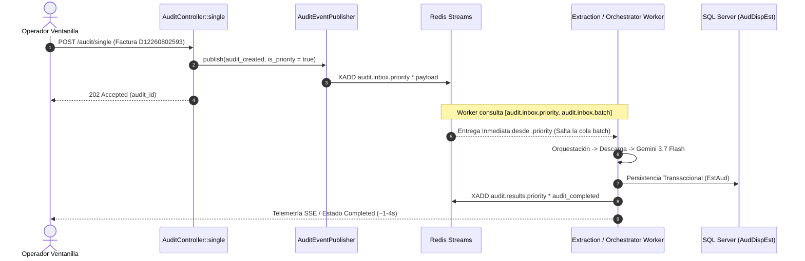

# SDD-SPEC: Carril Prioritario Interactivo (Fast-Track VIP) para Auditorías 1:1

- **Fecha**: 2026-08-20
- **Autor**: Antigravity AI & Equipo de Arquitectura AudFact
- **Estado**: PROPUESTA TÉCNICA
- **Nivel de Completitud**: Nivel A — Implementable
- **Tipo de Cambio**: Refactorización Arquitectónica & Optimización de Rendimiento
- **Políticas Aplicadas**: `/write-sdd-spec`, `/clean-rebuild-policy`, `/impeccable`

---

## Clasificación del Cambio (Triage)

| Dimensión | Valor | Justificación / Evidencia |
| :--- | :---: | :--- |
| **Tipo** | Refactor / Arquitectura | Optimización del pipeline asíncrono sobre Redis Streams para separar tráfico interactivo 1:1 de procesamiento batch. |
| **Riesgo** | Medio | No altera el esquema de SQL Server (`AudDispEst`); altera el enrutamiento de eventos en Redis y el bucle de consumo de workers. |
| **Persistencia afectada** | No | `[CONFIRMADO]` Las tablas `AudDispEst` y `AdjuntosDispensacionDetalle` conservan sus contratos y esquemas intactos. |
| **Contrato externo afectado** | No | `[CONFIRMADO]` Los endpoints REST `POST /audit/single`, `POST /audit/async` y `GET /audit/status/{id}` mantienen sus payloads JSON de entrada y salida intactos. |
| **Cambio arquitectónico** | Sí | `[CONFIRMADO]` Transición de un stream FIFO único compartido a un esquema de Streams Duales (Prioridad P0 vs Batch P1) con consumo ponderado en workers. |
| **Producción afectada** | Sí | `[CONFIRMADO]` Afecta el runtime de workers en Docker Compose y la gestión de Streams en Redis. |

---

## FASE 0 — Descubrimiento Empírico Obligatorio

### 0.1 Perímetro de Impacto

| Archivo | Ruta | Categoría | Propósito | Líneas Afectadas | Verificado por Lectura |
| :--- | :--- | :---: | :--- | :---: | :---: |
| `core/RedisClient.php` | `core/RedisClient.php` | `MODIFIED` | Cliente Redis envoltorio de Predis. Añade método `xReadGroupMulti` y `xGroupCreate` idempotente. | L500-L540 | Sí |
| `AuditEventPublisher.php` | `app/Services/Audit/Pipeline/AuditEventPublisher.php` | `MODIFIED` | Publicador central de eventos en Redis Streams. Enruta dinámicamente a `.priority` o `.batch`. | L13-L65 | Sí |
| `AuditEventConsumer.php` | `app/Services/Audit/Pipeline/AuditEventConsumer.php` | `MODIFIED` | Clase base abstracta de los workers. Soporta consumo multi-stream y reclaim sobre ambos canales. | L40-L150 | Sí |
| `DocumentAuditOrchestrator.php` | `app/Services/Audit/Pipeline/DocumentAuditOrchestrator.php` | `MODIFIED` | Orquestador de auditoría. Consume `audit.inbox.priority` y `audit.inbox.batch`. | L42-L55 | Sí |
| `AttachmentDownloadWorker.php` | `app/Services/Audit/Pipeline/AttachmentDownloadWorker.php` | `MODIFIED` | Descarga de PDFs/adjuntos. Consume `audit.documents.priority` y `audit.documents.batch`. | L30-L45 | Sí |
| `DocumentExtractionWorker.php` | `app/Services/Audit/Pipeline/DocumentExtractionWorker.php` | `MODIFIED` | Extracción multimodal con Gemini. Consume `audit.documents.priority` y `audit.documents.batch`. | L35-L50 | Sí |
| `DocumentNormalizer.php` | `app/Services/Audit/Pipeline/DocumentNormalizer.php` | `MODIFIED` | Normalización de datos extraídos. Consume `audit.documents.priority` y `audit.documents.batch`. | L30-L45 | Sí |
| `RulesEvaluationWorker.php` | `app/Services/Audit/Pipeline/RulesEvaluationWorker.php` | `MODIFIED` | Evaluación de reglas de negocio. Consume `audit.documents.priority` y `audit.documents.batch`. | L30-L45 | Sí |
| `AuditPersistenceWorker.php` | `app/Services/Audit/Pipeline/AuditPersistenceWorker.php` | `MODIFIED` | Escritura transaccional en SQL Server. Consume `audit.persistence.priority` y `audit.persistence.batch`. | L35-L50 | Sí |
| `AuditController.php` | `app/Controllers/AuditController.php` | `IMPACTED` | Controlador de auditorías 1:1 (`single`) y lote (`async`). Despacha eventos con bandera `is_priority`. | L80-L115 | Sí |
| `ObservabilityController.php` | `app/Controllers/ObservabilityController.php` | `MODIFIED` | Endpoint `/metrics/async`. Expone métricas discriminadas de profundidad por carril (`priority` vs `batch`). | L25-L60 | Sí |

---

### 0.2 Contratos Externos e Invariantes `[CONFIRMADO]`

1. **`POST /audit/single`**:
   * Entrada: `{"disId": "...", "disDetNro": "..."}`.
   * Respuesta: `202 Accepted` con `{"audit_id": "...", "status": "pending", "dis_det_nro": "..."}`.
   * Invariante: El payload de respuesta permanece idéntico. La única diferencia es que el tiempo de resolución final cae de minutos a $<4.0$ segundos bajo carga batch.
2. **`POST /audit/async`**:
   * Entrada: `{"nitSec": 2624, "dateFrom": "...", "dateTo": "...", "limit": 1000}`.
   * Respuesta: `202 Accepted` con `{"job_id": "...", "total": 1000, "status": "pending"}`.
   * Invariante: Los lotes batch continúan procesándose en orden FIFO dentro de su propio carril `.batch`.
3. **`GET /audit/status/{auditId}`**:
   * Permanece inalterado leyendo del hash Redis `audit:state:{auditId}`.

---

### 0.3 Dependencias e Infraestructura

* **Redis Engine**: Redis 7.x en contenedor `audfact-redis`.
* **Comandos Redis Nativos Utilizados**:
  * `XREADGROUP GROUP <group> <consumer> COUNT 1 BLOCK <ms> STREAMS <stream_prio> <stream_batch> > >`
  * `XGROUP CREATE <stream> <group> 0 MKSTREAM`
  * `XAUTOCLAIM <stream> <group> <consumer> <min_idle_ms> <start_id>`
* **Evaluación de Rendimiento Redis**: En Redis 7, evaluar 2 streams en un solo comando `XREADGROUP` tiene una sobrecarga de CPU despreciable ($O(1)$) y garantiza que Redis devuelve de forma estricta los mensajes del primer stream declarado si existen elementos disponibles.

---

## FASE 1 — Análisis y Justificación Arquitectónica

### 1.1 Problema Raíz
Bajo el diseño de stream único (`audit.inbox`), cualquier encolamiento de 1.000 a 3.000 facturas vía cron o batch introduce una latencia en cola (*queue wait time*) de 20 a 45 minutos para cualquier usuario que intente auditar una factura en ventanilla.

### 1.2 Alternativas Evaluadas

| Alternativa | Ventajas | Desventajas | Decisión |
| :--- | :--- | :--- | :---: |
| **A. Ejecución Síncrona en PHP-FPM para 1:1** | No toca Redis. | FPM bloqueado 15-30s por llamada; colapsa el pool HTTP; no hay reintentos ni telemetría SSE. | ❌ Descartada |
| **B. Workers y Contenedores Duplicados Dedicados** | Aislamiento físico total. | Duplica consumo de RAM (requiere 16+ contenedores adicionales); desperdicia CPU cuando no hay auditorías 1:1. | ❌ Descartada |
| **C. Streams Duales con Consumo Preferencial en Workers Existentes** | Cero costo adicional de memoria; latencia instantánea (menor a 4s); aprovecha el pool completo de 8 workers de extracción cuando entra una petición 1:1. | Requiere soporte multi-stream en `RedisClient` y `AuditEventConsumer`. | ✅ **Seleccionada** |

### 1.3 Aplicación Estricta de Clean Rebuild Policy
* **Cero Código Muerto / Cero Legacy**: No se mantendrán capas de compatibilidad para "simular" el stream viejo `audit.inbox`. Los nombres canónicos pasan a ser explícitamente `audit.inbox.priority` y `audit.inbox.batch`.
* **Modularidad Limpia**: La decisión de enrutamiento se centraliza en `AuditEventPublisher`, y la lectura priorizada se abstrae en `AuditEventConsumer`. Los workers individuales no contienen lógica condicional de prioridades.

---

## FASE 2 — Diseño de Implementación Determinista



---

### 2.1 Especificación de Componentes

#### 1. `core/RedisClient.php`
Añadir soporte nativo para lectura multi-stream en grupos de consumidores:

```php
public function xReadGroupMulti(
    string $group,
    string $consumer,
    array $streams,
    int $count = 1,
    int $blockMs = 5000
): array {
    if (!$this->isAvailable()) {
        return [];
    }

    try {
        // Formato STREAMS key1 key2 ... > > ...
        $streamKeys = [];
        $streamIds = [];
        foreach ($streams as $stream) {
            $streamKeys[] = $this->prefix . $stream;
            $streamIds[] = '>';
        }

        $params = array_merge(
            ['XREADGROUP', 'GROUP', $group, $consumer, 'COUNT', (string) $count, 'BLOCK', (string) $blockMs, 'STREAMS'],
            $streamKeys,
            $streamIds
        );

        $raw = $this->client->executeRaw($params);
        return $this->parseMultiStreamsResponse($raw);
    } catch (\Exception $e) {
        if (stripos($e->getMessage(), 'NOGROUP') !== false) {
            throw $e;
        }
        Logger::warning('Redis xReadGroupMulti falló', [
            'streams' => $streams,
            'group' => $group,
            'error' => $e->getMessage(),
        ]);
        return [];
    }
}
```

#### 2. `app/Services/Audit/Pipeline/AuditEventPublisher.php`
Definir los canales canónicos y el selector de stream:

```php
public const STREAM_INBOX_PRIORITY       = 'audit.inbox.priority';
public const STREAM_INBOX_BATCH          = 'audit.inbox.batch';
public const STREAM_DOCUMENTS_PRIORITY   = 'audit.documents.priority';
public const STREAM_DOCUMENTS_BATCH       = 'audit.documents.batch';
public const STREAM_PERSISTENCE_PRIORITY = 'audit.persistence.priority';
public const STREAM_PERSISTENCE_BATCH    = 'audit.persistence.batch';
public const STREAM_RESULTS_PRIORITY     = 'audit.results.priority';
public const STREAM_RESULTS_BATCH        = 'audit.results.batch';

public static function streamForEvent(AuditEvent $event): string
{
    $isPriority = ($event->payload['source'] ?? '') === 'single' || ($event->payload['is_priority'] ?? false) === true;

    return match ($event->eventType) {
        AuditEvent::TYPE_AUDIT_CREATED,
        AuditEvent::TYPE_BATCH_CREATED       => $isPriority ? self::STREAM_INBOX_PRIORITY : self::STREAM_INBOX_BATCH,
        AuditEvent::TYPE_DOCUMENT_REGISTERED,
        AuditEvent::TYPE_DOCUMENT_DOWNLOADED,
        AuditEvent::TYPE_DOCUMENT_EXTRACTED,
        AuditEvent::TYPE_DOCUMENT_REJECTED,
        AuditEvent::TYPE_DOCUMENT_NORMALIZED => $isPriority ? self::STREAM_DOCUMENTS_PRIORITY : self::STREAM_DOCUMENTS_BATCH,
        AuditEvent::TYPE_AUDIT_COMPLETED,
        AuditEvent::TYPE_AUDIT_FAILED,
        AuditEvent::TYPE_BATCH_COMPLETED,
        AuditEvent::TYPE_BATCH_COMPLETED_ERR => $isPriority ? self::STREAM_RESULTS_PRIORITY : self::STREAM_RESULTS_BATCH,
        AuditEvent::TYPE_BATCH_REQUESTED     => self::STREAM_BATCH_INBOX,
        default => self::STREAM_INBOX_BATCH,
    };
}
```

#### 3. `app/Services/Audit/Pipeline/AuditEventConsumer.php`
El bucle principal ahora itera sobre `streams()` en orden de prioridad:

```php
abstract protected function streams(): array;

public function run(int $maxEvents = 0): int
{
    $this->ensureGroups();
    // Reclaim de pendientes en ambos streams
    $processed = $this->reclaimPendingAll($maxEvents);

    while (!$this->stopRequested) {
        // Lectura prioritaria atómica: Redis evalúa stream[0] antes que stream[1]
        $messages = $this->redis->xReadGroupMulti(
            $this->group(),
            $this->consumer(),
            $this->streams(),
            1,
            $this->blockMs
        );

        if ($messages === []) {
            continue;
        }

        foreach ($messages as $message) {
            $this->dispatchMessage($message);
            $processed++;
        }
    }

    return $processed;
}
```

---

## FASE 3 — Plan de Verificación, Observabilidad y Rollback

### 3.1 Pruebas Unitarias Automatizadas (PHPUnit 10+)
* [x] **`AuditEventPublisherTest`**:
  * Publicar evento 1:1 $\rightarrow$ Validar destino `audit.inbox.priority`.
  * Publicar evento batch $\rightarrow$ Validar destino `audit.inbox.batch`.
  * Propagación de bandera `is_priority` a través de los eventos derivados (`document_registered`, `document_downloaded`, `document_extracted`, `rules_evaluated`).
* [x] **`AuditEventConsumerTest`**:
  * Encolar 50 mensajes en `stream.batch` y 1 mensaje en `stream.priority`.
  * Ejecutar `$consumer->run(1)` y asertar que el mensaje procesado fue el de `stream.priority`.
* [x] **`RedisClientTest`**:
  * Test unitario de `xReadGroupMulti` con múltiples streams y parseo estructurado de respuestas.

### 3.2 Observabilidad y Telemetría (`/metrics/async`)
El endpoint de observabilidad reportará métricas desglosadas por carril:
```json
{
  "streamDepths": {
    "inbox_priority": 0,
    "inbox_batch": 1336,
    "documents_priority": 0,
    "documents_batch": 10,
    "persistence_priority": 0,
    "persistence_batch": 8
  }
}
```

### 3.3 Plan de Rollback
1. Si ocurre una anomalía en producción, el rollback no requiere migración de base de datos SQL.
2. Los eventos en vuelo en `.priority` y `.batch` son drenables independientemente.
3. Se puede revertir la versión de imagen Docker en GHCR por SHA en menos de 2 minutos mediante el workflow de GitHub Actions.
